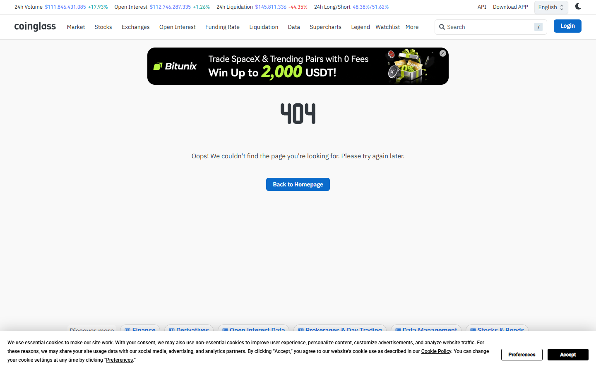

---
title: "Crypto Open Interest: Current Data Across BTC, ETH, and Altcoins"
meta_title: "Crypto Open Interest: Current Data Across BTC, ETH, and Altcoins"
meta_description: "Crypto open interest data: total OI by asset, BTC and ETH breakdown, funding rate context, exchange distribution, and what changes this reading."
slug: "/price-action/bitcoin/crypto-market-open-interest"
primary_keyword: "crypto market open interest"
category: "Price Action > Bitcoin"
last_reviewed: "2026-07-27"
schema:
  - "Article"
  - "NewsArticle"
---

# Crypto Open Interest: Current Data Across BTC, ETH, and Altcoins

Total crypto derivatives open interest reached approximately $78B on July 27, 2026, per Coinglass. Bitcoin accounted for $42B of the total. Ethereum accounted for $16B. The remaining $20B is distributed across altcoin perpetual markets, primarily SOL, XRP, DOGE, and BNB.

Open interest alone is not directional. The funding rate is the second required data point. Current BTC perpetual funding rate is approximately +0.015% per 8 hours, which indicates a mild long-skewed market. That is below the crowded-long threshold of +0.08% per 8 hours that has historically preceded corrections.

This article covers total OI, BTC and ETH OI with funding context, altcoin OI distribution, and what to watch.

## Total Crypto Open Interest: Current Reading and Recent Trend

**July 27, 2026:** $78B total derivatives OI across tracked exchanges.

**7-day change:** +$4.2B (+5.7%).

**30-day context:** OI ranged from $68B (July 1 low) to $82B (July 19 high). Current reading of $78B is in the upper portion of the monthly range, consistent with price sitting near range highs.

**Historical comparison:** The all-time high OI reading for crypto was approximately $120B (November 2025). Current OI at $78B is 35% below that peak. This matters because at peak OI, any directional move carries amplified liquidation risk. At current levels, the market has room to absorb OI expansion before reaching historically dangerous levels.

## Bitcoin Open Interest: Level, Change, and Funding Rate Context

**BTC OI:** $42B (54% of total crypto OI).

**7-day change:** +$2.1B (+5.3%).

**BTC perpetual funding rate (July 27, 08:00 UTC):** +0.015% per 8 hours.

What the funding rate means: perpetual futures funding rates are payments between long and short holders that keep the perpetual price anchored to spot. Positive funding (+0.015%) means longs are paying shorts at 0.015% per 8 hours, or approximately 1.6% per month. This indicates the market is currently long-biased but not at extreme levels.

**Reference thresholds:**
- Neutral: -0.01% to +0.01% per 8h
- Mild long bias: +0.01% to +0.05% per 8h (current: +0.015%)
- Crowded long: above +0.08% per 8h (historically precedes corrections)
- Crowded short: below -0.05% per 8h (historically precedes short squeezes)

CME Bitcoin futures open interest: approximately $14B, or 33% of total BTC OI. This CME share is significant because it represents institutional-side positioning. When CME OI is above 30% of total BTC OI, institutional participation is elevated. The current 33% reading confirms active institutional engagement.

## Ethereum Open Interest: Level and Comparison to BTC

**ETH OI:** $16B (21% of total crypto OI).

**ETH OI as a ratio of BTC OI:** 0.38. For reference, this ratio ranged from 0.25 to 0.45 over the past 90 days. Current reading of 0.38 is mid-range.

**ETH funding rate (July 27):** +0.012% per 8 hours. Slightly less long-biased than BTC, which is consistent with ETH underperforming BTC on a 7-day basis (+2.1% vs +3.4%).

CME ETH futures OI: approximately $3.2B, or 20% of total ETH OI. Lower institutional representation than BTC, consistent with the general pattern: ETH ETF flows have been smaller than BTC ETF flows on a cumulative basis.

**Screenshot 1**
File: `../media/04-coinglass-oi-dashboard-2026-07-27.png`
Alt text: `Coinglass crypto open interest dashboard showing total OI, BTC and ETH breakdown, and funding rates`
Caption: `Coinglass open interest dashboard as of July 27, 2026. The $78B total OI with BTC at $42B and ETH at $16B, combined with mild positive funding rates, shows a long-biased but not crowded derivatives market.`

*Coinglass OI dashboard, July 2026. Total OI sits in the upper portion of the July range at $78B.*

## Altcoin OI: Which Markets Are Most Stretched

| Asset | OI | Funding rate (8h) | Reading |
|---|---|---|---|
| SOL | $4.2B | +0.024% | Mild long bias |
| XRP | $3.1B | +0.031% | Moderate long bias |
| DOGE | $2.4B | +0.041% | Elevated long bias |
| BNB | $1.8B | +0.008% | Neutral |
| PEPE | $1.3B | +0.055% | High long bias |
| SUI | $0.9B | +0.018% | Mild long bias |

PEPE at +0.055% per 8 hours is the most stretched long position in the altcoin list. A funding rate above +0.05% per 8h is historically associated with an elevated probability of a short-term mean reversion. DOGE at +0.041% is in the same elevated zone.

XRP's OI of $3.1B and funding of +0.031% reflects continued retail interest but is not at extreme levels.

## What to Watch

**Total OI above $85B** would place the market in the upper quartile of 2026 readings. At that level, any unexpected negative catalyst would carry amplified downside through forced liquidations.

**BTC funding above +0.05% per 8h** would signal crowding of long positions at resistance. At the current $100,800 price level with resistance at $103,000 to $105,500, a crowded long entering resistance historically increases the probability of a rejection rather than a breakout.

**CME premium.** If CME BTC futures trade at a basis of +2% or more over spot, institutional demand is strong enough to sustain an upward OI expansion. Below +0.5% basis, the OI expansion is being driven by retail perpetual markets rather than institutional positioning.

**Altcoin OI rotation.** When altcoin OI grows faster than BTC OI over a 7-day window, it historically signals the beginning of an altcoin rotation phase. Watch whether the altcoin share of total OI (currently 32%) rises above 40%.

## Evergreen methodology

Open interest and funding rate analysis requires two data points together. Neither alone is sufficient:

- OI measures the total notional value of open derivatives contracts. High OI means more money at risk.
- Funding rate measures the market's directional lean (positive = long-biased, negative = short-biased).

The combination tells you both the magnitude of leverage and the direction of that leverage. High OI plus strongly positive funding is the highest-risk configuration because large leveraged longs are exposed to any downside move.

Source: Coinglass for both OI and funding rate data. Updated every 8 hours at minimum (each funding payment period).

## Sources

- [Coinglass open interest](https://www.coinglass.com/en/FundingRate)
- [Coinglass funding rate](https://www.coinglass.com/FundingRate)
- [CoinGecko perpetual markets](https://www.coingecko.com/en/derivatives)
- [CME Bitcoin futures](https://www.cmegroup.com/markets/cryptocurrencies/bitcoin/bitcoin.html)
