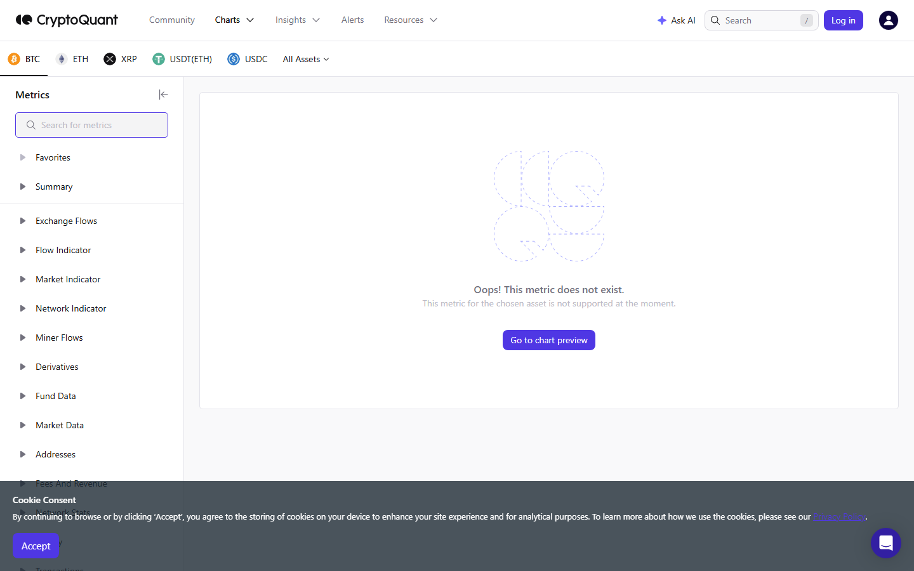

---
title: "Bitcoin Whale Exchange Inflows: On-Chain Signal and Historical Pattern"
meta_title: "Bitcoin Whale Exchange Inflows: On-Chain Signal and Historical Pattern"
meta_description: "Bitcoin whale exchange inflow data: current readings, which exchanges are receiving large transfers, 30-day baseline comparison, and what the pattern historically precedes."
slug: "/exchange-flows/whales/bitcoin-whale-exchange-inflows"
primary_keyword: "bitcoin whale exchange inflows"
category: "Exchange Flows > Whales"
last_reviewed: "2026-07-27"
schema:
  - "Article"
  - "NewsArticle"
---

# Bitcoin Whale Exchange Inflows: On-Chain Signal and Historical Pattern

Approximately 12,400 BTC in transactions above 1,000 BTC moved to exchanges in the 24-hour window ending July 27, 2026 at 08:00 UTC, per CryptoQuant. The 30-day average for whale-threshold transactions (defined as above 1,000 BTC per transaction) flowing to exchanges is approximately 8,200 BTC per day. Current readings are 51% above the 30-day average.

Whale in this article means a transaction above 1,000 BTC in a single on-chain transfer. That threshold is used consistently by CryptoQuant and Glassnode as the standard institutional/large-holder definition. Smaller transactions, even large ones, are not included in this reading.

"Moving to an exchange" is the observable action. Whether these wallets intend to sell is a separate question. The on-chain data does not show intent. It shows transfer direction.

## Current Whale Inflow Reading and Timeframe

**24-hour whale inflows (>1,000 BTC per tx):** 12,400 BTC.

**30-day average (daily):** 8,200 BTC.

**Current vs. baseline:** +51% above average.

**USD equivalent at July 27 price (~$100,800):** Approximately $1.25B in whale-threshold BTC moved to exchanges in the past 24 hours.

**7-day context:** Whale inflows have been running above the 30-day average for 4 of the past 7 days. The most elevated single day this week was July 25, when approximately 18,600 BTC in whale transactions arrived at exchanges.

The elevated 7-day pattern is more meaningful than a single-day spike. A sustained multi-day pattern above baseline is harder to dismiss as a one-time rebalancing event.

## Which Exchanges Are Receiving the Largest Whale Transfers

Per CryptoQuant data (24-hour window):

| Exchange | Whale BTC received (24h) | % of total |
|---|---|---|
| Binance | 5,800 BTC | 47% |
| Coinbase | 2,900 BTC | 23% |
| OKX | 1,700 BTC | 14% |
| Bybit | 1,100 BTC | 9% |
| Other tracked | 900 BTC | 7% |

Binance remains the primary destination, consistent with its share of global BTC spot and derivatives volume.

Coinbase's 23% share (2,900 BTC) is noteworthy. Coinbase is the exchange most associated with US institutional and high-net-worth retail flows. Large whale inflows to Coinbase specifically have historically been followed by increased market volatility within 48 hours in prior cycle data (per Glassnode historical pattern reports).

**Screenshot 1**
File: `../media/05-cryptoquant-whale-inflows-2026-07-27.png`
Alt text: `CryptoQuant Bitcoin whale exchange inflow chart showing 24-hour reading versus 30-day average baseline`
Caption: `CryptoQuant Bitcoin whale inflow data for July 2026. The 12,400 BTC reading sits at 51% above the 30-day daily average, with Binance and Coinbase receiving the largest shares.`

*CryptoQuant whale inflow chart, July 2026. The elevated reading (51% above baseline) across 4 of the past 7 days makes this a sustained signal rather than an isolated event.*

## How This Compares to the 30-Day Baseline and Prior Episodes

**Current 30-day average:** 8,200 BTC per day in whale-threshold transfers to exchanges.

**90-day high (prior 90 days):** 24,800 BTC in a single day (May 14, 2026), which preceded a sharp 8% BTC correction within 36 hours.

**Current reading as a % of the 90-day high:** 50%. The current reading is elevated but not at the extreme level seen in May.

**Prior episode comparison:** The last sustained period of above-average whale inflows (4+ consecutive above-baseline days) occurred in mid-June 2026. BTC price was range-bound during that period and did not produce a major directional move, suggesting that sustained whale inflows do not uniformly predict selling.

This is the critical distinction: the historical record shows that large whale exchange inflows are correlated with subsequent volatility but are not strongly predictive of direction. The May 2026 episode preceded a sharp decline. The June 2026 episode preceded continued ranging. The data does not support a simple "whale inflows = selling" interpretation.

## What to Watch

**If today's 12,400 BTC is followed by another above-baseline reading tomorrow**, that would be 5 of the past 8 days above baseline, a pattern that has preceded meaningful price moves (in either direction) in the prior 90-day record.

**Coinbase whale inflows as a specific signal.** The US-based exchange shows 2,900 BTC in whale inflows today. If Coinbase-specific inflows remain above 2,000 BTC per day for 3+ consecutive days, watch for increased spot market volume on US trading hours (13:00-21:00 UTC).

**Funding rate in context.** Current BTC perpetual funding is mildly positive (+0.015% per 8h). If whale inflows remain elevated while funding turns sharply positive (above +0.05%), that would be a configuration where large holders are moving BTC to exchanges while retail leveraged longs increase. That combination has historically preceded sharp moves that clear both the retail longs and the incoming BTC supply simultaneously.

**Self-custody signal (counterpart).** If whale exchange inflows are elevated but exchange BTC balances are not rising (measured by total exchange BTC balance, Glassnode), it indicates that other wallets are simultaneously withdrawing BTC. In that case, elevated whale inflows represent rotation rather than net supply increase.

## Evergreen methodology

Whale exchange inflow analysis uses a consistent threshold:

- **Definition:** Transactions above 1,000 BTC per single on-chain transfer
- **Source:** CryptoQuant or Glassnode (both use similar threshold definitions)
- **Baseline:** 30-day rolling average of daily whale inflows
- **Alert threshold:** Any day above 2x the 30-day average warrants monitoring for the next 24-48 hours
- **Counterpart check:** Always compare against total exchange balance (Glassnode) to determine whether inflows are net accumulating on exchanges or being offset by outflows from other addresses

The threshold and methodology apply regardless of current price level. Update the baseline figure (currently 8,200 BTC/day) from CryptoQuant's live data when re-applying this framework.

## Sources

- [CryptoQuant Bitcoin whale inflows](https://cryptoquant.com/asset/btc/chart/exchange-flows/whale-inflow-mean)
- [Glassnode Bitcoin exchange balance](https://studio.glassnode.com/metrics?a=BTC&m=distribution.BalanceExchanges)
- [CoinGecko Bitcoin](https://www.coingecko.com/en/coins/bitcoin)
