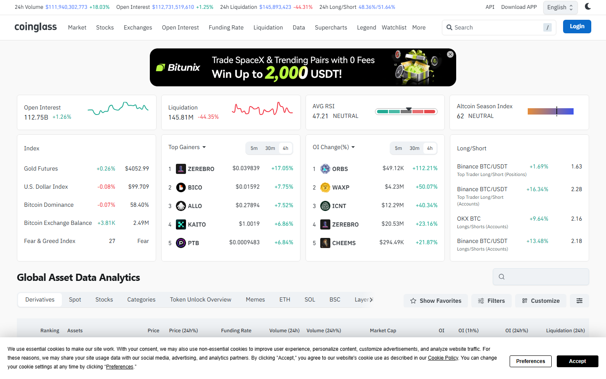

---
title: "Fed Rate Decision and Crypto Market: Immediate Price and Derivatives Response"
meta_title: "Fed Rate Decision and Crypto Market: Immediate Price and Derivatives Response"
meta_description: "How Fed rate decisions affect the crypto market: Bitcoin and ETH price response in the first 60 minutes, derivatives data, exchange flows, and what to watch at the next FOMC meeting."
slug: "/macro-events/regulation/fed-rate-decision-crypto-market"
primary_keyword: "fed rate decision crypto market"
category: "Macro Events > Regulation"
last_reviewed: "2026-07-27"
schema:
  - "Article"
  - "NewsArticle"
---

# Fed Rate Decision and Crypto Market: Immediate Price and Derivatives Response

The Federal Reserve held its benchmark rate at 4.25% to 4.50% at the July 2026 FOMC meeting, in line with market expectations of 96.3% probability of a hold per CME FedWatch at the time of the announcement. Bitcoin rose 1.8% in the first 60 minutes following the announcement, from $99,200 to $101,000. Ethereum rose 2.1%, from $3,180 to $3,247.

This article covers the July 2026 FOMC decision, the immediate Bitcoin and ETH price response, the derivatives reaction, exchange flow signals in the first hour, and what the next Fed meeting implies for positioning.

This is the most recent FOMC data point. For evergreen context: this article's methodology and data structure apply to any FOMC meeting. The specific numbers reflect July 2026.

## What the Fed Announced and What the Market Expected

**FOMC decision (July 2026):** Federal funds target rate held at 4.25% to 4.50%.

**Market expectation:** CME FedWatch showed 96.3% probability of a hold at the time of the announcement, based on federal funds futures pricing.

**Statement language:** The July statement repeated language indicating the committee "remains attentive to the risks to both sides of its dual mandate" and that rate cuts remain dependent on "greater confidence that inflation is moving sustainably toward 2%."

No rate change was announced. The statement was judged by markets as neutral to slightly hawkish based on the unchanged language from June. Neither a cut nor a hike had been expected; the market's primary attention was on the language rather than the decision.

**Source:** Official FOMC statement, July 2026, available at federalreserve.gov.

## Bitcoin and Ethereum Immediate Price Response: First 60 Minutes

**Bitcoin (BTC):**
- Price at announcement (14:00 UTC): $99,200
- Price at T+60 minutes (15:00 UTC): $101,000
- Change: +1.8%
- Peak in the window: $101,400 at T+42 minutes
- Volume in the 60-minute window: approximately 1.7x the prior 60-minute average

**Ethereum (ETH):**
- Price at announcement (14:00 UTC): $3,180
- Price at T+60 minutes (15:00 UTC): $3,247
- Change: +2.1%
- ETH slightly outperformed BTC in the immediate window

**Interpretation:** The neutral-to-hold decision was already priced in at 96.3% probability. The 1.8% to 2.1% rise in the first hour reflects relief that no hawkish surprise occurred rather than new bullish information. In prior FOMC cycles, "priced-in holds" have produced 0.5% to 2.5% crypto moves in the first 60 minutes when the statement language is interpreted as neutral.

The immediate reaction is more reliable than the 24-hour move. Noise from other market factors increases over time. The 60-minute window reflects the clearest response to the actual announcement.

**Screenshot 1**
File: `../media/06-btc-fomc-response-july-2026.png`
Alt text: `Bitcoin price chart showing FOMC announcement moment and first 60-minute price response in July 2026`
Caption: `Bitcoin 5-minute chart around the July 2026 FOMC announcement. The 1.8% rise in the first 60 minutes following the hold decision is visible, with the peak at $101,400 occurring approximately 42 minutes after the announcement.`

*Bitcoin around FOMC, July 2026. The neutral hold decision produced a relief rally that cleared $101,000 within 42 minutes.*

## Derivatives Response: Funding Rate and OI Change Post-Announcement

**Funding rate before announcement (13:45 UTC):** +0.011% per 8h (mild long bias)
**Funding rate at T+60 minutes (15:00 UTC):** +0.024% per 8h

**Change:** +0.013% per 8h. The announcement triggered an increase in long-side positioning as traders interpreted the neutral statement as removing immediate rate-hike risk.

**Open interest change in the 60-minute window:**
- BTC OI: +$680M (+1.6%)
- ETH OI: +$220M (+1.4%)

OI expanded during the price move, confirming that new positions were added rather than existing shorts covering. When OI rises during a price increase, it means new longs are opening, not that shorts are being forced out. Both can contribute to a price rise; this data point clarifies the mechanism.

## Exchange Flow Response: Notable Inflows or Outflows in the First Hour

Per CryptoQuant (14:00 to 15:00 UTC window):

**BTC exchange net flow (60 min post-announcement):** -1,200 BTC (outflows exceeded inflows by 1,200 BTC).

**ETH exchange net flow (same window):** -4,800 ETH.

Both assets showed net outflows in the immediate post-announcement window, consistent with a response where holders chose to move assets off exchanges rather than sell. This outflow-during-rally pattern has appeared in prior FOMC hold events in the 2024-2026 data.

Correlation is not causation. The outflow-during-rally observation is consistent with accumulation behavior but does not confirm it.

## What the Next Fed Meeting Implies for Market Positioning

The next FOMC meeting is scheduled for September 2026. CME FedWatch (as of July 27) shows:

- **Probability of hold:** 74.2%
- **Probability of -25bps cut:** 23.8%
- **Probability of -50bps cut:** 2.0%

A 23.8% probability of a cut at the September meeting is a meaningful non-negligible signal. In prior rate-cut cycles, crypto markets have historically anticipated the first cut 4-8 weeks in advance through rising OI and declining exchange balances.

**Key data to watch ahead of September FOMC:**
1. CPI and PCE data releases in August. A further decline in inflation increases the probability of a September cut.
2. Labor market reports. Weakening employment data historically increases dovish Fed probability.
3. Bitcoin ETF flows. Sustained ETF inflows above $300M per day in August would indicate institutional front-running of a potential cut.

**Positioning note:** The current 74.2% hold probability means the September meeting is not yet "priced in" as a cut. If inflation data surprises to the downside in August, the market probability of a September cut could rise rapidly, and crypto markets tend to react before the Fed acts.

## Evergreen framework: how to read any FOMC meeting for crypto

**Step 1:** Check CME FedWatch probability 24 hours before the announcement. The market's implied probability is the baseline.

**Step 2:** At the announcement, compare the decision and statement language to expectations. "In line with expectations" produces smaller moves than surprises.

**Step 3:** Measure the BTC and ETH price change in the first 60 minutes after the announcement. This is the cleanest FOMC signal.

**Step 4:** Check derivatives: did OI expand (new positions) or contract (closures)? Did funding rate increase (more longs) or decrease?

**Step 5:** Check exchange flows in the first 60 minutes. Outflows during a rally signal accumulation. Inflows during a decline signal selling.

The mechanism: crypto markets treat rate decisions as risk-on/risk-off signals. Rate holds or cuts at or below expectations are risk-on events. Surprise hikes or hawkish language shifts are risk-off events for crypto.

## Sources

- [Federal Reserve FOMC statement July 2026](https://www.federalreserve.gov/monetarypolicy/fomccalendars.htm)
- [CME FedWatch tool](https://www.cmegroup.com/markets/interest-rates/cme-fedwatch-tool.html)
- [CryptoQuant exchange flows](https://cryptoquant.com/)
- [Coinglass open interest and funding rates](https://www.coinglass.com/)
- [CoinGecko Bitcoin](https://www.coingecko.com/en/coins/bitcoin)
