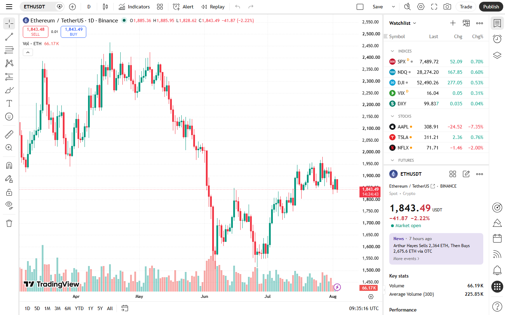

---
title: "Ethereum Price Breakout: Setup, Trigger Level, and Volume Confirmation"
meta_title: "Ethereum Price Breakout: Setup, Trigger Level, and Volume Confirmation"
meta_description: "Ethereum price breakout analysis: current setup, what defines the breakout level, volume and OI confirmation, failed breakout criteria, and key levels above."
slug: "/price-action/breakouts/ethereum-price-breakout"
primary_keyword: "ethereum price breakout"
category: "Price Action > Breakouts"
last_reviewed: "2026-07-27"
schema:
  - "Article"
  - "NewsArticle"
---

# Ethereum Price Breakout: Setup, Trigger Level, and Volume Confirmation

Ethereum is trading at approximately $3,250 as of July 27, 2026, testing a resistance zone it has approached twice without a confirmed 4-hour close above $3,280. The setup has the technical structure of a potential breakout: compressed range over 12 days, decreasing sell volume at resistance, and a flat-to-positive funding rate. The trigger level is $3,280 (4-hour close). The confirmation requirement is volume at 1.5x the 5-day average or higher on the breakout candle.

This article covers the current setup, what defines the breakout level, volume and OI requirements for confirmation, what a failed breakout looks like, and what to watch above.

## Current Ethereum Price and the Range It Is Breaking From

Ethereum has traded in a range between approximately $3,050 (July 15 low) and $3,310 (July 19 high) for 12 days. The range width is approximately $260, or roughly 8% of the lower bound.

Current price at $3,250 places ETH at 77% of the way through the range (from bottom to top), meaning price is currently in the upper portion of the established range and approaching the resistance ceiling.

**Range characteristics:**
- Duration: 12 days (July 15 to July 27)
- Width: ~$260 (8% of range low)
- Lower bound: $3,050 (tested twice, held both times)
- Upper bound: $3,280 to $3,310 (wicked through twice, no 4-hour close above $3,280)

A 12-day compression range in a larger bull structure is a recognized consolidation pattern. The compressed price action builds the potential energy that breakouts release. Whether that energy resolves to the upside or downside is determined by what happens at the test of resistance.

## What Defines the Breakout Level: Volume Node, Prior Resistance, or Liquidation Cluster

The $3,280 level is the breakout threshold for three independent reasons:

**1. Prior swing high with volume.** The July 19 high of $3,310 was reached on volume that was 2.3x the 5-day average. Price then rejected sharply. The $3,280 level sits at the base of that rejection wick, making it a volume node from the prior attempt.

**2. Short liquidation cluster.** Per Coinglass heatmap data, approximately $180M in short liquidations sit between $3,280 and $3,350. A 4-hour close above $3,280 would begin triggering those forced short closures, which mechanically add upward price pressure.

**3. Three-month resistance.** On the 1-day chart, $3,280 corresponds to a prior swing high from April 2026. That level was tested and rejected on two separate occasions before the current setup.

A breakout is defined by a 4-hour close above $3,280, not a wick through it. Two prior wicks through this level (July 19 and July 23) both failed to produce a close above it.

## Volume and OI Confirmation: Is the Move Validated?

**Volume requirement:** The breakout candle (4-hour) must show volume at or above 1.5x the 5-day average to be considered confirmed. The 5-day average 4-hour volume is approximately 42,000 ETH traded on Binance. Confirmation threshold: 63,000 ETH or above.

**OI requirement:** Open interest should expand during the breakout. If price breaks above $3,280 while OI contracts, it indicates short covering rather than new long entry. Short-cover-driven breakouts are less durable than new-long-driven breakouts.

**Funding rate at breakout:** If the 8-hour funding rate is above +0.05% at the time of the breakout candle, the long side is already crowded. Crowded longs entering resistance increase the probability of a failed breakout. A funding rate at or below +0.03% at the time of the break would be a healthier structure.

**Screenshot 1**
File: `../media/07-eth-range-breakout-setup-2026-07-27.png`
Alt text: `Ethereum 4-hour price chart showing 12-day range compression, resistance at $3,280, and breakout setup`
Caption: `Ethereum 4-hour chart as of July 27, 2026. The 12-day range between $3,050 and $3,310 is visible, with the $3,280 level marked as the breakout threshold. Two prior wicks above $3,280 without a close confirm that the level is not yet broken.`

*Ethereum 4-hour chart, July 2026. The compression range is intact. $3,280 is the threshold for a confirmed breakout by 4-hour close.*

## What a Failed Breakout Would Look Like

A failed breakout occurs when price closes above $3,280 on a 4-hour candle and then returns below $3,280 within the next two to three candles (8 to 12 hours).

**Criteria for failed breakout:**
- 4-hour close above $3,280 followed by
- Return below $3,280 within 12 hours without holding

Failed breakouts can produce sharp reversals. If the move above $3,280 triggers short liquidations (the $180M cluster) and then immediately reverses, those who entered long on the breakout become trapped, creating additional sell pressure on the reversal.

**Price level that would negate the setup entirely:** A daily close below $3,050 would break the lower boundary of the 12-day range, invalidating the consolidation structure and shifting attention to the next support zone at $2,900 to $2,950.

## What to Watch

**Watch the breakout candle volume first.** Volume below 1.5x the 5-day average on the 4-hour breakout candle is the most common indicator of an unconfirmed breakout. Thin-volume moves through resistance are the most frequently reversed.

**Watch funding rate into the test.** If ETH funding is above +0.04% per 8h as price tests $3,280, the crowding risk is elevated. The cleaner setup would have funding at or below +0.02%.

**Watch BTC correlation.** ETH breakout attempts are more durable when BTC is simultaneously breaking or holding above its own resistance. If BTC is at $103,000 or above when ETH tests $3,280, the macro structure supports the ETH move.

**Next resistance above $3,280:** $3,450 to $3,500 (July 2026 local high from a prior cycle), then $3,700 to $3,800 (the April 2026 swing high cluster).

## Evergreen methodology

Range breakout analysis applies the same framework at any price level:

1. Define the range: identify the high, low, and duration of the current consolidation.
2. Define the breakout threshold: the level that has resisted multiple tests without a 4-hour close above.
3. Confirm with volume: breakout candle must show above-average volume.
4. Check OI and funding: are new longs entering, or are shorts covering?
5. Define the failed-breakout invalidation level: a close back below the breakout level within 12 hours.

The $3,280 threshold in this article is the July 2026 figure. Apply the same four-step process to the current range when re-reading this after price has moved.

## Sources

- [CoinGecko Ethereum price](https://www.coingecko.com/en/coins/ethereum)
- [Coinglass ETH liquidation heatmap](https://www.coinglass.com/pro/futures/LiquidationHeatMap)
- [TradingView ETH chart](https://www.tradingview.com/chart/?symbol=BINANCE:ETHUSDT)
- [Coinglass ETH open interest](https://www.coinglass.com/en/FundingRate)
