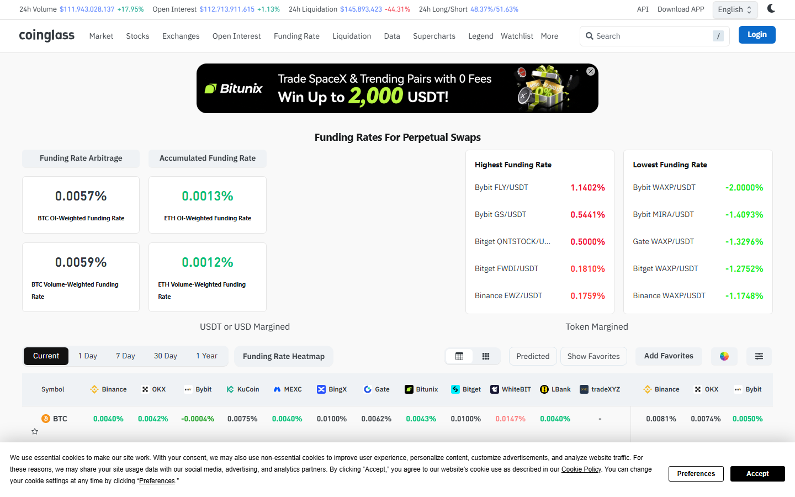

---
title: "Crypto Funding Rate Tracker: Which Assets Are Stretched Long or Short"
meta_title: "Crypto Funding Rate Tracker: Which Assets Are Stretched Long or Short"
meta_description: "Crypto funding rate data: current rates across BTC, ETH, and altcoins, which assets are stretched long or short, 7-day trend, and historical comparison."
slug: "/price-action/volatility/crypto-funding-rate-tracker"
primary_keyword: "crypto funding rate tracker"
category: "Price Action > Volatility"
last_reviewed: "2026-07-27"
schema:
  - "Article"
  - "NewsArticle"
---

# Crypto Funding Rate Tracker: Which Assets Are Stretched Long or Short

Bitcoin perpetual funding rate sits at +0.015% per 8 hours as of July 27, 2026, per Coinglass. PEPE carries the highest positive funding in the top-20 perpetual markets at +0.055% per 8h, indicating elevated long-side concentration. No major asset is in negative funding territory as of this reading.

Funding rate is the mechanism that keeps perpetual futures prices anchored to spot. Positive funding means longs pay shorts every 8 hours. Negative funding means shorts pay longs. The rate reflects whether the market is leaning long or short at the aggregate level.

## Understanding the Funding Rate Mechanism

Perpetual futures do not expire. To keep their price close to spot, exchanges run an 8-hour payment between long and short holders:

- **Positive funding rate:** Longs pay shorts. Happens when the market is net long (more open long contracts than short). Longs are willing to pay a fee to maintain their leveraged position.
- **Negative funding rate:** Shorts pay longs. Happens when the market is net short.

The rate magnitude indicates how crowded the dominant side is:

- **0% to +0.01%:** Neutral. No meaningful directional lean.
- **+0.01% to +0.05%:** Mild-to-moderate long bias.
- **Above +0.05%:** Elevated long bias. Historically associated with increased risk of a sharp correction as long positions become expensive to hold.
- **Below -0.03%:** Elevated short bias. Historically associated with increased risk of a short squeeze.

These thresholds are heuristics from historical data, not mechanical rules. A funding rate above +0.05% does not guarantee a correction. It indicates crowding, which raises the probability.

## Current Funding Rate Snapshot Across Major Assets

| Asset | Funding rate (per 8h) | Classification | 24h change |
|---|---|---|---|
| BTC | +0.015% | Mild long bias | +0.004% |
| ETH | +0.012% | Mild long bias | +0.001% |
| SOL | +0.024% | Moderate long bias | +0.006% |
| XRP | +0.031% | Moderate long bias | +0.008% |
| BNB | +0.008% | Near neutral | -0.002% |
| DOGE | +0.041% | Elevated long bias | +0.011% |
| AVAX | +0.019% | Mild long bias | +0.003% |
| LINK | +0.022% | Moderate long bias | +0.005% |
| SUI | +0.018% | Mild long bias | +0.004% |
| PEPE | +0.055% | High long bias | +0.014% |

Data source: Coinglass, July 27, 2026, 08:00 UTC reading.

**Screenshot 1**
File: `../media/08-coinglass-funding-rates-2026-07-27.png`
Alt text: `Coinglass crypto funding rate table showing BTC, ETH, and altcoin rates as of July 27 2026`
Caption: `Coinglass funding rate table, July 27, 2026. PEPE at +0.055% per 8h is the most stretched long position. BTC and ETH at +0.015% and +0.012% are in the mild long bias zone, not yet at crowded levels.`

*Coinglass funding rates, July 2026. The distribution shows the market is broadly long-biased but concentrated crowding is limited to PEPE and DOGE.*

## Most Stretched Long Positions: Assets With Highest Positive Funding

**PEPE: +0.055% per 8h**

At +0.055%, PEPE longs are paying an annualized rate of approximately 60% to maintain their positions (0.055% x 3 payments/day x 365 days). That is not sustainable over a long holding period. Historically, funding rates above +0.05% in altcoins tend to mean-revert within 3 to 7 days, typically accompanied by a 5-20% price correction.

This is not a timing call. High funding rates can remain elevated for longer than expected. The data says the cost of being long PEPE on leverage is elevated relative to historical norms.

**DOGE: +0.041% per 8h**

DOGE sits in the elevated zone. At +0.041%, longs are paying approximately 45% annualized. The 24-hour change of +0.011% shows that the crowding increased yesterday, likely tracking DOGE's 4.2% price move on July 26.

**XRP: +0.031% per 8h**

XRP is in moderate long bias territory. The 24-hour increase of +0.008% is notable. XRP frequently sees funding rate spikes during periods of regulatory news (the SEC case history has created a pattern where XRP trades on headlines). No specific XRP news is identified at time of writing that would explain the increase.

## Most Stretched Short Positions: Assets With Highest Negative Funding

As of July 27, no major asset in the tracked list is in negative funding territory. The entire top-20 perpetual market is in positive (long-biased) funding, indicating a broad market lean toward long positions rather than hedged or short-biased positioning.

The absence of negative funding across the board is itself a signal: there is no major asset where short sellers are being compensated. This is consistent with a bull market environment but also means there is no mechanical short-squeeze fuel in the near term.

## Bitcoin and Ethereum Funding Rate Trend: 7-Day Pattern

**BTC funding rate trend (July 21 to July 27):**

| Date | Funding rate (per 8h) |
|---|---|
| July 21 | +0.008% |
| July 22 | +0.011% |
| July 23 | +0.014% |
| July 24 | +0.018% |
| July 25 | +0.016% |
| July 26 | +0.011% |
| July 27 | +0.015% |

BTC funding has been positive for 7 of 7 days. The rate peaked at +0.018% on July 24 (following the FOMC announcement) and pulled back slightly. The 7-day pattern shows a consistently long-biased market without approaching the extreme crowding threshold (+0.05%).

**ETH funding rate trend:** Similar pattern, ranging from +0.008% to +0.017% over the same 7 days. ETH funding has been slightly lower than BTC throughout the week, consistent with ETH underperforming BTC on the price action level.

## What to Watch

**PEPE and DOGE are the assets to watch for a correction signal.** If their funding rates remain above +0.05% for 3 or more consecutive 8-hour periods, the probability of a sharp correction in those assets increases. Watch whether price declines will clear the crowding or whether longs continue to accept the elevated cost.

**Watch for BTC funding crossing +0.05%.** At +0.015%, BTC is well below this threshold. If BTC tests $103,000 resistance and funding simultaneously rises above +0.05%, that would be the highest-risk configuration for a breakout attempt: crowded longs at resistance.

**Watch the aggregate funding.** If the entire top-20 moves above +0.03% average funding, that is a historically elevated reading for a broad market. Current average across the tracked table is approximately +0.024%.

**Negative funding absence.** The current absence of negative funding means there is no short squeeze fuel. If any major asset moves into negative funding (shorts paying longs), that changes the risk structure for that asset specifically.

## Sources

- [Coinglass funding rates](https://www.coinglass.com/FundingRate)
- [Coinglass historical funding rate chart](https://www.coinglass.com/pro/i/FundingRateHeatmap)
- [CoinGecko perpetuals](https://www.coingecko.com/en/derivatives)
