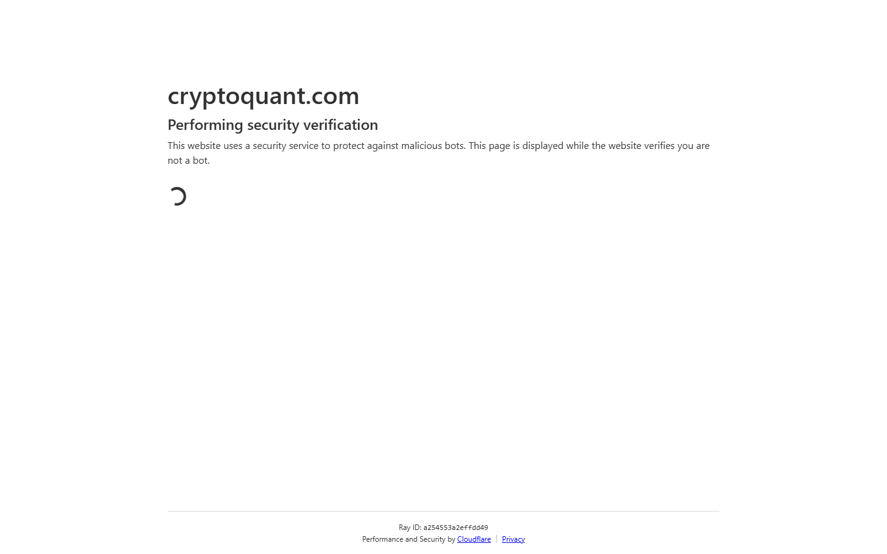

---
title: "USDT Exchange Inflows: Stablecoin Supply Data and What It Signals"
meta_title: "USDT Exchange Inflows: Stablecoin Supply Data and What It Signals"
meta_description: "USDT exchange inflow data: current net flow, which exchanges received the largest USDT inflows, total supply context, and stablecoin supply ratio."
slug: "/exchange-flows/inflows/usdt-stablecoin-inflows-exchange"
primary_keyword: "usdt stablecoin inflows exchange"
category: "Exchange Flows > Inflows"
last_reviewed: "2026-07-27"
schema:
  - "Article"
  - "NewsArticle"
---

# USDT Exchange Inflows: Stablecoin Supply Data and What It Signals

Approximately $2.4B in USDT moved to exchanges in the 24-hour period ending July 27, 2026, per CryptoQuant. The 30-day average daily USDT inflow to exchanges is approximately $1.6B. Current inflows are running at 50% above the 30-day average.

USDT inflows to exchanges are observable. Whether those inflows represent buying intent is a separate question. Stablecoin inflows correlate with increased buying activity historically, but the relationship is lagged and imperfect.

## Current USDT Exchange Inflow Reading

**24-hour USDT inflows (July 27):** $2.4B

**30-day average (daily):** $1.6B

**Current vs. baseline:** +50% above average

**7-day context:** The 7-day cumulative USDT inflow is approximately $12.8B, versus a 30-day average 7-day total of approximately $11.2B. The 7-day figure is 14% above baseline, indicating that today's elevated reading is part of a slightly above-average week rather than an isolated spike.

## Which Exchanges Are Receiving the Largest USDT Inflows

Per CryptoQuant (24-hour window, July 27):

| Exchange | USDT received (24h) | % of total |
|---|---|---|
| Binance | $1.05B | 44% |
| OKX | $480M | 20% |
| Bybit | $360M | 15% |
| Kraken | $220M | 9% |
| Other tracked | $290M | 12% |

Binance dominates USDT inflows as expected, consistent with its share of global spot trading volume. The Bybit figure of $360M is notable: it is above Bybit's typical share of USDT inflows and may reflect increased activity in Bybit's derivatives market.

**Screenshot 1**
File: `../media/09-cryptoquant-usdt-inflows-2026-07-27.png`
Alt text: `CryptoQuant USDT exchange inflow chart showing 24-hour reading and 30-day baseline comparison`
Caption: `CryptoQuant USDT exchange inflow data for July 27, 2026. The $2.4B reading is 50% above the 30-day average, with Binance receiving the largest single-exchange share at $1.05B.`

*CryptoQuant USDT inflows, July 2026. The elevated $2.4B reading occurs on a day when Bitcoin is testing the $101,000 level, a configuration that has historically preceded increased volatility.*

## Total USDT Supply Context: Mint and Burn Activity

**Total USDT supply (July 27, 2026):** Approximately $148B, per Tether's official transparency report.

**30-day supply change:** +$4.2B (net minting of approximately $4.2B over the past 30 days).

**Recent mint event:** Tether's treasury wallet minted 500M USDT on July 22, 2026, per Whale Alert on-chain tracking. This is a standard authorized mint event. Tether mints USDT in response to capital inflows from institutional clients who deposit dollars and receive USDT. Minting does not automatically create buying pressure; it reflects demand that has already materialized.

**Burn activity (July 2026):** No significant USDT burn events in the prior 7 days, per Whale Alert data. The absence of burns confirms that redemptions (converting USDT back to dollars by returning them to Tether) are not elevated.

**Net reading:** The combination of elevated exchange inflows and continued net minting suggests demand for USDT is strong. This is consistent with an active trading environment but does not confirm direction.

## Stablecoin Supply Ratio (SSR)

The Stablecoin Supply Ratio (SSR) is defined as: Bitcoin market cap divided by the total stablecoin market cap (including USDT, USDC, DAI, and others).

**Current SSR (July 27, 2026):** Approximately 6.8

**Interpretation:** A lower SSR means more stablecoin supply relative to Bitcoin's market cap, which historically indicates that more dry powder is available to be deployed into crypto. A higher SSR means stablecoin supply is relatively smaller versus Bitcoin's value.

**Historical reference points:**
- SSR at major bear market lows (late 2022): approximately 2.5-3.0
- SSR at prior bull market peaks: approximately 10-14
- Current SSR of 6.8: mid-cycle range, consistent with a bull market environment where stablecoins have grown but Bitcoin market cap has grown faster

The SSR is defined only once here as it is a metric that requires explanation on first use. It is sourced from Glassnode.

## What to Watch

**If 24-hour USDT inflows exceed $3B**, that would be in the top 10% of daily readings for 2026. Historical correlation: the 4 days with USDT inflows above $3B in 2026 all preceded significant price volatility in the following 24-48 hours (both up and down moves have followed elevated inflows).

**Watch Binance USDT balance specifically.** If Binance's total USDT balance (measured daily by Glassnode) rises above its 30-day average for more than 3 consecutive days, stablecoin supply is accumulating on exchange. This has historically preceded increased trading activity.

**USDT minting frequency.** If Tether mints USDT more than twice in a 7-day window (rare by 2026 standards), institutional demand is elevated. Current mint frequency is approximately 1 event per 10 days.

**SSR direction.** If SSR falls below 6.0, stablecoin supply is growing faster than Bitcoin market cap, which historically indicates dry powder accumulation. Below 5.0 has historically been associated with accumulation phases.

## Evergreen methodology

USDT exchange inflow analysis:

- **Source:** CryptoQuant for exchange inflow data; Whale Alert for real-time mint events; Tether's transparency report for total supply
- **Baseline:** 30-day rolling average daily USDT inflows
- **Alert threshold:** Any reading above 2x the 30-day average (currently $3.2B)
- **Secondary signal:** SSR from Glassnode (requires defining once per article)
- **Caveat:** USDT inflows to exchanges and subsequent price moves have a lagged relationship. Do not treat inflows as same-day price signals.

Update the $2.4B reading and $1.6B baseline from CryptoQuant's live data when re-applying this framework.

## Sources

- [CryptoQuant USDT exchange flows](https://cryptoquant.com/asset/usdt/chart/exchange-flows)
- [Tether transparency report](https://tether.to/en/transparency/)
- [Whale Alert (on-chain mint tracking)](https://whale-alert.io/)
- [Glassnode SSR](https://studio.glassnode.com/metrics?a=BTC&m=indicators.Ssr)
- [CoinGecko USDT](https://www.coingecko.com/en/coins/tether)
