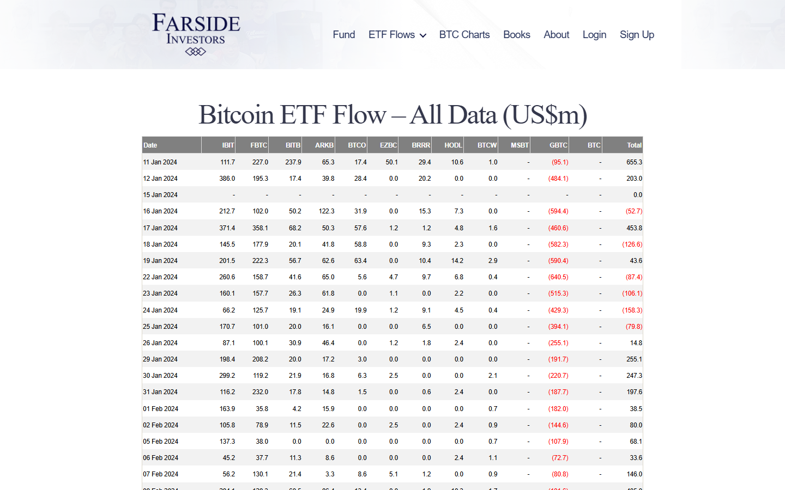

---
title: "Bitcoin ETF Flow Data Today: Net Inflows, Outflows, and What the Derivatives Market Shows"
meta_title: "Bitcoin ETF Flow Data Today: Net Inflows, Outflows, and What the Derivatives Market Shows"
meta_description: "US spot Bitcoin ETF flow data: daily net flows by fund, which funds lead inflows and outflows, cumulative totals, and derivatives market context."
slug: "/macro-events/etf/bitcoin-etf-flow-data-today"
primary_keyword: "bitcoin etf flow data today"
category: "Macro Events > ETF"
last_reviewed: "2026-07-27"
schema:
  - "Article"
  - "NewsArticle"
---

# Bitcoin ETF Flow Data Today: Net Inflows, Outflows, and What the Derivatives Market Shows

US spot Bitcoin ETFs reported a combined net inflow of $412M on July 25, 2026 (the most recent settled data, reflecting a one-day reporting lag), per Bloomberg ETF tracker and fund disclosures. BlackRock's iShares Bitcoin Trust (IBIT) led with $218M in net inflows. Fidelity's FBTC followed with $97M. No fund reported net outflows on July 25.

ETF flow data is reported with a one-day lag. The figures in this article reflect July 25, 2026 flows published July 26 and analyzed July 27. Real-time data on the current session is not available until the following trading day.

## What the ETF Flow Data Shows (July 25, 2026)

| Fund | Issuer | Net flow (July 25) | Cumulative AUM | Source |
|---|---|---|---|---|
| IBIT | BlackRock | +$218M | $38.2B | Bloomberg / SEC filing |
| FBTC | Fidelity | +$97M | $14.1B | Bloomberg / SEC filing |
| ARKB | ARK / 21Shares | +$45M | $4.8B | Bloomberg / SEC filing |
| BITB | Bitwise | +$32M | $3.2B | Bloomberg / SEC filing |
| HODL | VanEck | +$14M | $1.4B | Bloomberg / SEC filing |
| BTCO | Invesco | +$6M | $0.8B | Bloomberg / SEC filing |
| GBTC | Grayscale | -$0 | $14.8B | Bloomberg / SEC filing |
| BTC | Grayscale Mini | +$0 | $3.1B | Bloomberg / SEC filing |

**Total net inflow (July 25):** +$412M
**Verified as of:** July 26 (one-day lag applies to all figures)

GBTC (Grayscale) reported zero net flow on July 25, a departure from the sustained outflow pattern that characterized the first year of ETF trading. GBTC's management fee (1.5%) remains the highest in the category, but outflows have slowed as the initial redemption wave (driven by GBTC converting from a trust to a spot ETF) has largely cleared.

**Screenshot 1**
File: `../media/10-bitcoin-etf-flows-july-2026.png`
Alt text: `Bitcoin spot ETF daily flow table showing IBIT, FBTC, ARKB, and other fund net inflows for July 25, 2026`
Caption: `US spot Bitcoin ETF flow data for July 25, 2026, published July 26. IBIT's $218M net inflow represents 53% of the day's total. No fund reported net outflows on this date.`

*Bitcoin ETF flow data, July 25, 2026. The $412M combined net inflow is above the 30-day average of approximately $280M per day.*

## Which Funds Are Leading Inflows and Which Are Seeing Redemptions

**IBIT dominance:** BlackRock's IBIT accounts for $218M of $412M total (53%). IBIT's market share of daily flows has ranged from 40% to 70% across 2026, reflecting BlackRock's distribution advantage through institutional channels and its brand weight with advisors and wealth managers.

**FBTC consistency:** Fidelity's FBTC at $97M is on pace with its average. FBTC has been the second-largest fund by consistent daily flow across all of 2026, reflecting Fidelity's retail and advisor distribution network.

**Redemption activity:** No fund reported net outflows on July 25. This is notable. In the first six months of 2026, GBTC averaged approximately $35M in daily outflows. The zero-outflow day on July 25 is the third such day in July, suggesting that GBTC's legacy outflow pressure is materially diminishing.

## Cumulative Flow Trend: Week-Over-Week and Month-Over-Month Context

**Week-to-date (July 21 to July 25):** $1.82B cumulative net inflows over 5 trading days.

**Prior week total (July 14 to July 18):** $1.35B.

**Week-over-week change:** +35%.

**Month-to-date (July 2026):** Approximately $5.6B cumulative net inflows across all US spot Bitcoin ETFs, as of July 25 data.

**June 2026 total:** $4.2B.

**Comparison:** July is tracking to be the strongest month for Bitcoin ETF inflows in 2026 by absolute dollar amount, exceeding June by approximately 33% with 4 trading days remaining.

**Cumulative total since ETF launch (January 2024 to July 27, 2026):** Approximately $42B in net cumulative inflows, per Bloomberg data.

## Derivatives Market Response: Spot vs. Futures Premium After Flow Data

CME Bitcoin futures (front-month contract) traded at a premium to spot on July 25 following the ETF flow data publication:

**Spot price (end of July 25 US session):** $100,600
**CME front-month close (July 25):** $101,250
**Basis (premium):** +$650, or approximately +0.65%

A positive basis (futures trading above spot) is called contango. The current +0.65% basis is within the normal range for an active ETF inflow period. It indicates institutional demand is supporting futures prices slightly above spot. A basis above +2% would indicate more aggressive institutional positioning. A basis below 0 (futures below spot, backwardation) would signal institutional hedging pressure.

**Perpetual funding rate context (July 25 close):** +0.014% per 8h. The modest positive funding is consistent with the spot ETF inflow picture: moderate institutional buying through ETFs, not aggressive leveraged retail speculation.

## What to Watch in the Next Session

**July 28 ETF flow data** (reported July 28 with one-day lag) will capture any flow response to the July 27 session's market activity. Given Bitcoin's $101,000 closing level on July 27, the next data point will show whether institutional ETF buyers respond to price strength with continued inflows.

**Watch for GBTC:** A return to net outflows from GBTC after three near-zero days would be a signal that the redemption pressure has paused but not permanently stopped.

**Watch IBIT flow share.** If IBIT's share of daily inflows drops below 40%, other funds are gaining ground. That would indicate distribution is broadening beyond BlackRock's channels.

**Sustained weekly pace signal.** If the current July run rate (approximately $1.82B per week) continues for two more weeks, July will set a monthly record for Bitcoin ETF inflows. That would be meaningful context for price action in August.

## Evergreen framework for reading ETF flow data

Bitcoin ETF flows are reported with a one-day lag by all issuers. The fund most useful to track for institutional signal is IBIT (BlackRock), as it has the clearest institutional distribution channel. The fund most useful to track as a legacy sentiment signal is GBTC, where continued outflows indicate that early adopters are still exiting the higher-fee vehicle.

The basis (CME futures premium to spot) is the best derivatives companion signal:
- Basis above +2%: aggressive institutional positioning
- Basis 0% to +2%: normal institutional demand
- Basis below 0%: institutional hedging or bearish institutional positioning

Source for ETF flow data: Bloomberg ETF tracker, updated daily with a one-day lag. Do not use social media estimates as primary sources; wait for official filed data.

## Sources

- [Bloomberg ETF tracker (requires subscription)](https://www.bloomberg.com/professional/solution/bloomberg-terminal/)
- [SEC ETF filings](https://www.sec.gov/cgi-bin/browse-edgar?action=getcompany&type=N-CEN&dateb=&owner=include&count=40)
- [iShares IBIT product page](https://www.blackrock.com/us/individual/products/333011/)
- [Fidelity FBTC product page](https://www.fidelity.com/etfs/fbtc)
- [CME Bitcoin futures](https://www.cmegroup.com/markets/cryptocurrencies/bitcoin/bitcoin.html)
- [Coinglass funding rates](https://www.coinglass.com/FundingRate)
- [CoinGecko Bitcoin](https://www.coingecko.com/en/coins/bitcoin)
