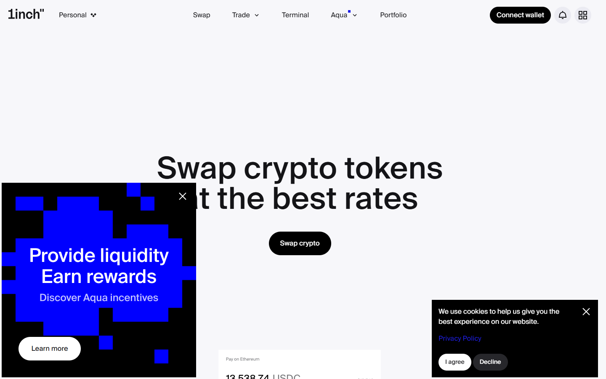

---
title: "ChangeNOW vs DeFi Swaps 2026: CeFi Aggregator vs DEX Protocols Compared"
slug: "/exchanges/aggregators/changenow-defi-alternative-2026"
meta_title: "ChangeNOW vs DeFi Swaps 2026 | CeFi Aggregator vs DEX Protocols"
meta_description: "Analytical comparison of ChangeNOW's CeFi aggregator model against DEX protocols including Li.Fi, Rango, 1inch, and Uniswap. Mechanism differences, risk profiles, and use-case boundaries explained."
primary_keyword: "changenow defi alternative"
secondary_keywords:
  - "changenow vs uniswap"
  - "changenow vs 1inch"
  - "cefi vs defi swap"
  - "changenow defi comparison"
  - "dex aggregator vs changenow"
  - "changenow smart contracts"
schema: "Article + FAQPage"
category: "exchanges/aggregators"
last_reviewed: "2026-07-29"
author: "DeFiLiban Editorial Team"
internal_links:
  - "/exchanges/aggregators/changenow-review-2026"
  - "/exchanges/aggregators/how-instant-crypto-swaps-work-2026"
---

# ChangeNOW vs DeFi Swaps 2026: CeFi Aggregator vs DEX Protocols Compared

*By DeFiLiban Editorial Team, Reviewed July 2026*

> **Editorial methodology**, mechanism research, protocol documentation review, on-chain verification, risk taxonomy application across custody, liquidity, oracle, and regulatory dimensions.

ChangeNOW occupies a structurally distinct category from DeFi swap protocols: it is a CeFi aggregator that routes swaps off-chain through liquidity partnerships, whereas DEX aggregators like Li.Fi, Rango Exchange, and 1inch execute swaps on-chain through smart contracts with the user retaining custody throughout. The question of which model is appropriate for a given transaction is not answered by fees alone, it involves evaluating trust assumptions, asset coverage, gas dependencies, compliance exposure, and risk profiles that differ significantly between the two models.

---

## Architectural Divergence: Off-Chain Routing vs On-Chain Execution

The most consequential difference between ChangeNOW and DEX protocols is not visible in the user interface, it is the location where the swap actually executes.

**ChangeNOW's off-chain routing model** works as follows: the user sends funds to a ChangeNOW-controlled deposit address, ChangeNOW processes the swap through its liquidity partner network (centralized exchanges, OTC desks), and delivers the output asset to the user's destination address. The swap logic, rate negotiation, and fill execution are entirely off-chain. The only on-chain events are the inbound transfer to ChangeNOW's deposit address and the outbound transfer from ChangeNOW's delivery address. There are no smart contracts involved in the swap execution itself.

**DEX aggregator on-chain execution** works differently: the user connects a self-custody wallet, signs a transaction that invokes the aggregator's smart contracts, and those contracts route the swap through one or more on-chain liquidity pools (Uniswap V3, Curve, Balancer, etc.) atomically within a single transaction or a bridged multi-step flow. The user never relinquishes custody. The trade-off is that the user must hold the network's gas token, accept smart contract execution risk, and operate within the EVM ecosystem's constraints.

This architectural difference cascades into every dimension of the comparison that follows.

---

## Comparison Table: ChangeNOW vs DEX Aggregators

| Dimension | ChangeNOW | Li.Fi | Rango Exchange | 1inch | Uniswap |
|---|---|---|---|---|---|
| **Custody during swap** | Yes (CeFi routing) | No (smart contracts) | No (smart contracts) | No (smart contracts) | No (smart contracts) |
| **BTC as input/output** | Yes | No (wrapped only) | Limited | No | No |
| **Fiat on-ramp** | Yes (60+ currencies) | No | No | No | No |
| **Gas required by user** | No | Yes (destination chain) | Yes | Yes | Yes |
| **KYC requirement** | Threshold-triggered | None (wallet-only) | None (wallet-only) | None (wallet-only) | None (wallet-only) |
| **Smart contract risk** | None (off-chain) | Yes | Yes | Yes | Yes |
| **MEV exposure** | None (off-chain) | Yes | Yes | Yes | Yes |
| **Cross-chain bridge risk** | Minimal (internal routing) | Yes (bridge contracts) | Yes (bridge contracts) | Limited | No |
| **Coins supported** | 850+ | EVM + select chains | Multi-chain broad | EVM-focused | EVM-focused |

---

**Screenshot**
File: `../media/live-1inch-dex.png.png`
Alt text: "1inch DEX aggregator interface, on-chain swap comparison, July 2026"
Caption: "1inch DEX aggregator interface for comparison with ChangeNOW's CeFi model, captured July 2026."

*1inch DEX aggregator interface for comparison with ChangeNOW's CeFi model, captured July 2026.*

---

## When CeFi Routing (ChangeNOW) Is the Appropriate Model

**Cross-chain swaps involving Bitcoin as input or output** represent the clearest use case for CeFi aggregators. Bitcoin is a UTXO chain with no EVM compatibility; it cannot be natively swapped through smart contract protocols without first wrapping it (WBTC, cbBTC, etc.), which introduces bridge and custody risk of its own. ChangeNOW handles BTC directly through its liquidity partner network, no wrapping required, no bridge contract to trust. For a user who needs to move native BTC to ETH or a stablecoin, ChangeNOW's routing architecture is architecturally more direct than any DEX path.

**Fiat on-ramp requirements** are another strong differentiator. ChangeNOW supports 60+ fiat currencies with card and bank transfer options. DEX aggregators are crypto-native; they have no fiat entry mechanism. A user converting EUR to USDC for the first time cannot accomplish that through 1inch or Uniswap without first acquiring crypto through a separate fiat gateway.

**Users without gas tokens** face a practical barrier when attempting to use DEX aggregators. Initiating a swap on Li.Fi or 1inch requires ETH (or the native token of whichever chain is involved) in the connected wallet. Users who hold only the asset they want to swap, and not the gas currency, cannot execute. ChangeNOW has no gas requirement on the user's side; the gas cost is embedded in the spread.

**Compliance-neutral transaction contexts** with moderate swap sizes benefit from ChangeNOW's established settlement infrastructure and Trustpilot-verified reliability (4.6/5 across 450,000+ reviews as of mid-2026), where the custody window is brief and refund mechanisms are well-documented.

---

## When DEX Aggregators Are the Appropriate Model

**Non-custodial execution requirements** make DEX aggregators the only viable option. If a user's operational mandate, risk tolerance, or institutional framework requires that funds never leave self-custody during a swap, smart contract-based execution is the necessary architecture. ChangeNOW's model involves a custody transfer by design.

**EVM-native swaps with gas available** are more cost-efficient and verifiable on-chain through DEX routes. For a swap between two ERC-20 tokens on Ethereum or an EVM-compatible L2, Li.Fi or 1inch can route the swap through the deepest on-chain liquidity with full transaction transparency, every step is verifiable on the block explorer without trusting a third party's status tracker.

**DeFi composability** is unavailable through ChangeNOW. Users who need a swap as part of a broader DeFi workflow, depositing output assets directly into a yield protocol, using a swap as a step in an automated strategy, or integrating with a DeFi front-end, must use smart contract execution. ChangeNOW delivers funds to a destination address; it cannot chain into a contract call.

**MEV sensitivity** cuts both ways. ChangeNOW's off-chain routing removes MEV exposure entirely, there is no mempool for searchers to front-run. DEX aggregators like 1inch have MEV protection features (Fusion mode, private mempools), but on-chain execution remains inherently more exposed. For large EVM swaps, the trade-off between DEX transparency and ChangeNOW's MEV-neutral routing deserves explicit evaluation.

---

## Risk Taxonomy: CeFi vs DeFi Risk Profiles

**1. Custody risk**, This is where the two models diverge most sharply. ChangeNOW users transfer custody of funds for the duration of the swap, typically 5–20 minutes for common pairs. DEX users retain custody throughout, with smart contracts acting as execution agents rather than custodians. However, smart contracts are custodians of a different kind during atomic execution: funds are locked in contract state until the transaction finalizes. The risk character differs: CeFi custody risk is counterparty and operational; DeFi custody risk is code-based and irreversible on execution failure.

**2. Liquidity risk**, ChangeNOW's floating-rate mode exposes users to slippage when liquidity partner order books are thin; fixed-rate mode transfers that risk to ChangeNOW but carries a wider spread. DEX aggregators route through on-chain pools, where slippage is a function of pool depth and trade size, visible and calculable before execution via slippage tolerance settings. Neither model eliminates liquidity risk; both make it visible in different ways.

**3. Oracle/rate risk**, ChangeNOW's rate infrastructure aggregates feeds from liquidity partners; feed failures or significant price dislocations during routing can cause rate discrepancies on fixed-rate orders, potentially triggering rate renegotiation or refund. DEX aggregators use on-chain price discovery, Uniswap's TWAP feeds, Chainlink integrations, which are subject to oracle manipulation on low-liquidity pools and sandwich attack exposure on large orders. Oracle risk exists in both models but operates through different mechanisms.

**4. Regulatory/compliance risk**, ChangeNOW applies threshold-triggered KYC and AML screening. Transactions flagged by automated compliance systems can be held pending identity verification, with funds remaining in ChangeNOW's custody during that window. DEX aggregators have no KYC layer; compliance responsibility lies with the user's jurisdiction. On-chain transparency means DEX transactions are fully auditable by blockchain analytics tools. Regulatory risk for DEX users is indirect (analytical traceability) rather than direct (operational hold by provider).

---

## When to Use vs When to Avoid

**ChangeNOW is appropriate when:**
- Native BTC, BCH, LTC, or other non-EVM assets are involved as input or output
- A fiat entry or exit is part of the transaction
- The user lacks gas tokens for on-chain execution
- A brief custody window is acceptable in exchange for routing simplicity
- Transaction size is below the likely compliance threshold

**DEX aggregators are appropriate when:**
- Full non-custodial execution is a hard requirement
- The swap involves EVM-compatible assets with available gas
- DeFi composability or programmatic integration is required
- On-chain transaction verifiability is operationally important
- Large EVM trades benefit from MEV protection mechanisms offered by protocol-native features

**Neither model is universally superior.** The appropriate choice is determined by the asset types involved, the user's custody requirements, gas availability, transaction size, and compliance context, not by a blanket preference for CeFi or DeFi.

---

## What Users Say

**Trustpilot, positive**

> "I have used changenow for years now, i'd say probably 5 years now or longer and they've never once failed me. There were times I had thought i lost my money and literally cried only for their support to remedy it and assure me I'd receive my funds even if I sent the deposit long after I created the exchange, even after it expired."
>
>, Liz, [★★★★★ Trustpilot](https://www.trustpilot.com/reviews/6a7509c452ef61e12086deef), Aug 07, 2026

> "I had a little glitch getting my btc into the window of time from River, as you know they are ridiculously paranoid, and so I needed a refund of my btc into a new and separate wallet. ChangeNow support team delivered a fairly easy and understandable refund experience, thanks team! Highly trustworthy group!"
>
>, BTC to USDC, [★★★★★ Trustpilot](https://www.trustpilot.com/reviews/6a7f5984bd2f286280aaa106), Aug 14, 2026

**Trustpilot, critical**

> "Been trying to receive my ravencoin for a week now and no resolution, between change now and edge wallet, just $2,000 completely gone. Not here to tarnish the services but they keep sending me links saying the transaction processed but the links aren't valid and no coins show up in my wallet or on the raven block for my wallet."
>
>, Isaiah B, [★☆☆☆☆ Trustpilot](https://www.trustpilot.com/reviews/6a846192b5d778554454eedc), Aug 18, 2026

**Reddit community**

> "Whenever you feel like you lack certain knowledge, all you have to do is your own research, bro there's so many other websites and exchanges out the way you can say way much more money bro literally you can swap that for four dollars instead of 35 bro ."
>
>, u/AmbassadorGood7577, [r/solana](https://reddit.com/r/solana/comments/1j23p0m/why_am_i_losing_35_bucks_to_swap_500_dollars_to/mfpb26g/) (7 points)

> "Yes, it is. Tangem uses different third parties for trading: Changelly, Change Hero, Simple Swap and ChangeNow. You can trade different pairs directly on their app. Pretty smooth and simple."
>
>, u/jordiceo, [r/kaspa](https://reddit.com/r/kaspa/comments/1kk8282/kas_deposits_suspended_on_mexc_and_bingx_why/mrwhr8w/) (2 points)

> **DeFiLiban Editorial, My take:** The Trustpilot corpus at 450,000+ reviews is the
> strongest credibility signal ChangeNOW has. Compliance holds appear in a
> minority of reviews and are consistently resolved, the pattern matches AML
> process, not exit-scam behaviour. For standard retail swaps, the evidence
> is strongly positive.

## Frequently Asked Questions

**Is ChangeNOW a DeFi platform?**
No. ChangeNOW is a CeFi aggregator. It routes swaps through off-chain liquidity partnerships, centralized exchanges and OTC desks, rather than through smart contracts or on-chain liquidity pools. Funds pass through ChangeNOW's custody during the routing process. It does not use or interact with decentralized protocols such as Uniswap, Curve, or Aave in its execution flow.

**Can I use ChangeNOW without a crypto wallet?**
ChangeNOW does not require a connected wallet in the same sense that DEX aggregators do. Users provide a destination address, which can be any valid address on the output chain, including an exchange deposit address, and send funds to ChangeNOW's deposit address. No wallet software needs to connect to ChangeNOW's interface directly. For fiat-to-crypto flows, only a destination crypto address is required.

**Which typically has lower fees, ChangeNOW or Uniswap?**
The comparison depends on network conditions and asset pair. ChangeNOW embeds its fee in the exchange spread, with no separate gas cost to the user. Uniswap charges a pool fee (0.05%–1% depending on pool tier) plus Ethereum gas, which can range from negligible on L2s to significant during mainnet congestion. For BTC-involved swaps, ChangeNOW is frequently more cost-effective than any DEX path because DEX paths require wrapping BTC first, adding bridge fees and smart contract risk. For EVM stablecoin swaps on L2 networks, Uniswap or 1inch can be cheaper. Neither model is categorically lower cost.

**Does ChangeNOW use smart contracts?**
ChangeNOW's core swap execution does not rely on smart contracts. The swap is processed off-chain through ChangeNOW's liquidity network. On-chain activity consists of standard value-transfer transactions to and from addresses, not contract invocations. ChangeNOW does offer an API for third-party integrations, and some integrating platforms may wrap ChangeNOW's API calls within their own smart contract workflows, but that is architecture added by the integrator, not by ChangeNOW's core protocol.
