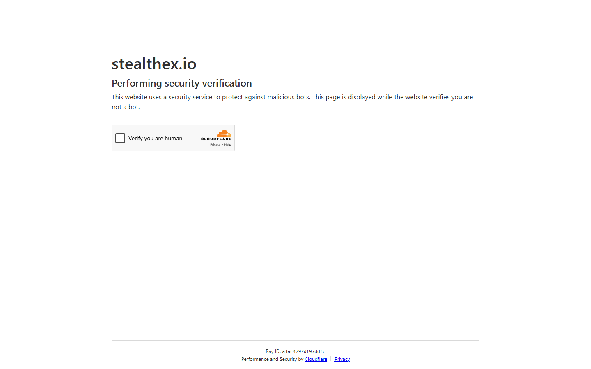

---
title: "StealthEX as a DeFi Alternative 2026: Non-Custodial Swaps Without DEX Complexity"
slug: "/exchanges/aggregators/stealthex-defi-alternative-2026"
meta_title: "StealthEX DeFi Alternative 2026: No-KYC Swaps Without On-Chain Complexity"
meta_description: "StealthEX as a DeFi alternative in 2026. How non-custodial swap services compare to DEXs for no-KYC trading without gas fees, slippage, and on-chain complexity."
primary_keyword: "stealthex defi alternative"
secondary_keywords:
  - "stealthex vs dex 2026"
  - "non-custodial swap vs defi"
  - "no kyc crypto swap defi alternative"
schema: "Article + FAQPage"
category: "exchanges/aggregators"
last_reviewed: "2026-08-18"
author: "DeFiLiban Research Team"
internal_links:
  - "/exchanges/aggregators/privacy-coin-swap-no-kyc-2026"
  - "/exchanges/aggregators/stealthex-review-2026"
---

# StealthEX as a DeFi Alternative 2026: Non-Custodial Without DEX Complexity

*By DeFiLiban Research Team, Reviewed August 2026*

Decentralized finance (DeFi) and non-custodial swap services like StealthEX solve overlapping problems, but through different mechanisms. DEXs like Uniswap operate entirely on-chain. StealthEX operates off-chain but maintains non-custodial properties by routing swaps without holding funds. For users who want no-KYC trading without gas fees, slippage, and on-chain complexity, StealthEX sits in a useful middle ground.

**Screenshot**
File: `../media/live-stealthex-homepage.png`
Alt text: "StealthEX homepage, non-custodial swap as DeFi alternative, August 2026"
Caption: "StealthEX provides non-custodial swaps as an alternative to DEX complexity, captured August 2026."

*StealthEX non-custodial swap interface, captured August 2026.*

---
## DeFi vs StealthEX: core comparison

| | DEX (Uniswap/Curve) | StealthEX |
|---|---|---|
| Custody | Non-custodial | Non-custodial |
| KYC | None | None |
| Gas fees | Yes (ETH/L2) | Built into spread |
| Slippage | Yes | Fixed rate option |
| Cross-chain | Via bridges | **Native cross-chain** |
| Privacy coins | No XMR on-chain | **XMR, ZEC available** |
| Settlement speed | Near-instant (same chain) | 5-30 min (cross-chain) |
| Complexity | Wallet + DApp | Simple web interface |

---

## Why users choose StealthEX over DEXs

**Cross-chain swaps without bridges.** DEXs operate within a single blockchain ecosystem. Swapping BTC for ETH on Uniswap is not possible natively. StealthEX handles cross-chain swaps directly, with no bridge contract risk.

**Privacy coin access.** Monero (XMR) cannot exist on EVM chains due to its privacy architecture. DEXs cannot list XMR. StealthEX provides the only functional path to XMR from BTC or ETH for users who need a simple interface.

**No gas fee complexity.** Gas fee management on Ethereum mainnet is a non-trivial user experience problem. StealthEX's spread-inclusive pricing removes gas from the user's calculation.

**Fixed rate guarantee.** DEXs always use market rate at execution (AMM model). StealthEX offers fixed rate, locking the received amount at order creation.

---

## Why DeFi wins in specific cases

**On-chain verifiability.** Every DEX trade is recorded on-chain and publicly auditable. StealthEX swaps are handled off-chain, though transaction IDs are provided.

**Speed on same-chain pairs.** If swapping ETH-to-USDT on Ethereum, Uniswap settles in seconds. StealthEX's 5-30 minute window is slower.

**Composability.** DeFi protocols can be composed programmatically. StealthEX is an API service, not a composable on-chain primitive.

**No counterparty.** DEXs use liquidity pools with no counterparty risk. StealthEX routes through partner liquidity providers who are counterparties.

---

## The optimal use case split

| Need | Better option |
|------|--------------|
| BTC to ETH or XMR | StealthEX |
| ETH to USDT (mainnet) | DEX (faster, no counterparty) |
| Privacy coin access | StealthEX |
| DeFi protocol interaction | On-chain |
| No gas complexity | StealthEX |
| Maximum on-chain transparency | DEX |

---

## StealthEX as a DeFi entry point

A common pattern: use StealthEX to convert BTC (Bitcoin mainnet) to ETH or USDT, receive on an EVM wallet, then enter DeFi protocols directly. StealthEX functions as the bridge between Bitcoin holders and the EVM DeFi ecosystem without requiring a centralized exchange.

---

## Frequently Asked Questions

**Is StealthEX safer than a DEX?**
Different risk profiles. DEXs have smart contract risk but no counterparty. StealthEX has counterparty (routing partner) risk but no smart contract vulnerability. Both are non-custodial.

**Can I use StealthEX instead of Uniswap?**
For cross-chain swaps (BTC-to-ETH, BTC-to-USDT, XMR-to-ETH), yes. For single-chain swaps within Ethereum or an L2, Uniswap is faster and cheaper.

**Does StealthEX work with DeFi wallets?**
Yes. StealthEX receives any wallet address as output. You can receive funds directly into MetaMask, Coinbase Wallet, or any EVM wallet, then use them in DeFi.

