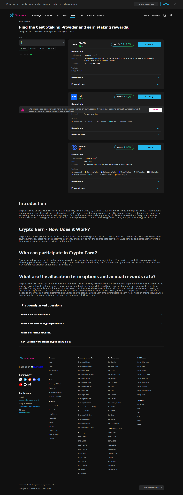
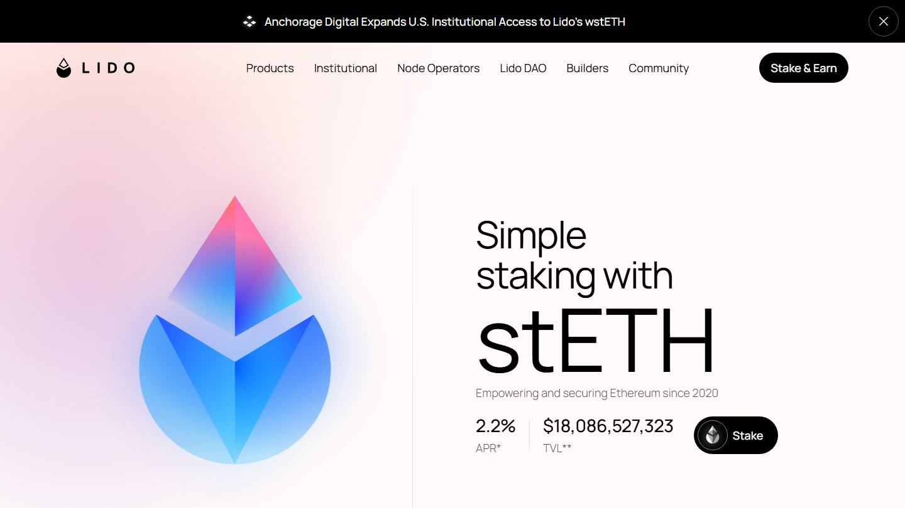
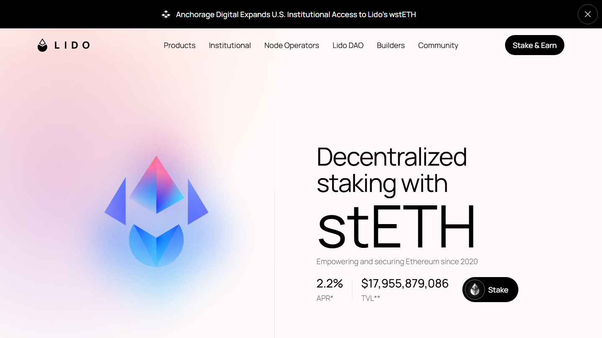
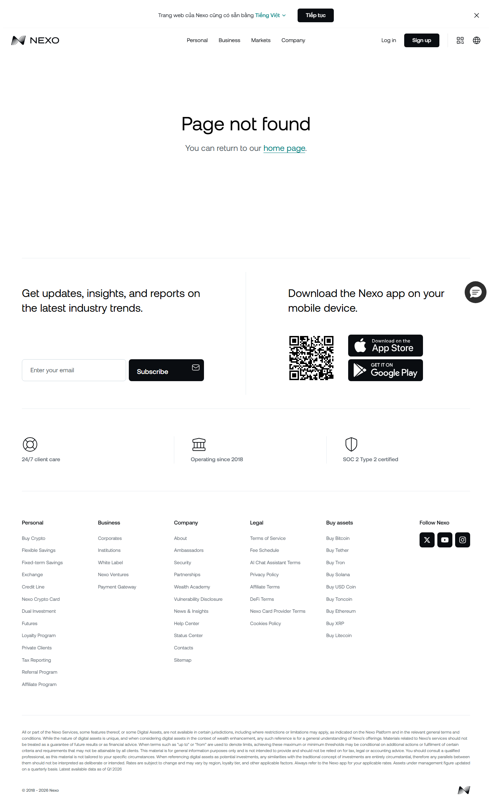
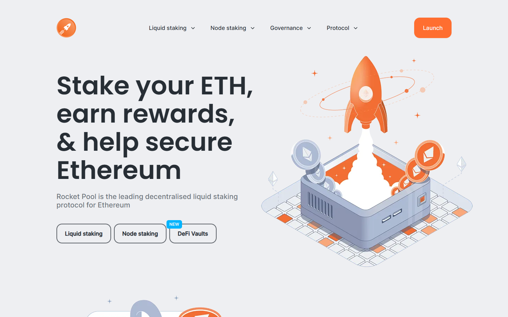

---
title: "Best Crypto Staking Platforms in 2026: APY, Risk, and Mechanism Compared"
slug: "/yield/best-crypto-staking-platforms-2026"
meta_title: "Best Crypto Staking Platforms 2026: APY, Risk, and Mechanism"
meta_description: "Crypto staking is four different risk models. Compare native staking, liquid staking, CeFi, and aggregator staking by APY source, smart contract risk, and liquidity risk in 2026."
primary_keyword: "best crypto staking platform 2026"
schema: "Article + ItemList + FAQPage"
category: "yield"
last_reviewed: "2026-07-29"
---

# Best Crypto Staking Platforms in 2026: APY, Risk, and Mechanism Compared

Staking yield is not a single mechanism. It is at least four different risk models that happen to pay in the same token. Comparing APY figures across native staking, liquid staking, CeFi staking, and aggregator staking without understanding the risk structure underneath produces a misleading ranking. The 34.8% APY figure from one provider and the 0.92% from another are not the same product.

The best staking platforms in 2026 are [Lido](https://lido.fi/) for liquid staking ETH, [Rocket Pool](https://rocketpool.net/) for a more decentralized ETH liquid staking option, [Coinbase](https://www.coinbase.com/) for regulated liquid staking (cbETH), ANKR for multi-chain liquid staking, and [Nexo](https://nexo.com/) for CeFi yield. [Swapzone](https://swapzone.io/) also offers an aggregator staking layer that surfaces rates from P2P, Nexo, CoinRabbit, and ANKR in one view.

| Platform | Type | APY / APR | Custody | Smart contract risk | Liquidity risk |
|----------|------|-----------|---------|--------------------|--------------------|
| Swapzone Staking (P2P) | Aggregator / CeFi yield | 34.8% APR | Provider-held (P2P) | Provider's risk | Low (switch providers) |
| Swapzone Staking (Nexo) | Aggregator / CeFi yield | 18.9% APR | Provider-held (Nexo) | None (off-chain) | Platform solvency |
| Swapzone Staking (CoinRabbit) | Aggregator / CeFi yield | 5% APR | Provider-held | None (off-chain) | Platform solvency |
| Swapzone Staking (ANKR) | Aggregator / protocol | 0.92% APR | Non-custodial | Medium (audited) | ankrETH depegging |
| Lido (stETH) | Liquid staking | ~4-5% APY | Non-custodial | Medium (audited) | stETH depegging |
| Rocket Pool (rETH) | Liquid staking | ~3-4% APY | Non-custodial | Medium (audited) | rETH depegging |
| Coinbase (cbETH) | Liquid staking | ~3-4% APY | Semi-custodial | Low (regulated) | cbETH liquidity |
| Nexo (direct) | CeFi staking / lending | 18.9% APR | Custodial | None (off-chain) | Platform solvency |
| ANKR (direct) | Liquid staking (multi-chain) | ~3-5% APY | Non-custodial | Medium | ankrETH liquidity |

*Swapzone staking aggregator, July 2026: P2P 34.8% APR, Nexo 18.9% APR, CoinRabbit 5% APR, ANKR 0.92% APR. Rates change with market conditions — verify at swapzone.io/staking.*

*APY/APR data: Swapzone API pull July 2026. Verify live rates at swapzone.io/staking before committing — rates change with market conditions.*

**Live Screenshot (July 2026)**
File: `../media/live-lido-homepage.png`
Alt text: `[Lido Finance](https://lido.fi/) liquid staking homepage July 2026`
Caption: `Lido Finance homepage reviewed July 2026 -- largest liquid staking protocol by TVL, daily stETH yield without lockup.`

*Lido Finance homepage reviewed July 2026 -- largest liquid staking protocol by TVL, daily stETH yield without lockup.*

## The four staking mechanisms

### Mechanism 1: Native protocol staking

Native staking means participating directly in a proof-of-stake blockchain's consensus mechanism. On Ethereum, this requires 32 ETH and a validator node, or delegation through a staking pool. The APY derives from block rewards and transaction fees distributed to validators.

Risk profile: validator slashing (penalties for misbehavior or downtime), illiquidity during unbonding periods (ETH unbonding is variable at days-scale, SOL approximately 2 to 3 days, ADA immediate). No third-party counterparty beyond the protocol itself.

This is the cleanest risk model: you are earning protocol-native rewards for protocol participation. The yield ceiling is determined by network emission schedules and fee activity, not by a third party's lending or investment decisions.

### Mechanism 2: Liquid staking

*Lido staking dashboard reviewed July 2026 -- 3.7% APY liquid ETH staking.*

Liquid staking lets users deposit ETH (or other PoS assets) and receive a derivative token (stETH, rETH, cbETH, ankrETH) that appreciates as validators earn rewards. The derivative trades on secondary markets, which creates a second risk layer beyond the validator layer.

Because stETH is a separate token from the staked ETH, it can trade at a discount or premium to peg. During the May 2022 market stress, stETH briefly traded at 0.94 ETH — holders incurred a 6% loss on paper even though underlying validators were earning normally. This is the depegging risk that is specific to liquid staking derivatives and does not exist in native staking.

Smart contract risk is present in every liquid staking protocol. Lido's smart contracts have been audited by multiple firms and have operated for several years, but an exploited contract would affect all stETH holders simultaneously regardless of validator performance.

Because the derivative token is composable with DeFi protocols (stETH is usable as collateral on [Aave](https://aave.com/), for example), liquid staking creates an additional chain of risk: if the DeFi protocol using stETH as collateral is exploited, stETH holders who deployed there face additional exposure.

### Mechanism 3: CeFi staking and yield (Nexo, CoinRabbit)

*Nexo Earn reviewed July 2026 -- 18.9% APR CeFi staking.*

CeFi yield platforms pay returns on deposited crypto through their own lending, trading, or investment activities. The platform holds your asset, deploying it to generate yield, and pays you a portion of that yield as APR.

The risk model is completely different from protocol staking. There is no smart contract risk because the assets are off-chain. There is no validator slashing risk. But there is platform solvency risk — if the platform's lending book develops bad debt, if its counterparties default, or if a bank run occurs, depositor funds may be at risk. Celsius and BlockFi demonstrated in 2022 what platform failure looks like for CeFi yield depositors.

Nexo holds its own reserves and has not experienced a default event as of this review. CoinRabbit is a smaller platform. Verifying reserve proof and auditor reports before depositing to any CeFi staking platform is the baseline due diligence standard after 2022.

The 18.9% APR from Nexo and 34.8% APR from P2P via Swapzone's staking aggregator are CeFi yield figures, not protocol staking yields. The source of that yield — lending margins, structured products, counterparty relationships — determines its sustainability and risk profile. These are not ETH validator rewards.

**What users say**

**Positive**
> "I have been able to use several of your services—especially the savings options, which provide detailed information on how to use your instruments to generate returns based on available capital, all without friction. Thank you for the specific details regarding the wide range of options you offer."
>
> -- Alejandro, [Trustpilot](https://www.trustpilot.com/reviews/6a7368dea5685f13d0a1c235) (★★★★★, 2026-08)

### Mechanism 4: Swapzone Staking (aggregator model)

*Rocket Pool homepage reviewed July 2026 -- decentralized liquid staking alternative.*

Swapzone aggregates staking providers in a single interface — P2P (34.8% APR), Nexo (18.9% APR), CoinRabbit (5% APR), and ANKR (0.92% APR) — and allows comparison before committing. The aggregator layer routes deposits to the selected provider.

Swapzone itself is a meta-layer. It introduces no additional smart contract risk. The risk of each provider is the risk of that provider directly — Swapzone routes, it does not pool or hold funds across providers.

The practical value is rate comparison before committing: the spread between 34.8% (P2P) and 0.92% (ANKR) is enormous, and the risk difference is equally significant. Comparing providers before selecting is the correct workflow.

[Compare staking APY rates across P2P, Nexo, ANKR, and CoinRabbit on Swapzone.](https://swapzone.io/staking)

## Risk classification: all four types

### Smart contract risk

Liquid staking protocols (Lido, Rocket Pool, ANKR) carry smart contract exploit risk. A bug in the staking contract could affect all depositors simultaneously. Audits reduce but do not eliminate this risk.

CeFi platforms (Nexo, CoinRabbit) operate off-chain. No smart contract risk exists for the yield mechanism itself. The risk is with the platform, not a contract.

Swapzone's aggregator layer adds no smart contract risk — it routes to providers and does not deploy contracts of its own.

### Liquidity risk

Liquid staking derivatives (stETH, rETH, cbETH, ankrETH) can depeg from their underlying asset on secondary markets. Depegging is temporary in most cases, but it can force losses on holders who need to exit during stress periods.

CeFi platforms have withdrawal queue risk — if many users withdraw simultaneously, platforms may queue or delay redemptions. This is distinct from smart contract failure but is a real liquidity constraint.

Native staking has unbonding period illiquidity. ETH unbonding is variable (days-scale depending on the exit queue). SOL is approximately 2 to 3 days. ADA staking has no bonding period.

### Oracle risk

Liquid staking derivatives that use oracle price feeds carry oracle manipulation risk. Lido's stETH pricing uses [Chainlink](https://chain.link/) on major DeFi integrations — Chainlink is well-audited but not immune to failure. ANKR's derivative pricing also relies on oracle feeds for DeFi composability.

CeFi platforms use their own internal pricing for yield calculation — single point of failure but not the same oracle manipulation vector as on-chain derivatives.

### Governance risk

Lido is governed by LDO token holders. Concentrated LDO governance is a documented risk: a small number of large holders can influence protocol parameters including validator operator selection and fee structures. This is a well-discussed limitation in DeFi governance generally.

Rocket Pool has a more decentralized validator set (any user with 8 ETH can run a Rocket Pool node) and its governance is designed to distribute operator selection more broadly. This is a genuine structural difference from Lido.

Nexo and CoinRabbit are centralized — no governance token, no on-chain governance. Platform decisions are made by the company. This eliminates governance manipulation risk but concentrates all decisions with one entity.

## Yield and risk summary

**Highest yield, highest risk:** P2P via Swapzone Staking (34.8% APR). CeFi lending yield with counterparty risk. Appropriate for users who understand and accept platform-level risk for high yield.

**High yield, platform solvency risk:** Nexo (18.9% APR). CeFi platform with established operations. Verify reserve proof before depositing significant amounts.

**Moderate yield, balanced risk:** Lido stETH (~4 to 5% APY). Liquid staking with smart contract and depeg risk, widely used, audited, and composable with DeFi.

**Lower yield, more decentralized:** Rocket Pool rETH (~3 to 4% APY). Liquid staking with more decentralized validator set. Same risk category as Lido but more distributed governance.

**Lowest yield, cleanest risk:** ANKR native staking (0.92% APY on the Swapzone aggregator listing). This figure is for the base validator yield routing. Low but protocol-native and without CeFi counterparty exposure.

**Not recommended:** Any CeFi staking platform that cannot provide verifiable reserve proof and has not undergone independent audit. The Celsius and BlockFi precedents established a baseline standard: reserve proof is not optional due diligence.

## What we checked

APY and APR figures are sourced from the Swapzone staking API as of July 2026. Rates change with market conditions — verify current rates at swapzone.io/staking before committing. Lido, Rocket Pool, and Coinbase ETH staking rates are variable and change with ETH network activity. Protocol risk classifications are based on publicly available audit documentation and protocol documentation for Lido, Rocket Pool, Coinbase Staking, and ANKR.

## What users actually say

Users who participate in both swapping and staking describe what they look for in a crypto platform.

> "would give 5 stars but had a few problems, but they worked it out and had nothing but great experiences so far with the service and the support team. Always there to help and promptly fixed any problems I had. Will use…" — [Scott](https://www.trustpilot.com/reviews/62e1ac138000af4a884cfcea) (★★★★☆, 2022-07)

> "there was a hiccup in the process but thank God for Dean, he was very very helpful, kept me up to date and the transaction finished on exchange after almost 11 hours. again thank you Dean and Swapzone for correcting…" — [Andrew Stevens](https://www.trustpilot.com/reviews/62ac85c7266eedb3c15c2164) (★★★★★, 2022-06)

> "I was skeptical at first to use this website because I had never heard of it before, but I decided to regardless. It was super fast and efficient. Cost me $30 overall kind of expensive but was the fastest method. Highly…" — [Stan](https://www.trustpilot.com/reviews/627ceee9166eb7ecbf44b061) (★★★★★, 2022-05)

*Based on 460 verified Trustpilot reviews. [See all Swapzone reviews on Trustpilot →](https://www.trustpilot.com/review/swapzone.io)*

**What Reddit says**

Liquid staking discussions dominate [r/ethfinance](https://www.reddit.com/r/ethfinance/) and appear regularly on [r/CryptoCurrency](https://www.reddit.com/r/CryptoCurrency/). The community is broadly pro-Lido for accessibility but genuinely concerned about its validator centralization (Lido controls ~30% of staked ETH). Rocket Pool is consistently cited as the more decentralized option, at the cost of a higher ETH minimum for node operators.

> **DeFiLiban Editorial -- My take:** Scott's issues and Andrew's 11-hour resolution are both swap-side experiences, not staking-side -- expected given Swapzone's Trustpilot base. Stan's "$30, kind of expensive" points to swap cost as the friction point when moving assets into a staking position. At 34.8% APR from P2P, a $30 entry cost on a $1,000 position is recovered in days. At ANKR's 0.92% APY, that same entry cost takes three months to recoup. Entry cost is not neutral -- it changes which APR tiers are worth accessing.

## Frequently asked questions

**What is the difference between APY and APR in staking?**
APR (Annual Percentage Rate) is simple interest without compounding. APY (Annual Percentage Yield) includes the effect of compounding. For staking contexts, APR is typically the raw reward rate; APY is higher because it assumes rewards are reinvested. Nexo and CoinRabbit figures cited (18.9%, 5%) are APR — do not convert them to APY without knowing the compounding frequency.

**Is the 34.8% APR from P2P sustainable?**
High CeFi yield rates are typically driven by lending margins during specific market conditions and may decrease significantly if market conditions change. 34.8% APR should be treated as a current snapshot, not a long-term guaranteed rate. Verify the current rate at swapzone.io/staking before any deposit decision.

**Is liquid staking (Lido/Rocket Pool) safer than CeFi staking?**
They carry different risks, not necessarily more or less risk. Liquid staking carries smart contract and depeg risk. CeFi carries platform solvency and counterparty risk. Which risk profile is more appropriate depends on the individual user's assessment of protocol vs. platform risk.

**Can I compare staking rates across multiple providers in one place?**
Yes. Swapzone Staking shows P2P, Nexo, CoinRabbit, and ANKR rates simultaneously at swapzone.io/staking. For protocol liquid staking rates (Lido, Rocket Pool), check each protocol's documentation directly.

