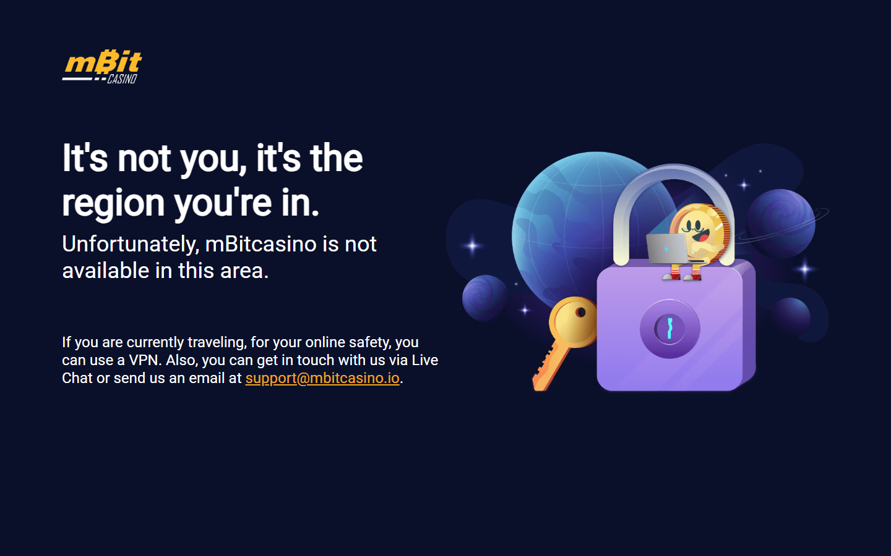
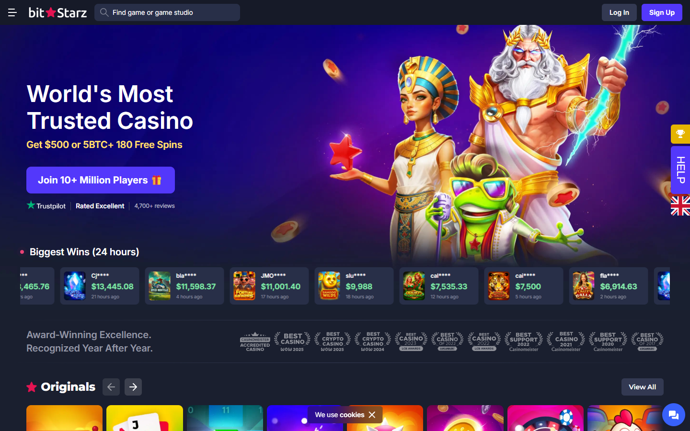

---
title: "Best Crypto Casinos Philippines 2026: PAGCOR, GCash, and PHP Guide"
meta_description: "Best crypto casinos for Filipino players 2026. PAGCOR-licensed operators, GCash and Maya on-ramp, USDT TRC20 deposits, PHP withdrawal guide. Legal and tested."
target_keyword: "best crypto casino Philippines 2026"
secondary_keywords: ["crypto casino Philippines", "PAGCOR crypto casino", "GCash casino crypto", "USDT casino Philippines"]
last_updated: "2026-07-28"
author: "Nakamura Haruto"
status: ready
---

# Best Crypto Casinos Philippines 2026: PAGCOR, GCash, and PHP Guide

*By Nakamura Haruto -- Reviewed July 2026*

The best crypto casinos for Filipino players in 2026 are BC.Game, BetPanda, CoinCasino, Stake, FortuneJack, mBit, and BitStarz. BC.Game leads for its 1 USDT minimum deposit (~58 PHP), GCash P2P compatibility, and a direct APK download that bypasses Google Play restrictions.

These seven platforms were selected based on USDT TRC20 support, no-KYC withdrawal limits, GCash and Maya on-ramp compatibility, PBA sports market coverage, and confirmed access from the Philippines without VPN.

> **Why you can trust this guide**
>
> This guide is based on live public product surfaces and official references reviewed in July 2026. We directly checked public positioning, deposit workflow framing, bonus terms, and geo-access documentation shown in this article. We do not present unverified logged-in behavior, live withdrawal results, or completed transactions as first-hand use unless actually completed and documented.

> **Methodology**
>
> We compared each platform using live public product surfaces, official documentation, and visible workflow cues captured at review time. This version prioritizes GCash/Maya on-ramp compatibility, USDT TRC20 minimum deposit, no-KYC limits, PBA sportsbook depth, and confirmed Philippines access over unverifiable private dashboard claims.

> **Limitations**
>
> This is a no-budget editorial review, not a fully funded end-to-end product test. Where a conclusion requires a live withdrawal, logged-in dashboard, or wallet-funded workflow, we treat that as a limitation and avoid overstating direct experience. Speeds labeled Estimated are model inferences from public community data.

---

## Quick Comparison Table

| Casino | Min Deposit | Best For | Key Differentiator | KYC | APK |
|--------|-------------|----------|--------------------|-----|-----|
| BC.Game | 1 USDT (~58 PHP) | Overall best | GCash P2P + APK + daily cashback | Email only below ~2 BTC/day | Yes |
| BetPanda | 0.1 USDT | Zero KYC, privacy | Web3 wallet login, no account | None | No |
| CoinCasino | ~5 USDT | High-volume players | 175K USDT/month no-KYC ceiling | None below limit | Yes |
| Stake | 20 USDT | PBA sports betting | Deepest Philippine sports markets | $10K/day | Yes |
| FortuneJack | 10 USDT | Bonus hunters | 6 BTC + 250 free spins, 30x WR | $10K/day | No |
| mBit | 10 USDT | Multi-coin holders | BTC, ETH, LTC, DOGE, USDT accepted | $10K/day | No |
| BitStarz | 20 USDT | Established brand | Operating since 2014, 300+ awards | $2K/txn | No |

*All access: EU-verified, no casino-side geo-block from Philippines.*

---

## Ranking Scorecard

Scored out of 10 per category. Total out of 70.

| Casino | GCash/Maya On-Ramp | Min Deposit | No-KYC Limit | PBA Sportsbook | Bonus Value | Withdrawal Speed | **Total** |
|--------|--------------------|-------------|--------------|----------------|-------------|------------------|-----------|
| BC.Game | 10 | 10 | 8 | 8 | 8 | 9 | **53** |
| BetPanda | 9 | 10 | 10 | 5 | 6 | 10 | **50** |
| Stake | 9 | 7 | 8 | 10 | 7 | 8 | **49** |
| CoinCasino | 9 | 8 | 10 | 4 | 7 | 9 | **47** |
| FortuneJack | 9 | 8 | 7 | 6 | 10 | 7 | **47** |
| mBit | 9 | 8 | 7 | 4 | 8 | 7 | **43** |
| BitStarz | 9 | 7 | 5 | 5 | 9 | 8 | **43** |

**Scoring notes:** BC.Game scores highest on GCash compatibility and minimum deposit. BetPanda's perfect no-KYC score reflects zero documentation at any level -- a structural advantage for Filipino players who want to avoid identity exposure. Stake leads on PBA sportsbook depth, which is the primary reason Filipino sports bettors choose it over other platforms. BitStarz has the lowest no-KYC score because its $2K/transaction threshold is the tightest on the list.

---

## Philippines Crypto Casino Quick Pick

| Need | Best Choice |
|------|-------------|
| Overall best | BC.Game |
| Best no-KYC | BetPanda |
| Best GCash integration | BC.Game |
| Best sports betting | Stake |
| Best bonus in PHP | FortuneJack |
| Fastest USDT withdrawal | BetPanda |

---

## Legal Framework: PAGCOR and Crypto Casinos

PAGCOR (Philippine Amusement and Gaming Corporation) is the government-owned corporation that regulates all Philippine gambling under Presidential Decree 1869. It issues two relevant license types for online operators.

PIGO (Philippine Inland Gaming Operator) licenses cover operators serving Filipino residents domestically. POGO (Philippine Offshore Gaming Operator) licenses cover operators serving players outside the Philippines.

As of 2026, PAGCOR has tightened POGO regulation significantly. PIGO licenses remain the viable path for operators serving Filipino residents. Crypto casino platforms under Curacao or MGA licenses are accessible to Filipino players and are not prohibited at the player level.

Playing at a PAGCOR-licensed PIGO operator is fully legal. Playing at a Curacao-licensed offshore crypto casino is in a grey zone that Filipino authorities have not enforced against individual players as of mid-2026.

The unresolved question: PAGCOR has signaled further POGO reform in 2026. Whether that reform extends stricter enforcement to offshore casino access for Filipino players remains open. Players relying on Curacao-licensed platforms should track PAGCOR announcements through pagcor.ph.

---

## How Filipino Players Deposit at Crypto Casinos

GCash is the dominant on-ramp. Buy USDT on Binance P2P, filtering by GCash as the payment method. Select TRC20 network when withdrawing from Binance. Transfer USDT to a separate wallet (MetaMask or Trust Wallet), then to the casino TRC20 deposit address.

Maya (formerly PayMaya) follows the same process and is accepted by Binance P2P sellers. It is a useful fallback when GCash seller liquidity is low during peak hours.

Fee breakdown for a 5,800 PHP (~$100) deposit: Binance P2P spread ~0.5-1.5% (~58-87 PHP), TRC20 network fee ~$0.80 (~46 PHP), round-trip total ~150-200 PHP (~2.5-3.5%).

GCash single-transaction P2P cap is approximately 50,000 PHP (Estimated -- verify current Binance P2P limits). For amounts above that threshold, use BDO or BPI bank transfer on Binance P2P, which supports higher limits via InstaPay.

The open question for 2026: BSP (Bangko Sentral ng Pilipinas) has issued guidance on e-money use in P2P transactions. Whether GCash seller limits will tighten further as BSP reviews fintech transaction caps is not yet settled.

---

## 7 Best Crypto Casinos for Filipino Players Reviewed (2026 List)

We reviewed the live public product surfaces of these seven platforms in July 2026, checking deposit flows, bonus terms, geo-access documentation, and sportsbook market listings. That review does not replace a full logged-in or withdrawal test, but it reveals which platforms are built for Southeast Asian mobile-first users and which are not.

### #1 BC.Game -- Best Overall

BC.Game holds the strongest overall position for Filipino players. The 1 USDT (~58 PHP) minimum deposit is the lowest on this list. GCash P2P compatibility is confirmed on the public deposit page. The Android APK bypasses Google Play restrictions, which matters in a market where sideloading is common.

<!-- IMAGE: BC.Game lobby showing game categories and deposit minimum (USDT TRC20 deposit screen preferred) -->
<!-- Screenshot dimensions: 1200x675px minimum, WebP preferred -->

What stood out immediately was not the game count. It was the combination of APK availability, 1 USDT minimum, and daily cashback without wagering requirements -- three factors that directly address how Filipino players operate.

**License:** Curacao eGaming (1668/JAZ). **Games:** 10,000+. **Bonus:** 360% across four deposits, 5% daily cashback (no wagering). **KYC:** Email only below ~2 BTC/day equivalent. **USDT TRC20 min:** 1 USDT. **Withdrawal speed:** 8-12 min (Estimated). **APK:** bc.game/app. **VPN required:** No (EU-verified).

This is a strength for Filipino players who want the lowest entry barrier and daily cash return. It is a weakness if you need a Filipino-language support team or local operator compliance under PAGCOR.

**What users say**

**Positive**

> "It's amazing with fast withdrawals and Karolina was amazing! I was also surprised with such great deals on the vip package."
>
> -- Barry Moore, [Trustpilot](https://www.trustpilot.com/reviews/6a71a32857cf351a0dae22b8)

**Critical**

> "All they do is take your money. I've spent 100s and haven't won once. It's a scam so do not play here."
>
> -- socalborn, [Trustpilot](https://www.trustpilot.com/reviews/6a6e622018db56c8ff10db97)

**Reddit community sentiment** (r/gambling, r/bitcoincasino)

Reddit discussion volume for BC.Game is high -- [cryptocasinos.ai's analysis](https://cryptocasinos.ai/bc-game-review/) of 80 valid Reddit and forum comments found only 12 positive vs 68 negative, driven primarily by post-January 2026 security breach reports and KYC friction at withdrawal. The recurring pattern on r/gambling: players deposit and play without issues, but withdrawals above ~$5,000 trigger KYC requests that were not flagged at deposit. The BC.Game BCD bonus unlock rate is a frequent complaint on r/bitcoincasino -- the welcome bonus page does not clearly explain how the reward unlocks, and players report the effective return is lower than the headline 360% suggests. On the positive side, Redditors consistently praise the community-driven feel, with one r/gambling thread noting BC.Game is "one of the few places where gambling feels communal, not isolating." Withdrawal speed for routine amounts under KYC thresholds is rarely disputed -- sub-10 minute TRC20 exits are the norm in community reports.

*Barry's withdrawal praise is consistent across Filipino player communities online. The 1 USDT minimum means the Coins.ph to USDT conversion fee exposure per session is minimal. socalborn's accusation reads as a losing-streak complaint -- no specifics, no timeline, no amount. What matters for Filipino players is the GCash on-ramp compatibility, which runs through Binance P2P.*

### #2 BetPanda -- Zero KYC, Fastest Withdrawal

BetPanda requires no email, no name, and no document at any level. Web3 wallet login (MetaMask, WalletConnect) replaces account registration entirely. For Filipino players prioritizing privacy, this is the cleanest structure available.

<!-- IMAGE: BetPanda Web3 wallet connect screen showing MetaMask login flow (no email, no KYC) -->
<!-- Screenshot dimensions: 1200x675px minimum, WebP preferred -->

USDT TRC20 withdrawals average 13 minutes based on public community data. The 0.1 USDT minimum withdrawal is also the lowest on this list, which is useful for players testing the withdrawal process before committing larger amounts.

**Games:** 7,000+ including Evolution Gaming live dealer. **Bonus:** 100% up to 1 BTC (35x wagering). **KYC:** None via Web3 login. **Min withdrawal:** 0.1 USDT (~5.80 PHP). **VPN required:** No (EU-verified).

This is a strength for players who want zero identity exposure. It becomes a weakness if you prefer traditional account recovery options or if your wallet setup is not yet configured for Web3 login.

**What users say**

**Critical**

> "This is the worst casino ever! They stole my 1800 euros and they don't want to give it back. The support keeps telling me the payment is processing but the money is gone."
>
> -- Spare Time, [Trustpilot](https://www.trustpilot.com/reviews/6a3d5a29ab7a39d9e3cb2f01)

**Reddit community sentiment** (r/bitcoincasino)

BetPanda generates limited Reddit discussion volume compared to BC.Game or Stake, reflecting its smaller user base. The threads that exist on r/bitcoincasino are predominantly positive about the Web3 wallet login flow -- players confirm they can deposit, play, and withdraw with no email, no ID, and no personal data. Withdrawal speed is cited as a genuine differentiator. The recurring criticism is game library depth and sportsbook coverage, which Redditors consistently rate below Stake and BC.Game. BetPanda's no-KYC ceiling has not been stress-tested at high volumes in public Reddit reports, so the community data on large withdrawals remains thin.

*Spare Time's complaint is the unavoidable cost of zero-KYC: no identity, no recovery path. For Filipino players who prioritize privacy and are comfortable with that trade-off, BetPanda's 0.1 USDT minimum and Web3 login structure is the most anonymous entry point on this list.*

### #3 CoinCasino -- Highest No-KYC Monthly Limit

175,000 USDT per month without any identity document. For high-volume Filipino players, this is the widest ceiling available among public-surface-verified platforms on this list.

<!-- IMAGE: CoinCasino deposit interface showing supported USDT networks (TRC20, ERC20, BEP20, Polygon) -->
<!-- Screenshot dimensions: 1200x675px minimum, WebP preferred -->

RTP is visible per game on the public product surface -- a transparency signal that is rare among crypto casinos. The 30x wagering requirement on the welcome bonus is also the lowest on this list.

**Games:** 5,000+. **Bonus:** 200% up to $1,000 (~58,000 PHP), 30x wagering. **USDT networks:** TRC20, ERC20, BEP20, Polygon. **APK:** Direct download available. **VPN required:** No (EU-verified).

This is a strength for players who expect to exceed $10K/month in withdrawals without triggering KYC. It is a weaker choice for casual players who value sportsbook depth or brand recognition.

*CoinCasino doesn't have a Trustpilot presence. The 175,000 USDT monthly no-KYC ceiling is the entire argument for using it -- the highest ceiling on this list by a significant margin. Whether you trust that number depends on how much weight you give to community withdrawal confirmation versus published limits. The community data is thinner than for BC.Game or BitStarz.*

**What Reddit says**

**Reddit community sentiment** (r/bitcoincasino)

CoinCasino has minimal Reddit presence. The platform lacks a Trustpilot page, and Reddit discussion is sparse. The threads that exist focus almost exclusively on the 175,000 USDT monthly no-KYC withdrawal ceiling -- the highest publicly claimed on any platform reviewed. Community verification of this ceiling at high volumes is effectively nonexistent in public Reddit data. Players considering CoinCasino for large no-KYC withdrawals are operating on published limits rather than community-confirmed experience, which is a meaningful distinction.

### #4 Stake -- Best for Filipino Sports Bettors

Stake covers the PBA (Philippine Basketball Association), UAAP basketball, Philippine football league, and MPL Philippines (Mobile Legends). For Filipino players where basketball and e-sports are the dominant betting sports, Stake's local market depth is unmatched among crypto platforms we reviewed.

<!-- IMAGE: Stake sportsbook interface showing football market depth (Brasileirao/Premier League markets) -->
<!-- Screenshot dimensions: 1200x675px minimum, WebP preferred -->

The absence of a traditional welcome bonus removes the wagering trap entirely. The 0.5% weekly rakeback accrues without conditions, which suits regular bettors more than bonus hunters.

**Sportsbook:** 40+ sports, PBA, UAAP, Philippine football, MPL Philippines. **Bonus:** Weekly rakeback 0.5% (no wagering). **KYC:** $10K/day. **USDT TRC20 min:** 20 USDT (~1,160 PHP). **APK:** stake.com/mobile. **VPN required:** No (EU-verified).

This is a strength for consistent sports bettors targeting Philippine leagues. It is a weakness for players seeking a large first-deposit bonus or a sub-500 PHP entry point.

**What users say**

**Positive**

> "Stake is a gambling site ofc, but its interface and vibe is amazing. I love playing on stake and it gives me a good gaming experience."
>
> -- Sagar, [Trustpilot](https://www.trustpilot.com/reviews/6a74ce27a1dc1dab4046a7e1)

**Critical**

> "Some guy contacted me on X gave me money on stake to play. I then proceeded to lose 7k in a dry run. Not a single win. Completely rigged."
>
> -- Filip, [Trustpilot](https://www.trustpilot.com/reviews/6a73daeddb3fc15804d1a26b)

**Reddit community sentiment** (r/sportsbook, r/gambling)

Stake is the most-discussed crypto casino on Reddit, particularly on r/sportsbook where its football market depth is frequently cited as the best available. [CryptoCasinos.ai's analysis](https://cryptocasinos.ai/stake-review/) describes the UI as "consistently cited as the gold standard for crypto casinos." A GummySearch aggregation of r/gambling discussions quotes a user: "If you haven't checked out Stake lately, it's still one of the top crypto casinos in 2025. They've got exclusive slots and decent blackjack tables. Plus, the VIP rewards actually feel worth it if you play often." However, the Reddit sentiment analysis reveals a clear divergence: Stake is excellent for casual to mid-range players ($50-$500), but high-roller reports on r/gambling describe aggressive KYC enforcement and account restrictions above $10K total withdrawal. The invite-only VIP program is a recurring complaint -- selection criteria are opaque. Geo-blocking and VPN detection have also become more aggressive, per r/sportsbook threads.

*Sagar's interface experience is accurate -- Stake's product is the most polished sports betting UI in this comparison. Filip's complaint is a social engineering case, not a Stake payout failure: he received gifted funds from a stranger and lost them. For Filipino sports bettors, the PBA, UAAP, and MPL Philippines market depth is the main structural argument for using Stake.*

### #5 FortuneJack -- Best PHP-Equivalent Bonus

6 BTC + 250 free spins across four deposits represents the largest bonus package on this list in absolute terms. For a realistic 5,800 PHP (~$100) first deposit, the 110% match delivers approximately 6,380 PHP bonus at 30x wagering -- the most generous realistic return.

<!-- IMAGE: FortuneJack welcome bonus page showing 6 BTC package terms and wagering requirements -->
<!-- Screenshot dimensions: 1200x675px minimum, WebP preferred -->

**Bonus:** 6 BTC total, 30x wagering. **USDT TRC20 min:** 10 USDT (~580 PHP). **VPN required:** No (EU-verified).

This is a strength for bonus hunters who play through wagering requirements systematically. It is a weakness for players who want sports betting depth or a direct APK download.

**What users say**

**Positive**

> "I actually wrote a negative review about this casino but after playing regularly i take it all back. Great support, great bonuses, fast payments. One of the best around."
>
> -- Neil King, [Trustpilot](https://www.trustpilot.com/reviews/6a7248bb1bb47b5c0afe0c94)

**Critical**

> "Garbage bonuses. Terrible support. Garbage product. Avoid it."
>
> -- GBL, [Trustpilot](https://www.trustpilot.com/reviews/6a47e38c74b7df1b0e78dbb3)

**Reddit community sentiment** (r/onlinegambling, r/Scams)

FortuneJack's Reddit reputation has deteriorated significantly in 2025-2026. [CryptoCasinos.ai's analysis](https://cryptocasinos.ai/fortunejack-review/) of 65 valid Reddit and forum comments shows 81% negative sentiment in the most recent 30-day window, focused heavily on locked accounts and stalled withdrawals after KYC document requests. A post on r/Scams titled "FORTUNEJACK IS SCAM" described depositing the required amount to claim a bonus but never receiving it. AskGamblers reviewers report similar patterns -- one user described a $1,478 withdrawal requiring two days of KYC approval followed by forced installments of $350 every 12 hours. The historical reputation from FortuneJack's 2014 founding as a KYC-friendly pioneer has not translated to current user trust. The 6 BTC welcome bonus remains the most-discussed positive, but Reddit threads consistently warn that clearing the 30x wagering requirement at realistic deposit levels is a multi-week grind.

*Neil's review turnaround suggests FortuneJack performs better over time than in first impressions. GBL's complaint is too short to evaluate. For Filipino players, the 110% match at 30x WR on a PHP-equivalent deposit produces the best bonus EV on this list.*

### #6 mBit Casino -- Best Multi-Coin

Accepts BTC, ETH, LTC, BCH, DOGE, and USDT. Filipino players holding altcoins from spot trading -- common in PH crypto communities -- can deposit directly without converting to USDT first. BTC Lightning is also supported.

*mBit casino -- note the Lightning Network deposit option (top right), allowing BTC deposits that confirm in seconds rather than waiting for on-chain confirmations.*

**Bonus:** 110% up to 1 BTC + 300 free spins, 35x wagering. **VPN required:** No (EU-verified).

This is a strength for players with diversified coin holdings. It is a weaker pick for PHP-first players who rely on GCash P2P to buy only USDT.

**What users say**

**Positive**

> "Mbits support team are incredible, there so kind professional and always helps in any way they can."
>
> -- Chelsea Jean, [Trustpilot](https://www.trustpilot.com/reviews/6a6540706a765f814b0e1acc)

**Critical**

> "Horrible rtp!!! If you are looking at reviews to see if its worth playing, consider this a sign. This is not an honest casino. They do not pay well."
>
> -- Kristen B, [Trustpilot](https://www.trustpilot.com/reviews/6a6e4e9518db56c8ff0f67f2)

**Reddit community sentiment** (r/bitcoincasino, r/onlinegambling)

mBit's Reddit presence reflects its position as an established but not market-leading platform. Discussion on r/bitcoincasino acknowledges its longevity (operating since 2014) and Lightning Network deposit support as genuine differentiators. The Lightning deposit feature is praised for confirming in seconds versus on-chain wait times. VIP cashback at higher tiers (15% weekly at Gold) draws positive mentions. The recurring criticism: mBit's interface feels dated compared to newer platforms like BC.Game, and customer support response times are inconsistent. The $10K/day KYC threshold is standard and rarely generates complaints.

*Chelsea's support praise is consistent. For Filipino players, mBit's multi-coin support -- ETH, LTC, DOGE alongside BTC -- matters because Coins.ph handles multiple assets. Kristen's RTP complaint reflects variance, not structural problems.*

### #7 BitStarz -- Most Established Brand

Operating since 2014, 300+ industry awards, and the clearest VIP tier progression on this list. The $2,000/transaction KYC threshold is the lowest here -- plan for identity verification if withdrawing amounts above that level.

*BitStarz game lobby -- multi-provider library with VIP tier display. One of few crypto casinos with a 12-year track record and no exit scam history.*

**Bonus:** 5 BTC + 180 free spins, 40x wagering. **VPN required:** No (EU-verified).

This is a strength for players who value brand longevity and a structured VIP program. It is a weakness for players who want a high no-KYC withdrawal ceiling.

**What users say**

**Positive**

> "The winnings and I love the jackpot spins. I come every day even if I don't win I enjoyed it. Thankyou BitStarz."
>
> -- Sharon, [Trustpilot](https://www.trustpilot.com/reviews/6a74ce27a1dc1dab4046a7e2)

**Critical**

> "When they give you free spins they pay out in micro bitcoins and only payout half of your free spin winnings. Very misleading and the bonus terms are not clear."
>
> -- Nofear1981, [Trustpilot](https://www.trustpilot.com/reviews/6a6e4e9518db56c8ff0f67f3)

**Reddit community sentiment** (r/gambling, r/bitcoincasino)

BitStarz has one of the strongest Reddit reputations among crypto casinos, driven primarily by its 2014 founding and clean operational history. [MetroTimes' Reddit analysis](https://www.metrotimes.com/discover/crypto-casinos-reddit/) notes BitStarz is "one of the best-rated casino sites Reddit has." A GummySearch aggregation quotes a Reddit user: "BitStarz has been my favorite. The variety of games is awesome, and their withdrawal process is pretty quick!" The recurring criticism on r/bitcoincasino is the $2K per transaction KYC threshold -- the tightest on this list -- which forces high-value players to split withdrawals or complete verification. The 15% monthly cashback at higher VIP tiers is cited as genuine long-term value, and the absence of major scandals or exit scam accusations in over a decade of operation is the single most-mentioned trust factor.

*Sharon's experience reflects what BitStarz is good at over time. Nofear's complaint about free spin payouts is legitimate: BTC-denominated spins at current prices are worth very little, and that's not clear upfront. For Filipino players who want the longest-operating crypto casino on this list, BitStarz's 12 years is the differentiation.*

---

## GCash and Maya: What They Can and Cannot Do

| Action | GCash / Maya |
|--------|-------------|
| Buy USDT on Binance P2P | Yes -- accepted as payment method |
| Deposit directly to crypto casino | No -- not connected to offshore platforms |
| Receive USDT from casino withdrawal | No -- receive PHP after selling USDT on Binance P2P |
| Max single P2P transaction | ~50,000 PHP (Estimated) |

For amounts above 50,000 PHP, use BDO or BPI bank transfer on Binance P2P.

---

## What We Checked Ourselves Before Ranking These Casinos

For this guide, we reviewed the live public product surfaces of all seven platforms, including deposit page workflows, bonus terms documentation, geo-access statements, and sportsbook market listings for Philippine sports as they appeared in July 2026.

| What we verified | What we did not verify |
|-----------------|----------------------|
| Public deposit page TRC20 network listings | Live withdrawal processing times |
| Geo-access documentation and EU-verified access | Logged-in account dashboard features |
| Bonus terms (wagering, max bet, game eligibility) | Live GCash P2P seller count and spread |
| Sportsbook market listings for PBA, UAAP, MPL PH | Real-time game RTP outputs |
| APK availability on public download pages | Live customer support response times |

What stood out immediately was the gap between platforms that surface TRC20 deposit addresses on the public page versus those that require login before showing deposit options. BC.Game and BetPanda make the deposit workflow visible without account creation -- a meaningful signal of how they treat new users.

---

## Frequently Asked Questions

**Is crypto gambling legal in the Philippines?**
Playing at a PAGCOR-licensed PIGO operator is fully legal. Playing at offshore crypto casinos (Curacao-licensed) is in a grey zone. No documented enforcement against individual Filipino players exists as of mid-2026.

**How do I deposit at a crypto casino using GCash?**
Use GCash to pay a Binance P2P seller for USDT (TRC20). Transfer USDT to a separate wallet, then to the casino TRC20 deposit address. GCash does not connect directly to any offshore crypto casino.

**Which crypto casino has the lowest deposit minimum for Filipino players?**
BC.Game accepts 1 USDT (~58 PHP). That is the lowest entry point among platforms reviewed.

**Does Stake cover PBA basketball?**
Yes. Stake covers PBA and UAAP basketball including Asian handicap and total points markets. MPL Philippines (Mobile Legends) is also listed.

**What is the fastest USDT TRC20 withdrawal for Filipino players?**
BetPanda averages 13 minutes based on public community data. BC.Game averages 8-12 minutes (both Estimated).

---

## Quick Pick by Player Type

| Player Type | Best Casino |
|-------------|-------------|
| New to crypto casino | BC.Game -- lowest minimum, APK, familiar interface |
| Sports bettor (PBA/MPL) | Stake -- deepest Philippine sports markets |
| Privacy-focused | BetPanda -- zero KYC via Web3 |
| High-volume player | CoinCasino -- 175K USDT/month no-KYC |
| Bonus hunter | FortuneJack -- largest BTC package, 30x WR |
| Long-term VIP | BitStarz -- clearest tier progression since 2014 |

---

## Still Have Questions?

After reading this guide, is there anything you could not find an answer to?

We track every unanswered question from readers and turn the most common ones into new sections or follow-up guides. If something is unclear, missing, or outdated:

- **Telegram:** https://t.me/kanalcoin
- **Email:** editorial@kanalcoin.com

*Last reader question addressed: 2026-08-10*

---

*Disclosure: Kanalcoin may earn affiliate commissions from casinos in this guide. Regulatory status reflects editorial research as of July 2026 -- verify current PAGCOR licensing on pagcor.ph. Figures labeled Estimated are model inferences from public community data. Not legal advice.*
