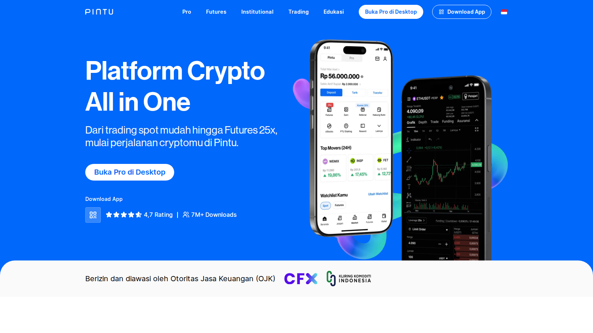
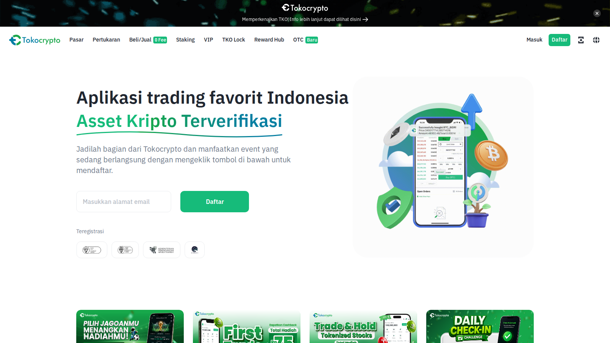
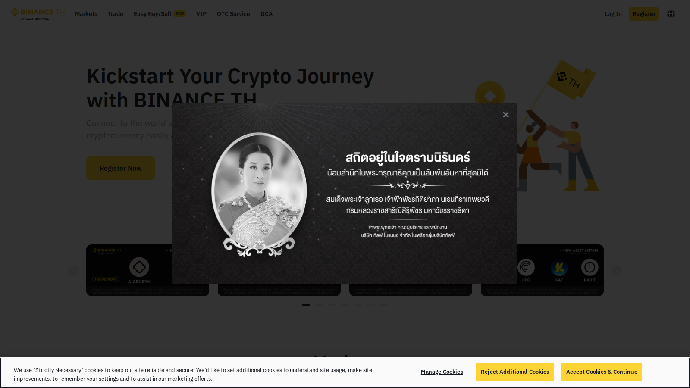
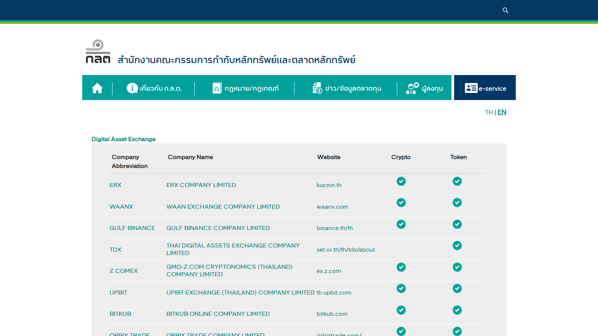

# Best Crypto Exchanges in Southeast Asia 2026: Top Platforms by Country, Fees, and Fiat Access

**Meta Title**
Best Crypto Exchanges in Southeast Asia 2026: Top Platforms by Country, Fees, and Fiat Access

**Meta Description**
Compare the best crypto exchanges in Southeast Asia in 2026 by country coverage, fiat access, liquidity, security, and trading features.

**Suggested Slug**
`/asia/best-crypto-exchanges-southeast-asia-2026`

**Primary Keyword**
best crypto exchanges in Southeast Asia 2026

**Secondary Keywords**
best crypto exchange Southeast Asia, ASEAN crypto exchanges, crypto exchanges with local fiat in Asia, best crypto platforms Asia

**Suggested Category**
`asia`

**Last Reviewed**
`2026-07-16`

**Editorial Note**
This article is for informational purposes only and does not constitute investment, legal, or tax advice. Exchange availability, local payment rails, and product scope can change quickly.

Choosing a crypto exchange in Southeast Asia forces you to look beyond global feature lists. The real challenge centers on how smoothly a platform bridges local fiat currencies to digital assets, bypassing deposit delays and high transaction fees. 

Because ASEAN retail investors operate in a fragmented payment landscape, a platform that works perfectly in western markets might fail to support local bank transfers in Indonesia or QR payment systems in Thailand. This comparison evaluates the top regional platforms through the lens of local payment access, mobile usability, and regional compliance. If you already know your target market, you can read our country-specific guides to [the best crypto exchanges in Vietnam](/asia/vietnam/best-crypto-exchanges-vietnam-2026), [the best crypto exchanges in Indonesia](/asia/indonesia/best-crypto-exchanges-indonesia-2026), and [the best crypto exchanges in Thailand](/asia/thailand/best-crypto-exchanges-thailand-2026).

## The Best Crypto Exchanges in Southeast Asia in 2026

The leading crypto exchanges in Southeast Asia in 2026 are Pintu for simple IDR onboarding, Indodax for deep Indonesian liquidity, Bitkub for Thai retail THB access, Binance TH for a regulated global brand experience, and Tokocrypto for active Indonesian traders who want Binance-backed depth. While offshore global platforms still attract users seeking advanced derivatives, licensed regional exchanges offer the most reliable paths for local fiat integration.

## Why You Can Trust This Comparison

This evaluation draws from live public interface testing, local regulatory databases, and regional market research updated on July 16, 2026. Key data points reference [Chainalysis's 2025 Global Crypto Adoption Index](https://www.chainalysis.com/blog/2025-global-crypto-adoption-index/), the [ADB's Asian Economic Integration Report 2026](https://aric.adb.org/aeir2026), and the [OECD's Asia capital-markets review](https://www.oecd.org/en/publications/asia-capital-markets-report-2026_08f87bed-en/full-report/developments-in-crypto-asset-markets_193a8553.html).

To maintain transparency, we define the exact limits of our testing:
- **Observed**: We navigated the public web and mobile applications, reviewed signup requirements visible before funding, checked advertised fiat rails, and cross-checked official licensing references.
- **Not Verified**: We did not deposit local fiat (IDR or THB), execute trades, test live order book spreads, or process fiat withdrawals. 

Our findings combine public product behavior, official licensing references, and public user discussions from Reddit. We treat those Reddit comments as qualitative user experience evidence, not as verified platform performance data.

## Quick Comparison of the Top Southeast Asia Crypto Exchanges

| Exchange | Primary Market | Local Fiat & Payment Rails | App Availability | Regulatory License | Main Trade-off |
|---|---|---|---|---|---|
| **Pintu** | Indonesia | IDR (Bank Transfer, e-wallet routes) | iOS & Android | PFAK license issued by Bappebti; now under OJK transition | Simple app flow; pricing should be checked against order-book exchanges |
| **Indodax** | Indonesia | IDR (Bank Transfer, Virtual Accounts) | iOS, Android, Web | PFAK license listed by Bappebti; now under OJK transition | Strong local liquidity; interface is less beginner-oriented |
| **Bitkub** | Thailand | THB (Bank QR Code, Bank Transfer) | iOS, Android, Web | Licensed by Thailand's Ministry of Finance; regulated by SEC Thailand | Local THB convenience; trading and withdrawal fees need checking |
| **Binance TH** | Thailand | THB (bank funding) | iOS, Android, Web | Operated by Gulf Binance under Thai SEC and Ministry of Finance supervision | Local Binance route; product scope differs from Binance Global |
| **Tokocrypto** | Indonesia | IDR (Virtual Accounts, bank routes) | iOS, Android, Web | PFAK license issued by Bappebti; now under OJK transition | Better trading-style flow; bank-route reliability still matters |

## How We Evaluated Southeast Asia Exchanges

Our evaluation prioritizes:
- **Fiat rails practicality**: How easily a retail user can deposit and withdraw local currencies like IDR and THB.
- **Mobile optimization**: Whether the mobile apps provide stable navigation and clear deposit interfaces for mobile-first users.
- **Regulatory alignment**: Clear licensing or supervision status with local agencies such as OJK/Bappebti in Indonesia and the SEC in Thailand.
- **Everyday liquidity**: Sufficient order book depth for retail-sized spot purchases of major assets.

## What We Checked Ourselves

Our team reviewed the live interfaces of these exchanges, assessing how they present onboarding paths, security verification, and fee structures.

The media set below is used as review evidence, not decoration. For Kanalcoin readers, the most useful screenshots are the ones that show local access, regional product posture, or regulator-facing proof.

*Pintu homepage captured during our July 2026 review of crypto exchanges in Southeast Asia, used to evaluate the public IDR onboarding posture and beginner-facing product language.*

*Tokocrypto homepage captured during our July 2026 review, used to compare Indonesia-focused exchange positioning against simpler mobile-first apps.*

*Binance TH homepage captured during our July 2026 review, used to assess how the Thai product presents a regulated local Binance route rather than Binance Global parity.*

*Thailand SEC digital asset license page captured during our July 2026 review, used as regulator-facing evidence for the Thailand exchange sections.*

| Media evidence | What it supports | What it does not prove |
|---|---|---|
| Pintu homepage | Public onboarding posture, IDR-first consumer positioning, mobile-first language | Live IDR deposit speed, spread size, withdrawal reliability |
| Tokocrypto homepage | Indonesia exchange positioning and active-trading product posture | Bank-route uptime, account migration flow, tax calculation accuracy |
| Binance TH homepage | Local Thai Binance product framing and public access route | Same feature scope as Binance Global, live order execution, withdrawal speed |
| Thailand SEC license capture | Regulator-facing context for Thai exchange availability | Current account eligibility for every user, all supported assets, all fee conditions |

These captures support public-shell and regulator-facing claims. They do not prove funded deposits, completed KYC, trade execution quality, or live withdrawal timing. That distinction matters because ASEAN exchange selection often fails at the exact point where local bank rails, identity checks, and regulator-specific product limits meet.

## Why These Exchanges Made the List

Southeast Asia remains a top global market for retail crypto adoption, yet payment methods are highly localized. The Asian Development Bank's 2026 integration report and the OECD's Asian capital markets analysis both emphasize that payment convenience and mobile banking integrations drive regional adoption more than complex speculative products.

Consequently, the best exchange for an Indonesian or Thai user is rarely the platform with the most obscure tokens. Instead, users require platforms that:
- Connect directly to local bank accounts or popular e-wallets.
- Simplify account setup on mobile viewports.
- Maintain transparent fee rates for retail transactions.
- Hold valid local operational licenses.

For users who already hold digital assets and want to move them off exchanges, checking our guides to [the best crypto wallets in Asia](/asia/best-crypto-wallets-asia-2026) and [the best stablecoins for Asia](/asia/best-stablecoins-asia-2026) will provide the necessary next steps.

## Which Exchange Is Best for Which Type of User

### New retail buyers
If you want to buy your first Bitcoin or stablecoin with local fiat, Pintu and Bitkub offer the most straightforward mobile-banking integrations. They remove the complexity of reading order books, though this convenience carries higher fees.

### Active spot traders
If you trade frequently and need charting tools, Indodax and Tokocrypto provide standard bid-ask order books with lower trading fees. Their layouts expect some trading experience.

### Users seeking compliance safety
Binance TH and Tokocrypto offer licensed frameworks backed by global exchange architectures. They appeal to users who want to avoid the regulatory risks of using unlicensed offshore platforms.

## Detailed Review of the Best Crypto Exchanges in Southeast Asia

### Pintu

Pintu targets mobile-first beginners in Indonesia by presenting a clean interface that feels more like a payment app than a trading terminal. The application focuses exclusively on simplicity, allowing quick rupiah (IDR) funding through popular e-wallets like GoPay, OVO, and Dana.

**Best for:**
- Indonesian beginners seeking rapid IDR onboarding.
- Mobile-only users who prefer simple buy/sell buttons.
- Retail buyers looking for instant bank transfers.

**Trade-offs:**
- Wide buy/sell spreads compared to order-book exchanges.
- Lacks advanced technical indicators and order types.

A practical pattern appears in Indonesian Reddit discussions: users often mention Pintu alongside Tokocrypto and Indodax as local routes that can connect crypto activity back to Indonesian bank accounts. In a [r/indonesia thread about Coinbase access from Indonesia](https://www.reddit.com/r/indonesia/comments/s1dkyj/coinbase_indonesia/), one user advised using local exchanges such as Tokocrypto, Indodax, Pintu, or Luno because they support direct bank deposit and withdrawal. In a separate [discussion about converting foreign currency to IDR](https://www.reddit.com/r/indonesia/comments/tjw8nj/convert_uang_asing_ke_idr_dalam_jumlah_besar/), users compared Pintu with Tokocrypto on cost. That makes Pintu a useful first account for IDR access, but it leaves unresolved whether larger-volume users will eventually move to cheaper order-book routes.

### Indodax

As one of the oldest crypto platforms in Indonesia, Indodax offers deep rupiah liquidity and a massive selection of spot trading pairs. The platform operates a traditional order-book system, appealing to users who want to trade active market moves rather than simply buy and hold.

**Best for:**
- Experienced Indonesian traders needing deep IDR liquidity.
- Users looking for a wide variety of altcoins.
- Traders who prefer desktop web terminals.

**Trade-offs:**
- Outdated mobile interface that feels cluttered.
- Occasional order execution lag during high-volume events.

Indodax's strongest user-side case is liquidity. In an older but still useful [r/indonesia daily discussion](https://www.reddit.com/r/indonesia/comments/mm6r5h/08_april_2021_daily_chat_thread/), a user described Indodax as the strongest IDR on/off-ramp because its IDR pairs had better volume and liquidity than smaller local alternatives. That kind of user feedback fits the platform's role in Indonesia: Indodax may not feel as clean as newer mobile apps, but traders still care about whether local order books can absorb larger IDR trades when market volatility rises.

### Bitkub

Bitkub dominates the Thai crypto market, providing the primary liquidity hub for Thai Baht (THB) trading. The platform’s integration with local banking networks allows Thai users to deposit funds instantly using bank QR code scans.

**Best for:**
- Thai retail users seeking instant THB deposits.
- Investors who value strong local regulatory compliance.
- Users looking for a platform with high domestic trust.

**Trade-offs:**
- Flat 0.25% trading fee is higher than global standards.
- Past issues with server downtime during peak bull runs.

Thai Reddit discussions show why Bitkub remains important even when users criticize its costs. In a [r/Thailand thread about moving crypto into Thai baht](https://www.reddit.com/r/Thailand/comments/pgcqbs/what_is_the_best_way_to_get_crypto_from_my_wallet/), users described Bitkub as reliable and easy for linked Thai bank accounts, while also noting that its 0.25% trading fee is higher than Binance. Another [r/Thailand discussion about Bitkub and Satang](https://www.reddit.com/r/Thailand/comments/n8ykp9/hi_does_anyone_has_any_experiences_with_bitkub_or/) highlighted instant Thai bank withdrawals and QR deposits, but also warned that registration can take time when new-user demand rises. The THB rail remains the draw, but pricing and KYC friction leave room for regulated competitors.

### Binance TH

Binance TH is a regulated joint venture between Gulf Energy and Binance, designed to bring Binance's trading technology to the Thai market under local SEC licensing. It bridges the gap between local fiat convenience and global exchange execution.

**Best for:**
- Thai users who want the Binance interface under a local license.
- Traders looking for tighter bid-ask spreads on major pairs.
- Users seeking seamless mobile banking deposits.

**Trade-offs:**
- Token selection is limited by Thai SEC regulations.
- Product scope may be narrower than Binance Global, so futures, token listings, and yield products need direct checking.

Binance TH solves a different problem from Binance Global. Binance TH says eligible users can fund accounts from Thai bank accounts, while Thai Reddit users still frame local platforms mainly as fiat on-ramps and off-ramps. In a recent [r/Thailand trading discussion](https://www.reddit.com/r/Thailand/comments/1sxm3zq/trading_crypto_in_thailand/), one user noted that Binance TH can be used if the user has the required documents. That makes the regulated route clearer for Thai residents, but active traders still need to check which assets and order types Binance TH currently supports before assuming global-platform parity.

### Tokocrypto

Tokocrypto is an established Indonesian exchange backed heavily by Binance, using Binance Cloud technology to power its matching engine. It offers a bridge for Indonesian traders who want global-style trading pairs but require local tax compliance and IDR bank channels.

**Best for:**
- Indonesian traders seeking low maker-taker fees.
- Users who want smooth integrations with Binance accounts.
- Retail buyers who want clearer local records for crypto transactions.

**Trade-offs:**
- Frequent virtual account maintenance windows.
- Complex account migration steps for legacy users.

Tokocrypto appears repeatedly in Indonesian Reddit threads as a practical local exchange rather than only as a brand name. In the [Coinbase Indonesia discussion](https://www.reddit.com/r/indonesia/comments/s1dkyj/coinbase_indonesia/), users pointed readers toward Tokocrypto, Indodax, Pintu, and Luno because local bank routes matter more than Coinbase-style global access. In a [thread about sending money from Canada to Indonesia](https://www.reddit.com/r/indonesia/comments/1kig896/cheapest_simplest_way_to_send_money_from_canada/), one user said they used Tokocrypto for crypto payments from overseas work before converting to IDR. That supports Tokocrypto's use case as a practical IDR bridge, but bank-route reliability and Indonesia's OJK transition still need fresh checks before large transfers.

## Country-by-Country Notes for ASEAN Users

### Vietnam
Vietnam remains a leading market for retail crypto activity, but users rely almost exclusively on global platforms like Binance, OKX, and Bybit due to the lack of licensed domestic retail exchanges. Most transactions occur via peer-to-peer (P2P) bank transfers in Vietnamese Dong (VND). While Vietnam's draft regulatory frameworks aim to define digital assets, the current absence of licensed local exchanges keeps retail investors exposed to P2P counterparty risks.

### Indonesia
Indonesia's crypto oversight has shifted from Bappebti toward OJK, while Bappebti-issued PFAK licenses remain important historical license markers. If you transact in IDR, local platforms such as Pintu, Tokocrypto, or Indodax usually offer clearer bank-routing and local compliance context than offshore-only exchanges. Users should still check current OJK guidance and platform fee pages before assuming tax treatment or withdrawal limits.

### Thailand
Thailand provides a highly structured environment overseen by the SEC and Ministry of Finance licensing framework. Platforms such as Bitkub and Binance TH operate inside that local framework, which makes THB bank transfers more straightforward than offshore-only routes. However, this oversight can limit product scope, forcing Thai traders to choose between local compliance and broader offshore features.

### Singapore
Singapore is the financial hub of the region, and its regulator, MAS, enforces strict anti-money laundering rules. The market favors institutional and accredited investors, meaning retail users face high onboarding barriers and limited local exchange choices compared to neighboring markets.

### Philippines and Malaysia
In Malaysia, Luno remains a dominant licensed option, while the Philippines relies on platforms like Coins.ph for remittance-focused transactions. Both markets feature high mobile wallet usage, making local banking integrations the primary factor for exchange adoption.

For narrower country-level decisions, see our guides to [the best crypto exchanges in Vietnam](/asia/vietnam/best-crypto-exchanges-vietnam-2026), [the best crypto exchanges in Indonesia](/asia/indonesia/best-crypto-exchanges-indonesia-2026), and [the best crypto exchanges in Thailand](/asia/thailand/best-crypto-exchanges-thailand-2026).

## Balanced Evaluation: Where This Ranking Can Be Wrong for You

This ranking serves retail investors looking for licensed fiat gateways. It will not fit your needs if:
- You are a professional derivatives trader who requires perpetual contracts and high leverage.
- You reside in Vietnam and rely entirely on P2P trading platforms.
- You trade niche memecoins or micro-cap altcoins that are not licensed by regional regulators.

Understanding these boundaries helps you decide whether to accept the limitations of a regulated regional exchange or to manage the security risks of using an offshore platform.

## What to Watch Out for Before Choosing an Exchange

When selecting a platform in Southeast Asia, evaluate these operational realities:
- **Real deposit costs**: Check for hidden virtual account fees or spread markups.
- **App store rating history**: Look for reports of mobile app crashes during high-volatility events.
- **Tax withholding rules**: Understand how the platform handles local transaction taxes.
- **Customer support access**: Verify whether the exchange provides local language support for rapid dispute resolution.

Focusing on these parameters helps you judge whether a platform can support your normal exit route when market conditions change quickly.

## FAQ

### What is the best crypto exchange in Southeast Asia overall?
No single platform serves the entire region. The best exchange is the licensed platform in your specific country—such as Bitkub in Thailand or Tokocrypto in Indonesia—which connects directly to your local bank account.

### Can I deposit local fiat currency on global exchanges?
Many global exchanges do not support direct deposits for every ASEAN currency. Users often rely on P2P trading desks, which carry counterparty risks, or transfer assets from a licensed local exchange.

### Are crypto trading fees higher in Southeast Asia?
Yes, regulated regional exchanges often charge higher fees (such as Bitkub’s 0.25%) compared to global platforms (usually 0.10% or lower) due to local licensing costs and tax withholding requirements.

## Sources Used In This Draft

- Chainalysis, [The 2025 Global Crypto Adoption Index](https://www.chainalysis.com/blog/2025-global-crypto-adoption-index/)
- Asian Development Bank, [Asian Economic Integration Report 2026](https://aric.adb.org/aeir2026)
- OECD, [Asia Capital Markets Report 2026: Developments in Crypto-Asset Markets](https://www.oecd.org/en/publications/asia-capital-markets-report-2026_08f87bed-en/full-report/developments-in-crypto-asset-markets_193a8553.html)
- Pintu, [official site and support materials](https://pintu.co.id/)
- Indodax, [official site](https://indodax.com/)
- Bitkub, [official site](https://www.bitkub.com/)
- Binance TH, [official site](https://www.binance.th/)
- Tokocrypto, [official site](https://www.tokocrypto.com/)
- Reddit, [Coinbase Indonesia discussion on local exchange access](https://www.reddit.com/r/indonesia/comments/s1dkyj/coinbase_indonesia/)
- Reddit, [r/indonesia discussion on converting foreign currency to IDR](https://www.reddit.com/r/indonesia/comments/tjw8nj/convert_uang_asing_ke_idr_dalam_jumlah_besar/)
- Reddit, [r/indonesia discussion on crypto wallets and local exchanges](https://www.reddit.com/r/indonesia/comments/vk5w70/pengalaman_atau_review_wallet_krypto_di_indonesia/)
- Reddit, [r/Thailand discussion on Bitkub and Thai bank withdrawals](https://www.reddit.com/r/Thailand/comments/pgcqbs/what_is_the_best_way_to_get_crypto_from_my_wallet/)
- Reddit, [r/Thailand discussion on Bitkub and Satang Pro](https://www.reddit.com/r/Thailand/comments/n8ykp9/hi_does_anyone_has_any_experiences_with_bitkub_or/)
- Reddit, [r/Thailand discussion on trading crypto in Thailand](https://www.reddit.com/r/Thailand/comments/1sxm3zq/trading_crypto_in_thailand/)
- OJK, [Bappebti transfers regulation and supervision duties to OJK and BI](https://ojk.go.id/en/berita-dan-kegiatan/siaran-pers/Pages/Bappebti-Transfers-Regulation-and-Supervision-Duties-on-Digital-Financial-Assets-Crypto-Assets-and-Derivatives-to-OJK-BI.aspx)
- Bappebti, [licensed physical crypto asset traders list](https://bappebti.go.id/pedagang_aset_kripto)
- SEC Thailand, [digital asset business operators framework](https://www.sec.or.th/EN/pages/lawandregulations/digitalassetbusiness.aspx)
- Binance TH, [official FAQ on Thai licensing](https://www.binance.th/en/faq/binance-th-activities/5422dacb5b6e46e09a75d3b9711f7817)

## Related Internal Links

- [Best Crypto Exchanges in Vietnam 2026](/asia/vietnam/best-crypto-exchanges-vietnam-2026)
- [Best Crypto Exchanges in Indonesia 2026](/asia/indonesia/best-crypto-exchanges-indonesia-2026)
- [Best Crypto Exchanges in Thailand 2026](/asia/thailand/best-crypto-exchanges-thailand-2026)
- [Best Crypto Wallets in Asia 2026](/asia/best-crypto-wallets-asia-2026)
- [Best Stablecoins for Asia 2026](/asia/best-stablecoins-asia-2026)
