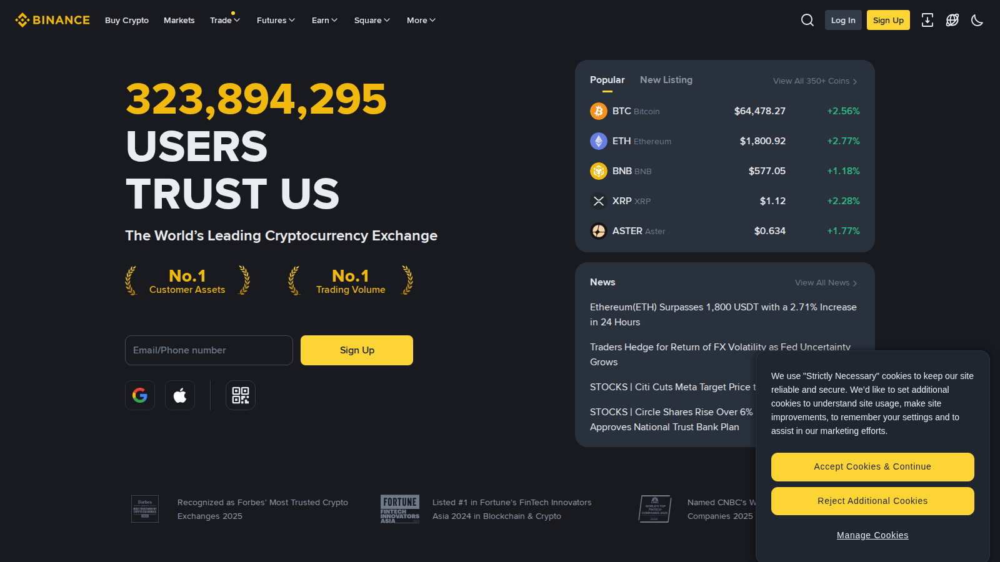
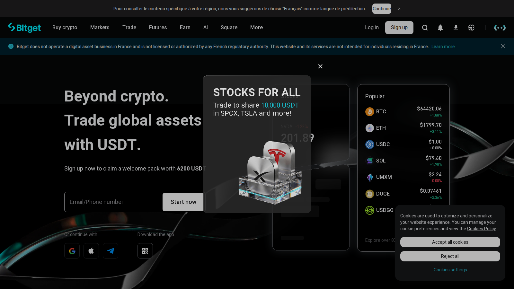

# Best Crypto Exchanges in Vietnam 2026: Top Platforms for VND Deposits, P2P, and Trading

**Editorial Note**
This article is for informational purposes only and does not constitute investment, legal, or tax advice. Access routes, P2P depth, and local enforcement conditions can change quickly.

The best crypto exchanges in Vietnam in 2026 are Binance, Bybit, Bitget, OKX, and MEXC. Binance is the strongest overall choice for Vietnam-based users who need the widest market access and the most familiar P2P culture for VND entry and exit. Bybit is the better fit for active traders who prioritize execution depth over beginner onboarding. Bitget sits in the middle lane between beginner clarity and more active-market features. OKX is the strongest pick for users who want exchange trading and broader wallet or onchain tooling in the same ecosystem. MEXC is best for users who prioritize long-tail altcoin access and are comfortable applying stricter due diligence themselves.

For context on how Vietnam compares to neighboring markets, see our [Best Crypto Exchanges in Southeast Asia 2026](/asia/best-crypto-exchanges-southeast-asia-2026) overview.

| Exchange | Outstanding point | Score | One-line note |
|---|---|---|---|
| Binance | Deepest VND P2P counterparty depth | 5/5 | Interface complexity can overwhelm new users |
| Bybit | Best active-trader and derivatives posture | 4/5 | Not the right first account for VND beginners |
| Bitget | Best middle lane between beginner and active | 3.5/5 | Copy-trading framing overpromises independence |
| OKX | Best exchange plus Web3 wallet ecosystem | 4/5 | Dense interface, not suited for casual buyers |
| MEXC | Widest altcoin breadth available to Vietnam users | 3/5 | Higher personal due-diligence demands |

## Vietnam's regulatory context: what SSC oversight means for exchange selection

Vietnam does not currently have a licensed domestic retail crypto exchange framework comparable to Indonesia's OJK system or Thailand's SEC. The State Securities Commission (SSC Vietnam) oversees the broader financial and digital asset policy direction following the 2025 Law on Digital Technology Industry, but as of July 2026 no global exchange operates under a Vietnam-specific retail crypto exchange license.

This means Vietnamese users access all five platforms in this list as offshore accounts. That does not make them unavailable, but it does mean that SSC Vietnam's evolving rules, including any future licensing framework, could change access conditions with less notice than in a fully licensed domestic market. Users in Vietnam should treat the regulatory context as a live variable, not a settled fact.

Geo-restriction is not currently the primary concern for any of the five platforms in this list. All five are accessible from Vietnam as of July 2026. The more practical constraint is VND: none of these platforms support direct VND bank transfer. Vietnamese users reach them through P2P desks, which work, but which add a counterparty step that direct bank routes do not have.

## Quick comparison of the best crypto exchanges in Vietnam

| Exchange | Best for | VND access | Language support | App availability | Regulation context | Main tradeoff |
|---|---|---|---|---|---|---|
| Binance | Overall use and P2P familiarity | P2P (no direct VND bank route) | Vietnamese, English | iOS, Android, Web | No Vietnam-specific license; global entity used by Vietnamese users | Product complexity can overwhelm new users |
| Bybit | Active and derivatives traders | P2P available | Vietnamese, English | iOS, Android, Web | No Vietnam-specific license; accessible to Vietnamese users | Less beginner-friendly than simpler apps |
| Bitget | Retail users moving into more active trading | P2P available | Vietnamese, English | iOS, Android, Web | No Vietnam-specific license; accessible to Vietnamese users | Copy-trading framing can distract from independent risk control |
| OKX | Exchange plus wallet and onchain tools | P2P available | Vietnamese, English | iOS, Android, Web | No Vietnam-specific license; accessible to Vietnamese users | Interface can feel dense for first-time buyers |
| MEXC | Long-tail altcoin hunters | P2P available | Vietnamese, English | iOS, Android, Web | No Vietnam-specific license; accessible to Vietnamese users | Trust and withdrawal checks matter more before funding |

## Binance

[Binance](https://www.binance.com/en/p2p) is the strongest overall pick for Vietnam-based users who need the widest market access and the most familiar P2P culture. From the public flow we reviewed, it immediately feels more like a full crypto operating system than a simple buy-and-hold app. That is a strength if you already expect to move between spot, P2P, and broader exchange tools, but it can become a weakness if your priority is the shortest possible path from VND to a first purchase.

*Binance homepage, July 2026: global exchange and P2P surface positioning reviewed for Vietnam-based user context.*

**Best for:** Users who want strong liquidity, familiar market structure, and widely used P2P funding routes.
**Main tradeoff:** Interface complexity and product breadth create more wrong-click risk for casual users than simpler apps.

Vietnamese users consistently come back to Binance P2P as the default VND entry point, not because it is the only option, but because the counterparty depth is the deepest available. In a [r/VietNam thread on how to cash out crypto in Vietnam](https://www.reddit.com/r/VietNam/comments/1ncivit/how_to_cash_out_crypto_in_vietnam/), one user summarized the practical consensus: "Binance has a p2p feature that lets you sell usdt for vnd." Another thread on [safely cashing out via Binance P2P](https://www.reddit.com/r/VietNam/comments/1pp4nly/cashing_out_on_binance_p2p_safely_in_vietnam/) captures the risk dimension too: users moving meaningful USDT amounts worry about whether P2P counterparties are clean, and whether a bank account freeze is possible downstream.

That liquidity advantage does not make Binance automatically the right answer. The product surface assumes more user confidence than most beginner-friendly apps. The real question a live account test would answer is whether the P2P experience holds up at real Vietnamese bank speeds when demand spikes.

---

## Bybit

[Bybit](https://www.bybit.com/) is the better choice for Vietnamese users who already think like active traders. The public product surface signals a trading venue rather than a mass-market onboarding app: order types, perpetuals, and execution posture are visible early in the flow, before any beginner framing appears.

**Best for:** Active spot and derivatives traders, users who care more about trading posture and execution depth than beginner UX.
**Main tradeoff:** Less forgiving for new users; local cash-in and cash-out practicality needs separate verification.

One data point from a Vietnamese user captures Bybit's actual role in the market. In a [r/VietNam thread about crypto use and payments](https://www.reddit.com/r/VietNam/comments/1p4w3fu/cryptotravel_in_vietnam/), one commenter described using Bybit Pay to handle bank transfers for 90% of their spending in Vietnam, a use case that is adjacent to, but distinct from, active trading. Bybit in Vietnam is not the simplest first account, and it does not solve the VND P2P problem differently from Binance. It solves the active-trader and payment-rail problem better once the VND entry step is already handled elsewhere.

That is the honest framing for Bybit in Vietnam: a second account for users who already know what they need, not the first account for users still figuring out the basics.

---

## Bitget

[Bitget](https://www.bitget.com/) sits in the middle lane between beginner clarity and more active-market features. From the public flow we reviewed, it feels more retail-guided than Bybit, but less stripped down than a pure starter app. Its copy-trading framing is visible earlier in the flow than on competing platforms.

*Bitget homepage, July 2026: retail-focused exchange surface and copy-trading identity reviewed for Vietnam-based user context.*

**Best for:** Users moving from beginner use into more active trading, traders curious about copy-trading features without committing to a pure derivatives platform.
**Main tradeoff:** Copy-trading framing can distract from independent risk control; VND workflow evidence needs a live test before publication.

The P2P entry pattern for Vietnam users is consistent across platforms. In a [r/VietNam thread asking why people P2P trade crypto in Vietnam](https://www.reddit.com/r/VietNam/comments/1niy0jx/why_do_people_p2p_trade_crypto_in_vietnam/), one user described P2P as the practical default: "When I was in VN it was the only way available to ramp in through Binance." Another explained the structural reason: banks and regulations can be restrictive, so P2P is how people move funds more freely. That same dynamic applies to Bitget's P2P desk: the draw is access, not the platform brand.

The copy-trading angle is real, but it is also the part that needs the most personal scrutiny. Copying another trader's positions does not transfer their risk tolerance or their ability to cut a loss. That gap between what the feature promises and what it actually requires is the thing this platform's interface underweights.

---

## OKX

[OKX](https://www.okx.com/) is the strongest pick for users who want exchange trading and broader wallet or onchain tooling in the same ecosystem. From the public flow we reviewed, it immediately feels more like a multi-surface crypto platform than a single-job exchange: the wallet, Web3 gateway, and DEX tools are surfaced earlier than on any other platform in this list.

*OKX homepage, July 2026: exchange and Web3 wallet ecosystem surface reviewed for Vietnam-based user context.*

**Best for:** Users who expect to move between centralized trading and onchain tools, traders comfortable with denser product navigation.
**Main tradeoff:** Heavier interface than many casual users need; more ecosystem breadth means more decision points early.

The Vietnam crypto landscape also has a risk dimension that OKX users need to factor in. In a [r/VietNam thread about the ONUS platform suddenly freezing withdrawals](https://www.reddit.com/r/VietNam/comments/1s30i88/major_crypto_platform_onus_vietnam_suddenly/), Vietnamese users described finding that a domestic platform with 7 million registered users had halted all access with no notice. The comments are direct: "Never keep your crypto/money on a crypto exchange." That warning applies to OKX too: the platform's breadth and Web3 tools are only useful if the withdrawal path is tested before meaningful funds are committed.

OKX is not a weakness pick. It is an accurate fit for users who already know what they need from an exchange. It will reward you once you know what you are looking for. It will frustrate you if you arrive expecting a simple VND-to-BTC flow.

---

## MEXC

[MEXC](https://www.mexc.com/) is the right choice for Vietnamese users who prioritize long-tail altcoin access and are comfortable applying stricter personal due diligence. From the public product surface, MEXC signals broad token inventory more clearly than brand trust or mainstream onboarding, which is an honest signal about the tradeoff.

**Best for:** Altcoin-focused traders, users hunting beyond major blue-chip assets, experienced users comfortable with self-directed risk filtering.
**Main tradeoff:** Long-tail asset access comes with higher due-diligence demands; MEXC is not the right first account for a Vietnam-based beginner.

MEXC-specific Vietnam user discussions are thinner than for Binance or Bitget, which is consistent with its more specialized positioning. In a [r/VietNam thread on crypto use in Vietnam](https://www.reddit.com/r/VietNam/comments/1ouvhba/crypto_use_in_vietnam/), one commenter was blunt: "They don't use cryptocurrency, they speculate and gamble real money on it. Most people I've known are neck deep in debt to family and friends because they bet on shitcoins." That context matters for MEXC: a platform that leads with token breadth is speaking directly to the speculative use case, which is real in Vietnam but also the highest-risk entry point.

The version of MEXC that works well is one where the user already understands what they are buying, why the asset is on a smaller exchange rather than Binance, and what their exit plan is. The version that goes badly is the one where token breadth is mistaken for platform quality.

---

## What stood out once we looked at the actual Vietnam exchange landscape

What stood out was how consistently VND access, not product features, drives the real exchange decision for Vietnamese users. All five platforms in this list face the same VND constraint: no direct bank transfer, P2P as the main entry route. That changes the comparison from a feature race into a question of P2P depth, counterparty familiarity, and whether the platform's Vietnamese-language support is good enough to use without friction.

The policy context adds a second layer. Because SSC Vietnam has not yet issued a licensed domestic exchange framework, every user in this list is operating offshore. That is not unusual: it describes most Vietnamese crypto users today. But it does mean the regulatory baseline can shift faster here than in Indonesia or Thailand, where licensed domestic exchanges already exist and give users a clearer set of rules to reference.

## Fees, spreads, and hidden friction matter more than headlines

Vietnam-based users often focus too much on headline fees and too little on real execution cost. In practice, a low advertised fee matters less if P2P pricing is wide, withdrawal routes are slow, stablecoin spreads are higher than expected, or the platform pushes overtrading through product clutter.

This is why the best exchange is not the one with the lowest number on a fee page. It is the one with the cleanest real workflow for your actual use case.

## What to check before choosing an exchange in Vietnam

- Does the platform's P2P desk have enough VND counterparty depth for your deposit size?
- Is Vietnamese-language support available for account and transfer questions?
- Are the trading fee, P2P spread, and withdrawal fee visible before confirmation?
- Does the mobile app work clearly on the device you actually use?
- What is your plan if a P2P counterparty is slow or unresponsive?
- If you receive money from overseas, does the platform support a stablecoin remittance path that converts cleanly to VND?

These questions matter more than token counts. In Vietnam, the exchange is only useful if the VND path in and out works when you need it.

## Why you can trust this guide

> This guide is based on live public exchange surfaces, official platform materials, and regional market references reviewed in July 2026, including Chainalysis's 2025 Global Crypto Adoption Index and Vietnam's Law on Digital Technology Industry. We directly checked visible onboarding framing, public trading posture, and top-level product positioning. Anything that depends on a logged-in VND workflow, live P2P depth, withdrawals, or a full end-to-end trade still needs final verification before publication.

## What we checked ourselves before ranking these exchanges

To write this comparison, we reviewed the live public product surfaces of the shortlisted exchanges and compared how they present onboarding, trading posture, and mainstream-user entry points. That direct review does not replace a full VND deposit or withdrawal test, but it does show very quickly which platforms are signaling simplicity, which are signaling trader depth, and which are trying to do both at once.

What stood out immediately was not who had the longest feature list. It was how differently these exchanges frame the first user decision. Binance and OKX push ecosystem depth early in the flow. Bitget and Bybit push trading identity. That distinction matters for Vietnam-based users whose real first question is whether the VND cash-in path works, not whether the derivatives dashboard is impressive.

## What this review verified and what it did not

| Claim | Status |
|---|---|
| Binance public homepage and P2P surface loaded and reviewed | Observed |
| Bitget public homepage loaded and reviewed | Observed |
| OKX public homepage loaded and reviewed | Observed |
| Bybit public homepage loaded and reviewed | Observed |
| Vietnam Law on Digital Technology Industry reference checked | Observed |
| VND deposit completed on any platform via P2P | Not verified |
| Live P2P order depth and counterparty quality checked | Not verified |
| Withdrawal timing to Vietnamese bank tested end-to-end | Not verified |
| Customer support response tested from a Vietnam-registered account | Not verified |
| MEXC public homepage loaded and reviewed | Not verified |

## FAQ

### What is the best crypto exchange in Vietnam overall?

For most users, Binance is still the strongest all-around answer because it combines liquidity, P2P familiarity, and widely used VND funding routes. Active traders may prefer Bybit or OKX depending on how they trade.

### Is P2P still the main way to get VND into crypto in Vietnam?

Yes. No platform in this list supports direct VND bank transfer. P2P desks are the standard entry route for most Vietnamese users, which is why counterparty depth and P2P familiarity matter in the comparison.

### Which exchange is best for beginners in Vietnam?

Binance and Bitget are usually the easiest starting points because they balance accessibility with enough product depth to grow into. Binance's P2P depth and Bitget's Vietnamese-language support are the two practical advantages for new users.

### Does Vietnam have a licensed domestic crypto exchange?

Not as of July 2026. SSC Vietnam has not yet issued a licensed domestic retail exchange framework. Vietnamese users access all major exchanges as offshore accounts. The 2025 Law on Digital Technology Industry created a policy direction, but a final licensing framework for retail exchange operations had not been published as of this review.

## Sources

- Ministry of Information and Communications of Vietnam, [Law on Digital Technology Industry](https://english.mic.gov.vn/national-assembly-adopts-law-on-digital-technology-industry-197250616203643956.htm)
- Chainalysis, [The 2025 Global Crypto Adoption Index](https://www.chainalysis.com/blog/2025-global-crypto-adoption-index/)
- Binance, [P2P trading platform](https://www.binance.com/en/p2p)
- Bybit, [official site](https://www.bybit.com/)
- Bitget, [official site](https://www.bitget.com/)
- OKX, [official site](https://www.okx.com/)
- MEXC, [official site](https://www.mexc.com/)
- Reddit, [r/VietNam: how to cash out crypto in Vietnam](https://www.reddit.com/r/VietNam/comments/1ncivit/how_to_cash_out_crypto_in_vietnam/)
- Reddit, [r/VietNam: cashing out on Binance P2P safely in Vietnam](https://www.reddit.com/r/VietNam/comments/1pp4nly/cashing_out_on_binance_p2p_safely_in_vietnam/)
- Reddit, [r/VietNam: why do people P2P trade crypto in Vietnam](https://www.reddit.com/r/VietNam/comments/1niy0jx/why_do_people_p2p_trade_crypto_in_vietnam/)
- Reddit, [r/VietNam: crypto use in Vietnam](https://www.reddit.com/r/VietNam/comments/1ouvhba/crypto_use_in_vietnam/)
- Reddit, [r/VietNam: ONUS platform suddenly frozen, liquidity issue](https://www.reddit.com/r/VietNam/comments/1s30i88/major_crypto_platform_onus_vietnam_suddenly/)
- Reddit, [r/VietNam: crypto and travel in Vietnam, Bybit Pay experience](https://www.reddit.com/r/VietNam/comments/1p4w3fu/cryptotravel_in_vietnam/)

## Related Internal Links

- [Best Crypto Exchanges in Southeast Asia 2026](/asia/best-crypto-exchanges-southeast-asia-2026)
- [Best Crypto Exchanges in Indonesia 2026](/asia/indonesia/best-crypto-exchanges-indonesia-2026)
- [Best Crypto Exchanges in Thailand 2026](/asia/thailand/best-crypto-exchanges-thailand-2026)
- [Best Crypto Wallets in Asia 2026](/asia/best-crypto-wallets-asia-2026)
- [Best Stablecoins for Asia 2026](/asia/best-stablecoins-asia-2026)
