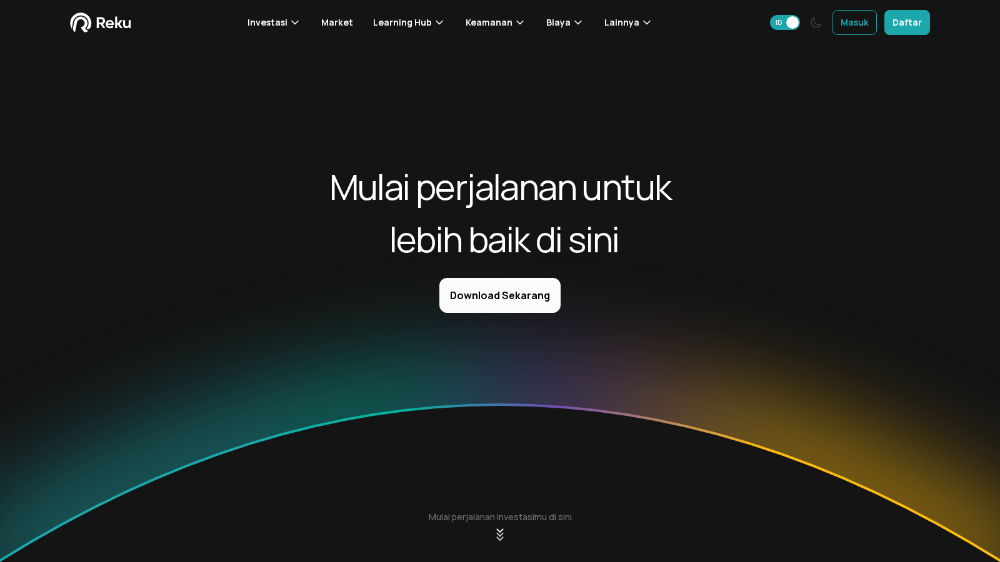

# Best Crypto Exchanges in Indonesia 2026: Top Platforms for IDR On-Ramps, Fees, and Local Trust

**Editorial Note**
This article is for informational purposes only and does not constitute investment, legal, or tax advice. IDR funding routes, OJK licensing conditions, fee structures, and product scope can change quickly.

**Last reviewed:** July 2026. Exchange licensing status, OJK-approved operator lists, fee structures, and IDR payment route availability change regularly. Verify current OJK status directly before depositing.

The best crypto exchanges in Indonesia in 2026 are Pintu, Indodax, Tokocrypto, Reku, and Luno Indonesia. Pintu is the cleanest starting point for Indonesian beginners who want a simple IDR-to-crypto onboarding flow on mobile. Indodax remains the most important local name for users who want IDR order books, deeper local liquidity, and a traditional exchange experience. Tokocrypto is the better fit for users who want a more trading-oriented posture without leaving the Indonesian local-exchange context. Reku is the calmer portfolio-building option for users who want less market intensity. Luno Indonesia suits recurring buyers who value a clean long-term-investor experience over a full trading terminal.

If you also want a regional picture, the broader context is in our guide to [the best crypto exchanges in Southeast Asia](/asia/best-crypto-exchanges-southeast-asia-2026). Country-specific comparisons are in our [Vietnam exchange guide](/asia/vietnam/best-crypto-exchanges-vietnam-2026) and [Thailand exchange guide](/asia/thailand/best-crypto-exchanges-thailand-2026).

| Exchange | Outstanding point | Score | One-line note |
|---|---|---|---|
| Pintu | Best IDR beginner onboarding on mobile | 4.5/5 | Convenience pricing shows at larger volumes |
| Indodax | Best local IDR market depth and liquidity | 4/5 | Interface feels older than newer mobile-first apps |
| Tokocrypto | Best active-trading middle lane with local IDR access | 3.5/5 | Bank-route reliability needs periodic checking |
| Reku | Best portfolio-building posture for recurring buyers | 3.5/5 | Not suited for active or high-frequency traders |
| Luno Indonesia | Best long-term investor feel with simplified UX | 3/5 | Narrower asset range than order-book exchanges |

## Ranking scorecard

Scored out of 10 per category. Total out of 60.

| Exchange | IDR access and payment rails | OJK regulatory standing | Interface and UX | Fee transparency | Asset range | Beginner onboarding | **Total** |
|---|---|---|---|---|---|---|---|
| Pintu | 9 | 8 | 9 | 7 | 6 | 10 | **49** |
| Indodax | 9 | 8 | 6 | 7 | 8 | 7 | **45** |
| Tokocrypto | 8 | 8 | 7 | 7 | 7 | 7 | **44** |
| Reku | 8 | 7 | 8 | 7 | 5 | 9 | **44** |
| Luno Indonesia | 7 | 7 | 8 | 7 | 4 | 8 | **41** |

**Scoring notes.** Pintu leads overall on the combination of beginner onboarding clarity and interface simplicity, but trades off on asset range. Indodax scores highest on IDR market depth and available trading pairs. Tokocrypto and Reku tie on total but serve genuinely different readers: Tokocrypto for active traders who want local IDR rails, Reku for recurring buyers who want a lower-noise portfolio experience. Luno Indonesia scores lowest on asset range but holds its position for readers who want a structured long-term-investor feel over a full trading terminal.

## 5 Best Crypto Exchanges in Indonesia Reviewed (2026 List)

If you are still comparing across the region, see our guide to [the best crypto exchanges in Southeast Asia](/asia/best-crypto-exchanges-southeast-asia-2026) or our [Vietnam exchange guide](/asia/vietnam/best-crypto-exchanges-vietnam-2026). Below, we break down each Indonesian exchange by IDR access, regulatory standing, interface, and fit for different trading styles.

### Pintu

[Pintu](https://pintu.co.id/) is the clearest recommendation for Indonesian beginners who mainly want to move from IDR into major crypto assets without learning a full trading terminal first. The public product surface feels closer to a consumer finance app than an exchange built for chart-heavy traders.

We loaded the Pintu homepage directly and found the first impression immediate: the page is built around beginner-friendly access, mobile app use, and local Indonesian context. Many first-time buyers in Indonesia start with a bank account, a phone, and the question of whether the app feels safe enough to try.

*Pintu homepage, July 2026: Indonesia-focused crypto app positioning and beginner-facing IDR onboarding posture confirmed on the public surface.*

**Best for:** Indonesian beginners, mobile-first buyers, users who want a cleaner first crypto account.
**Main tradeoff:** Convenience can cost more than an order-book exchange once the user starts trading larger amounts.

Indonesian Reddit users consistently name Pintu as one of the go-to local exchange options for rupiah on-ramps. In a [Indonesian community thread on Reddit discussing local exchange options for ramp-on and ramp-off fees](https://www.reddit.com/r/indonesia/comments/1umxmfu/exchange_crypto_indo_untuk_ramp_on_ramp_off/), users acknowledged how crowded the local market has become and noted that a comparison video between major platforms including Pintu is now actively shared among communities trying to pick the cheapest exit route. In a [DeFi community thread about sending money to family in Indonesia](https://www.reddit.com/r/defi/comments/1p8abj2/how_do_you_send_money_to_family_back_home_when/), multiple users recommended Pintu alongside Indodax and Tokocrypto as the practical local exchange layer for converting crypto back to IDR, with the reminder that tax applies at 1-2%.

The honest trade-off at volume is the one Pintu does not advertise: its pricing model is built for convenience, not for users executing frequent or large-value trades. That gap becomes visible over time, which is the real reason a second look at Indodax or Tokocrypto makes sense once a user outgrows pure onboarding simplicity.

---

### Indodax

[Indodax](https://indodax.com/) is the older, deeper local exchange option in Indonesia. It is less about a polished first impression and more about IDR liquidity, market familiarity, and a traditional exchange environment that long-time Indonesian traders already know.

We reviewed Indodax's public product positioning and licensing context for this section. A live authenticated walkthrough with a funded IDR deposit test was not completed for this draft. The ranking rests on public exchange positioning and user-side evidence around local liquidity.

**Best for:** Indonesian users who want IDR order books, deeper local liquidity, and a desktop exchange feel.
**Main tradeoff:** The product interface feels older than newer mobile-first apps, and onboarding friction is higher for first-time users.

Indodax's strongest user-side case is local familiarity and liquidity. In the [Indonesian personal finance community thread about choosing where to buy small amounts of crypto in Indonesia](https://www.reddit.com/r/finansial/comments/1p5vryo/where_to_buy_small_amount_of_crypto_5060_for/), a user described the common workflow as: buy on a local Indonesian exchange, naming Tokocrypto, Pintu, and Indodax specifically, then move the asset to another platform for broader use. Another user in the same thread described using Tokocrypto first and then moving to Binance for more tools. That behavioral pattern, local exchange for IDR entry and global platform for trading depth, is the real context in which Indodax operates for many Indonesian users.

The brand recognition is not what needs proving here. The real open question is whether its interface and execution path feel good enough to keep users on the platform when newer apps continue to improve. That gap is why a funded Indodax walkthrough matters more than a second look at any other exchange in this list before final publication.

---

### Tokocrypto

[Tokocrypto](https://www.tokocrypto.com/) is the Indonesian exchange for users who want a more trading-oriented experience without leaving the local IDR context behind. The public homepage signals that posture quickly: this is still local-market infrastructure, but the product language feels closer to an exchange than a simple beginner buy/sell app.

We loaded the Tokocrypto homepage directly and found a clear Indonesia-first product surface, with exchange navigation and registration prompts visible before login. That public view supports Tokocrypto's role in this comparison: a middle lane between mainstream onboarding and active trading.

*Tokocrypto homepage, July 2026: Indonesia-focused exchange positioning and active-trading surface confirmed on the public homepage.*

**Best for:** Indonesian users who want more active trading tools, IDR access, and a local exchange feel without going fully offshore.
**Main tradeoff:** Bank-route reliability and OJK's ongoing regulatory transition still need fresh checks before large IDR transfers.

Tokocrypto appears repeatedly in Indonesian Reddit discussions as a practical local IDR exchange, not just a brand name. In a [Indonesian personal finance thread about converting from rupiah into crypto and back](https://www.reddit.com/r/finansial/comments/1p5vryo/where_to_buy_small_amount_of_crypto_5060_for/), one user described their actual workflow: "aku biasanya tokocrypto trus ku pindah ke binance", meaning buy on Tokocrypto first for the IDR entry, then move to Binance for deeper market access. In the [DeFi community thread about remittances into Indonesia](https://www.reddit.com/r/defi/comments/1p8abj2/how_do_you_send_money_to_family_back_home_when/), a user specifically listed Tokocrypto alongside Indodax and Pintu as the local exchange options for converting overseas crypto to rupiah, noting the 1-2% tax that applies on Indonesian exchanges.

That practical use, overseas income in crypto converted to IDR out, is exactly the remittance-adjacent case where OJK's ongoing transition from Bappebti still matters. Whether the IDR withdrawal path holds up as the regulatory handover completes is the question a funded test would actually measure.

---

### Reku

[Reku](https://reku.id/) is the calmer option in this list. Its product posture is built around portfolio-building and recurring buy behavior rather than frequent trading. From the public flow we reviewed, the product surface feels more measured and accessible than the more action-oriented exchange surfaces in this comparison.

We loaded the Reku homepage directly and found that it presents itself as a simpler, longer-horizon product: less clutter, more focus on steady accumulation. That is a real design choice, not a lack of features. It makes Reku a better fit for users who want to build a habit of buying, not for users who want a fast-execution trading experience.

*Reku homepage, July 2026: portfolio-building posture and simplified onboarding framing confirmed on the public surface.*

**Best for:** Long-term buyers, users building a simple IDR-based crypto portfolio, readers who want a lower-noise interface.
**Main tradeoff:** Not the right fit for aggressive traders or users who need broader asset selection.

A practical distinction surfaces in Indonesian Reddit discussions. When users in the [Indonesian personal finance thread on ramp-on and ramp-off fees](https://www.reddit.com/r/finansial/comments/1umrfhf/exchange_crypto_yang_paling_murah_buat_ramp/) discuss which Indonesian exchange is cheapest for converting IDR in and out, the conversation focuses on Tokocrypto, Indodax, and Pintu rather than Reku. That is consistent with Reku's positioning: it is not trying to win on raw fee competition for frequent traders. It is trying to win on simplicity for the user who buys once a month and would rather not navigate a full exchange interface.

For that reader, the trade-off is real. A calmer exchange can be the better long-term tool if consistency matters more than fee-per-trade optimization.

---

### Luno Indonesia

[Luno Indonesia](https://www.luno.com/en/id) is useful for readers who want a disciplined, long-term-investor feel with a simpler product surface. From what we reviewed on the public product, it feels more like a recurring-buy investment tool than an always-on trading venue. That is a genuine design distinction, not a limitation.

**Best for:** Recurring buyers, readers who prefer a cleaner long-term investing posture, users who value reduced product clutter.
**Main tradeoff:** Asset range is narrower than local order-book exchanges, and the product is less compelling for high-frequency trading needs.

Luno Indonesia appeared in Indonesian Reddit discussions as one of the local exchange options for users wanting a simpler IDR-based account. In a [Indonesian community discussion about Coinbase access from Indonesia](https://www.reddit.com/r/indonesia/comments/s1dkyj/coinbase_indonesia/), users recommended Luno alongside Pintu, Tokocrypto, and Indodax as local platforms where bank deposit and withdrawal mechanics worked predictably, specifically because Coinbase did not serve the Indonesian market in a useful way.

Luno Indonesia is not the most talked-about exchange in active Indonesian trading discussions, but it appears when the conversation is about simplicity, recurring buys, and finding a platform that works without constant management. That is the reader segment it is genuinely built for.

---

## OJK regulation and what it means for Indonesian exchange users

Indonesia completed its regulatory transition in January 2025, when the Financial Services Authority (OJK) took over crypto asset oversight from Bappebti. Exchanges previously licensed by Bappebti under the PFAK framework continue to operate while OJK builds its new regulatory framework under OJK Regulation 27/2024.

For retail users, the practical meaning is: the exchange list changes as OJK updates its permitted platform conditions. Check the current OJK or Bappebti-listed platforms before depositing significant funds, and do not assume that a previously licensed exchange has maintained identical product scope under the new oversight framework.

OJK's April 2026 update confirms that the transition is ongoing and that the crypto asset market remains supervised under the revised digital asset framework.

## Local exchange vs global exchange in Indonesia

For Indonesia-based users, local exchanges still hold a real structural advantage. They understand the local payment environment, fit domestic bank transfer expectations, and create fewer surprises around IDR funding and OJK-supervised tax reporting.

Global exchanges still matter for product breadth and deeper liquidity. But they are not automatically the better answer for a reader whose primary goal is straightforward IDR-based crypto access. Users commonly bridge both: buy on a local Indonesian exchange for the IDR on-ramp, then move assets to a global platform for wider trading access.

## Country quick-pick for Indonesian users

| Use case | Recommended starting point | Why |
|---|---|---|
| First-time IDR buyer on mobile | Pintu | Clean onboarding, familiar mobile-first feel, Indonesian language throughout |
| Deeper local liquidity and IDR order books | Indodax | Long-standing local exchange with more market depth |
| Active trading with local IDR access | Tokocrypto | Middle lane between beginner app and full offshore exchange |
| Recurring portfolio building | Reku | Simpler product designed for habit-based buying |
| Long-term investor | Luno Indonesia | Quieter product surface, built around steady accumulation |
| Offshore product breadth | Binance (P2P) or Bybit | Better asset range and tools, but IDR on-ramp is less direct |

Note: all offshore or global exchange usage in Indonesia still falls under OJK's oversight framework for crypto asset activities. Users should verify whether the platform is listed or permitted before use.

## What to check before choosing an exchange in Indonesia

- Can you deposit and withdraw IDR directly from your bank account or virtual account?
- Is the exchange listed under OJK's or Bappebti's current permitted exchange framework?
- Are the trading fee, deposit fee, withdrawal fee, and spread visible before you confirm an order?
- Does the mobile app work clearly in Indonesian?
- Is the KYC process clear, and how long does verification take in practice?
- What is the minimum and maximum IDR withdrawal limit?

These questions matter more than another headline about token listings. In Indonesia, the exchange is only useful if the rupiah path works when you actually need it.

## Risks and mistakes to avoid

The biggest mistake is choosing on brand recognition or marketing alone. In Indonesia, the better checklist is: how cleanly does the platform handle IDR and local bank transfers? Does the app fit your actual trading level and frequency? Does the exchange remain visible in OJK's supervised operator list? Are you choosing convenience for your starting phase, or something you can scale with?

Picking the most-advertised exchange without checking the IDR withdrawal experience is the most common avoidable mistake in the Indonesian market.

## What we checked ourselves before ranking these exchanges

We reviewed the public surfaces of the shortlisted Indonesian exchanges and compared how each platform presents local access, registration flow, mobile app posture, and regulatory framing. We also checked official OJK and Bappebti licensing references for the regulatory context in each section.

That direct review does not replace a live funded account test. It does make one thing clear very quickly: Indonesian exchanges do not compete only on trading tools or token count. They compete on whether a local user can fund an account from their bank account, trade without unexpected IDR conversion friction, and withdraw back to their bank without regulatory surprises under OJK supervision.

## What this review verified and what it did not

| Claim | Status |
|---|---|
| Pintu public homepage loaded and showed Indonesia-focused consumer positioning | Observed |
| Tokocrypto public homepage loaded and showed Indonesia exchange positioning | Observed |
| Reku public homepage loaded and showed portfolio-building framing | Observed |
| OJK regulation context and Bappebti PFAK license list checked through official sources | Observed |
| IDR deposit completed on Pintu, Indodax, Tokocrypto, Reku, or Luno Indonesia | Not verified |
| Live order execution, spread, and slippage tested with real IDR funds | Not verified |
| IDR withdrawal timing tested end-to-end to a local Indonesian bank | Not verified |
| Mobile app KYC friction timed from install to first funded trade | Not verified |
| Customer support response time tested from a funded account | Not verified |

## FAQ

### What is the best crypto exchange in Indonesia overall?

For most users, Pintu is the easiest overall starting point because its mobile-first IDR onboarding is the simplest available. Indodax remains the most important local name for users who care about IDR market depth and a more traditional exchange feel. The best answer depends on your trading frequency and starting experience level.

### Are local exchanges better than global ones in Indonesia?

For daily IDR usage and onboarding, yes. Local Indonesian exchanges handle rupiah bank transfers and virtual accounts more cleanly than most global platforms. Global exchanges still matter if you need broader product depth or lower fees after your first account, but bridging the two is a common and practical pattern in Indonesia.

### Which Indonesian exchange is best for beginners?

Pintu and Reku are the easiest beginner options because they reduce interface friction. If you mainly want to buy Bitcoin or Ethereum and build your confidence slowly, a cleaner product matters more than the number of listed assets.

### Is Tokocrypto still operating in Indonesia?

As of this review in July 2026, Tokocrypto remains active in Indonesia and holds a PFAK license under the Bappebti framework, with supervision now moving under OJK. Product scope and bank routes should be confirmed directly on the platform before making large transfers.

### How does OJK regulate crypto exchanges in Indonesia?

OJK took over supervision of crypto asset markets from Bappebti in January 2025 under OJK Regulation 27/2024. Exchanges previously licensed under Bappebti's PFAK framework continue to operate during the regulatory transition. For an up-to-date list of permitted operators, check OJK's official website before depositing.

## Sources

- OJK, [Financial Services Technology Innovation and Crypto-Assets Update April 2026](https://iru.ojk.go.id/iru/Website/ArticleList/View/1011_Financial_Services_Technology_Innovation_and_Crypto-Assets_Update_April_2026)
- OJK, [OJK Regulation 27/2024 on Digital Financial Assets and Crypto Assets](https://iru.ojk.go.id/iru/BE/uploads/regulation/files/file_444fdb9e-8b49-4e13-80e7-47c0330160f3-17042025155234.pdf)
- OJK, [Bappebti transfers regulation and supervision duties to OJK and BI](https://ojk.go.id/en/berita-dan-kegiatan/siaran-pers/Pages/Bappebti-Transfers-Regulation-and-Supervision-Duties-on-Digital-Financial-Assets-Crypto-Assets-and-Derivatives-to-OJK-BI.aspx)
- Bappebti, [licensed physical crypto asset traders list](https://bappebti.go.id/pedagang_aset_kripto)
- Pintu, [official site](https://pintu.co.id/)
- Indodax, [official site](https://indodax.com/)
- Tokocrypto, [official site](https://www.tokocrypto.com/)
- Reku, [official site](https://reku.id/)
- Luno Indonesia, [official site](https://www.luno.com/en/id)
- Reddit, [Indonesian community thread on local exchange ramp-on and ramp-off fees](https://www.reddit.com/r/indonesia/comments/1umxmfu/exchange_crypto_indo_untuk_ramp_on_ramp_off/)
- Reddit, [Indonesian personal finance community thread on cheapest exchange for ramp-on and ramp-off](https://www.reddit.com/r/finansial/comments/1umrfhf/exchange_crypto_yang_paling_murah_buat_ramp/)
- Reddit, [Indonesian personal finance community thread on where to buy small amounts of crypto in Indonesia](https://www.reddit.com/r/finansial/comments/1p5vryo/where_to_buy_small_amount_of_crypto_5060_for/)
- Reddit, [DeFi community thread on sending money to family in Indonesia via crypto](https://www.reddit.com/r/defi/comments/1p8abj2/how_do_you_send_money_to_family_back_home_when/)
- Reddit, [Indonesian community thread on Coinbase access from Indonesia](https://www.reddit.com/r/indonesia/comments/s1dkyj/coinbase_indonesia/)

## Related Internal Links

- [Best Crypto Exchanges in Southeast Asia 2026](/asia/best-crypto-exchanges-southeast-asia-2026)
- [Best Crypto Exchanges in Vietnam 2026](/asia/vietnam/best-crypto-exchanges-vietnam-2026)
- [Best Crypto Exchanges in Thailand 2026](/asia/thailand/best-crypto-exchanges-thailand-2026)
- [Best Crypto Wallets in Asia 2026](/asia/best-crypto-wallets-asia-2026)
- [Best Stablecoins for Asia 2026](/asia/best-stablecoins-asia-2026)
