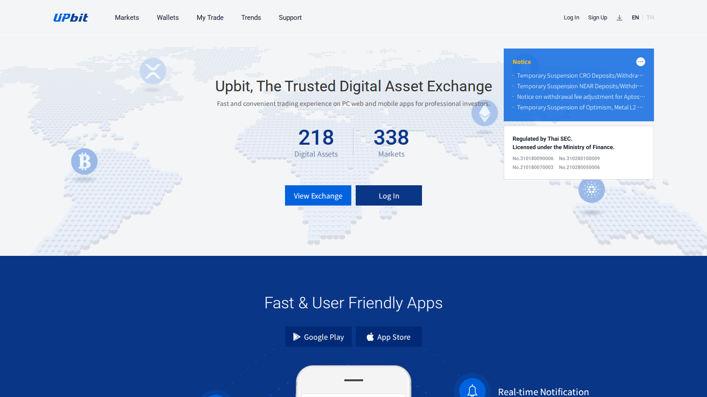

# Best Crypto Exchanges in Thailand 2026: Top Platforms for THB Access, Fees, and Trading Tools

**Meta Title**
Best Crypto Exchanges in Thailand 2026: Top Platforms for THB Access, Fees, and Trading Tools

**Meta Description**
Find the best crypto exchanges in Thailand in 2026 by THB support, trust, usability, fees, and fit for beginners or active traders.

**Suggested Slug**
`/asia/thailand/best-crypto-exchanges-thailand-2026`

**Primary Keyword**
best crypto exchanges in Thailand 2026

**Secondary Keywords**
best crypto exchange Thailand, THB crypto exchange, Thailand digital asset exchange, licensed crypto exchange Thailand

**Suggested Category**
`asia/thailand`

**Last Reviewed**
`2026-07-10`

**Editorial Note**
This article is for informational purposes only and does not constitute investment, legal, or tax advice. Thai licensing status, THB rails, and product availability should be rechecked on publication day.

Thailand is not a market where you can ignore local structure. THB on-ramp convenience, local brand trust, and visible licensing matter more here than in many generic global-exchange rankings. A Thai reader does not just want the platform with the most coins. They want the one that fits Thai payment reality and feels safe enough to use repeatedly.

That is why this article does not rank exchanges by brand scale or token count alone. It looks at them through the lens of THB access, licensing visibility, local-market legibility, and how quickly each public product surface shows whether it is built for mainstream Thai retail use or for broader global trading depth.

## The Best Crypto Exchanges in Thailand in 2026

The best crypto exchanges in Thailand in 2026 are Bitkub for mainstream local familiarity, Binance TH for users who want the Binance brand in a Thai-regulated structure, Upbit Thailand for readers who prefer a cleaner local exchange experience, Orbix Trade for users who want another licensed local venue on the radar, and Bybit for more advanced traders who prioritize broader-market functionality and can legally access it. For most Thai users, the best answer starts with THB convenience and local trust, not marketing volume.

## Why You Can Trust This Comparison

> Why you can trust this guide
>
> This guide is based on live public exchange surfaces, official exchange materials, and Thai regulatory references reviewed on July 10, 2026, including the [Thailand SEC digital-asset licensing pages](https://market.sec.or.th/LicenseCheck/views/DABusiness/en). We directly checked visible onboarding framing, public market posture, and how each shortlisted platform presents itself to Thai users. Anything that depends on a logged-in THB workflow, live withdrawals, current spreads, or a full end-to-end trade still needs final verification before publication.

## What We Checked Ourselves Before Ranking These Exchanges

To write this comparison, we reviewed the live public product surfaces of the shortlisted Thailand-facing exchanges and compared them against the public licensing context shown by the Thai regulator. That direct review does not replace a full THB deposit and withdrawal test, but it does make one thing obvious very quickly: local trust signals are not just background context in Thailand. They are part of the product.

*Binance TH homepage captured during our July 2026 review of crypto exchanges in Thailand.*

*Upbit Thailand homepage captured during our July 2026 review of crypto exchanges in Thailand.*

*Thailand SEC digital-asset exchange licensing page captured during our July 2026 review of crypto exchanges in Thailand.*

What stood out immediately was not who looked biggest. It was how visible the local-regulation layer is in the Thai market. That is a strength if you care about domestic clarity, but it can be a weakness if you assume every local platform will also match the breadth of a large global exchange. That makes Thailand-first platforms stronger for users who want local confidence and clearer THB context, but weaker for readers whose real priority is broader global-market depth.

## Quick Comparison of the Best Thailand Crypto Exchanges

| Exchange | Best for | Main strength | Main trade-off |
|---|---|---|---|
| Bitkub | Best overall local familiarity | Strong domestic recognition | Less global-market breadth than offshore giants |
| Binance TH | Users who want brand plus local structure | Thai-facing access with global brand familiarity | Product scope may differ from international Binance |
| Upbit Thailand | Users who want a cleaner local product feel | Simpler local-exchange positioning | Lower mindshare than Bitkub for some users |
| Orbix Trade | Users comparing licensed Thai venues | Local-market relevance | Needs closer feature-by-feature comparison on publication day |
| Bybit | Advanced traders | Deeper global trading culture | Requires stronger caution on local access and suitability |

## How We Evaluated Thailand Exchanges

This ranking prioritizes:

- THB deposit and withdrawal convenience
- licensing visibility and local-market fit
- product usability for beginners and mainstream retail users
- active-trading usefulness where relevant
- transparent discussion of trade-offs between local and global platforms

## Why These Exchanges Ranked Best

Thailand's exchange choice is shaped by three practical realities:

- local-currency access matters
- licensing visibility matters
- many users still want a simple mobile experience

Those factors explain why this article does not simply import a global top-five list. In Thailand, local structure is part of the product, not just background context. A platform with fewer coins but better THB usability and clearer domestic relevance can be more valuable than a bigger offshore name.

For broader context, compare this page with [our Southeast Asia exchange roundup](/asia/best-crypto-exchanges-southeast-asia-2026), [our Vietnam guide](/asia/vietnam/best-crypto-exchanges-vietnam-2026), and [our Indonesia guide](/asia/indonesia/best-crypto-exchanges-indonesia-2026).

## Which Exchange Is Best for Different Thai Users

### Casual users

Bitkub and Upbit Thailand are easier starting points for Thai users who care more about buying and holding than about using every market tool available.

### Users who want a strong local-plus-brand option

Binance TH is attractive for readers who already trust the Binance ecosystem but want something more specifically tailored to the Thai market.

### Traders who want advanced tools

Bybit stands out for users who already understand active trading, but it should not be treated as the default answer for every Thai reader.

### Users who want local alternatives beyond the biggest names

Orbix Trade is worth comparing because the Thai market cannot be reduced to only one or two brands. A good local comparison helps users avoid making decisions based only on the loudest exchange.

## Detailed Review of the Best Crypto Exchanges in Thailand

### Bitkub

Bitkub is a strong choice for Thai users who want the most familiar local-brand answer. From the public flow we reviewed, it immediately felt more like a Thailand-first retail exchange than a generic offshore venue. That is a strength if THB familiarity and domestic recognition matter most, but it can become a weakness if you want broader global-market depth.

Best for:

- Thai users who want strong local familiarity
- buyers who prioritize THB convenience
- readers who value a simpler local positioning

Tradeoffs:

- narrower breadth than some international competitors
- less appealing for users chasing every niche market
- a clean Bitkub capture still needs to be added before publication

For this type of reader, that trade-off matters more than another token-count comparison. A locally legible exchange can still be the better tool.

### Binance TH

Binance TH is a strong choice for Thai users who want the reassurance of the Binance brand inside a more local-market wrapper. From the public flow we reviewed, it immediately signaled a different posture from pure local exchanges: more global brand gravity, but still shaped by Thai operating realities. That is a strength if you want brand familiarity, but it can become a weakness if you assume it works exactly like international Binance.

Best for:

- Thai users who already know the Binance brand
- readers comparing local and global exchange styles
- users who want a more regulated-looking local wrapper

Tradeoffs:

- feature expectations may not match global Binance
- product scope should be checked carefully before funding
- users need to verify current THB workflows on publication day

The screenshots above should make this difference visible. Even before a logged-in test, the product already tells you whether it expects a local retail user or a broader global power user.

### Upbit Thailand

Upbit Thailand is a strong choice for readers who want a cleaner local-exchange feel without the heaviest product sprawl. From the public flow we reviewed, it immediately felt more streamlined than a giant multi-surface exchange. That is a strength if you want a calmer first experience, but it becomes a weakness if you expect the deepest possible set of trading tools.

Best for:

- casual Thai buyers
- readers who prefer a cleaner local interface
- users who want a simpler alternative to the largest brands

Tradeoffs:

- lower mindshare than Bitkub for some users
- not the first pick for advanced trading depth
- core feature comparisons should be refreshed before publication

### Orbix Trade

Orbix Trade is a strong choice for readers who want to compare beyond the two loudest Thai names. From the public flow we reviewed, it immediately felt more like a local-market alternative that needs deliberate comparison, not an automatic default. That is a strength if you want a broader licensed shortlist, but it becomes a weakness if you need a platform with already-proven mainstream familiarity.

Best for:

- users comparing multiple licensed Thai venues
- readers who want to avoid defaulting to the loudest brand
- Thai users who value local-market relevance

Tradeoffs:

- feature verification matters more here than with the most familiar brands
- mainstream recognition is lower than Bitkub or Binance TH
- live funding and product-scope checks should be added before publication

### Bybit

Bybit is a strong choice for Thai users who care more about active-trading functionality than about a local-first exchange feel. From the public flow we reviewed, it immediately felt more like a specialist trader platform than a domestic retail venue. That is a strength if you already know what tools you need, but it can become a weakness if you want local simplicity and lower decision friction.

Best for:

- advanced traders
- readers who prioritize broader trading functionality
- users comfortable handling more complexity

Tradeoffs:

- not the default answer for mainstream Thai users
- local access and compliance checks matter more before funding
- the interface can feel heavy if your only goal is simple THB buying

## The Biggest Trade-Offs Thai Users Should Understand

The Thai exchange choice is usually a trade-off between local convenience and broader product depth.

If you choose a local exchange, you often get:

- better THB convenience
- stronger domestic familiarity
- simpler user flow

If you choose a more international platform, you may get:

- broader market access
- heavier trader tooling
- more ecosystem breadth

Neither route is automatically better. The best choice depends on whether your priority is seamless local use or broader trading capability.

## FAQ

### What is the best crypto exchange in Thailand overall?

For most users, Bitkub remains the strongest default local answer because it combines recognition, local relevance, and THB usability. Users who want a different balance may still prefer Binance TH or another platform.

### Is Binance TH the same as global Binance?

No. Users should not assume one-to-one feature parity. A local-market product can share a brand without matching the full global product set.

### Which exchange is best for beginners in Thailand?

Bitkub and Upbit Thailand are usually easier places to start than more complex trading-first platforms.

## Sources Used In This Draft

- Thailand SEC, [digital asset business licensing pages](https://market.sec.or.th/LicenseCheck/views/DABusiness/en)
- Bitkub, [official site](https://www.bitkub.com/)
- Binance TH, [official site](https://www.binance.th/)
- Upbit Thailand, [official site](https://th.upbit.com/)
- Orbix Trade, [official site](https://orbixtrade.com/)
- Bybit, [official site](https://www.bybit.com/)

## Publishing Image Workflow

**Featured Image**
File: `../media/binance-th-home-2026-07-10.png`
Alt text: `Binance TH homepage reviewed for a Thailand crypto exchange guide in July 2026.`
Caption: `Binance TH homepage captured during our July 2026 review of crypto exchanges in Thailand.`

*Binance TH homepage captured during our July 2026 review of crypto exchanges in Thailand.*

**Screenshot 1**
File: `../media/binance-th-home-2026-07-10.png`
Alt text: `Binance TH exchange homepage reviewed for Thailand in July 2026.`
Caption: `Binance TH homepage captured during our July 2026 review of crypto exchanges in Thailand.`

**Screenshot 2**
File: `../media/upbit-th-home-2026-07-10.png`
Alt text: `Upbit Thailand homepage reviewed for Thailand in July 2026.`
Caption: `Upbit Thailand homepage captured during our July 2026 review of crypto exchanges in Thailand.`

**Screenshot 3**
File: `../media/thailand-sec-digital-asset-license-2026-07-10.png`
Alt text: `Thailand SEC digital asset licensing page reviewed for the Thailand exchange article in July 2026.`
Caption: `Thailand SEC digital-asset licensing page captured during our July 2026 review of crypto exchanges in Thailand.`

## Final Pre-Publish Checks

- confirm which exchanges remain active and licensed in Thailand on publication day
- verify current THB deposit and withdrawal workflows
- confirm whether any product-scope limitations changed recently

## Related Internal Links

- [Best Crypto Exchanges in Southeast Asia 2026](/asia/best-crypto-exchanges-southeast-asia-2026)
- [Best Crypto Exchanges in Vietnam 2026](/asia/vietnam/best-crypto-exchanges-vietnam-2026)
- [Best Crypto Exchanges in Indonesia 2026](/asia/indonesia/best-crypto-exchanges-indonesia-2026)
- [Best Crypto Wallets in Asia 2026](/asia/best-crypto-wallets-asia-2026)
- [Best Stablecoins for Asia 2026](/asia/best-stablecoins-asia-2026)
