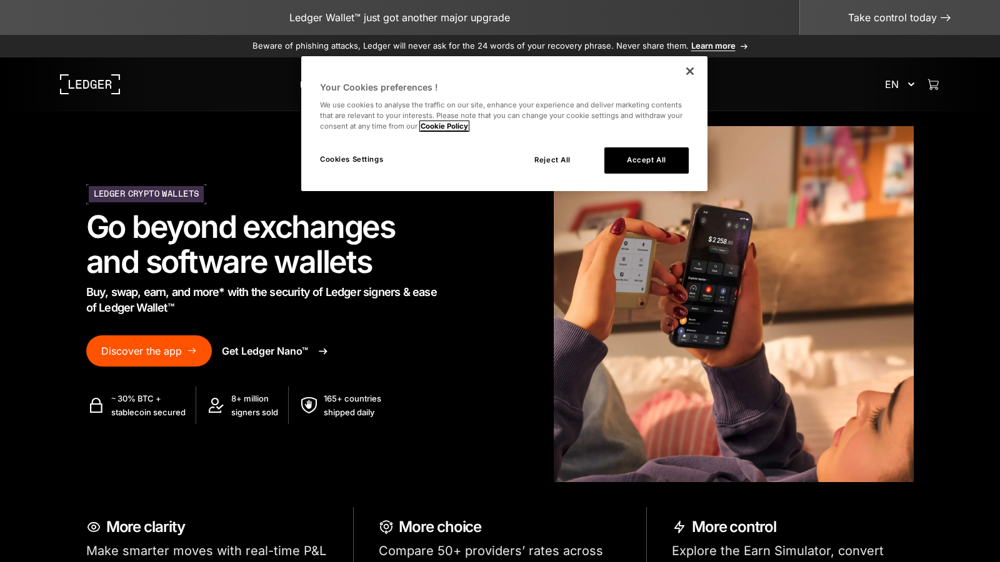
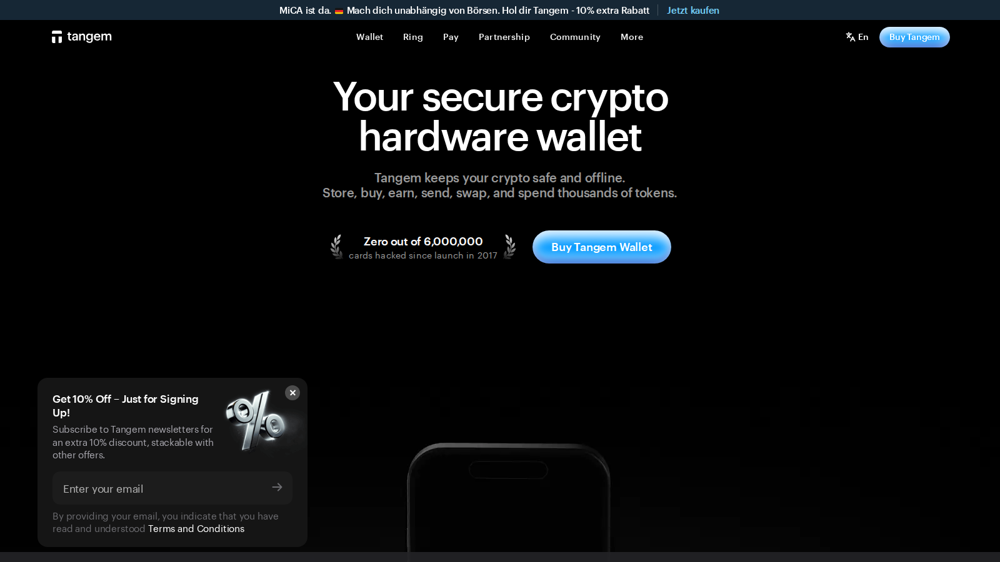
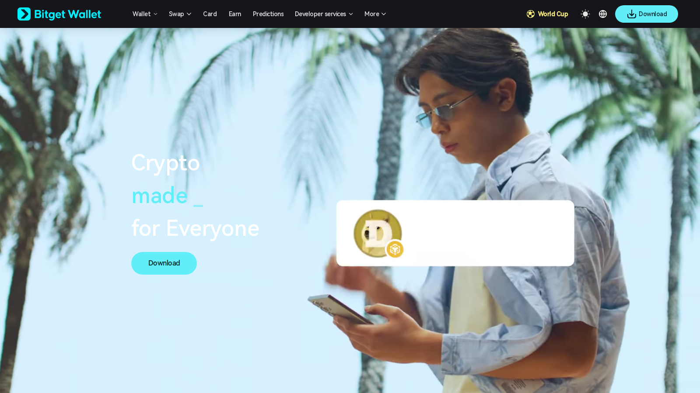

# Best Crypto Wallets in Asia 2026: Top Picks for Security, Multi-Chain Support, and Ease of Use

**Meta Title**
Best Crypto Wallets in Asia 2026: Top Picks for Security, Multi-Chain Support, and Ease of Use

**Meta Description**
Explore the best crypto wallets in Asia in 2026 for self-custody, mobile usability, multi-chain access, and long-term storage.

**Suggested Slug**
`/asia/best-crypto-wallets-asia-2026`

**Primary Keyword**
best crypto wallets in Asia 2026

**Secondary Keywords**
best crypto wallet Asia, self-custody wallet Asia, mobile crypto wallet Asia, best hardware wallet Asia

**Suggested Category**
`asia`

**Last Reviewed**
`2026-07-10`

**Editorial Note**
This article is for informational purposes only and does not constitute investment, legal, or tax advice. Wallet features, supported chains, and hardware availability can change over time.

The best crypto wallet in Asia is not just the most secure wallet in theory. It is the one that fits how people in the region actually use crypto: on mobile, across multiple chains, often through stablecoins, and sometimes as a bridge between exchange balances and longer-term self-custody. That makes usability matter almost as much as security design.

For most Asian users in 2026, the strongest wallet shortlist is Trust Wallet, Ledger Nano X, Tangem, MetaMask, and Bitget Wallet. Each one serves a different type of user, and that is the key point. There is no single wallet that is best for every reader.

## The Best Crypto Wallets in Asia in 2026

The best crypto wallets in Asia in 2026 are Trust Wallet for all-around mobile usability, Ledger Nano X for long-term self-custody, Tangem for beginners who want hardware security without a steep learning curve, MetaMask for users who live inside the EVM and onchain app world, and Bitget Wallet for users who want a mobile-heavy multichain experience. Your best wallet depends on whether you prioritize security depth, mobile speed, or DeFi access.

## Why You Can Trust This Comparison

This wallet guide uses official wallet documentation, product pages, and Asia-specific usage context rather than generic "most downloaded app" logic. The ranking gives extra weight to self-custody practicality, multichain use, and how Asian users actually move funds between exchanges, stablecoins, and onchain tools.

## What We Checked Ourselves Before Ranking These Wallets

To write this comparison, we reviewed the live public product surfaces of the shortlisted wallets and compared what they signal before a user even completes setup. That direct review does not replace a full seed-phrase flow, transfer test, or onchain-signing session, but it does reveal whether a wallet is trying to feel like a beginner product, a security-first device, or a Web3 control panel.

*Ledger homepage captured during our July 2026 review of crypto wallets in Asia.*

*Tangem homepage captured during our July 2026 review of crypto wallets in Asia.*

*Bitget Wallet homepage captured during our July 2026 review of crypto wallets in Asia.*

What stood out immediately was not just feature count. It was posture. Ledger presents itself as a control-and-security product, Tangem pushes hardware simplicity, and Bitget Wallet signals mobile-first Web3 convenience. That difference is exactly why one wallet can feel excellent for one user and wrong for another.

## Quick Comparison of the Best Crypto Wallets in Asia

| Wallet | Best for | Main strength | Main trade-off |
|---|---|---|---|
| Trust Wallet | Best overall mobile wallet | Easy multichain mobile experience | Not as strong for cold storage as hardware wallets |
| Ledger Nano X | Long-term holders | Strong self-custody posture | Less convenient for fast day-to-day interaction |
| Tangem | Beginners wanting hardware | Very simple hardware-wallet workflow | Not ideal for users who want advanced wallet customization |
| MetaMask | EVM and DeFi users | Deep ecosystem compatibility | Can feel limited or awkward outside the EVM world |
| Bitget Wallet | Mobile-first multichain users | Broad mobile tooling and Web3 usability | Users should verify comfort with the full product ecosystem |

## How We Evaluated Wallets

This ranking prioritizes:

- security design and recovery practicality
- multichain and stablecoin usability
- mobile experience for mainstream users
- fit for beginners, DeFi users, or long-term holders
- realistic trade-offs between convenience and cold-storage discipline

## Why These Wallets Made the List

Asian crypto usage has three characteristics that matter for wallet rankings:

- mobile usage is extremely high
- stablecoins are a major part of activity
- users often move between centralized exchanges and onchain tools

That means a wallet must do more than store keys. It needs to help users move between chains, manage assets clearly, and avoid making self-custody feel terrifying for first-time users.

This is why the list includes both hardware and software wallets. A smartphone-first region still needs cold-storage options, but a hardware wallet alone is not a complete answer for people who interact with DeFi, NFTs, or daily transfers.

For related reading, pair this guide with [the best stablecoins for Asia](/asia/best-stablecoins-asia-2026), [the best stablecoins for remittance in Asia](/asia/best-stablecoins-remittance-asia-2026), and [the best crypto exchanges in Southeast Asia](/asia/best-crypto-exchanges-southeast-asia-2026).

## Which Wallet Is Best for Which Type of User

### First-time self-custody users

Trust Wallet and Tangem are usually the easiest starting points because they reduce the intimidation factor. One does it through a familiar mobile experience, and the other does it through a simpler hardware model.

### DeFi and multi-chain users

MetaMask and Bitget Wallet are more attractive for users who want faster onchain interaction rather than only storage.

### Users storing larger balances

Ledger Nano X is the strongest choice here because long-term self-custody usually benefits from more deliberate hardware separation.

### Users who want the simplest mobile experience

Trust Wallet remains one of the easiest answers for readers who want a recognizable app that works across multiple assets without demanding too much setup knowledge.

## Detailed Review of the Best Crypto Wallets in Asia

### Trust Wallet

Trust Wallet remains one of the most practical all-around choices because it understands the mass-market mobile user. For readers in Asia who want to move between stablecoins, major chains, and exchange withdrawals without overthinking wallet architecture, that is a real advantage.

Its weakness is that convenience is not the same thing as maximum security. If you are storing serious long-term capital, a software wallet should not be your only layer.

### Ledger Nano X

Ledger Nano X remains one of the clearest long-term self-custody answers because it creates stronger separation between internet-facing activity and private-key control. For readers who view crypto as capital they may hold for years rather than trade weekly, that difference matters.

The trade-off is speed. Hardware security is usually less convenient than a hot wallet, and that is the point.

### Tangem

Tangem is compelling because it lowers the psychological barrier to hardware-wallet adoption. Many users know they should move at least part of their holdings off exchanges, but they are intimidated by seed phrases, device setup, and technical jargon. Tangem is built to make that transition easier.

Its limitation is that advanced wallet users may want more granular control than Tangem is designed to provide.

### MetaMask

MetaMask still matters because so much of the onchain experience still runs through EVM networks. If you actively use DeFi, swaps, onchain apps, or newer token launches, MetaMask remains part of the default toolkit.

The trade-off is that it is not the cleanest wallet for readers who just want simple storage and transfers. It makes more sense for users who already expect to interact with the broader Web3 stack.

### Bitget Wallet

Bitget Wallet is useful for readers who want a mobile-forward multichain wallet with more built-in Web3 orientation than simpler storage apps. In Asia, where users often discover crypto through mobile ecosystems first, that is a real reason to include it.

The caution is that users should separate ease of access from security discipline. A wallet can be feature-rich and still demand careful risk management from the user.

## Hot Wallet vs Hardware Wallet in 2026

For most Asian users, the strongest setup is not choosing one forever. It is combining them.

Use a hot wallet when you need:

- frequent transfers
- DeFi access
- app connectivity

Use a hardware wallet when you need:

- long-term storage
- larger balances
- stronger separation from day-to-day browsing and app risk

This two-layer setup is more realistic than pretending every user should immediately become a pure cold-storage maximalist.

## Wallet Risks and Safety Mistakes to Avoid

The most common wallet mistake is moving off an exchange without improving security habits. Self-custody only helps if the user also improves behavior.

Readers should:

- back up recovery information carefully
- separate long-term storage from everyday spending
- avoid signing transactions they do not understand
- treat convenience features as a trade-off, not a free upgrade

## FAQ

### What is the best crypto wallet in Asia overall?

Trust Wallet is the best all-around mobile answer for most users, while Ledger Nano X is the best answer for long-term cold storage. The right choice depends on what you are trying to protect and how often you need to move funds.

### Is a hardware wallet necessary in 2026?

Not for every user, but it becomes much more important as balances grow. If crypto is becoming a meaningful part of your savings, hardware separation is still one of the clearest upgrades you can make.

### Which wallet is best for beginners?

Trust Wallet and Tangem are usually the easiest beginner options because they reduce complexity without removing the core self-custody lesson.

## Sources Used In This Draft

- Trust Wallet, [official site](https://trustwallet.com/)
- Ledger, [Nano X and official site](https://www.ledger.com/)
- Tangem, [official site](https://tangem.com/)
- MetaMask, [official site](https://metamask.io/)
- Bitget Wallet, [official site](https://web3.bitget.com/)
- Chainalysis, [The 2025 Global Crypto Adoption Index](https://www.chainalysis.com/blog/2025-global-crypto-adoption-index/)

## Suggested Media

- Featured image: hot wallet versus hardware wallet split visual
- Comparison table graphic: wallet type, chain support, best-for, and main risk notes
- Screenshot block: Trust Wallet, MetaMask, and Bitget Wallet mobile UI examples
- Explainer visual: simple self-custody setup and fund-separation diagram

## Final Pre-Publish Checks

- verify any regional shipping or hardware-wallet availability notes for Asian markets
- confirm current chain support and app-store availability for each wallet
- add screenshots or setup examples if the article will target more beginner search intent

## Related Internal Links

- [Best Crypto Exchanges in Southeast Asia 2026](/asia/best-crypto-exchanges-southeast-asia-2026)
- [Best Stablecoins for Asia 2026](/asia/best-stablecoins-asia-2026)
- [Best Stablecoins for Remittance in Asia 2026](/asia/best-stablecoins-remittance-asia-2026)
- [Top DePIN Crypto Projects 2026](/asia/top-depin-crypto-projects-2026)
- [Top RWA Crypto Projects 2026](/asia/top-rwa-crypto-projects-2026)
