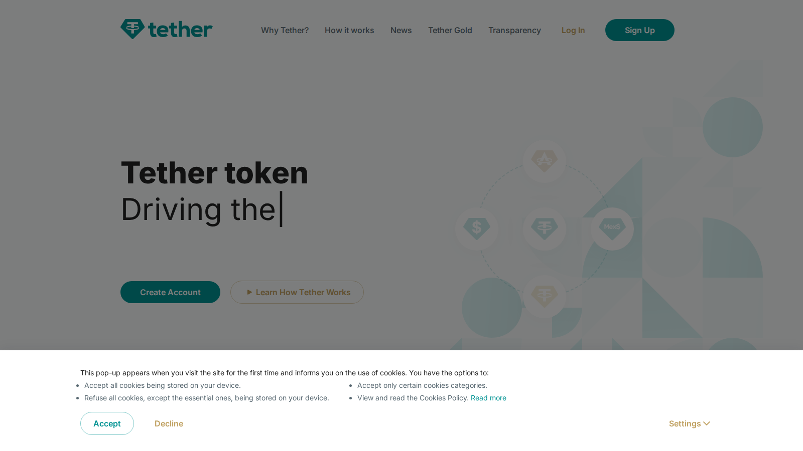
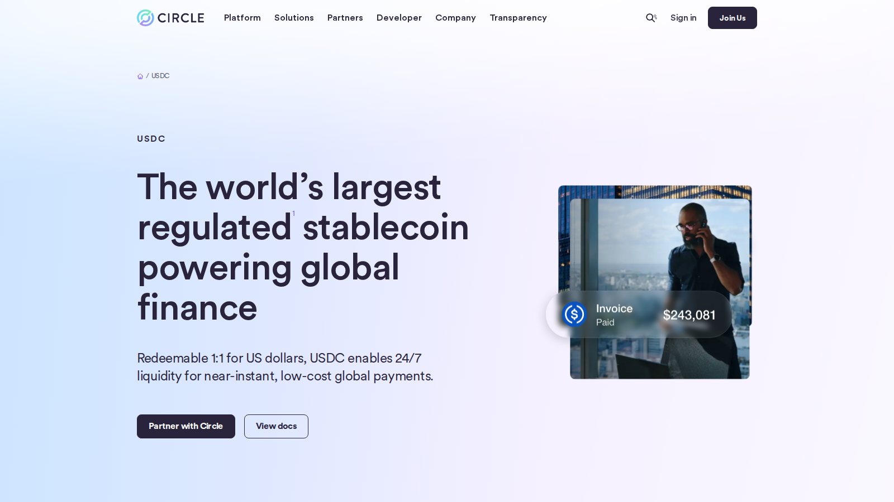
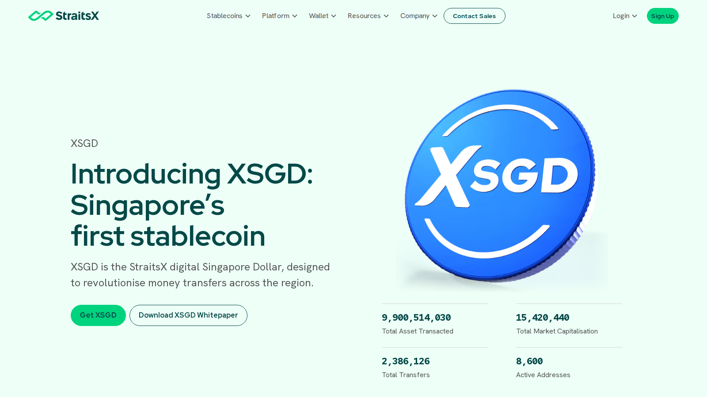

---
title: "Best Stablecoins for Asia 2026"
slug: "/asia/best-stablecoins-asia-2026"
meta_title: "Best Stablecoins for Asia 2026: Top Options for Trading, Payments, and Capital Preservation"
meta_description: "Compare the best stablecoins for Asia in 2026 by liquidity, transparency, transfer costs, payment utility, and regional usability."
search_intent: "Commercial investigation"
primary_keyword: "best stablecoins for Asia 2026"
secondary_keywords:
  - "best stablecoin Asia"
  - "stablecoins for trading Asia"
  - "stablecoins for payments Asia"
  - "top stablecoins 2026"
category: "asia"
last_reviewed: "2026-07-22"
schema:
  - "Article"
  - "ItemList"
  - "FAQPage"
  - "BreadcrumbList"
internal_links:
  - "/asia/best-stablecoins-remittance-asia-2026"
  - "/asia/best-crypto-exchanges-southeast-asia-2026"
  - "/asia/best-crypto-wallets-asia-2026"
  - "/europe/eu/best-mica-compliant-crypto-exchanges-2026"
  - "/asia/top-rwa-crypto-projects-2026"
---

# Best Stablecoins for Asia 2026: Top Options for Trading, Payments, and Capital Preservation

**Editorial Note**
This article is for informational purposes only and does not constitute investment, legal, or tax advice. Stablecoin reserve posture, chain support, and exchange availability can change quickly.

**Last reviewed:** July 2026. Stablecoin exchange listings, reserve disclosures, and regulatory status change regularly. Verify current support before moving significant value.

The best stablecoins for Asia in 2026 are USDT, USDC, FDUSD, XSGD, and PYUSD. USDT remains the dominant choice for trading and everyday transfers because exchange support and chain availability are the widest of any stablecoin. USDC is the better pick for users who want a cleaner reserve transparency profile for larger holdings. FDUSD is relevant for users inside exchange-heavy workflows where it has active promotion. XSGD is the only regulated Singapore-dollar stablecoin with meaningful regional payment use. PYUSD is the payment-first stablecoin backed by PayPal, worth watching but not yet a mainstream Asia trading or transfer default.

If your primary use case is cross-border transfers, the more specific analysis is in [our stablecoin remittance guide](/asia/best-stablecoins-remittance-asia-2026). For wallets to hold these assets, see [our Asia wallet guide](/asia/best-crypto-wallets-asia-2026).

| Stablecoin | Outstanding point | Score | One-line note |
|---|---|---|---|
| USDT | Deepest exchange liquidity and broadest chain support | 4.5/5 | Reserve transparency debates continue |
| USDC | Strongest regulated transparency and institutional trust profile | 4/5 | Not always the most liquid in Asia trading lanes |
| FDUSD | Best for users inside Binance and exchange-native ecosystems | 3.5/5 | Usefulness is platform-dependent |
| XSGD | Only regulated SGD-pegged stablecoin with regional payment track record | 3/5 | Much smaller liquidity than dollar stablecoins |
| PYUSD | Best-positioned payment-brand stablecoin to watch | 2.5/5 | Not yet a default Asia transfer or trading asset |

## Ranking scorecard

Scored out of 10 per category. Total out of 60.

| Stablecoin | Exchange liquidity and acceptance | Chain availability | Issuer transparency | Payment and cross-border usability | Regulatory clarity | Asia-specific adoption | **Total** |
|---|---|---|---|---|---|---|---|
| USDT | 10 | 10 | 5 | 8 | 5 | 10 | **48** |
| USDC | 8 | 8 | 9 | 7 | 9 | 7 | **48** |
| FDUSD | 7 | 6 | 6 | 5 | 6 | 7 | **37** |
| XSGD | 4 | 5 | 8 | 7 | 9 | 6 | **39** |
| PYUSD | 5 | 5 | 7 | 6 | 7 | 4 | **34** |

**Scoring notes.** USDT and USDC tie on total score but serve different reader priorities. USDT leads on exchange liquidity and Asia adoption but trails on issuer transparency and regulatory clarity. USDC leads on transparency and regulatory clarity but trails on raw trading liquidity in many Asian markets. XSGD scores higher than its size would suggest because it holds genuine regulatory standing and a specific regional payments use case. FDUSD scores are conditional on platform context.

## 5 Best Stablecoins for Asia Reviewed (2026 List)

Stablecoins do different jobs in Asia: trading collateral, savings rail, remittance medium, and payment bridge. The right stablecoin depends on which job you are actually trying to do.

### USDT (Tether)

[USDT](https://tether.to/) is the practical default for most Asian users and it is worth being clear about why: it is not because USDT is the cleanest stablecoin on trust grounds. It is because it is the most liquid, the most widely accepted, and the most available across chains that matter in the region.

We reviewed the Tether public product surface. USDT runs on 15+ blockchains. The ones that matter most for everyday Asian use are Tron (TRC-20) and BNB Chain (BEP-20). TRC-20 USDT transfers cost under $1 in network fees and settle in seconds. That makes it the dominant transfer rail for stablecoin movement between Vietnamese, Indonesian, Filipino, and Indian users and exchanges. Any article that does not mention this is not answering the question a real Asian user is asking.

*Tether homepage, July 2026: market infrastructure positioning and broad chain support confirmed.*

**Best for:** Traders who prioritize liquidity, users transferring stablecoins between exchanges, anyone who needs a stablecoin that is accepted everywhere in Asia without friction.
**Main tradeoff:** Tether does not publish real-time reserve breakdowns in the same format as Circle. For users who need the cleanest possible reserve transparency for compliance or institutional reasons, USDC is the better choice.

What to check before relying on USDT: Tether publishes quarterly attestations, not daily reserve reports. The reserve mix includes US Treasuries, money market funds, and other assets. It is not a simple one-for-one dollar-in-a-bank model. For day-to-day transfers under a few thousand dollars, this distinction is academic. For treasuries holding millions in USDT, it is not.

---

### USDC (Circle)

[USDC](https://www.circle.com/usdc) is the more conservative choice and the right answer for users whose primary concern is issuer transparency rather than maximum exchange liquidity. Circle publishes monthly reserve reports and holds USDC reserves in short-duration US Treasuries and cash held at regulated US financial institutions.

We reviewed the Circle USDC public product surface. Circle received OCC approval as a federally chartered national trust bank in 2026, which strengthens its regulated-finance positioning. USDC is available on Ethereum, Solana, Base, Polygon, Arbitrum, and other chains. It does not have TRC-20 availability on Tron, which is the main gap for Asian users who rely on Tron as a low-fee transfer rail.

*Circle USDC page, July 2026: regulated reserve transparency and OCC national trust bank positioning confirmed.*

**Best for:** Users who want cleaner reserve transparency, institutional or business treasuries, anyone whose counterparties require a regulated-issuer stablecoin.
**Main tradeoff:** USDC does not run on Tron. For users in Asia whose main workflow involves low-cost TRC-20 USDT transfers between exchanges, USDC requires Ethereum or alternative chains with higher per-transfer fees.

---

### FDUSD (First Digital)

[FDUSD](https://firstdigitallabs.com/) is a Hong Kong-regulated stablecoin issued by First Digital Trust and heavily promoted within the Binance ecosystem. It was launched in mid-2023 specifically as a Binance-native stablecoin alternative and carries zero-fee promotional status for many Binance trading pairs.

**Best for:** Users who trade primarily on Binance and want a stablecoin with promotional zero-fee pairs, users already operating within the First Digital ecosystem.
**Main tradeoff:** FDUSD's usefulness is heavily tied to Binance's promotional decisions. Outside Binance, FDUSD acceptance and liquidity are substantially thinner than USDT or USDC. If Binance changes its fee promotion, the primary competitive advantage disappears.

The specific thing to check: FDUSD is available on Ethereum and BNB Chain. It is not on Tron, Solana, or most other chains where Asian users commonly move stablecoins. That limits its remittance and cross-chain use relative to USDT.

---

### XSGD (StraitsX)

[XSGD](https://www.straitsx.com/xsgd) is the Singapore Dollar-pegged stablecoin issued by StraitsX, which holds a Major Payment Institution license from the Monetary Authority of Singapore. It is the only regulated SGD stablecoin with active use in regional payment corridors.

We reviewed the StraitsX XSGD public product surface. The positioning is clearly payment-oriented rather than trading-dominant: StraitsX frames XSGD around cross-border settlement, business payments, and regulated digital-dollar infrastructure.

*StraitsX XSGD page, July 2026: Singapore MAS-regulated SGD stablecoin and regional payment corridor positioning.*

**Best for:** Users in Singapore or in payment corridors involving SGD, businesses that need a regulated local-currency stablecoin for compliance or treasury purposes, readers tracking non-dollar stablecoin development in Asia.
**Main tradeoff:** XSGD is not a substitute for USDT or USDC for general trading. Liquidity is substantially smaller. For everyday Asian crypto use, it is a niche tool. For regulated Singapore-based payment flows, it is the most credible regional option.

---

### PYUSD (PayPal)

[PYUSD](https://www.paypal.com/pyusd) is PayPal's USD stablecoin, launched on Ethereum in 2023 and expanded to Solana in 2024. It is issued by Paxos Trust Company under New York state trust company regulation.

**Best for:** Users tracking the payment-brand stablecoin category, businesses looking at PayPal-native payment flows, readers who want to understand where large consumer payment platforms are going with stablecoin infrastructure.
**Main tradeoff:** PYUSD has not yet achieved meaningful adoption as an Asian trading or transfer default. Most Asian exchanges do not list it as a major trading pair. Until PayPal's Asian market presence generates meaningful PYUSD distribution, it remains a watchlist item rather than a practical recommendation for most Asian users.

---

## Chain fees: the decision most stablecoin articles skip

For Asian users, the chain you use to transfer a stablecoin matters more than the stablecoin brand in many cases.

| Chain | Typical USDT transfer fee | Settlement time | Key Asian use case |
|---|---|---|---|
| Tron (TRC-20) | Under $1 | 1-3 minutes | Dominant for exchange-to-exchange and P2P transfers in SEA, South Asia |
| BNB Chain (BEP-20) | Under $0.50 | Seconds | Binance ecosystem transfers |
| Ethereum (ERC-20) | $2-15+ (variable) | 15 seconds to minutes | Institutional and DeFi transfers |
| Solana | Under $0.01 | Seconds | Growing for USDC transfers |

The table above is why TRC-20 USDT is dominant in everyday Asian stablecoin transfers. It is not because users prefer Tether on principle. It is because the fee structure fits the typical transfer size of retail and semi-retail users.

## When this review expires

This article should be re-checked when any of the following happen:

- Tether publishes reserve composition changes or faces significant regulatory action
- Circle changes its reserve structure, chain support, or OCC standing
- FDUSD changes its Binance promotional fee status
- XSGD gains or loses MAS license standing, or launches on new major chains
- PYUSD achieves meaningful adoption on a major Asian exchange
- A new stablecoin with significant Asian exchange support enters the market
- Network fee structures on Tron, BNB Chain, or Solana change substantially

If none of these fire by January 2027, treat the current recommendations as stale.

## What we checked ourselves before ranking these stablecoins

We reviewed live public issuer pages for each stablecoin and checked reserve disclosure formats, chain availability, and regional payment framing. We also verified network fee data for TRC-20 (Tron), BEP-20 (BNB Chain), ERC-20 (Ethereum), and Solana transfer costs using publicly available block explorer data.

That direct review does not replace a reserve-quality audit, a corridor-by-corridor remittance test, or a live exchange-availability check on publication day.

## What this review verified and what it did not

| Claim | Status |
|---|---|
| Tether and USDT chain availability reviewed on public issuer page | Observed |
| Circle OCC national trust bank charter confirmed | Observed |
| XSGD MAS Major Payment Institution license confirmed on StraitsX site | Observed |
| TRC-20 and BEP-20 fee levels verified against public network data | Observed |
| FDUSD First Digital Trust regulatory standing reviewed | Observed |
| Live reserve composition audited for any stablecoin | Not verified |
| Corridor-by-corridor off-ramp tested for any stablecoin | Not verified |
| Exchange listing status confirmed on all major Asia exchanges | Not verified |

## FAQ

### What is the best stablecoin in Asia overall?

USDT for trading and everyday transfers. USDC for larger holdings where reserve transparency matters more. The right choice depends on which job the stablecoin needs to do.

### Is USDT still safe to use?

For everyday transfers and trading on reputable exchanges, USDT remains the practical default. For users who need the strongest reserve transparency for institutional or compliance purposes, USDC is the more defensible choice.

### Why is TRC-20 USDT so popular in Asia?

Because Tron network fees are under $1 per transfer and settlement is fast. That fee structure fits the typical transfer size of retail and semi-retail users in Southeast Asia, South Asia, and between regional exchanges.

### What is XSGD and why does it matter?

XSGD is a Singapore Dollar stablecoin issued by StraitsX under MAS regulation. It matters because it is the only regulated SGD stablecoin with an active regional payments track record, which makes it relevant for Singapore-linked payment flows even though its liquidity is small compared to dollar stablecoins.

## Sources

- Asian Development Bank, [Asian Economic Integration Report 2026](https://aric.adb.org/aeir2026)
- OECD, [Asia Capital Markets Report 2026: Developments in Crypto-Asset Markets](https://www.oecd.org/en/publications/asia-capital-markets-report-2026_08f87bed-en/full-report/developments-in-crypto-asset-markets_193a8553.html)
- Tether, [official site](https://tether.to/)
- Circle, [official USDC site](https://www.circle.com/usdc)
- First Digital Labs, [FDUSD overview](https://firstdigitallabs.com/)
- StraitsX, [XSGD overview](https://www.straitsx.com/xsgd)
- PayPal, [PYUSD overview](https://www.paypal.com/pyusd)

## Related

- [Best Stablecoins for Remittance in Asia 2026](/asia/best-stablecoins-remittance-asia-2026)
- [Best Crypto Exchanges in Southeast Asia 2026](/asia/best-crypto-exchanges-southeast-asia-2026)
- [Best Crypto Wallets in Asia 2026](/asia/best-crypto-wallets-asia-2026)
- [Best MiCA Compliant Crypto Exchanges 2026](/europe/eu/best-mica-compliant-crypto-exchanges-2026)
- [Top RWA Crypto Projects 2026](/asia/top-rwa-crypto-projects-2026)
