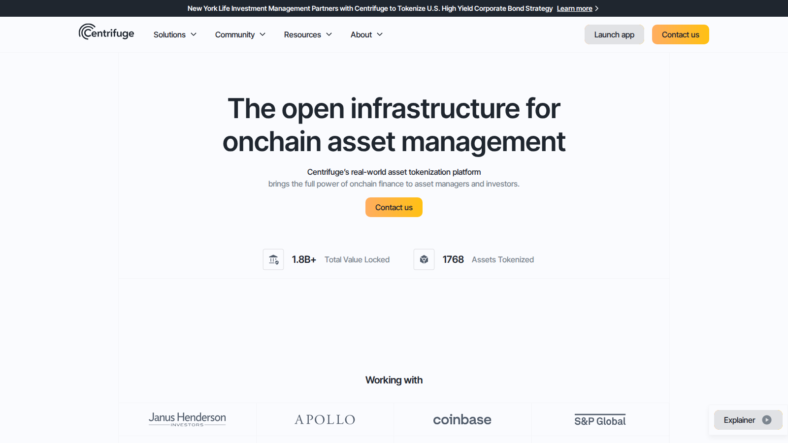
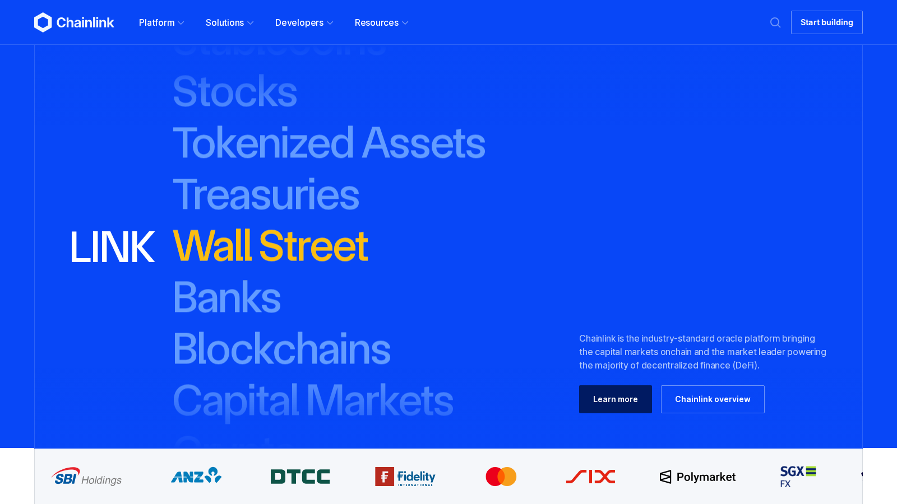
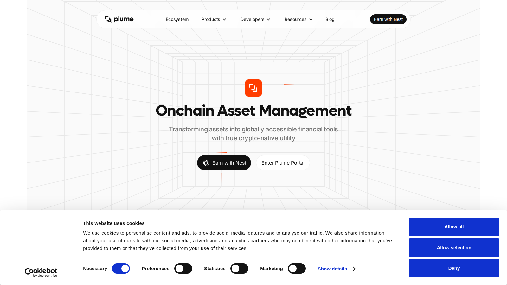

# Top RWA Crypto Projects 2026: Leading Real-World Asset Tokens and Infrastructure to Watch

**Meta Title**
Top RWA Crypto Projects 2026: Leading Real-World Asset Tokens and Infrastructure to Watch

**Meta Description**
Explore the top RWA crypto projects in 2026 by adoption, token utility, infrastructure depth, and the risks that still matter most.

**Suggested Slug**
`/asia/top-rwa-crypto-projects-2026`

**Primary Keyword**
top RWA crypto projects 2026

**Secondary Keywords**
best RWA crypto projects, real-world asset crypto, tokenized asset projects, RWA tokens 2026

**Suggested Category**
`asia`

**Last Reviewed**
`2026-07-10`

**Editorial Note**
This article is for informational purposes only and does not constitute investment, legal, or tax advice. Token metrics, protocol scope, and regulatory posture can change quickly in RWA markets.

The RWA story in 2026 is bigger than tokenized Treasuries alone. The strongest projects are no longer just promising that traditional assets will come onchain someday. They are building distribution, custody, compliance, and yield infrastructure around that thesis. That is what makes the category worth tracking seriously rather than treating it as another narrative cycle.

The strongest RWA shortlist in 2026 is Ondo, Centrifuge, Maple, Plume, and Chainlink as an infrastructure pick tied to tokenization. Not every item on this list is the same kind of project, and that is intentional. The RWA stack is part issuer layer, part credit layer, part infrastructure layer.

## The Top RWA Crypto Projects to Watch in 2026

The top RWA crypto projects to watch in 2026 are Ondo for broad tokenized-finance visibility, Centrifuge for early institutional credit infrastructure, Maple for yield and private-credit relevance, Plume as a dedicated RWA chain to watch, and Chainlink as a tokenization-enabling infrastructure layer. If you want the cleanest pure-play exposure to the narrative, Ondo is still the easiest starting point, but the category is wider than any single token.

## Why You Can Trust This Comparison

This comparison uses official project sites, product framing, and category context from [RWA.xyz](https://www.rwa.xyz/) rather than ranking projects by social-media noise alone. The focus is on adoption logic, infrastructure depth, and whether the story still works when hype cools down.

## What We Checked Ourselves Before Ranking These RWA Projects

To write this comparison, we reviewed the live public product surfaces of the shortlisted RWA projects and compared how they frame tokenization, asset management, and infrastructure utility. That direct review does not replace a full product, revenue, or token-value audit, but it does reveal which projects are positioning themselves like financial rails, which are positioning themselves like asset wrappers, and which are leaning into broader infrastructure language.

*Centrifuge homepage captured during our July 2026 review of RWA crypto projects.*

*Chainlink homepage captured during our July 2026 review of RWA crypto projects.*

*Plume homepage captured during our July 2026 review of RWA crypto projects.*

What stood out immediately was not just which project used the word "RWA." It was what kind of role each project claims in the stack. That matters because a tokenized-asset platform, an infrastructure layer, and an RWA-focused chain should not be judged as if they are the same product.

## Quick Comparison of the Top RWA Crypto Projects

| Project | Best for | Main strength | Main trade-off |
|---|---|---|---|
| Ondo | Best overall RWA visibility | Strong tokenized-finance brand and distribution narrative | Valuation expectations can outrun execution |
| Centrifuge | Credit infrastructure | Early focus on institutional and real-world credit rails | More complex story than consumer-facing token plays |
| Maple | Yield and credit watchers | Strong relevance to institutional-style onchain lending | Credit cycles can change sentiment fast |
| Plume | RWA-native chain watchers | Purpose-built RWA ecosystem positioning | Still needs to prove durable adoption at scale |
| Chainlink | Infrastructure exposure | Trusted middleware layer for tokenization workflows | Not a pure RWA bet in the same way as issuers or asset platforms |

## How We Evaluated RWA Projects

This ranking prioritizes:

- visible adoption or ecosystem traction
- credible asset, credit, or infrastructure utility
- whether token exposure maps to the underlying thesis
- durability of the business story beyond narrative momentum
- clear risk framing around execution, liquidity, and regulation

## Why These RWA Projects Made the List

The strongest RWA projects in 2026 tend to score well on four dimensions:

- real adoption rather than only narrative
- credible institutional or infrastructure positioning
- actual utility for token holders or ecosystem participants
- a story that still makes sense when hype cools down

That last point matters. Many RWA writeups still treat the sector like a generic "Wall Street comes onchain" slogan. The better question is whether a project is building real financial plumbing that remains useful even if the headline narrative becomes less fashionable.

For adjacent narrative coverage, compare this article with [our DePIN project guide](/asia/top-depin-crypto-projects-2026), [our Asia stablecoin guide](/asia/best-stablecoins-asia-2026), and [our MiCA exchange guide](/europe/eu/best-mica-compliant-crypto-exchanges-2026).

## Which Type of RWA Project Fits Different Investor Profiles

### Conservative narrative followers

Ondo and Chainlink usually make the most sense because their stories are easier to understand and easier to map to visible market themes.

### Infrastructure-focused investors

Chainlink and Centrifuge are more interesting if you care less about a flashy front-end brand and more about what has to exist behind tokenized asset flows.

### Yield and credit watchers

Maple is compelling for readers who care about onchain credit quality, treasury-linked yield narratives, and the intersection of DeFi and professional lending structure.

### Higher-risk narrative investors

Plume is the clearest example here. It offers upside if RWA-native infrastructure ecosystems deepen, but it also carries more execution risk than the most established names in the category.

## Detailed Review of the Top RWA Crypto Projects in 2026

### Ondo

Ondo remains the easiest RWA project to explain because it sits close to the heart of what many investors think the category means: tokenized access to real financial products and institutional-grade wrappers. That clarity has helped it become one of the most visible names in the space.

The trade-off is that visibility creates expectations. A project with a strong narrative can be priced as if execution is already solved.

### Centrifuge

Centrifuge deserves more respect than it often gets in broader crypto conversation because it spent years working on the real mechanics of bringing offchain assets and financing structures into an onchain framework. That makes it one of the category's more substance-heavy names.

Its weakness is that the story is more complex. Complexity can be a disadvantage in a market that prefers easy slogans.

### Maple

Maple belongs on the list because RWA is not only about tokenization optics. It is also about credit, yield, and professional capital relationships. Maple has become relevant because it sits near that convergence point.

The downside is that credit-sensitive projects can look very different depending on market conditions. They are never only a narrative trade.

### Plume

Plume is worth watching because it is trying to become a more purpose-built home for RWA activity rather than simply attaching tokenization language to an existing general-purpose chain story. That gives it a clearer niche.

The issue is proof. RWA-native chains still need to show that they can attract durable usage, not just attention.

### Chainlink

Chainlink is not a pure RWA issuer or credit project, but it belongs here because tokenized finance still needs reliable infrastructure around data, messaging, and execution. If real-world assets scale onchain, infrastructure providers should matter too.

The trade-off is that Chainlink gives more indirect exposure. It is a broader crypto-infrastructure story, not just an RWA thesis.

## What Looks Real in RWA and What Still Looks Unproven

What looks real:

- tokenized Treasury demand
- institutional interest in compliant onchain wrappers
- infrastructure demand around settlement and data

What still needs proof:

- broad retail demand beyond a few headline products
- durable token-value capture in every project
- smooth legal interoperability across jurisdictions

That is why the best RWA list in 2026 has to separate real traction from narrative overflow.

## FAQ

### What is the best RWA crypto project in 2026 overall?

Ondo is still the cleanest overall answer because it combines visibility, product relevance, and narrative clarity. It is not the only serious project, but it is the easiest starting point for most readers.

### Is Chainlink really an RWA project?

Not in the same direct sense as Ondo or Centrifuge. It makes the list because tokenized assets still depend on infrastructure, and Chainlink is part of that enabling layer.

### Are RWA projects lower risk than other crypto narratives?

Not automatically. They may be closer to real financial products, but they still face execution risk, liquidity risk, legal complexity, and token-valuation risk.

## Sources Used In This Draft

- RWA.xyz, [official data site](https://www.rwa.xyz/)
- Ondo Finance, [official site](https://ondo.finance/)
- Centrifuge, [official site](https://centrifuge.io/)
- Maple, [official site](https://maple.finance/)
- Plume, [official site](https://plumenetwork.xyz/)
- Chainlink, [official site](https://chain.link/)

## Suggested Media

- Featured image: tokenized-asset visual using treasuries, funds, and onchain rails
- Comparison table graphic: project, focus area, adoption signal, and risk matrix
- Diagram: RWA stack from asset layer to infrastructure layer
- Chart: category split across tokenized funds, credit, and infra

## Final Pre-Publish Checks

- verify token names and current product scope for each project on publication day
- add one or two current adoption datapoints from RWA.xyz or official reporting if the article is going live immediately
- confirm whether any material regulatory or market events changed the shortlist

## Related Internal Links

- [Top DePIN Crypto Projects 2026](/asia/top-depin-crypto-projects-2026)
- [Best Stablecoins for Asia 2026](/asia/best-stablecoins-asia-2026)
- [Best MiCA Compliant Crypto Exchanges 2026](/europe/eu/best-mica-compliant-crypto-exchanges-2026)
- [Best Crypto Wallets in Asia 2026](/asia/best-crypto-wallets-asia-2026)
- [Best Crypto Exchanges in Southeast Asia 2026](/asia/best-crypto-exchanges-southeast-asia-2026)
