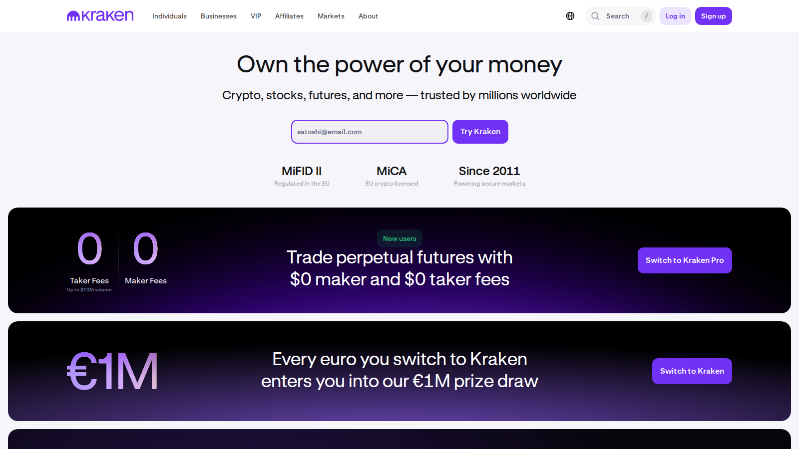
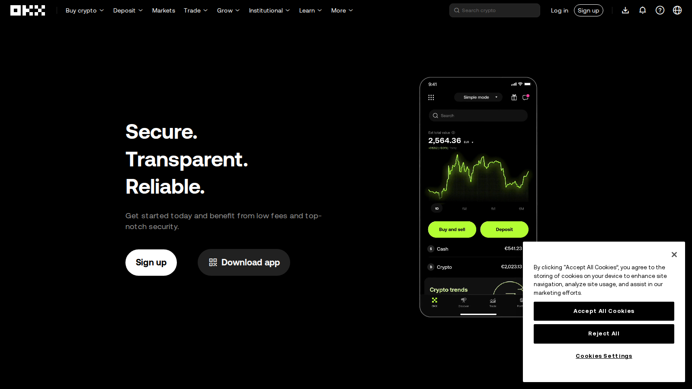

# Best MiCA Compliant Crypto Exchanges 2026: Top Platforms for EU Users After the New Rules

**Meta Title**
Best MiCA Compliant Crypto Exchanges 2026: Top Platforms for EU Users After the New Rules

**Meta Description**
Compare the best MiCA compliant crypto exchanges in 2026 based on licensing, product access, liquidity, fees, and operational trust.

**Suggested Slug**
`/europe/eu/best-mica-compliant-crypto-exchanges-2026`

**Primary Keyword**
best MiCA compliant crypto exchanges 2026

**Secondary Keywords**
MiCA compliant exchange, best EU crypto exchange 2026, licensed crypto exchange Europe, MiCA crypto platforms

**Suggested Category**
`europe/eu`

**Last Reviewed**
`2026-07-10`

**Editorial Note**
This article is for informational purposes only and does not constitute investment, legal, or tax advice. MiCA licensing, passporting status, and product scope should be rechecked on the publication day for each EU market.

MiCA changed the European exchange conversation because "best exchange" in the EU is no longer only a feature comparison. Licensing, passporting, stablecoin support, and product scope now shape what users can actually access. That means an exchange with a famous brand but weaker regulatory footing can be less useful than a platform with clearer European operating status.

That is why this article does not rank exchanges by feature list alone. We are looking at them through the lens of visible regulatory posture, product continuity, retail usability, and the trade-offs between mainstream trust and broader crypto-native depth.

## The Best MiCA Compliant Crypto Exchanges in 2026

The best MiCA compliant crypto exchanges in 2026 are Coinbase for regulated mainstream accessibility, Kraken for broad European strategic ambition, OKX for users who want strong global-product DNA with European structure, Crypto.com for users who want a large consumer brand with regional licensing momentum, and Gemini for users who prioritize brand restraint and regulatory seriousness. The best choice depends on whether you care most about simplicity, product depth, or confidence in long-term European operating stability.

## Why You Can Trust This Comparison

This comparison uses the [ESMA MiCA rulebook](https://www.esma.europa.eu/publications-and-data/interactive-single-rulebook/mica), [EBA supervision materials](https://www.eba.europa.eu/regulation-and-policy/asset-referenced-and-e-money-tokens-mica), official exchange sites, and public company statements where available. It is written to help users understand regulatory fit and product trade-offs, not merely to repeat marketing claims about "being compliant."

## What We Checked Ourselves Before Ranking These MiCA Exchanges

To write this comparison, we reviewed the live public product surfaces of the shortlisted exchanges and compared how they present trust, product scope, and European operating posture. That direct review does not replace a jurisdiction-by-jurisdiction account test, but it does show quickly which brands are leaning into mainstream trust, which are leaning into crypto-native breadth, and which are explicitly foregrounding their European regulatory positioning.

*Coinbase homepage captured during our July 2026 review of MiCA-relevant crypto exchanges in Europe.*

*Kraken homepage captured during our July 2026 review of MiCA-relevant crypto exchanges in Europe.*

*OKX homepage captured during our July 2026 review of MiCA-relevant crypto exchanges in Europe.*

What stood out immediately was not just which exchange looked biggest. It was how differently they frame legitimacy. Coinbase leads with mainstream trust, Kraken mixes product depth with explicit EU cues, and OKX still feels more like a broad crypto-native platform adapting itself to Europe. That difference matters because MiCA is not only a legal filter. It changes how users interpret product stability.

## Quick Comparison of the Best MiCA Compliant Exchanges

| Exchange | Best for | Main strength | Main trade-off |
|---|---|---|---|
| Coinbase | Best overall mainstream fit | Strong brand trust and cleaner user experience | Fees can be less attractive for some active traders |
| Kraken | Product depth with regulatory ambition | Strong exchange reputation and Europe focus | Users should verify local product scope carefully |
| OKX | Global exchange users wanting EU structure | Strong ecosystem breadth | Product availability may vary by jurisdiction |
| Crypto.com | Consumer-facing all-in-one experience | Large retail brand and broad app ecosystem | The experience can feel marketing-heavy for advanced users |
| Gemini | Users prioritizing regulatory posture | Conservative brand profile | Less expansive product feel than some rivals |

## How We Evaluated MiCA Exchanges

This ranking prioritizes:

- visible MiCA or EU-regulatory positioning
- product usability for retail or active-trading users
- likelihood of stable, long-term European operating continuity
- practical trade-offs in fees, scope, and ecosystem breadth
- caution around overclaiming compliance where market-level differences still matter

## Why These Exchanges Made the List

MiCA matters because it makes European access more structural. It influences:

- which entities can operate across the bloc
- how products are distributed
- how stablecoin support is handled
- how much confidence users can place in continuity of service

This article is not claiming that every exchange on the list offers the same thing everywhere in Europe. It is saying these are the most credible names to compare if MiCA compliance is part of your decision framework.

For stablecoin-specific consequences of EU regulation, pair this article with [our guide to the best stablecoins for Asia](/asia/best-stablecoins-asia-2026) and [our remittance-stablecoin guide](/asia/best-stablecoins-remittance-asia-2026).

## Which MiCA Compliant Exchange Fits Different EU Users

### First-time buyers

Coinbase is still the easiest answer for beginners because the product experience is more straightforward and the brand is easier to trust for mainstream users.

### Cost-focused traders

Kraken and OKX will often be more interesting to users who care more about product depth and trading efficiency than about the simplest interface.

### Users who care most about regulatory clarity

Coinbase and Gemini are usually the strongest brand-level answers for users who value a conservative trust profile.

### Users who want an all-in-one app ecosystem

Crypto.com remains relevant because some users value convenience across buying, spending, app use, and brand familiarity more than they value a pure trading-first environment.

## Detailed Review of the Best MiCA Compliant Crypto Exchanges

### Coinbase

Coinbase is a strong choice for EU users who care most about mainstream trust and a more legible compliance posture. From the public flow we reviewed, it immediately felt more like a regulated consumer finance product than a maximalist trader terminal. That is a strength if simplicity and confidence matter most, but it can become a weakness if your priority is lower-cost active trading or broader product depth.

Best for:

- first-time EU buyers
- readers who prioritize mainstream trust
- users who want a cleaner retail experience

Tradeoffs:

- fees can feel less attractive for active traders
- product feel may be too simplified for some advanced users
- exact local-product scope should still be checked before publication

The screenshots above show why this matters: legitimacy is framed differently across exchanges. In a MiCA environment, that presentation layer affects user trust faster than most feature lists do.

### Kraken

Kraken is a strong choice for users who want a more serious trading platform without giving up visible European operating ambition. From the public flow we reviewed, it immediately felt more like a product-depth exchange that is trying to stay institutionally legible. That is a strength if you want a balance between trust and trading utility, but it becomes a weakness if you assume every local EU market gets the same exact scope.

Best for:

- cost-focused or more active traders
- readers who want deeper exchange functionality
- users comparing serious global brands with EU posture

Tradeoffs:

- local feature availability still needs verification
- not as simple as Coinbase for beginners
- jurisdiction-specific product checks remain necessary

### OKX

OKX is a strong choice for readers who want a more crypto-native exchange feel inside a European regulatory frame. From the public flow we reviewed, it immediately felt broader and more ecosystem-heavy than the cleaner consumer-first platforms. That is a strength if you want depth and a larger product environment, but it can become a weakness if you need the clearest possible retail simplicity or consistent scope across all EU jurisdictions.

Best for:

- users who want stronger ecosystem breadth
- active traders comfortable with denser interfaces
- readers comparing global-exchange DNA with EU positioning

Tradeoffs:

- product availability may vary by jurisdiction
- heavier interface than many mainstream users need
- publication should include a fresh local-scope verification

### Crypto.com

Crypto.com is a strong choice for users who want an all-in-one consumer brand rather than only an exchange screen. From the public flow we reviewed, it immediately felt more like a broad retail ecosystem than a pure trading venue. That is a strength if convenience and app familiarity matter, but it becomes a weakness if you want a more execution-focused platform with less marketing-heavy framing.

Best for:

- users who like an all-in-one app ecosystem
- mainstream retail readers
- buyers who value brand familiarity and convenience

Tradeoffs:

- advanced users may prefer a more trading-focused environment
- product presentation can feel retail-brand-heavy
- exact EU product scope should still be refreshed before publication

### Gemini

Gemini is a strong choice for readers who value conservative brand posture over maximum product sprawl. From the public flow we reviewed, it immediately felt more restrained and trust-led than the broader crypto-native exchanges. That is a strength if regulatory seriousness matters most to you, but it can become a weakness if you want the deepest range of products and market tools.

Best for:

- users who prioritize conservative brand posture
- readers who care most about regulatory clarity
- buyers who prefer a simpler trust-first tone

Tradeoffs:

- less expansive product feel than some competitors
- weaker fit for users chasing maximum feature breadth
- local availability and entity details should be checked before publication

## How MiCA Changes What "Best Exchange" Means in Europe

Before MiCA, users could often treat regulation as background context. In 2026, it is part of the core product comparison.

The best exchange is now partly about:

- continuity of access
- stablecoin support
- entity structure
- confidence that the platform can operate across Europe without constant product uncertainty

That is why MiCA does not only affect lawyers and compliance teams. It affects ordinary user choice.

## Limits and Risks Users Still Need to Understand

MiCA compliance is not a magic quality stamp. Users still need to care about:

- fees
- liquidity
- product restrictions
- custody and operational risk

A licensed exchange can still be a poor fit for your actual needs. Regulation narrows part of the risk, but not all of it.

## FAQ

### What is the best MiCA compliant crypto exchange overall in 2026?

Coinbase is the cleanest mainstream answer, while Kraken and OKX are often stronger for users who care more about product depth. The best choice still depends on how you use crypto.

### Does MiCA compliance guarantee an exchange is safe?

No. It improves regulatory clarity and may improve operational discipline, but users still need to evaluate fees, custody, product fit, and execution quality.

### Why does MiCA matter so much for stablecoins and exchange choice?

Because stablecoin availability, licensing, and cross-border service structure now affect what exchanges can realistically offer EU users over time.

## Sources Used In This Draft

- ESMA, [MiCA interactive rulebook](https://www.esma.europa.eu/publications-and-data/interactive-single-rulebook/mica)
- European Banking Authority, [MiCA token supervision pages](https://www.eba.europa.eu/regulation-and-policy/asset-referenced-and-e-money-tokens-mica)
- Coinbase, [official site](https://www.coinbase.com/)
- Kraken, [official site](https://www.kraken.com/)
- OKX, [official site](https://www.okx.com/)
- Crypto.com, [official site](https://crypto.com/)
- Gemini, [official site](https://www.gemini.com/)

## Image Publishing Plan

### Featured Image

- File: `../media/coinbase-home-2026-07-10.png`
- Placement: top of article above the introduction
- Caption: Coinbase homepage captured during our July 2026 review of MiCA-relevant crypto exchanges in Europe.
- Alt text: Coinbase homepage reviewed for a MiCA compliant crypto exchange guide in July 2026.

### Screenshot 1

- File: `../media/coinbase-home-2026-07-10.png`
- Placement: under `## What We Checked Ourselves Before Ranking These MiCA Exchanges`
- Caption: Coinbase homepage captured during our July 2026 review of MiCA-relevant crypto exchanges in Europe.
- Alt text: Coinbase exchange homepage reviewed for MiCA comparison research in July 2026.

### Screenshot 2

- File: `../media/kraken-home-2026-07-10.png`
- Placement: directly below Screenshot 1 in the first-hand review section
- Caption: Kraken homepage captured during our July 2026 review of MiCA-relevant crypto exchanges in Europe.
- Alt text: Kraken exchange homepage reviewed for MiCA comparison research in July 2026.

### Screenshot 3

- File: `../media/okx-home-2026-07-10.png`
- Placement: directly below Screenshot 2 in the first-hand review section
- Caption: OKX homepage captured during our July 2026 review of MiCA-relevant crypto exchanges in Europe.
- Alt text: OKX exchange homepage reviewed for MiCA comparison research in July 2026.

## Final Pre-Publish Checks

- verify the exact MiCA-license or passporting status of each exchange on publication day
- confirm whether product availability or stablecoin support changed recently for any EU jurisdiction
- add direct announcement links for each exchange before publishing

## Related Internal Links

- [Best Stablecoins for Asia 2026](/asia/best-stablecoins-asia-2026)
- [Best Stablecoins for Remittance in Asia 2026](/asia/best-stablecoins-remittance-asia-2026)
- [Top RWA Crypto Projects 2026](/asia/top-rwa-crypto-projects-2026)
- [Best Crypto Exchanges in Southeast Asia 2026](/asia/best-crypto-exchanges-southeast-asia-2026)
- [Best Crypto Wallets in Asia 2026](/asia/best-crypto-wallets-asia-2026)
