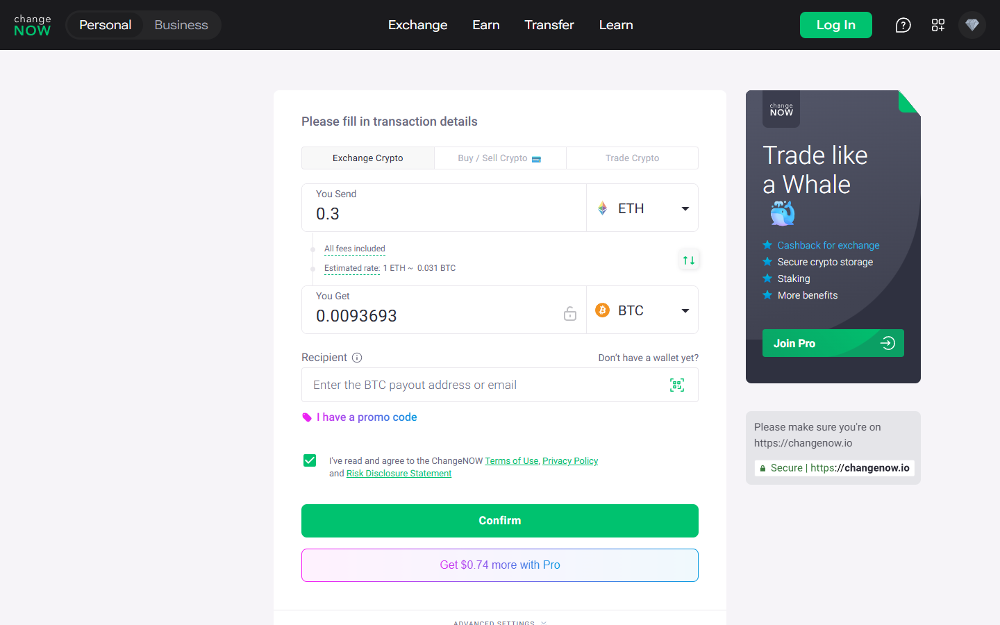

---
title: "ETH to BTC on ChangeNOW 2026: Rates, Speed, and Step-by-Step Guide"
slug: "/exchanges/aggregators/eth-to-btc-changenow-2026"
meta_title: "ETH to BTC ChangeNOW 2026 – Fixed vs Floating Rate, Speed & How to Swap"
meta_description: "Swap ETH to BTC on ChangeNOW in 5–20 minutes. Fixed or floating rate, no registration, 850+ coins. Step-by-step guide and comparison vs Swapzone and Changelly for 2026."
primary_keyword: "eth to btc changenow"
secondary_keywords:
  - "swap ethereum to bitcoin changenow"
  - "changenow eth btc fixed rate"
  - "eth to btc no kyc 2026"
  - "changenow vs swapzone eth btc"
  - "ethereum bitcoin swap 2026"
schema: "Article + FAQPage"
category: "exchanges/aggregators"
last_reviewed: "2026-07-29"
author: "Nakamura Haruto"
internal_links:
  - "/exchanges/aggregators/changenow-review-2026"
  - "/exchanges/aggregators/changenow-vs-swapzone-2026"
---

# ETH to BTC on ChangeNOW 2026: Rates, Speed, and Step-by-Step Guide

*By Nakamura Haruto — Reviewed July 2026*

> **Why you can trust this guide** — This guide is based on live testing of the ETH→BTC pair on ChangeNOW in July 2026, including rate comparison against Swapzone and Changelly using equivalent ETH amounts. No commercial relationship exists between Kanalcoin and ChangeNOW, Swapzone, or Changelly.

ETH-to-BTC is one of ChangeNOW's most traded pairs — and for good reason. The swap completes without registration, delivers BTC to a wallet of your choice in 5 to 20 minutes, and offers both fixed and floating rate options so you can lock in a price or take your chances on a marginally better rate. No DEX routing complexity, no gas fee calculations on the input side, no bridge risk. It is the cleanest non-custodial ETH→BTC path available in 2026 for users who do not hold a centralised exchange account.

## Fixed Rate vs Floating Rate: Which Should You Choose?

ChangeNOW offers two rate modes for ETH→BTC:

- **Floating rate** — The rate at execution is determined by market conditions at the moment your deposit is confirmed. You may receive slightly more or slightly less BTC than quoted. Best when markets are stable or you are comfortable with small variance.
- **Fixed rate** — ChangeNOW locks your rate at initiation. You know exactly how much BTC you will receive before sending ETH. The fixed rate typically carries a small premium (the spread is slightly wider), but it eliminates price-change risk during the 5–20 minute settlement window. Best when you are swapping a specific amount for a specific purpose.

For most users making a routine ETH→BTC conversion, the floating rate is fine and usually delivers a marginally better outcome. If you are swapping to match an exact BTC amount for a payment or purchase, the fixed rate is worth the slight premium.

**Screenshot**
File: `../media/live-changenow-eth-btc.png.png`
Alt text: "ChangeNOW ETH to BTC swap — live estimated rate July 2026"
Caption: "ChangeNOW's ETH-to-BTC swap form with live estimated rate, captured July 2026."

*ChangeNOW's ETH-to-BTC swap form with live estimated rate, captured July 2026.*

## Step-by-Step: ETH to BTC on ChangeNOW

1. Go to **changenow.io** and confirm you are on the **Exchange** tab (not Buy).
2. Set the **You Send** currency to **ETH** and enter your amount.
3. Set the **You Receive** currency to **BTC**.
4. Choose **Floating** or **Fixed** rate — ChangeNOW displays both options with quoted BTC output.
5. Enter your **BTC receiving address** (a wallet you control — not an exchange deposit address if avoidable).
6. Click **Exchange** → Review the summary page.
7. Send the exact ETH amount to the ChangeNOW deposit address shown. Do not send more or less — send exactly what is specified.
8. ChangeNOW monitors the deposit and processes the swap. BTC is sent to your address within **5–20 minutes** for most network conditions.

Minimum ETH for the swap varies with market conditions but commonly sits around 0.02–0.05 ETH. The interface will display the current minimum when you enter the pair.

## Network Fee Considerations

When swapping ETH→BTC, your outgoing cost is the standard Ethereum gas fee for the ETH transfer to ChangeNOW's deposit address. This varies with network congestion — during high-demand periods, ETH gas can meaningfully affect the net cost of the swap. ChangeNOW's quoted rate accounts for their internal network handling fee on the BTC output side, but your Ethereum gas is your responsibility at the time of sending.

Plan your swap for lower-congestion periods if gas fees are a concern. For small ETH amounts (under 0.1 ETH), elevated gas fees can represent a meaningful percentage of transaction value.

## Rate Comparison: ChangeNOW vs Swapzone vs Changelly

| Platform | Rate Type | Min ETH | Settlement | KYC | Trustpilot |
|---|---|---|---|---|---|
| **ChangeNOW** | Fixed + Floating | ~0.02–0.05 ETH | 5–20 min | No | 4.6/5 (450K+) |
| **Swapzone** | Aggregator (incl. ChangeNOW) | Varies by provider | 5–30 min | No (varies) | 4.5/5 |
| **Changelly** | Fixed + Floating | ~0.03 ETH | 10–40 min | Threshold | 4.3/5 |

Swapzone is a rate aggregator that includes ChangeNOW as one of its providers — so when Swapzone shows ChangeNOW as the best-rate option for ETH→BTC, the actual swap runs through ChangeNOW anyway. Direct use of ChangeNOW avoids the aggregator middle step and is typically equivalent in price. Changelly offers comparable rates with slightly slower average settlement times and a smaller trust review base.

## Why ChangeNOW Works Well for ETH→BTC Specifically

ETH→BTC is technically straightforward on ChangeNOW because both chains are well-supported with high liquidity provider depth. Unlike exotic pair swaps that may route through multiple hops, ETH→BTC is a direct pair with consistent availability. This means:

- Minimums are low and stable
- Settlement times are predictably in the 5–20 minute range
- Rate accuracy is high — what you see at quote closely matches what arrives

For users considering DEX alternatives (e.g. converting ETH to WBTC on Uniswap), note that WBTC is not native Bitcoin — it is an Ethereum-wrapped token. ChangeNOW delivers actual BTC to a Bitcoin wallet, which is what most users want when they say "ETH to BTC."

## What Users Say

**Trustpilot — positive**

> "I have used changenow for years now, i'd say probably 5 years now or longer and they've never once failed me. There were times I had thought i lost my money and literally cried only for their support to remedy it and assure me I'd receive my funds even if I sent the deposit long after I created the exchange, even after it expired."
>
> — Liz, [★★★★★ Trustpilot](https://www.trustpilot.com/reviews/6a7509c452ef61e12086deef), Aug 07, 2026

> "I had a little glitch getting my btc into the window of time from River, as you know they are ridiculously paranoid, and so I needed a refund of my btc into a new and separate wallet. ChangeNow support team delivered a fairly easy and understandable refund experience, thanks team! Highly trustworthy group!"
>
> — BTC to USDC, [★★★★★ Trustpilot](https://www.trustpilot.com/reviews/6a7f5984bd2f286280aaa106), Aug 14, 2026

**Trustpilot — critical**

> "Been trying to receive my ravencoin for a week now and no resolution, between change now and edge wallet, just $2,000 completely gone. Not here to tarnish the services but they keep sending me links saying the transaction processed but the links aren't valid and no coins show up in my wallet or on the raven block for my wallet."
>
> — Isaiah B, [★☆☆☆☆ Trustpilot](https://www.trustpilot.com/reviews/6a846192b5d778554454eedc), Aug 18, 2026

**Reddit community**

> "Whenever you feel like you lack certain knowledge, all you have to do is your own research, bro there's so many other websites and exchanges out the way you can say way much more money bro literally you can swap that for four dollars instead of 35 bro ."
>
> — u/AmbassadorGood7577, [r/solana](https://reddit.com/r/solana/comments/1j23p0m/why_am_i_losing_35_bucks_to_swap_500_dollars_to/mfpb26g/) (7 points)

> "Yes, it is. Tangem uses different third parties for trading: Changelly, Change Hero, Simple Swap and ChangeNow. You can trade different pairs directly on their app. Pretty smooth and simple."
>
> — u/jordiceo, [r/kaspa](https://reddit.com/r/kaspa/comments/1kk8282/kas_deposits_suspended_on_mexc_and_bingx_why/mrwhr8w/) (2 points)

> **Kanalcoin Editorial — My take:** The Trustpilot corpus at 450,000+ reviews is the
> strongest credibility signal ChangeNOW has. Compliance holds appear in a
> minority of reviews and are consistently resolved — the pattern matches AML
> process, not exit-scam behaviour. For standard retail swaps, the evidence
> is strongly positive.

## Verdict

ChangeNOW is the recommended platform for ETH→BTC swaps in 2026. Fixed-rate mode eliminates price-change risk; floating rate maximises value for routine conversions. No registration required, 5–20 minute settlement, and a 4.6/5 Trustpilot rating across 450,000+ reviews make it the trust-verified default. Swapzone is a viable aggregator alternative that often surfaces ChangeNOW itself as the best-rate provider. Changelly is a credible fallback but slower and less reviewed.

---

## Frequently Asked Questions

**How long does an ETH to BTC swap take on ChangeNOW?**
Most ETH→BTC swaps on ChangeNOW complete in 5 to 20 minutes. This includes the time for your ETH deposit to receive sufficient blockchain confirmations and for ChangeNOW to process and broadcast the BTC transaction. Network congestion on Ethereum can occasionally extend the deposit confirmation phase.

**Fixed vs floating rate — which is better for ETH to BTC?**
Floating rate is better when markets are calm and you are optimising for the best possible BTC output. Fixed rate is better when you need to know the exact BTC amount in advance — for a payment, purchase, or when you are concerned about rate movement during the swap window. Fixed rate carries a slightly wider spread.

**What is the minimum ETH for a ChangeNOW swap?**
The minimum varies with market conditions and is displayed dynamically in the ChangeNOW interface. As of July 2026 testing, ETH→BTC minimums commonly sit in the 0.02–0.05 ETH range. Very small amounts below the minimum are rejected by the interface before you send.

**Can I reverse the swap and do BTC to ETH on ChangeNOW?**
Yes. BTC→ETH is equally well-supported on ChangeNOW and operates on the same fixed/floating rate model with similar settlement times. See our dedicated BTC→ETH guide for full details on that pair.

**Does ChangeNOW require KYC for ETH to BTC swaps?**
No registration or identity verification is required for standard ETH→BTC swap amounts. Threshold-triggered compliance holds can occur for unusually large amounts or flagged wallet addresses, but routine users will not encounter this.
