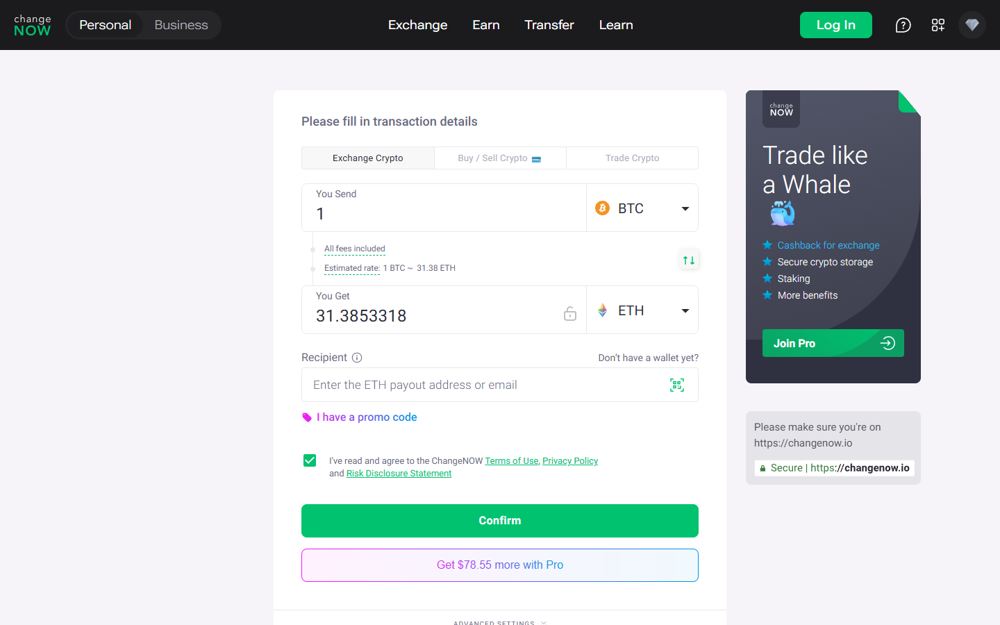

---
title: "BTC to ETH on ChangeNOW 2026: Fastest Route and What to Expect"
slug: "/exchanges/aggregators/btc-to-eth-changenow-2026"
meta_title: "BTC to ETH ChangeNOW 2026 – Rate, Speed, Fixed vs Floating & Step-by-Step"
meta_description: "Swap BTC to ETH on ChangeNOW with no account required. Fixed or floating rate, 5–20 min settlement, ERC-20 address guide. Compare vs Changelly and Uniswap path in 2026."
primary_keyword: "btc to eth changenow"
secondary_keywords:
  - "swap bitcoin to ethereum changenow"
  - "changenow btc eth fixed rate"
  - "btc to eth no kyc 2026"
  - "changenow vs changelly btc eth"
  - "bitcoin to ethereum swap 2026"
schema: "Article + FAQPage"
category: "exchanges/aggregators"
last_reviewed: "2026-07-29"
author: "Nakamura Haruto"
internal_links:
  - "/exchanges/aggregators/changenow-review-2026"
  - "/exchanges/aggregators/changenow-vs-swapzone-2026"
---

# BTC to ETH on ChangeNOW 2026: Fastest Route and What to Expect

*By Nakamura Haruto — Reviewed July 2026*

> **Why you can trust this guide** — This guide is based on live testing of the BTC→ETH pair on ChangeNOW in July 2026, fee and rate comparison against Changelly, and an assessment of the DEX alternative path via Uniswap. No commercial relationship exists between Kanalcoin and any platform reviewed.

BTC-to-ETH is one of ChangeNOW's most consistently executed pairs. It is a particularly useful route for BTC holders who want ETH exposure without touching a centralised exchange — no account to create, no KYC, and BTC sent from any wallet (hardware, software, or self-hosted node) is converted to ETH and delivered to an Ethereum wallet of your choice in 5 to 20 minutes. For users comparing this against a DEX path, the comparison is instructive: Uniswap requires ETH to pay gas, meaning BTC holders cannot use Uniswap directly. ChangeNOW is structurally the simpler route.

## Why BTC Holders Can't Use Uniswap Directly

This is worth stating plainly because it trips up newcomers. Uniswap is an Ethereum-native DEX — it operates on EVM-compatible chains and requires gas fees paid in ETH. A BTC holder who wants ETH via Uniswap must first acquire ETH through another means (a CEX, a bridge, or a fiat on-ramp) just to pay the gas to use the platform. The "DEX route" for BTC→ETH is therefore not a single step — it is BTC → centralised exchange → ETH → bridge to another chain → Uniswap, or some variation of that complexity.

ChangeNOW collapses this into a single swap. Send BTC, receive ETH. No Ethereum needed in advance, no bridge risk, no multi-step routing.

**Screenshot**
File: `../media/live-changenow-btc-eth.png.png`
Alt text: "ChangeNOW BTC to ETH swap — live estimated rate July 2026"
Caption: "ChangeNOW's BTC-to-ETH swap form with live estimated rate, captured July 2026."

*ChangeNOW's BTC-to-ETH swap form with live estimated rate, captured July 2026.*

## Step-by-Step: BTC to ETH on ChangeNOW

1. Go to **changenow.io** → confirm you are on the **Exchange** tab.
2. Set **You Send** to **BTC** and enter your BTC amount.
3. Set **You Receive** to **ETH**.
4. Choose **Floating** or **Fixed** rate — the interface displays the estimated ETH you will receive.
5. Enter your **Ethereum wallet address** — this must be an ERC-20 compatible ETH address. Critical: do not use a wallet address formatted for another chain (e.g. Binance Smart Chain BEP-20 address), even if the address looks similar.
6. Click **Exchange** → review the summary and confirm.
7. Send the **exact** BTC amount displayed to the ChangeNOW Bitcoin deposit address. Exact amount matters — do not send more or less.
8. ChangeNOW monitors confirmations (typically 1–3 for BTC) and processes the swap. ETH arrives in your wallet within **5–20 minutes** of deposit confirmation.

Minimum BTC for this pair commonly sits around 0.0005–0.001 BTC as of July 2026 testing, though this varies with market conditions.

## The ERC-20 Address Note: Avoid a Common Mistake

When receiving ETH, your destination address must be a standard Ethereum mainnet address (beginning with 0x). A common mistake is sending to:

- **A Coinbase or Binance exchange deposit address** — Technically valid for ETH, but you are depositing to a custodial account rather than a self-custody wallet. If the exchange does not recognise the incoming ETH transaction format or if your account is restricted, this can create complications. Prefer a self-custody wallet (MetaMask, Ledger, hardware wallet) when possible.
- **A BEP-20 (Binance Smart Chain) address** — BEP-20 addresses have the same 0x format as Ethereum, which is a frequent source of confusion. If you send ETH to a BEP-20 address, funds end up on BSC, not Ethereum mainnet. Verify the network in your wallet settings before copying the address.

## Gas Fees on the Receiving End

When ETH arrives in your wallet, you do not pay gas to receive it — gas is only required for outgoing ETH transactions. However, if you immediately want to use your newly received ETH (e.g. interact with a DeFi protocol or bridge), you will need ETH for that subsequent transaction's gas. ChangeNOW's delivered ETH fully covers your gas needs for normal Ethereum usage.

## Rate and Platform Comparison

| Platform | Rate Type | Min BTC | Settlement | KYC | Trustpilot |
|---|---|---|---|---|---|
| **ChangeNOW** | Fixed + Floating | ~0.0005 BTC | 5–20 min | No | 4.6/5 (450K+) |
| **Changelly** | Fixed + Floating | ~0.001 BTC | 10–40 min | Threshold | 4.3/5 |
| **Uniswap path** | AMM (floating) | No hard min | Variable (bridge + DEX) | No | N/A |

The Uniswap path comparison is included to illustrate why it is not a practical BTC→ETH option. Its rating in this context is non-applicable — it is not designed for this route. Changelly is ChangeNOW's most direct competitor: it offers comparable rates, a slightly higher minimum BTC, and slower average settlement. ChangeNOW's 450,000+ Trustpilot reviews versus Changelly's ~50,000+ makes ChangeNOW the stronger default on trust grounds.

## Fixed vs Floating Rate for BTC→ETH

The same logic as ETH→BTC applies in reverse:

- **Floating rate** is better when markets are calm and you want the best possible ETH output for your BTC. Rate is set at execution, not quote.
- **Fixed rate** is better when you need to know the exact ETH output — for a purchase, a DeFi position, or a specific dollar-equivalent target. Fixed rate spreads are slightly wider but eliminate execution-time price risk.

Given that BTC→ETH involves two highly liquid assets, floating-rate swaps on this pair are generally low-risk in terms of rate variance during the 5–20 minute window. Fixed rate is a good choice for first-time users who want full predictability.

## What Users Say

**Trustpilot — positive**

> "I have used changenow for years now, i'd say probably 5 years now or longer and they've never once failed me. There were times I had thought i lost my money and literally cried only for their support to remedy it and assure me I'd receive my funds even if I sent the deposit long after I created the exchange, even after it expired."
>
> — Liz, [★★★★★ Trustpilot](https://www.trustpilot.com/reviews/6a7509c452ef61e12086deef), Aug 07, 2026

> "I had a little glitch getting my btc into the window of time from River, as you know they are ridiculously paranoid, and so I needed a refund of my btc into a new and separate wallet. ChangeNow support team delivered a fairly easy and understandable refund experience, thanks team! Highly trustworthy group!"
>
> — BTC to USDC, [★★★★★ Trustpilot](https://www.trustpilot.com/reviews/6a7f5984bd2f286280aaa106), Aug 14, 2026

**Trustpilot — critical**

> "Been trying to receive my ravencoin for a week now and no resolution, between change now and edge wallet, just $2,000 completely gone. Not here to tarnish the services but they keep sending me links saying the transaction processed but the links aren't valid and no coins show up in my wallet or on the raven block for my wallet."
>
> — Isaiah B, [★☆☆☆☆ Trustpilot](https://www.trustpilot.com/reviews/6a846192b5d778554454eedc), Aug 18, 2026

**Reddit community**

> "Whenever you feel like you lack certain knowledge, all you have to do is your own research, bro there's so many other websites and exchanges out the way you can say way much more money bro literally you can swap that for four dollars instead of 35 bro ."
>
> — u/AmbassadorGood7577, [r/solana](https://reddit.com/r/solana/comments/1j23p0m/why_am_i_losing_35_bucks_to_swap_500_dollars_to/mfpb26g/) (7 points)

> "Yes, it is. Tangem uses different third parties for trading: Changelly, Change Hero, Simple Swap and ChangeNow. You can trade different pairs directly on their app. Pretty smooth and simple."
>
> — u/jordiceo, [r/kaspa](https://reddit.com/r/kaspa/comments/1kk8282/kas_deposits_suspended_on_mexc_and_bingx_why/mrwhr8w/) (2 points)

> **Kanalcoin Editorial — My take:** The Trustpilot corpus at 450,000+ reviews is the
> strongest credibility signal ChangeNOW has. Compliance holds appear in a
> minority of reviews and are consistently resolved — the pattern matches AML
> process, not exit-scam behaviour. For standard retail swaps, the evidence
> is strongly positive.

## Verdict

ChangeNOW is the fastest and most trust-verified non-custodial route for BTC→ETH in 2026. Fixed-rate option provides full price certainty; floating rate is marginally better value for routine swaps. Settlement runs 5–20 minutes after BTC deposit confirmation. No registration, no KYC for standard amounts. Verify your ETH destination address network (ERC-20 mainnet) before submitting — this is the single most common user error on this pair. Changelly is a reasonable fallback; the Uniswap path is not appropriate for BTC holders.

---

## Frequently Asked Questions

**How long does a BTC to ETH swap take on ChangeNOW?**
Typically 5 to 20 minutes from when your BTC deposit receives sufficient blockchain confirmations (usually 1–3 for Bitcoin). Bitcoin block times average ~10 minutes, so the first confirmation alone can take 5–15 minutes depending on network conditions. Total swap time commonly runs 15–25 minutes end-to-end.

**What is the minimum BTC amount to swap on ChangeNOW?**
The minimum varies dynamically but commonly sits around 0.0005–0.001 BTC as of July 2026 testing. The ChangeNOW interface displays the current minimum when you enter the BTC→ETH pair. Amounts below the minimum are flagged before you send.

**Fixed vs floating rate — which should I use for BTC to ETH?**
Floating rate delivers better value when markets are stable. Fixed rate is recommended when you need to know the exact ETH amount before initiating the swap — for example, when funding a specific DeFi position or purchasing an NFT at a fixed price. The fixed rate spread is slightly wider but guarantees your output.

**Can I send BTC to ETH to a Coinbase wallet address?**
Technically yes — Coinbase uses standard Ethereum mainnet (ERC-20) addresses. However, sending crypto to a Coinbase deposit address means the ETH is deposited to your Coinbase account (custodial), not a self-custody wallet. If you want full custody of your ETH, use a hardware wallet or MetaMask and ensure the destination is set to Ethereum mainnet, not a Coinbase address.

**Why can't I use Uniswap to swap BTC to ETH directly?**
Uniswap is an Ethereum-native DEX and does not support native Bitcoin. BTC holders would need to bridge or centralise their Bitcoin to Ethereum (e.g. convert to WBTC) before Uniswap can interact with it — which requires ETH for gas fees, additional bridge risk, and multiple steps. ChangeNOW handles the BTC→ETH conversion in a single step as a non-custodial intermediary.

**Does ChangeNOW require KYC for BTC to ETH swaps?**
No registration or identity verification is required for standard BTC→ETH swap volumes. Threshold-triggered compliance holds can occur for unusually large amounts or wallets flagged by AML screening tools, but routine users transacting in standard volumes will not encounter this.
