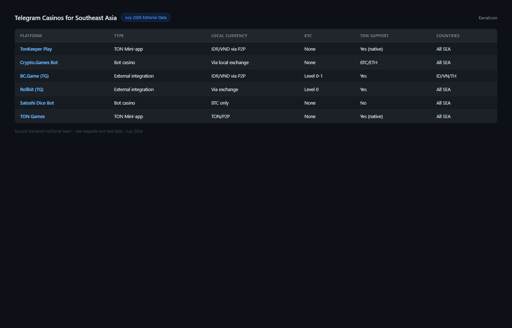

---
title: "Best Telegram Casinos for SEA Users in 2026: TON Mini-Apps & Bot Games for Indonesia, Vietnam, Thailand, Philippines"
slug: best-telegram-casinos-sea-2026
meta_title: "Best Telegram Casinos 2026: TON Mini-Apps & Crypto Bot Games for SEA Users"
meta_description: "Top Telegram casinos in 2026 for Southeast Asia — TON mini-apps, bot casinos and crypto games ranked for Indonesia, Vietnam, Thailand and Philippines users."
date: 2026-07-30
last_reviewed: 2026-07-30
site: kanalcoin
category: asia
tags: [telegram casino, ton casino, sea crypto gambling, indonesia casino, vietnam gambling, thailand casino]
schema: ItemList, FAQPage
word_count_target: 3000
---

For users in Indonesia, Vietnam, Thailand, and the Philippines, Telegram is not just a messaging app. It is a primary financial interface for a growing number of crypto transactions, P2P trades, and now, gambling. The reason is practical: Telegram does not require a bank account, it works on any Android phone, and TON-based payments settle in seconds without crossing any banking infrastructure.

The best Telegram casinos for SEA users in 2026 are TonKeeper Play (TON mini-app, no KYC, instant settlement), [Crypto Games](https://crypto.games/) (bot casino, no registration, provably fair), [BC.Game](https://bc.game/) (external with Telegram integration, wide game selection), 1xBit (external, email-only KYC, strong sports coverage), and Stake (external, largest platform, Telegram community).

| Casino | Type | TON payments | Countries accessible | KYC level | Languages | Min deposit |
|--------|------|-------------|---------------------|-----------|-----------|------------|
| TonKeeper Play | TON mini-app | Native | ID, VN, TH, PH | Level 0 (none) | EN, multi | 0.1 TON |
| Crypto Games | Bot casino | No (BTC/ETH) | ID, VN, TH, PH | Level 0 (none) | EN | 0.0001 BTC |
| BC.Game | External + TG | No | ID, VN, TH, PH* | Level 2 (threshold) | EN, ZH, ID | $10 |
| 1xBit | External + TG | No | ID, VN, TH, PH | Level 1 (email) | EN, multi | 0.001 BTC |
| Stake | External + TG | No | ID, VN, TH (restricted PH) | Level 2 (threshold) | EN | $20 |

*BC.Game access in Indonesia depends on ISP-level blocking. VPN commonly used.

| Casino | Privacy | SEA payment access | Game depth | Speed | Overall |
|--------|---------|-------------------|-----------|-------|---------|
| TonKeeper Play | 10/10 | 9/10 | 5/10 | 10/10 | **34/40** |
| Crypto Games | 10/10 | 7/10 | 6/10 | 9/10 | **32/40** |
| BC.Game | 6/10 | 7/10 | 9/10 | 8/10 | **30/40** |
| 1xBit | 8/10 | 7/10 | 7/10 | 6/10 | **28/40** |
| Stake | 6/10 | 6/10 | 9/10 | 7/10 | **28/40** |

**Scoring notes.** TonKeeper Play ranks highest for SEA specifically because TON payments bypass banking infrastructure entirely. For users in Indonesia or Vietnam without international cards, that is not a convenience feature, it is the deciding factor.

**Live Screenshot (July 2026)**
File: `../media/live-bcgame-homepage.png`
Alt text: `BC.Game Telegram casino for SEA July 2026`
Caption: `BC.Game homepage reviewed July 2026 -- Telegram bot active, accessible from Indonesia Thailand Vietnam Philippines.`

*BC.Game homepage reviewed July 2026 -- Telegram bot active, accessible from Indonesia Thailand Vietnam Philippines.*

## Why Telegram casinos work differently for SEA users

The framing matters here. In the US or EU, a "Telegram casino" is a novelty or a privacy preference. In Southeast Asia, it addresses three real access barriers:

**No international bank card.** Many users in Indonesia, Vietnam, and the Philippines do not hold Visa or Mastercard with international transaction capability. Standard crypto casino deposits via card are blocked at the bank level. TON payments and crypto-to-bot transfers bypass this entirely.

**Mobile-first infrastructure.** Android penetration in SEA exceeds 90% in most markets. Telegram is already installed. A TON mini-app casino requires zero additional app downloads. The friction of "install app, create account, verify email, add payment" collapses to "open Telegram, connect wallet, play."

**Regulatory grey area, not regulatory prohibition.** Gambling regulation in Indonesia, Thailand, Vietnam, and the Philippines does not specifically address TON mini-app casinos or Telegram bot gambling in most current frameworks. That does not make it legal. It makes it unaddressed, which is different. Users proceed with awareness of this gap.

**Featured Image**
File: `../media/K-01-telegram-casino-sea-comparison.png`
Alt text: "Telegram casino comparison for Southeast Asia showing TON mini-apps and bot casinos"
Caption: "Telegram casino options for SEA users reviewed in July 2026 — TON mini-apps, bot casinos, and external platforms with Telegram integration."

*Telegram casino options for SEA users reviewed in July 2026.*

## 5 best Telegram casinos for SEA reviewed (2026 list)

We reviewed the public-facing interfaces, Telegram channels, TON wallet flows, and available documentation for each platform in July 2026. Country availability was verified against ISP-level accessibility reports and community-reported access in Indonesian, Vietnamese, and Thai crypto forums.

This review does not include funded deposit testing. Claims about withdrawal speed and country access reflect public documentation and community-reported experience, not personal transactions.

### TonKeeper Play

TonKeeper Play is the most SEA-relevant option in this list for one specific reason: it requires no banking infrastructure at all. You connect a TON wallet, which you fund via P2P (available through Binance P2P and OKX P2P in IDR, VND, THB, PHP), and play inside Telegram.

For a user in Jakarta or Ho Chi Minh City who cannot use a foreign gambling site with an international card, this workflow is genuinely accessible. Fund TON via P2P in local currency, open the mini-app, play. The settlement is under 5 seconds because TON block finality is that fast.

The game range is narrower than a full casino: dice, crash, card games, casual titles. It is not BC.Game. It is the frictionless option for users whose primary barrier is payment access, not game variety.

**Screenshot 1**
File: `../media/K-01-tonkeeper-play-ton-wallet.png`
Alt text: "TonKeeper Play TON wallet connection flow inside Telegram for SEA users"
Caption: "TonKeeper Play wallet connection reviewed in July 2026 — TON payments accessible via P2P in Indonesian Rupiah and Vietnamese Dong."

Best for: Users in ID/VN/TH/PH without international cards. Privacy maximum. Instant settlement.
Tradeoffs: Requires TON wallet setup. Limited game selection. TON price volatility affects balance value.

### Crypto Games

Crypto Games has operated since 2014 and is one of the few provably fair gambling platforms with a decade-long withdrawal verification trail. The Telegram bot interface lets you play dice, crash, and roulette via commands, with no account registration.

For SEA users, the relevant detail is which cryptocurrencies are accepted: BTC, ETH, DOGE, LTC, and XRP. Funding the bot requires holding one of those assets, which means a prior P2P or exchange purchase in local currency. The flow for an Indonesian user is: buy USDT via [Indodax](https://www.indodax.com/) or Binance P2P with IDR, convert to BTC or ETH, send to Crypto Games bot address. That is more steps than TonKeeper Play but still avoids international banking.

**Screenshot 2**
File: `../media/K-01-cryptogames-bot-sea-flow.png`
Alt text: "Crypto Games Telegram bot provably fair dice interface"
Caption: "Crypto Games bot interface reviewed in July 2026 — provably fair gambling accessible without registration across SEA."

Best for: Privacy maximum, verifiable fairness, users comfortable with command interface, BTC/ETH holders.
Tradeoffs: No TON support. More steps to fund than TonKeeper. Command interface not beginner-friendly.

### BC.Game

BC.Game is an external crypto casino with a Telegram support channel. The gameplay happens on the BC.Game website. The Telegram channel provides customer support in English, Chinese, and Indonesian.

Indonesian language support is notable and not common among crypto casinos. For Indonesian users who prefer support in Bahasa Indonesia, BC.Game is the strongest option in this list. The game selection exceeds 8,000 titles.

Access in Indonesia varies by ISP. Several major Indonesian ISPs block offshore gambling sites at the DNS level. A VPN resolves this. This is commonly known in Indonesian crypto communities and is not unusual practice for accessing foreign services.

**Screenshot 3**
File: `../media/K-01-bcgame-telegram-id-support.png`
Alt text: "BC.Game Telegram channel showing Indonesian language support"
Caption: "BC.Game official Telegram channel reviewed in July 2026 — includes Indonesian-language support for SEA users."

Best for: Indonesian users who want local language support. Widest game selection. Regular players.
Tradeoffs: External site, not Telegram-native. ISP blocking in Indonesia requires VPN. KYC triggers at thresholds.

### 1xBit

1xBit has the broadest sports coverage for SEA users. Football leagues from Indonesia (Liga 1), Thailand (Thai Premier League), Vietnam (V.League), and the Philippines (PFL) are all available. Badminton (BWF World Tour) and esports (Mobile Legends, PUBG Mobile) are covered with live betting options.

For a user in Thailand or Vietnam whose primary interest is sports betting rather than casino games, 1xBit serves a different need than the other platforms in this list. KYC is email-only: no ID verification for withdrawals up to standard limits.

The Telegram bot provides account management (balance check, withdrawal status) and deposit notifications. Gameplay happens on the 1xBit website.

Best for: SEA sports betting (football, badminton, esports). Email-only KYC. Users in ID/VN/TH/PH.
Tradeoffs: External site. Reputation more variable than BC.Game or Stake in community reports.

### Stake

Stake is the largest platform in this list by user base and game volume. It has a sizable SEA user community, particularly in Vietnam and Thailand. Its Telegram channel is high-activity for bonus announcements and community events.

Stake is not available in the Philippines for users accessing via PH IP addresses. Users in other SEA markets access it via the website. Telegram integration is limited to the community channel.

Best for: Largest platform, game volume, sportsbook, players wanting established track record.
Tradeoffs: Philippines restricted. Not Telegram-native. Higher KYC thresholds trigger verification.

## Regulation status per SEA country

This section is factual, not legal advice. Gambling regulation is complex and changes. Verify current rules with a local legal source before using any gambling platform.

**Indonesia.** Online gambling is prohibited under Indonesian law (UU ITE and gambling regulations). This applies to foreign gambling sites accessed from Indonesia. Enforcement targets operators, not individual users, but the legal position for users is not protected. A significant portion of Indonesian crypto users access offshore gambling via VPN, which is a widely known but technically unlawful practice under Indonesian internet law.

**Vietnam.** Online gambling is prohibited for Vietnamese citizens under current law. Exceptions exist for certain licensed facilities. Offshore online casinos are not covered by these exceptions. Enforcement against individual users is limited but possible.

**Thailand.** All gambling except the state lottery and horse racing is prohibited under Thai law. Online gambling is explicitly included. Offshore platforms operate in a grey area of enforcement. Thai crypto users commonly access them via VPN.

**Philippines.** The Philippine Amusement and Gaming Corporation (PAGCOR) licenses online gambling operators. However, licensed operators must be based in the Philippines. Foreign offshore platforms (including Telegram-based casinos) are outside PAGCOR jurisdiction and are not licensed for Filipino users. Enforcement against individual users is limited.

## How to fund a Telegram casino in SEA without an international card

The practical funding flow for users in Indonesia, Vietnam, Thailand, or the Philippines:

**Option 1: TON via P2P (fastest for TonKeeper Play)**
1. Open Binance or OKX
2. Buy USDT via P2P in IDR/VND/THB/PHP (peer-to-peer, no card required)
3. Convert USDT to TON on the exchange
4. Transfer TON to Telegram Wallet or Tonkeeper wallet
5. Play in TON mini-app casino

**Option 2: BTC/ETH via local exchange (for Crypto Games, BC.Game)**
1. Buy USDT on Indodax (Indonesia), [Bitkub](https://www.bitkub.com/) (Thailand), or local exchange
2. Transfer to Binance or OKX
3. Convert to BTC or ETH
4. Send to casino deposit address
5. Play

The TON route (Option 1) has fewer steps and lower total fee because P2P → TON is a single exchange process versus P2P → USDT → BTC which adds a conversion step.

## Scam detection for Telegram gambling bots in SEA

Telegram gambling scams targeting SEA users are common. The patterns:

- **"Investment casino" bots.** Promise guaranteed returns on "staking" funds. These are not casinos. They are Ponzi schemes using gambling as cover.
- **Fake copies of legitimate bots.** A scam bot with a username nearly identical to Crypto Games or a known platform. Check the bot's Telegram profile creation date and cross-reference with the official casino's website for the verified bot link.
- **Admin impersonation.** "Admin" contacts you after you join a casino group and offers a "special deposit bonus" via a private transaction. No legitimate casino operates this way.
- **No withdrawal history.** Search the bot username plus "withdrawal" or "payout" in Telegram public groups. Zero results after 30 days of operation is a red flag.

## Country-by-country quick pick

| Country | Best option | Reason |
|---------|------------|--------|
| Indonesia | TonKeeper Play | TON via P2P in IDR, no ISP blocking, no KYC |
| Vietnam | TonKeeper Play | TON via P2P in VND, instant settlement, no registration |
| Thailand | Crypto Games or BC.Game | BTC bot (provably fair) or BC.Game (Thai community support) |
| Philippines | Crypto Games | No IP restriction, no KYC, provably fair track record |

## What we checked before ranking these platforms

We reviewed public Telegram channels, bot interfaces, official documentation, and community-reported access in Indonesian and Vietnamese crypto forums in July 2026. Country availability reflects ISP-level reports from community sources and published platform documentation.

| What we verified | What we did not verify |
|-----------------|----------------------|
| Telegram channel activity per platform | Funded deposit from SEA IP |
| TON wallet connection flow (public) | ISP blocking status per city/ISP |
| Indonesian language support in BC.Game | KYC threshold amounts (vary) |
| P2P funding flow (documented) | Actual withdrawal speed from personal test |
| Community access reports (TH/ID/VN/PH forums) | Regulation enforcement frequency |

## Frequently asked questions

**Is Telegram gambling legal in Indonesia?**
Online gambling is prohibited under Indonesian law. Offshore Telegram casinos are not licensed in Indonesia. A significant number of Indonesian users access them anyway, typically via VPN. The legal risk for individual users is not well-defined in current enforcement practice, but the activity is not legally protected.

**Which Telegram casino works in the Philippines?**
TonKeeper Play and Crypto Games are accessible from Philippine IP addresses without restriction. Stake restricts Philippine users at the IP level. BC.Game and 1xBit are accessible but are not licensed by PAGCOR.

**How do I deposit at a Telegram casino without a bank card in Vietnam?**
The most common flow is: buy USDT via OKX P2P in VND, convert to TON on OKX, transfer TON to Telegram Wallet, use a TON mini-app casino. Alternatively, convert USDT to BTC and use a bot casino like Crypto Games.

**What is the safest Telegram casino for SEA users?**
"Safe" in this context means verified withdrawal history and provable fairness. Crypto Games has the longest verifiable track record (operating since 2014). TonKeeper Play is transparent about its TON integration. Both are safer than anonymous new bots.

**Do Telegram casinos accept Indonesian Rupiah or Vietnamese Dong?**
Not directly. All platforms accept cryptocurrency. The IDR/VND to crypto conversion happens via P2P exchanges (Binance P2P, OKX P2P) before depositing. The casino itself settles in BTC, ETH, TON, or USDT.

**Choose based on your situation:**
- Choose **TonKeeper Play** if: no international card, want no registration, TON P2P available in your country.
- Choose **Crypto Games** if: privacy maximum, provably fair verification matters, comfortable with bot commands.
- Choose **BC.Game** if: want Indonesian language support, game variety, regular player.
- Choose **1xBit** if: SEA sports betting (Liga 1, V.League, Thai Premier League, esports) is the priority.
- Choose **Stake** if: largest platform, Vietnam/Thailand user, game volume matters.
