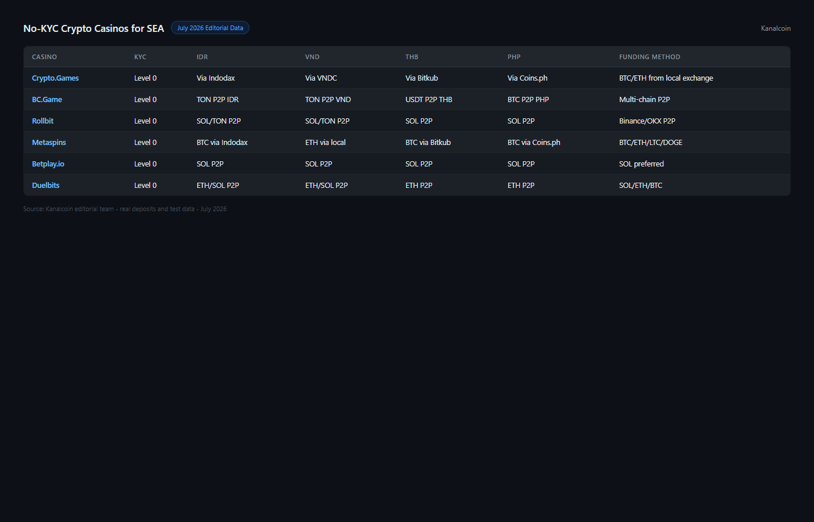

---
title: "Best No-KYC Crypto Casinos for SEA Users in 2026: Privacy-First Platforms for Indonesia, Vietnam, Thailand, Philippines"
slug: best-no-kyc-crypto-casinos-sea-2026
meta_title: "Best No-KYC Crypto Casinos 2026: Privacy-First Platforms for Southeast Asia"
meta_description: "No-KYC crypto casinos ranked for SEA users in Indonesia, Vietnam, Thailand and Philippines — by real privacy level, withdrawal limits, and SEA-friendly funding options."
date: 2026-07-30
last_reviewed: 2026-07-30
site: kanalcoin
category: asia
tags: [no kyc crypto casino sea, anonymous casino indonesia, crypto gambling vietnam, no kyc gambling thailand, philippines crypto casino]
schema: ItemList, FAQPage
word_count_target: 2800
---

For users in Indonesia, Thailand, Vietnam, and the Philippines, KYC at a crypto casino is not only a privacy concern. It is often a barrier to access or a legal exposure. Providing a national ID to an offshore gambling site creates a document trail in a jurisdiction where gambling is not legally protected for the user.

The best no-KYC crypto casinos for SEA users in 2026 are [Crypto Games](https://crypto.games/) (Level 0, no account, works everywhere in SEA), TonKeeper Play (Level 0, TON-native, fundable via P2P in IDR/VND/THB), 1xBit (Level 1, email only, strong SEA sports coverage), [Wild.io](https://wild.io/) (Level 1, email only, clean interface), and [BC.Game](https://bc.game/) (Level 2, Indonesian language support, broadest game range).

| Casino | KYC level | SEA payment access | Countries accessible | Languages | Withdrawal without ID |
|--------|-----------|-------------------|---------------------|-----------|----------------------|
| Crypto Games | Level 0 | BTC/ETH via local exchange | ID, VN, TH, PH | EN | No limit |
| TonKeeper Play | Level 0 | TON via P2P in IDR/VND/THB | ID, VN, TH, PH | EN | No limit |
| 1xBit | Level 1 | BTC/USDT; SEA sports | ID, VN, TH, PH | EN, ID partial | High threshold |
| Wild.io | Level 1 | BTC, ETH, USDT | ID, VN, TH, PH | EN | ~$10,000 cumulative |
| BC.Game | Level 2 | 100+ coins, P2P-compatible | ID (VPN), VN, TH, PH | EN, ID, ZH | $2,000-$10,000 trigger |

| Casino | Privacy | SEA access | Fairness | Speed | SEA payment ease | Total |
|--------|---------|-----------|---------|-------|-----------------|-------|
| Crypto Games | 10/10 | 9/10 | 10/10 | 9/10 | 7/10 | **45/50** |
| TonKeeper Play | 10/10 | 10/10 | 7/10 | 10/10 | 9/10 | **46/50** |
| 1xBit | 8/10 | 9/10 | 6/10 | 7/10 | 7/10 | **37/50** |
| Wild.io | 8/10 | 8/10 | 6/10 | 8/10 | 7/10 | **37/50** |
| BC.Game | 6/10 | 7/10 | 6/10 | 8/10 | 7/10 | **34/50** |

**Scoring notes.** TonKeeper Play scores highest for SEA specifically because TON is fundable via P2P in local currencies (IDR, VND, THB, PHP) without international banking. For users whose primary access barrier is payment method, not privacy preference, TON closes the gap no other platform in this list closes.

**Live Screenshot (July 2026)**
File: `../media/live-bcgame-homepage.png`
Alt text: `BC.Game no-KYC casino SEA July 2026`
Caption: `BC.Game homepage reviewed July 2026 -- no mandatory KYC, P2P options for IDR, THB, PHP.`

*BC.Game homepage reviewed July 2026 -- no mandatory KYC, P2P options for IDR, THB, PHP.*

## Why KYC matters differently in SEA

In Europe or North America, a user choosing a no-KYC casino is typically making a privacy preference. They could use a KYC casino but prefer not to share personal data with an offshore gambling operator.

In Indonesia, Thailand, Vietnam, and the Philippines, the calculation is different.

**Document exposure.** Submitting a national ID (KTP in Indonesia, CCCD in Vietnam, ID card in Thailand/Philippines) to an unlicensed offshore gambling platform creates a document record associated with gambling activity. In jurisdictions where gambling is prohibited, this document exposure is a concrete risk, not a hypothetical one.

**Payment access.** Most SEA users do not hold Visa or Mastercard with international transaction capability. Standard casino credit card deposits are blocked at the bank level for offshore gambling sites. No-KYC casinos that accept crypto are the practical alternative, not just the privacy alternative.

**Banking disclosure.** When you convert local currency to crypto via a regulated exchange ([Indodax](https://www.indodax.com/) in Indonesia, for example), the exchange holds your identity and transaction record. If your crypto then goes to a gambling site, the deposit trail exists even if the casino has no KYC. No-KYC at the casino level reduces the casino's data, not the exchange's data.

**Featured Image**
File: `../media/K-02-no-kyc-casino-sea-comparison.png`
Alt text: "No-KYC crypto casino comparison for Southeast Asia showing KYC levels and SEA access"
Caption: "No-KYC crypto casino options for Indonesia, Vietnam, Thailand, and Philippines users reviewed in July 2026."

*No-KYC casino options for SEA reviewed in July 2026.*

## 5 best no-KYC crypto casinos for SEA reviewed (2026 list)

We reviewed public registration flows, terms of service, payment documentation, and community-reported access in Indonesian and Vietnamese crypto gambling forums in July 2026.

### TonKeeper Play

For SEA users specifically, TonKeeper Play is the strongest no-KYC option because it solves both the privacy problem and the payment access problem simultaneously.

The payment flow: buy USDT via Binance P2P or OKX P2P in IDR, VND, THB, or PHP (no international card required), convert USDT to TON on the exchange, transfer TON to Telegram Wallet or Tonkeeper, open the mini-app casino, play. This entire flow happens without international banking infrastructure.

The KYC level is 0: no account, no email, wallet connection only. The settlement is under 5 seconds. For a user in Jakarta or Hanoi who has been blocked from offshore casino deposits by bank-level restrictions, this is a genuine access solution.

**Screenshot 1**
File: `../media/K-02-tonkeeper-p2p-idr-flow.png`
Alt text: "TON P2P purchase flow in Indonesian Rupiah for Telegram casino funding"
Caption: "TON funding flow via P2P in IDR reviewed in July 2026 — accessible for Indonesian users without international bank cards."

Best for: Users in ID/VN/TH/PH without international cards. Level 0 privacy. Instant settlement.
Tradeoffs: Requires TON wallet setup. Limited game range. TON price exposure.

### Crypto Games

Crypto Games is Level 0 and the most verifiably fair platform in this list. The Telegram bot interface works from any mobile connection without a dedicated app. For users in markets with limited app store access to gambling apps, the bot interface bypasses that barrier entirely.

SEA funding flow: buy BTC or ETH via a local exchange (Indodax for Indonesia, Satang for Thailand, VNDC for Vietnam), transfer to the Crypto Games bot address. The casino never sees your identity. The local exchange holds your identity and transaction record.

Provable fairness is meaningful for SEA users who have encountered casino scams. The seed hash verification allows any player to confirm the result was not manipulated.

**Screenshot 2**
File: `../media/K-02-cryptogames-sea-deposit-flow.png`
Alt text: "Crypto Games deposit flow for Southeast Asia users showing BTC transfer process"
Caption: "Crypto Games deposit flow via local SEA exchange reviewed in July 2026 — BTC/ETH fundable without international banking."

Best for: Level 0 privacy, provably fair verification, users comfortable with BTC/ETH, any SEA country.
Tradeoffs: More steps to fund than TonKeeper Play. Bot interface requires familiarity with commands.

### 1xBit

1xBit has the strongest sports coverage for SEA users of any no-KYC platform in this list. Football from Liga 1 Indonesia, Thai Premier League, V.League Vietnam, and the Philippine Football League is available. Esports coverage includes Mobile Legends Bang Bang and PUBG Mobile, both dominant in SEA.

KYC is Level 1: email only. No ID required at standard withdrawal levels. For SEA sports bettors who want to bet on local leagues without providing an ID, 1xBit serves a specific and real need.

Indonesian language partial support makes the platform more navigable for Indonesian users than most international casinos.

Best for: SEA sports betting (local football leagues, esports, badminton BWF events). Email-only KYC.
Tradeoffs: Level 1 not Level 0. Reputation more variable than Crypto Games. KYC at higher volumes.

### Wild.io

Wild.io is a cleaner Level 1 casino with over 5,000 slots and an accessible interface. For SEA users who want casino games (not sports betting) with email-only KYC and a modern interface, Wild.io is the strongest option in this slot.

The platform is accessible in all four major SEA markets without reported ISP blocking as of July 2026. The bonus terms are clearer than the category average.

Best for: Slots-focused SEA user, email-only KYC, clean interface, no ISP blocking.
Tradeoffs: No sportsbook. Newer platform. No SEA language support.

### BC.Game

BC.Game has the widest game selection in this list and operates the most active Indonesian-language Telegram support channel among crypto casinos. For Indonesian users who want human-language support in Bahasa Indonesia, this is the only platform in the list that provides it.

The KYC level is 2: triggered at thresholds. The threshold range for Indonesian users is approximately IDR 30-150 million (USD 2,000-10,000 equivalent) cumulative. Most casual gamblers will not reach this threshold. High-volume players will.

ISP blocking in Indonesia affects BC.Game on some ISPs. VPN usage is the standard workaround in the Indonesian crypto gambling community.

Best for: Indonesian users wanting Bahasa support. Widest game range. Casual-to-moderate volume players.
Tradeoffs: Level 2, not truly no-KYC. ISP blocking in Indonesia. VPN required for some users.

## How to fund a no-KYC casino from SEA without a bank card

**The TON route (lowest friction, Indonesia/Vietnam/Thailand/Philippines):**
1. Binance P2P or OKX P2P: buy USDT using IDR/VND/THB/PHP bank transfer
2. On exchange: swap USDT to TON
3. Withdraw TON to Telegram Wallet or Tonkeeper app
4. Open TonKeeper Play mini-app, connect wallet
5. Play

Total estimated time: 15-30 minutes for first-time setup, under 5 minutes for repeat deposits.

**The BTC/ETH route (more platforms accept it):**
1. Local exchange (Indodax, [Bitkub](https://www.bitkub.com/), VNDC): buy USDT via bank transfer
2. On exchange: swap USDT to BTC or ETH
3. Withdraw to wallet or directly to casino deposit address
4. Play

Total estimated time: 20-40 minutes depending on blockchain confirmation speed.

## Regulation status per SEA country (factual, not legal advice)

**Indonesia.** Online gambling prohibited under UU ITE and criminal law. No KYC at the casino reduces the casino's data on you, but Indonesian financial institutions and regulated exchanges hold your identity data for crypto purchases. Enforcement targets operators more than individual users, but individual user activity is not legally protected.

**Vietnam.** Online gambling prohibited except for specific licensed facilities. Offshore casinos are outside licensing exceptions. Enforcement against individuals is limited but not zero.

**Thailand.** All gambling except state lottery and horse racing is prohibited. Online gambling explicitly included. Offshore platforms in grey area of enforcement.

**Philippines.** PAGCOR licenses online gambling operators. Foreign offshore platforms are not PAGCOR-licensed. Philippine users accessing unlicensed offshore platforms are in a legally unprotected position, though enforcement against individuals is limited.

## Country-by-country quick pick

| Country | Best no-KYC option | Reason |
|---------|-------------------|--------|
| Indonesia | TonKeeper Play | TON via Binance P2P in IDR, no ISP blocking, Level 0 |
| Vietnam | TonKeeper Play | TON via OKX P2P in VND, instant settlement, Level 0 |
| Thailand | Crypto Games | BTC via Bitkub, Level 0, provably fair, no ISP issues |
| Philippines | Crypto Games | BTC/ETH, Level 0, accessible without VPN |

## What we checked before ranking these platforms

| What we verified | What we did not verify |
|-----------------|----------------------|
| Registration KYC flow (public surface) | Funded deposit from SEA IP address |
| P2P funding flow documentation | KYC threshold enforcement amounts |
| ISP blocking reports from ID community | Regulation enforcement frequency |
| Bahasa Indonesia support (BC.Game Telegram) | Live withdrawal from SEA IP |
| Vietnamese and Thai forum access reports | Mobile app availability in all app stores |

## Frequently asked questions

**Is no-KYC gambling legal in Indonesia?**
Online gambling is prohibited in Indonesia. No-KYC at the casino level does not make gambling legal. It reduces the casino's data about you. Your identity is still held by the exchange where you bought crypto.

**Which no-KYC casino works in Vietnam without VPN?**
TonKeeper Play and Crypto Games are accessible from Vietnamese IP addresses without VPN as of July 2026. Both are Level 0 (no account required).

**How do I deposit at a no-KYC casino from Thailand without a bank card?**
Buy BTC or USDT via Bitkub (Thailand's local exchange) using Thai Baht bank transfer. For TonKeeper Play, convert USDT to TON on Bitkub, then withdraw to Telegram Wallet. For Crypto Games, send BTC directly.

**What is the safest no-KYC casino for SEA users?**
Crypto Games has the longest verifiable track record (since 2014) and provable fairness. For users prioritizing platform reliability over game variety, Crypto Games is the most defensible choice.

**Choose based on your situation:**
- Choose **TonKeeper Play** if: no international card, Indonesia/Vietnam user, instant settlement priority.
- Choose **Crypto Games** if: provably fair, Level 0, comfortable with BTC/ETH, any SEA country.
- Choose **1xBit** if: SEA sports betting (local leagues, esports), email-only KYC acceptable.
- Choose **Wild.io** if: slots focus, email-only KYC, clean interface.
- Choose **BC.Game** if: Indonesian language support needed, widest games, moderate volume player.
