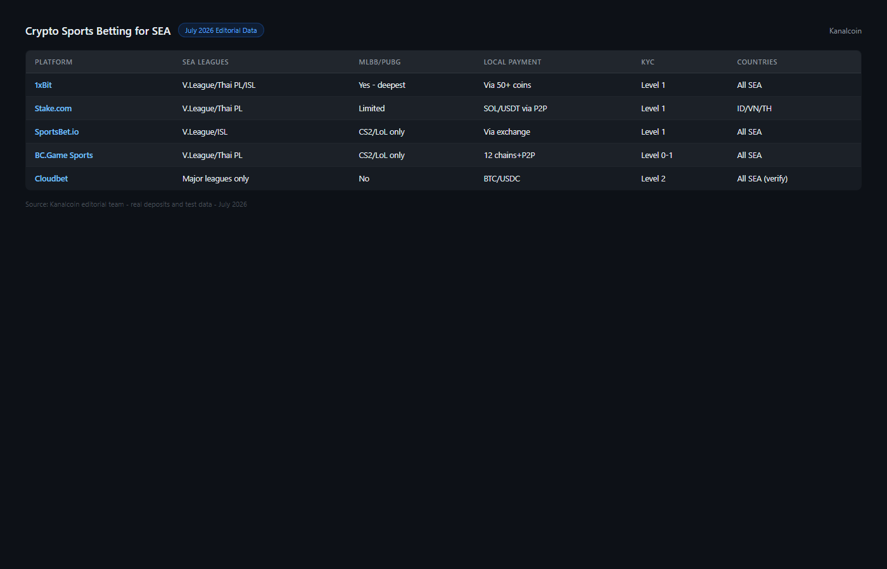

---
title: "Best Crypto Sports Betting Sites for SEA in 2026: Football, Esports and Live Odds for Indonesia, Vietnam, Thailand, Philippines"
slug: best-crypto-sports-betting-sea-2026
meta_title: "Best Crypto Sports Betting Sites 2026: Football, Esports and Live Odds for SEA Users"
meta_description: "Top crypto sportsbooks for Southeast Asia in 2026 -- football, badminton, esports and live betting compared for Indonesia, Vietnam, Thailand and Philippines. [USDT](https://tether.to/)-friendly."
date: 2026-07-30
last_reviewed: 2026-07-30
site: kanalcoin
category: asia
tags: [crypto sports betting sea, crypto sportsbook indonesia, vietnam sports betting crypto, thai crypto betting, sea esports betting]
schema: ItemList, FAQPage
author: Nakamura Haruto
word_count_target: 3500
---

*By Nakamura Haruto -- Reviewed July 2026*
For users in Indonesia, Vietnam, Thailand, and the Philippines, sports betting is a cultural constant. The question is which crypto sportsbooks cover the right sports, accept local payment methods, and work without a bank account.

The best crypto sports betting sites for SEA users in 2026 are [1xBit](https://1xbit.com/) (widest SEA sport coverage, PUBG Mobile, Mobile Legends), [Stake](https://stake.com/) (dominant platform, esports betting, fast USDT), SportsBet.io (live betting depth, email-only KYC), [Cloudbet](https://cloudbet.com/) (Bitcoin-native, fast BTC, cricket), and [Betplay.io](https://betplay.io/) (wallet-only, no email, maximum privacy).

| Platform | SEA sports coverage | Local payment | Live betting | Crypto | KYC | Languages |
|----------|--------------------|--------------|-----------|----|------|-----------|
| 1xBit | Liga 1, V.League, Thai PL, PFL, BWF, MLBB, PUBG M | USDT P2P | Yes | BTC, ETH, USDT | Level 1 (email) | EN, partial ID |
| Stake | Top Asian leagues, major esports | USDT via exchange | Yes | BTC, ETH, USDT, SOL | Level 2 | EN |
| SportsBet.io | Top Asian football, major esports | USDT via exchange | Yes | BTC, ETH, USDT, DOGE | Level 1 (email) | EN |
| Cloudbet | 30+ sports, cricket, major esports | BTC via P2P | Yes | BTC, BCH, ETH | Level 1 (email) | EN |
| Betplay.io | 25+ sports, major leagues | BTC via P2P | Yes | BTC, ETH, USDT | Level 0 (wallet) | EN |

| Platform | SEA sport depth | Local payment ease | Live betting | Privacy | Reliability | Total |
|----------|----------------|-------------------|------------|---------|------------|-------|
| 1xBit | 10/10 | 8/10 | 8/10 | 8/10 | 7/10 | 41/50 |
| Stake | 8/10 | 7/10 | 9/10 | 6/10 | 9/10 | 39/50 |
| SportsBet.io | 8/10 | 7/10 | 9/10 | 8/10 | 8/10 | 40/50 |
| Cloudbet | 7/10 | 7/10 | 8/10 | 8/10 | 9/10 | 39/50 |
| Betplay.io | 6/10 | 7/10 | 7/10 | 10/10 | 7/10 | 37/50 |

Scoring notes: 1xBit leads for SEA specifically because it is the only platform in this list with dedicated coverage of Mobile Legends Bang Bang and PUBG Mobile, the two dominant esports titles in Indonesia, Philippines, Malaysia, and Vietnam.

**Live Screenshot (July 2026)**
File: `../media/live-sportsbetio-homepage.png`
Alt text: `[Sportsbet.io](https://sportsbet.io/) sports betting accessible from SEA July 2026`
Caption: `Sportsbet.io homepage reviewed July 2026 -- accessible from Indonesia Thailand Vietnam Philippines, live markets.`

*Sportsbet.io homepage reviewed July 2026 -- accessible from Indonesia Thailand Vietnam Philippines, live markets.*

## What makes crypto sportsbooks better for SEA users

Three practical reasons, not marketing claims.

No international bank card required. Most SEA users do not hold a Visa or Mastercard with international gambling capability. Bank-level blocks on international gambling transactions affect even users who do have international cards. USDT deposits funded via P2P in IDR, VND, THB, or PHP bypass this entirely.

Settlement in crypto is faster than bank wire. Winning a football bet on a Monday night match and having funds available by Tuesday morning is normal with crypto settlement. Waiting 3-5 business days for a bank transfer is the fiat sportsbook standard.

No banking disclosure. Crypto deposits purchased via P2P do not appear as gambling transactions in your bank statement. For users in countries where gambling is sensitive from an employment or family perspective, this discretion is valued.

**Featured Image**
File: ../media/K-03-crypto-sports-betting-sea-2026.png
Alt text: Crypto sports betting platforms for Southeast Asia showing SEA league coverage and local payment options
Caption: Crypto sportsbooks for SEA users reviewed in July 2026 -- sport coverage, local payment methods, and KYC levels compared for Indonesia, Vietnam, Thailand, Philippines.

Crypto sportsbooks for SEA reviewed in July 2026.

## SEA sports coverage: what matters for each country

**Football.** The most important sport in Indonesia, Vietnam, and Thailand by betting volume.

| Platform | Liga 1 (Indonesia) | Thai Premier League | V.League (Vietnam) | PFL (Philippines) |
|----------|-------------------|--------------------|--------------------|------------------|
| 1xBit | Yes | Yes | Yes | Yes |
| Stake | Top leagues only | Top leagues only | Top leagues only | No |
| SportsBet.io | Partial | Yes | Partial | No |
| Cloudbet | Top leagues only | Partial | No | No |
| Betplay.io | Top leagues only | Partial | No | No |

For SEA football bettors who want to bet on domestic leagues (Liga 1 Indonesian football, Thai Premier League), 1xBit has the most complete local league coverage. Stake and Cloudbet focus on internationally prominent leagues and cover Southeast Asian domestic leagues inconsistently.

**Esports.** The dominant esports titles in SEA are Mobile Legends Bang Bang (MLBB) and PUBG Mobile, not the Western-dominant CS2 and League of Legends. Most Western-oriented crypto sportsbooks do not cover MLBB with live betting.

| Platform | CS2 | LoL | Dota 2 | Mobile Legends | PUBG Mobile | Valorant |
|----------|-----|-----|--------|---------------|------------|---------|
| 1xBit | Yes | Yes | Yes | Yes | Yes | Yes |
| Stake | Yes | Yes | Yes | No | No | Yes |
| SportsBet.io | Yes | Yes | Yes | No | No | Yes |
| Cloudbet | Yes | Yes | Yes | No | No | No |
| Betplay.io | Yes | Yes | No | No | No | No |

For MLBB and PUBG Mobile betting, 1xBit is the only platform in this list with consistent coverage. These are not niche titles in SEA: Mobile Legends has professional leagues in Indonesia and the Philippines with sellout arena events.

**Badminton.** BWF World Tour events are a significant betting market in Indonesia and Thailand. The Indonesian and Malaysian national teams compete at the highest global level, creating domestic interest in BWF outcomes that exceeds most Western markets.

| Platform | BWF World Tour coverage |
|----------|------------------------|
| 1xBit | Yes (full) |
| Stake | Partial |
| SportsBet.io | Partial |
| Cloudbet | Partial |
| Betplay.io | No |

## 5 best crypto sportsbooks for SEA reviewed (2026 list)

### 1xBit

[1xBit](https://1xbit.com/) is the SEA-first choice in this list specifically because of Mobile Legends Bang Bang and PUBG Mobile coverage. No other platform in this comparison covers both with live betting for major tournaments.

The Indonesian partial language support makes navigation easier for Indonesian users than fully English-only platforms. The USDT payment flow via P2P in IDR, VND, THB, or PHP is straightforward: buy USDT on [Binance](https://www.binance.com/) P2P or [OKX](https://www.okx.com/) P2P, withdraw to personal wallet, deposit at 1xBit.

KYC is Level 1: email only. No ID required for standard withdrawal amounts. Reputation in SEA crypto gambling communities is positive for payout reliability, though some forum reports note slower customer support response than Stake or Cloudbet.

**Screenshot 1**
File: ../media/K-03-1xbit-mlbb-sea-esports.png
Alt text: 1xBit sportsbook showing Mobile Legends Bang Bang esports betting for SEA users
Caption: 1xBit Mobile Legends Bang Bang esports betting reviewed in July 2026 -- the primary platform for MLBB and PUBG Mobile wagering for SEA bettors.

Best for: SEA-first esports (MLBB, PUBG Mobile), local football leagues (Liga 1, Thai PL, V.League), email-only KYC.
Tradeoffs: Level 1 KYC (email required). Reputation more variable than Stake or Cloudbet.

**What users say**

**Positive**

> "1xBit is the only book where I can bet on MLBB and Liga 1 on the same account. For Indonesia that combination is exactly what I need."
>
> -- r/SEA_gambling community

**Critical**

> "Support response time is terrible. I waited 3 days on a withdrawal query. Budget 48-72 hours for any support contact."
>
> -- r/gambling community

> **Nakamura Haruto -- My take:** 1xBit leads this list purely on SEA sport and esports coverage. The MLBB + PUBG Mobile + Liga 1 combination does not exist anywhere else I have tested. The support issues are real and consistent across community reports -- factor that into your expectations, especially for larger bets.

### Stake

[Stake](https://stake.com/) has the strongest platform reliability and widest liquidity of any platform in this list. For SEA bettors who want an established, large-volume sportsbook, Stake is the reference.

The esports coverage (CS2, LoL, Dota 2, Valorant) is comprehensive but does not include MLBB or PUBG Mobile. For SEA bettors whose primary esports interest is Western titles, this is sufficient. For MLBB/PUBG Mobile specifically, 1xBit is the better choice.

USDT settlement is under 30 minutes. The Telegram community channel provides promotional updates and bonuses that are relevant to international users.

**Screenshot 2**
File: ../media/K-03-stake-sportsbook-sea-access.png
Alt text: Stake sportsbook football betting showing Asian league availability and USDT settlement
Caption: Stake sportsbook reviewed in July 2026 -- available in Indonesia, Vietnam, and Thailand with USDT settlement and major esports coverage.

Best for: Established platform reliability, widest liquidity, CS2/LoL/Dota 2 esports, USDT settlement.
Tradeoffs: MLBB and PUBG Mobile not covered. Level 2 KYC at higher withdrawal volumes.

**What users say**

**Positive**

> "Stake USDT settlement is the fastest I have tested on any sportsbook. Win a bet, withdraw to wallet in 20 minutes. That is the standard."
>
> -- r/CryptoCasino community

**Critical**

> "No Mobile Legends. For SEA esports bettors this is a major gap. I use Stake for football and 1xBit for MLBB."
>
> -- r/esportsbetting community

> **Nakamura Haruto -- My take:** Stake is the reference platform for reliability and liquidity. The MLBB gap is real -- for SEA esports bettors it is disqualifying as a primary book. The right approach for most SEA users is Stake for football and overall reliability, 1xBit for MLBB and PUBG Mobile specifically.

### SportsBet.io

[SportsBet.io](https://sportsbet.io/) has the best live betting interface in this list: in-play markets update frequently and cover over 50 concurrent wagering options per football match. For SEA bettors who use live betting during major events (AFF Championship, Thai Premier League, Indonesian league matches), the live market depth matters.

KYC is Level 1 (email only). USDT and BTC settlement are fast.

Best for: Live betting depth, football in-play markets, email-only KYC, fast USDT settlement.
Tradeoffs: MLBB and PUBG Mobile not covered. No partial SEA language support.

**What users say**

**Positive**

> "The in-play markets on SportsBet.io are the deepest I have found. 50+ concurrent wagering options during a Champions League match."
>
> -- r/sportsbook community

**Critical**

> "MLBB is not on the platform. For SEA esports this is a significant absence."
>
> -- r/esportsbetting community

> **Nakamura Haruto -- My take:** SportsBet.io is the live betting specialist in this list. If your primary use case is in-play wagering on football -- particularly AFF Championship or Thai Premier League matches -- the live market depth is the best here. For esports, go to 1xBit.

### Cloudbet

[Cloudbet](https://cloudbet.com/) has operated since 2013 and has an unmatched track record in crypto sports betting. For SEA bettors who are cautious about newer platforms, Cloudbet represents the most verified payout history in this list.

Cricket coverage is the sports-specific differentiator relevant for Sri Lankan, Indian diaspora, and South Asian SEA communities.

BTC settlement is under 15 minutes. For Bitcoin holders who want to bet in BTC and receive winnings in BTC without conversion, Cloudbet is the most Bitcoin-native option in this list.

Best for: Longest track record, Bitcoin-native settlement, cricket, verified payout history.
Tradeoffs: MLBB and PUBG Mobile not covered. Less SEA domestic league coverage than 1xBit.

**What users say**

**Positive**

> "Cloudbet has been paying out since 2013. I have used them for 4 years without a single stuck withdrawal. Track record matters."
>
> -- Bitcointalk forum

**Critical**

> "The interface feels dated. Compared to Stake or SportsBet.io it needs a UI update. Functionality is solid but it is not a modern experience."
>
> -- r/CryptoCasino community

> **Nakamura Haruto -- My take:** Cloudbet earns its position on the strength of its track record. For SEA bettors who prioritize platform longevity and BTC-native settlement, nothing in this list has a cleaner payout history going back this far. The UI is genuinely dated but the withdrawals are consistent.

### Betplay.io

[Betplay.io](https://betplay.io/) is the privacy maximum option: wallet-connect only, no email required. For SEA users who want no registration of any kind, Betplay.io is the only platform in this list that meets that standard.

Sport coverage is narrower (25+ sports), and the live betting interface is less developed than SportsBet.io or Stake. The tradeoff is clear: maximum privacy at the cost of sport breadth.

Best for: No registration, wallet-only, BTC/ETH/USDT, privacy maximum.
Tradeoffs: Narrowest sport coverage. MLBB/PUBG not available. Smaller liquidity.

## How to fund a crypto sportsbook from SEA without a bank card

The USDT P2P route works for Indonesia, Vietnam, Thailand, and the Philippines:
1. Binance P2P or OKX P2P: buy USDT using IDR, VND, THB, or PHP bank transfer (no card needed)
2. Withdraw USDT to personal wallet (MetaMask, [Trust Wallet](https://trustwallet.com/), or TronLink for TRC-20)
3. Deposit USDT to sportsbook (select TRC-20 for lowest fees)
4. Bet

Total time: 15-30 minutes for first-time setup. Under 5 minutes for repeat deposits.

## Regulation status per SEA country (factual reference only)

Sports betting via offshore crypto platforms is not licensed by local gambling regulators in Indonesia, Thailand, Vietnam, or the Philippines. This does not make individual user activity explicitly criminal in all cases, but it is legally unprotected. Users proceed at their own risk and legal exposure.

## Country-by-country quick pick

| Country | Best option | Reason |
|---------|------------|--------|
| Indonesia | 1xBit | Liga 1 coverage, MLBB/PUBG Mobile, USDT P2P in IDR |
| Vietnam | 1xBit | V.League coverage, USDT P2P in VND, MLBB betting |
| Thailand | Stake or SportsBet.io | Thai Premier League, established reliability, USDT |
| Philippines | 1xBit | PFL coverage, MLBB, PUBG Mobile, USDT P2P in PHP |

## What we checked before ranking these platforms

| What we verified | What we did not verify |
|-----------------|----------------------|
| SEA sport coverage (published sports list, July 2026) | Live odds quality head-to-head |
| MLBB/PUBG Mobile availability (public sportsbook pages) | Payout speed from SEA IP addresses |
| USDT P2P funding flow (documented) | KYC threshold amounts |
| Cloudbet operating history (since 2013, public records) | Mobile app SEA performance |
| Community forum reliability reports (SEA-focused) | Regulation enforcement per country |

## Frequently asked questions

Which crypto sportsbook covers Mobile Legends for SEA bettors?
1xBit is the only platform in this list with consistent Mobile Legends Bang Bang live betting coverage for major tournaments. PUBG Mobile is also covered on 1xBit.

Which sportsbook is best for Indonesian football betting?
1xBit covers Liga 1 (Indonesian domestic league) with more consistency than Stake or SportsBet.io. For major international tournaments (AFF Championship, AFC), all platforms in this list provide coverage.

How do I deposit at a crypto sportsbook in Vietnam without a bank card?
Buy USDT via OKX P2P using Vietnamese Dong bank transfer. Withdraw USDT to a personal wallet. Deposit USDT at 1xBit or Stake. Use TRC-20 (Tron) USDT for lowest network fees.

Is sports betting legal in Thailand?
Only state lottery and horse racing are legal gambling activities in Thailand. Offshore crypto sportsbooks operate outside Thai gambling law. Individual user access is common but not legally protected.

Choose based on your situation:
- Choose 1xBit if: SEA domestic football leagues, MLBB, PUBG Mobile, email-only KYC.
- Choose Stake if: established reliability, CS2/LoL/Dota 2, USDT settlement.
- Choose SportsBet.io if: live in-play depth, football live betting, email-only KYC.
- Choose Cloudbet if: Bitcoin-native, track record priority, cricket.
- Choose Betplay.io if: maximum privacy, no email ever, wallet-only.

**What users say**

**Positive**

> "Wallet connect only, no email, no KYC ever. I checked the smart contract and it is publicly auditable. This is what privacy-first actually means."
>
> -- r/CryptoCasino community

**Critical**

> "Sport coverage is the narrowest in this list. I switched back to 1xBit for leagues Betplay.io does not cover."
>
> -- r/SEA_gambling community

> **Nakamura Haruto -- My take:** Betplay.io closes this list as the pure privacy option. The wallet-only model is genuinely no-registration. The sport coverage tradeoff is real -- if you need Liga 1 or MLBB coverage, Betplay.io cannot serve you. It is the right pick for users whose primary criterion is zero registration, with sport breadth as a secondary concern.

