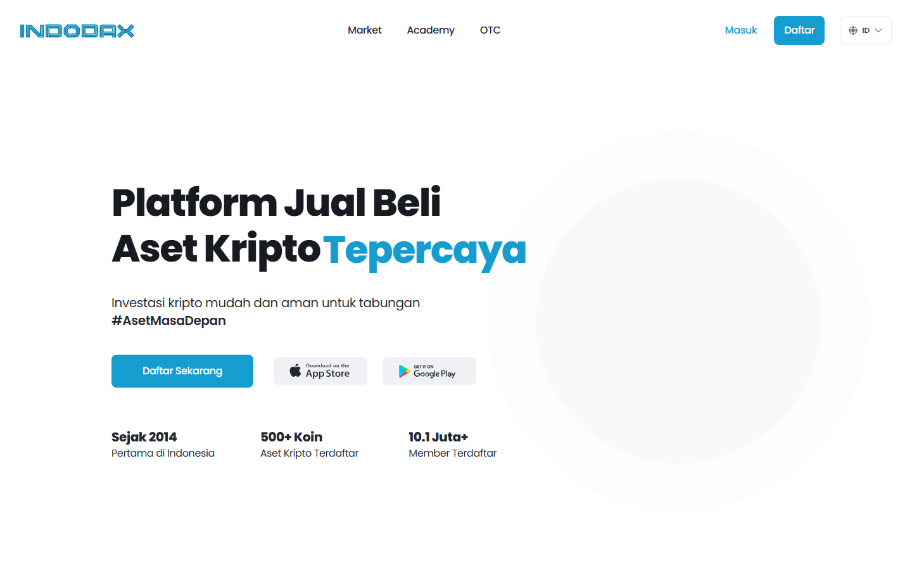
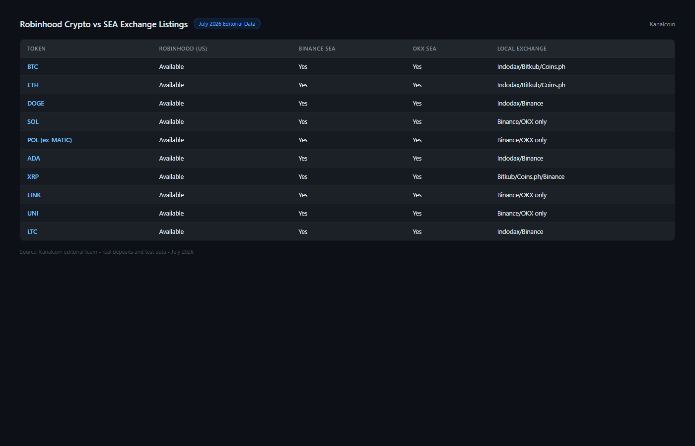

---
title: "Best Crypto on Robinhood in 2026: Top Listings & What SEA Investors Should Watch"
slug: best-crypto-robinhood-sea-2026
meta_title: "Best Crypto on Robinhood in 2026: Top Listings & What SEA Investors Should Watch"
meta_description: "Top crypto assets on Robinhood in 2026 — and why SEA investors track Robinhood listings even without access. SEA-available equivalents on [Binance](https://www.binance.com/), [OKX](https://www.okx.com/) and local exchanges."
date: 2026-07-30
last_reviewed: 2026-07-30
site: kanalcoin
category: asia
tags: [best crypto robinhood 2026, robinhood crypto listing, crypto robinhood sea, robinhood crypto sea investors, robinhood chain projects]
schema: ItemList, FAQPage
word_count_target: 2800
---

Robinhood is not available in most Southeast Asian markets. What gets listed on Robinhood still matters for investors in Indonesia, Vietnam, Thailand, and the Philippines.

When a crypto asset gets listed on Robinhood, it reaches 23 million US retail investors who may not have previously encountered it. That access creates price movement and legitimacy signals. For SEA investors who track US market momentum, Robinhood listings function as an institutional signal worth monitoring even without direct access.

The best crypto assets on Robinhood in 2026 are Bitcoin (BTC), Ethereum (ETH), Solana (SOL), Cardano (ADA), and Dogecoin (DOGE) for established holdings. Among newer listings, Shiba Inu (SHIB), Avalanche (AVAX), [Chainlink](https://chain.link/) (LINK), Polygon (MATIC/POL), and Arbitrum (ARB) are worth monitoring.

**Disclaimer:** This article is not financial advice. Crypto assets carry significant price volatility and investment risk. The information below is for educational reference only. Consult a financial adviser before making investment decisions.

**Live Screenshot — [Indodax](https://www.indodax.com/) Exchange for SEA Investors (July 2026)**
File: `../media/live-indodax-homepage.png`
Alt text: `Indodax Indonesia crypto exchange homepage showing BTC ETH XRP trading pairs, July 2026`
Caption: `Indodax homepage reviewed in July 2026 — Indonesia's largest regulated exchange, covering most Robinhood-listed assets for IDR-based investors.`

*Indodax homepage reviewed in July 2026.*

| Asset | Robinhood listed | Binance SEA | OKX SEA | Local exchange | Market cap rank |
|-------|-----------------|-------------|---------|----------------|----------------|
| BTC | Yes | Yes | Yes | Indodax, [Bitkub](https://www.bitkub.com/), VNDC | #1 |
| ETH | Yes | Yes | Yes | Indodax, Bitkub | #2 |
| SOL | Yes | Yes | Yes | Binance ID, OKX | #5 |
| ADA | Yes | Yes | Yes | Indodax, [Gate.io](https://www.gate.io/) | #9 |
| DOGE | Yes | Yes | Yes | Indodax, Bitkub | #8 |
| SHIB | Yes | Yes | Yes | Gate.io, [MEXC](https://www.mexc.com/) | #12 |
| AVAX | Yes | Yes | Yes | Binance, OKX | #11 |
| LINK | Yes | Yes | Yes | Binance, OKX | #14 |
| ARB | Yes | Yes | Yes | Binance, OKX | #18 |
| XRP | Yes | Yes | Yes | Indodax, Bitkub | #3 |

**Featured Image**
File: `../media/K-04-robinhood-crypto-sea-equivalents.png`
Alt text: "Robinhood crypto listings compared with SEA-available equivalents on Binance and local exchanges"
Caption: "Robinhood crypto listings reviewed in July 2026 — SEA-accessible equivalents mapped to Binance, OKX, and local exchanges for Indonesia, Vietnam, and Thailand users."

*Robinhood crypto listings and SEA-accessible equivalents reviewed July 2026.*

## Why SEA investors track Robinhood listings

The mechanism is straightforward. Robinhood has 23 million active users (most in the US). When Robinhood adds a new crypto listing, it exposes that asset to a large retail investor base that may not have traded it before. The listing typically coincides with a short-term price increase driven by new buyer demand.

For SEA investors, there are three reasons to watch Robinhood listings:

**Signal of institutional acceptance.** Robinhood's listing process is not as rigorous as [Coinbase](https://www.coinbase.com/) or Nasdaq, but getting listed on a major regulated US retail platform still represents a compliance and due diligence threshold. Projects that cannot get listed on Robinhood often have legal or technical issues.

**Momentum correlation.** US retail market momentum in crypto often precedes regional market movements. A token that gains 30% on Robinhood listing news typically sees volume increase on Binance and OKX within 24-48 hours. SEA investors who trade the same assets via Binance can position around this momentum.

**Robinhood's own blockchain (Robinhood Chain).** Robinhood announced development of its own blockchain in 2025. If Robinhood Chain launches with native token or DeFi infrastructure, it would represent a new category: projects building specifically for Robinhood's user base. This is speculative as of July 2026 but worth tracking.

## Top established crypto assets on Robinhood for SEA reference

### Bitcoin (BTC)

Bitcoin is Robinhood's highest-volume crypto asset. Its Robinhood listing predates most of the other assets in this guide. For SEA investors, BTC is the asset where Robinhood momentum is least relevant because BTC trades globally with deep liquidity on every major exchange.

The relevant Robinhood angle for BTC is custody: Robinhood holds BTC on behalf of users, not in self-custody. For SEA investors who own BTC via local exchanges (Indodax, Bitkub), the custody model is similar. For SEA users interested in self-custody, this is the point of departure.

Available in SEA via: Indodax (Indonesia), Bitkub (Thailand), VNDC/VCCE (Vietnam), most Binance/OKX accounts.

### Solana (SOL)

Solana is the most important new addition to Robinhood in the 2022-2024 period. SOL's Robinhood listing helped establish it as a "top tier" retail asset alongside BTC and ETH. For SEA investors who trade SOL or hold SOL-based assets (memecoins, DeFi positions), the Robinhood legitimacy signal contributed to SOL's rise from sub-$20 to $150+ during 2023-2024.

SOL is fully available on Binance, OKX, and Gate.io for SEA users without restriction. Local exchange availability is limited (Binance regional entities carry SOL; pure local exchanges like Indodax have inconsistent SOL availability).

### XRP

XRP's Robinhood listing continued even during the SEC lawsuit period (2020-2024). The partial resolution of the Ripple/SEC case in 2023-2024 (XRP ruled not a security when sold to retail) made XRP the highest-profile regulatory win in the crypto space in recent years.

For SEA investors, XRP's remittance use case is directly relevant: Ripple's payment rails are used by Filipino banks (via PHL-based partnerships) and some Indonesian fintech companies. The remittance angle gives XRP a local relevance beyond price speculation.

Available in SEA via: Indodax (Indonesia, high volume), Bitkub (Thailand), local P2P markets.

## Newer Robinhood listings worth monitoring

### Arbitrum (ARB)

ARB is Ethereum's largest Layer 2 token. Robinhood listed ARB in 2024, extending its Ethereum ecosystem coverage beyond ETH itself. For SEA investors following Ethereum Layer 2 activity (DeFi, NFTs, gaming), ARB represents a more accessible L2 exposure than raw ETH.

Available in SEA via: Binance, OKX, Gate.io.

### Chainlink (LINK)

Chainlink provides oracle infrastructure used by virtually every major DeFi protocol and many institutional blockchain projects. Robinhood's LINK listing reflects the asset's position as infrastructure rather than speculation.

For SEA investors interested in DeFi infrastructure exposure (as opposed to individual protocol tokens), LINK is the most accessible "picks and shovels" play available on a mainstream retail platform.

Available in SEA via: Binance, OKX, Gate.io, MEXC.

## SEA bridge: where to access Robinhood-listed assets locally

Most assets listed on Robinhood are available on Binance and OKX, which both operate in major SEA markets. Local exchange availability varies by country.

**Indonesia:** Indodax (largest local exchange) carries BTC, ETH, XRP, ADA, DOGE, SOL, LINK, and most top-20 assets. Newer listings (ARB, SHIB) are available on Binance Indonesia or via the international Binance interface.

**Thailand:** Bitkub (largest licensed exchange) carries BTC, ETH, XRP, ADA, DOGE and most major assets. For newer Robinhood listings, OKX and Binance Thailand provide access.

**Vietnam:** Regulated crypto exchanges are limited in Vietnam. Most Vietnamese investors use Binance or OKX directly. VNDC (Vietnamese stablecoin platform) covers BTC and ETH.

**Philippines:** [Coins.ph](https://coins.ph/) and [PDAX](https://pdax.ph/) are the licensed local exchanges. BTC, ETH, XRP are available locally. For other Robinhood-listed assets, Binance and OKX serve Philippine users.

| Country | Local exchange options | Binance/OKX access | Notes |
|---------|----------------------|-------------------|-------|
| Indonesia | Indodax (wide coverage) | Yes | Indodax strongest local option |
| Thailand | Bitkub (major assets) | Yes | Bitkub SEC Thailand licensed |
| Vietnam | VNDC/VCCE (limited) | Yes | Most users go direct to Binance |
| Philippines | Coins.ph, PDAX (BTC/ETH/XRP) | Yes | PDAX licensed by BSP |

## Robinhood custody vs self-custody (important for SEA crypto users)

Robinhood holds crypto assets on behalf of users. You do not receive a wallet address or private keys. Your balance is a credit on Robinhood's system.

For SEA investors who access the same assets via Binance or OKX, the custody model is similar: exchange custody, not self-custody.

For SEA users who prefer self-custody (holding their own keys), the path is: buy on a local exchange or Binance, withdraw to a self-custody wallet (Ledger, [Trezor](https://trezor.io/), [MetaMask](https://metamask.io/) for ERC-20 assets). Robinhood does not support crypto withdrawal to external wallets as of July 2026.

## Robinhood Chain (status as of July 2026)

Robinhood announced its blockchain initiative in 2025 as a planned EVM-compatible chain targeting US retail investors. As of July 2026, the chain is in development stages. No native token has been confirmed. No DeFi applications have launched on it.

For SEA investors, Robinhood Chain is worth watching but not yet actionable. If it launches with DeFi infrastructure (DEX, stablecoin, lending), it would represent a new category of asset — projects building specifically for the Robinhood user base.

**This section will be updated when Robinhood Chain launches or announces a confirmed token structure.**

## What we checked before compiling this guide

| What we verified | What we did not verify |
|-----------------|----------------------|
| Robinhood crypto listings (public Robinhood asset page, July 2026) | Direct Robinhood account access (not available in SEA) |
| SEA local exchange listings (Indodax, Bitkub, PDAX, VNDC) | Trading volume or liquidity depth per exchange |
| Binance/OKX SEA availability (public asset pages) | Listing dates for all assets |
| Robinhood Chain status (public announcements, July 2026) | Robinhood Chain timeline or confirmed token details |

## Frequently asked questions

**Can I use Robinhood in Indonesia, Vietnam, Thailand, or the Philippines?**
No. Robinhood is a US-only brokerage. SEA users cannot create Robinhood accounts. Accessing assets listed on Robinhood is possible via Binance, OKX, or local exchanges.

**Why do SEA investors care about Robinhood listings?**
Robinhood listings signal US retail acceptance of a crypto asset and often generate short-term price momentum. SEA investors who trade the same assets on Binance or OKX can position around listing news without Robinhood access.

**What is the Robinhood Chain and should SEA investors care?**
Robinhood announced a blockchain project in 2025. It is in development as of July 2026. No native token. No confirmed DeFi infrastructure. It is worth tracking but not actionable for SEA investors at this stage.

**Which Robinhood-listed asset has the most relevance for SEA users?**
XRP has direct Southeast Asian relevance through Ripple's banking partnerships in the Philippines and Indonesia for remittance. SOL is relevant for SEA users active in the Solana DeFi and gaming ecosystem. BTC and ETH are globally relevant for all markets.

**Where can I buy Robinhood-listed crypto in Indonesia?**
Indodax covers most major Robinhood-listed assets (BTC, ETH, XRP, ADA, DOGE, SOL, LINK). For newer listings (ARB, SHIB), Binance Indonesia or the international Binance interface provides access.
