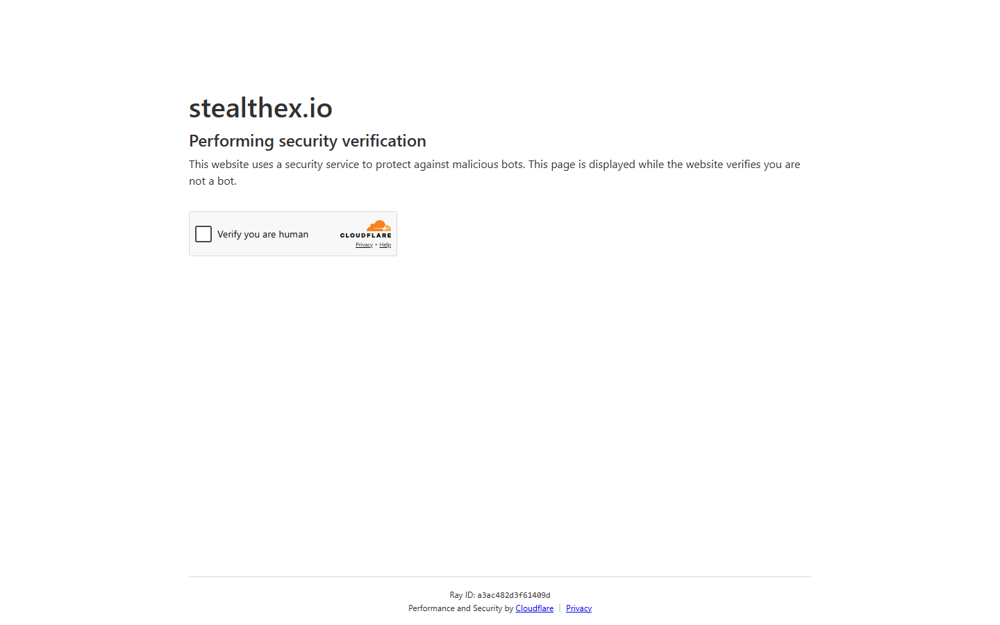

---
title: "ETH to BTC via StealthEX 2026: Swap Ethereum for Bitcoin, No Registration"
slug: "/exchanges/aggregators/eth-to-btc-stealthex-2026"
meta_title: "ETH to BTC StealthEX 2026: No-KYC Ethereum to Bitcoin Swap Guide"
meta_description: "How to swap ETH to BTC using StealthEX in 2026. Rates, settlement times, fixed vs floating, and top alternatives for no-registration Ethereum to Bitcoin conversion."
primary_keyword: "eth to btc stealthex"
secondary_keywords:
  - "eth to btc no kyc 2026"
  - "swap ethereum for bitcoin no registration"
  - "stealthex eth btc"
schema: "Article + HowTo + FAQPage"
category: "exchanges/aggregators"
last_reviewed: "2026-08-18"
author: "Kanalcoin Research Team"
internal_links:
  - "/exchanges/aggregators/btc-to-eth-stealthex-2026"
  - "/exchanges/aggregators/best-no-kyc-crypto-exchange-stealthex-2026"
  - "/exchanges/aggregators/stealthex-fiat-buy-crypto-2026"
---

# ETH to BTC via StealthEX 2026: No-KYC Swap Guide

*By Kanalcoin Research Team, Reviewed August 2026*

ETH-to-BTC is one of the most common swap routes and one where StealthEX consistently performs well. No registration, no KYC, and a documented 5-30 minute settlement window make it a reliable option for converting Ethereum to Bitcoin.

---

## ETH to BTC on StealthEX: key facts

| | |
|---|---|
| **Route** | ETH (Ethereum) to BTC (Bitcoin) |
| **Settlement time** | 15-25 minutes (typical) |
| **Fixed rate available** | Yes |
| **Floating rate available** | Yes |
| **KYC** | None |
| **Registration** | None required |
| **Minimum** | Approximately 0.01 ETH (varies) |

**Screenshot**
File: `../media/live-stealthex-eth-btc.png`
Alt text: "StealthEX ETH to BTC swap interface, rate and recipient field, August 2026"
Caption: "StealthEX ETH-to-BTC swap showing live rate and BTC recipient address field, captured August 2026."

*StealthEX ETH-to-BTC swap, captured August 2026.*

---

## Step-by-step: how to swap ETH to BTC on StealthEX

1. Go to stealthex.io (verify the URL, not stealth-ex.io)
2. Select ETH as the "Send" coin and BTC as the "Receive" coin
3. Enter the amount of ETH you want to swap
4. Choose fixed or floating rate
5. Enter your BTC recipient address (double-check this, errors are not reversible)
6. Review the rate and confirm
7. Send ETH to the StealthEX deposit address
8. Wait 15-25 minutes for the swap to complete and BTC to arrive

---

## Fixed vs floating rate for ETH/BTC

**Fixed rate:** Rate is locked at order creation. You receive exactly the displayed BTC amount regardless of price movement during settlement. Recommended for amounts where you need certainty.

**Floating rate:** Rate is settled at market price when the swap executes. Slightly better rate in a stable market, but ETH/BTC volatility during the 20-minute window can reduce the received amount.

For ETH/BTC, the fixed rate premium is typically 0.2-0.4%. Unless you are swapping a small amount where the premium cost exceeds the volatility risk, fixed rate is worth it.

---

## ETH to BTC rate comparison

| Service | Type | Rate vs market | Settlement |
|---------|------|---------------|-----------|
| StealthEX | Direct | 0.3-0.8% below spot | 15-25 min |
| ChangeNOW | Direct | 0.3-0.7% below spot | 10-20 min |
| Swapzone | Aggregator | Best available | 15-30 min |

Check Swapzone before committing to confirm StealthEX is competitive for your specific amount.

---

## What users say

> "Very smooth swap!"
>
> Mark Gieringer, [***** Trustpilot](https://www.trustpilot.com/reviews/6a63e0394a2ed56438bd8d08), Jul 24, 2026

> "Easy, fast, good experience with support."
>
> Pekka, [***** Trustpilot](https://www.trustpilot.com/reviews/692e15ea353f900aaa523839), Dec 02, 2025

---

## Frequently Asked Questions

**How long does ETH to BTC take on StealthEX?**
15-25 minutes for typical network conditions. ETH confirmations are fast (1-3 minutes), then the swap executes, then BTC confirmation adds 10-20 minutes.

**Is there a minimum for ETH to BTC on StealthEX?**
Yes, a minimum swap amount applies. It varies with market rates but is typically around 0.01 ETH. Check the interface for the current minimum.

**Should I use fixed or floating rate for ETH to BTC?**
Fixed rate is recommended for amounts above $100 USD equivalent. The 0.2-0.4% premium is lower than ETH/BTC volatility risk during a 20-minute window.

**Can I swap ETH to BTC on StealthEX without an account?**
Yes. No account, no email, no KYC required for crypto-to-crypto swaps on StealthEX.
