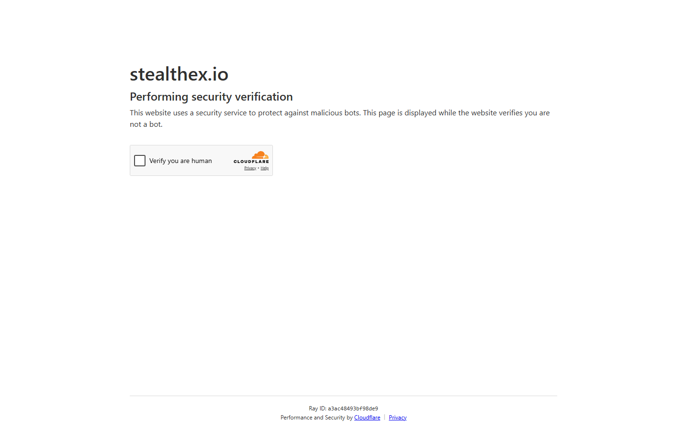

---
title: "BTC to ETH via StealthEX 2026: Swap Bitcoin for Ethereum, No KYC"
slug: "/exchanges/aggregators/btc-to-eth-stealthex-2026"
meta_title: "BTC to ETH StealthEX 2026: No-KYC Bitcoin to Ethereum Swap Guide"
meta_description: "How to swap BTC to ETH using StealthEX in 2026. Settlement times, fixed vs floating rate, fees, and top alternatives for Bitcoin to Ethereum with no registration."
primary_keyword: "btc to eth stealthex"
secondary_keywords:
  - "btc to eth no kyc 2026"
  - "swap bitcoin for ethereum no registration"
  - "stealthex btc eth"
schema: "Article + HowTo + FAQPage"
category: "exchanges/aggregators"
last_reviewed: "2026-08-18"
author: "Kanalcoin Research Team"
internal_links:
  - "/exchanges/aggregators/eth-to-btc-stealthex-2026"
  - "/exchanges/aggregators/best-no-kyc-crypto-exchange-stealthex-2026"
  - "/exchanges/aggregators/stealthex-review-2026"
---

# BTC to ETH via StealthEX 2026: No-KYC Bitcoin to Ethereum Swap

*By Kanalcoin Research Team, Reviewed August 2026*

BTC-to-ETH is one of StealthEX's highest-volume routes. The swap completes without registration, without KYC, and typically within 15-25 minutes. This guide covers the process, rate selection, and key considerations.

---

## BTC to ETH on StealthEX: key facts

| | |
|---|---|
| **Route** | BTC (Bitcoin) to ETH (Ethereum) |
| **Settlement time** | 20-35 minutes (typical) |
| **Fixed rate available** | Yes |
| **Floating rate available** | Yes |
| **KYC** | None |
| **Registration** | None required |
| **Network** | ETH ERC-20 standard |

**Screenshot**
File: `../media/live-stealthex-btc-eth.png`
Alt text: "StealthEX BTC to ETH swap interface, rate display, August 2026"
Caption: "StealthEX BTC-to-ETH swap showing live rate and ETH recipient address field, captured August 2026."

*StealthEX BTC-to-ETH swap, captured August 2026.*

---

## Step-by-step: BTC to ETH on StealthEX

1. Open stealthex.io (verify URL)
2. Select BTC as "Send" coin, ETH as "Receive" coin
3. Enter the BTC amount
4. Select fixed or floating rate
5. Enter your ETH recipient address (must be ERC-20 compatible, not a CEX deposit address unless you are certain it accepts external ETH)
6. Confirm and send BTC to the deposit address
7. Wait 20-35 minutes for settlement

**Note:** BTC confirmation time (1 confirmation required on StealthEX) accounts for most of the wait. ETH arrival is near-instant after swap execution.

---

## Rate and fee structure

BTC/ETH rates on StealthEX are within 0.3-0.8% of spot for standard amounts. The spread is built into the displayed rate, not added separately.

| Rate mode | Premium vs spot | Best for |
|-----------|----------------|----------|
| Fixed rate | 0.3-0.5% extra | Certainty on received amount |
| Floating rate | Closest to spot | Maximum ETH received |

For BTC-to-ETH specifically, the BTC confirmation wait (10-20 minutes) creates meaningful price movement risk on floating rate. Fixed rate eliminates this.

---

## Important: ETH network selection

StealthEX will default to ERC-20 ETH. If you intend to use the ETH on a specific chain (Polygon, Arbitrum, Optimism), you need to either:
- Specify the correct chain version in the swap selector
- Receive ETH on mainnet and bridge afterward

Never send ETH to a contract address or a CEX deposit address without confirming the CEX accepts external deposits of that token.

---

## Comparing BTC to ETH services

| Service | Rate vs market | Settlement | KYC |
|---------|---------------|-----------|-----|
| StealthEX | 0.3-0.8% below | 20-35 min | None |
| ChangeNOW | 0.3-0.7% below | 15-25 min | None (standard) |
| Swapzone | Best available | 20-40 min | Varies |

ChangeNOW is slightly faster on BTC/ETH due to lower minimum confirmation requirements on some routes. Swapzone lets you compare both in real time.

---

## Frequently Asked Questions

**How long does BTC to ETH take on StealthEX?**
20-35 minutes total. BTC confirmation (1 block, ~10-20 minutes) plus swap execution plus ETH receipt.

**Can I receive ETH on a Ledger/Trezor?**
Yes. Enter your hardware wallet ETH address as the recipient. StealthEX will send standard ERC-20 ETH.

**What is the minimum BTC for BTC to ETH on StealthEX?**
Approximately 0.001 BTC, but check the current minimum in the StealthEX interface as it varies with market rates.

**Is fixed rate worth it for BTC to ETH?**
Yes for amounts above $200. The BTC confirmation wait introduces real ETH/BTC price movement risk on floating rate swaps.
