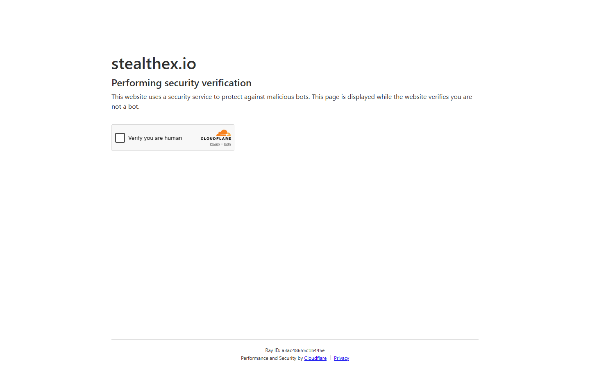

---
title: "XMR to BTC via StealthEX 2026: Swap Monero for Bitcoin No KYC"
slug: "/exchanges/aggregators/xmr-to-btc-stealthex-2026"
meta_title: "XMR to BTC StealthEX 2026: No-KYC Monero to Bitcoin Swap Guide"
meta_description: "How to swap XMR to BTC using StealthEX in 2026. Monero to Bitcoin settlement times, no-KYC limits, and best services for the XMR/BTC route in 2026."
primary_keyword: "xmr to btc stealthex"
secondary_keywords:
  - "xmr to btc no kyc 2026"
  - "swap monero for bitcoin"
  - "stealthex xmr btc"
schema: "Article + HowTo + FAQPage"
category: "exchanges/aggregators"
last_reviewed: "2026-08-18"
author: "Kanalcoin Research Team"
internal_links:
  - "/exchanges/aggregators/btc-to-eth-stealthex-2026"
  - "/exchanges/aggregators/best-no-kyc-crypto-exchange-stealthex-2026"
  - "/exchanges/aggregators/stealthex-review-2026"
---

# XMR to BTC via StealthEX 2026: Monero to Bitcoin No-KYC Guide

*By Kanalcoin Research Team, Reviewed August 2026*

> **Route availability note**
>
> XMR has been delisted from most centralized exchanges. XMR-to-BTC is available on StealthEX and select non-custodial alternatives as of August 2026. Verify availability before initiating, as partner liquidity can change.

XMR-to-BTC is one of the more complex swap routes available in 2026 due to Monero's delisting from most exchanges. StealthEX is among the most consistently available services for this route, with no-KYC policy and documented support for privacy coin pairs.

---

## XMR to BTC on StealthEX: key facts

| | |
|---|---|
| **Route** | XMR (Monero) to BTC (Bitcoin) |
| **Settlement time** | 25-50 minutes |
| **Fixed rate available** | Yes |
| **Floating rate available** | Yes |
| **KYC** | None stated |
| **Registration** | None required |
| **XMR confirmations required** | 10 blocks (~20 minutes) |

**Screenshot**
File: `../media/live-stealthex-xmr-btc.png`
Alt text: "StealthEX XMR to BTC swap interface, rate and BTC recipient field, August 2026"
Caption: "StealthEX XMR-to-BTC swap showing live rate and BTC recipient address field, captured August 2026."

*StealthEX XMR-to-BTC swap, captured August 2026.*

---

## Why XMR to BTC is harder than other routes

**10-block XMR confirmation requirement.** Monero requires 10 confirmations before a transaction is considered final. At ~2 minutes per block, this adds 20 minutes to settlement before the swap even executes.

**Fewer providers support XMR.** Since Binance, Coinbase, and Kraken delisted XMR, the route relies entirely on non-custodial services and their partner liquidity networks. StealthEX has maintained coverage, but availability fluctuates.

**Fixed rate is more expensive.** The XMR/BTC price is more volatile than ETH/BTC. Providers charge a higher fixed rate premium (0.5-1%) to compensate.

---

## Step-by-step: XMR to BTC on StealthEX

1. Open stealthex.io (verify URL, not stealth-ex.io)
2. Select XMR as "Send" coin, BTC as "Receive" coin
3. Enter the XMR amount you want to send
4. Select fixed rate (strongly recommended for XMR/BTC)
5. Enter your BTC recipient address
6. Note the StealthEX XMR deposit address and payment ID (if applicable)
7. Send XMR from your wallet (include payment ID if provided)
8. Wait 25-50 minutes for full settlement

**Critical:** Some XMR wallets require a payment ID for external sends. Verify whether StealthEX provides one and include it in your send transaction.

---

## Comparing XMR to BTC services

| Service | XMR supported | Settlement | No-KYC | Tor |
|---------|--------------|-----------|--------|-----|
| StealthEX | Yes | 25-50 min | No limit stated | No |
| ChangeNOW | Yes | 20-40 min | Standard amounts | No |
| Trocador | Via partners | 25-50 min | No limit | **Yes** |
| Exolix | Yes | 25-45 min | None stated | No |

For Tor users: Trocador aggregates XMR-to-BTC over Tor with no-log policy. For standard users, StealthEX and ChangeNOW are the most documented options.

---

## Reddit recommendation pattern

In r/Monero and r/privacy, StealthEX consistently appears in "how to convert XMR to BTC" threads. A typical recommendation: "I use stealthex and cake wallet" for no-KYC XMR transactions. For larger amounts, the advice often pairs it with a Tor browser or VPN for network privacy.

---

## Frequently Asked Questions

**Does StealthEX support XMR to BTC?**
Yes, as of August 2026. Both XMR-to-BTC and BTC-to-XMR routes are available. Verify current availability before initiating.

**How long does XMR to BTC take?**
25-50 minutes. XMR confirmation (10 blocks, ~20 min) plus swap execution plus BTC settlement.

**Do I need a payment ID for sending XMR to StealthEX?**
Check the StealthEX deposit instruction page when creating your swap. Some XMR deposit addresses require a payment ID. If provided, include it or your funds may not credit.

**Is fixed rate worth it for XMR to BTC?**
Yes. XMR/BTC volatility during the 25-50 minute settlement window is significant. Fixed rate costs 0.5-1% more but eliminates the risk of receiving substantially less BTC than quoted.
