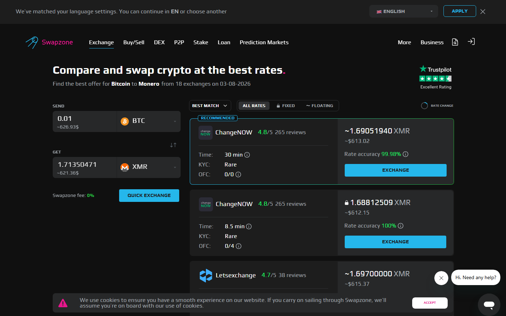
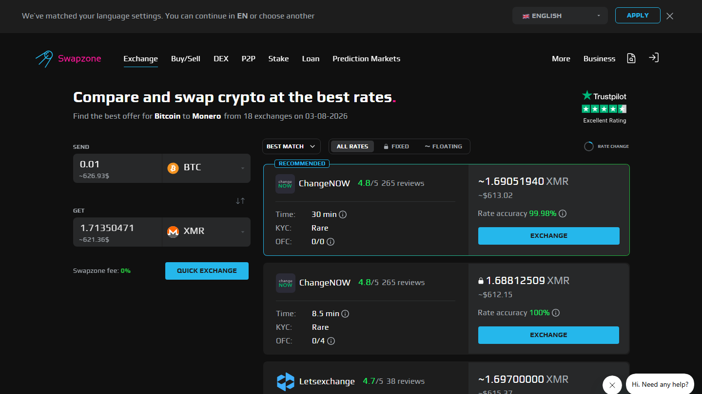

# Top 10 No-KYC Crypto Exchanges in 2026: What Still Works

For users in Indonesia, Thailand, and the Philippines, KYC requirements do more than collect data. They often block access entirely. OJK-licensed exchanges in Indonesia require full identity verification. SEC Thailand and BSP Philippines follow similar frameworks for regulated CEX operations.

But crypto-to-crypto swaps via non-custodial services operate under a different model. These services are not classified as regulated exchanges under current OJK, SEC TH, or BSP frameworks. No registration, no identity document, no KYC for standard swap sizes.

The 10 services below are tiered by KYC level, from zero to full.

| Service | KYC level | Type | Region access | No-KYC limit | Fiat |
|---------|-----------|------|---------------|--------------|------|
| [Swapzone](https://swapzone.io/) | 0 — none | Aggregator | Global | No stated limit | EUR/GBP/AUD/CAD/USD |
| [StealthEX](https://stealthex.io/) | 0 — none | Single provider | Global | No upper limit | No |
| [Exolix](https://exolix.com/) | 0 — none | Single provider | Global | Medium | No |
| [SimpleSwap](https://simpleswap.io/) | 0 — none | Single provider | Global | Low-medium | Limited |
| [SideShift.ai](https://sideshift.ai/) | 1 — email | Single provider | Global | Low | No |
| [ChangeNOW](https://changenow.io/) | 0-2 threshold | Single provider | Global | Medium-high | Limited |
| [Godex](https://godex.io/) | 0 — none | Single provider | Global | Lower | No |
| [LetsExchange](https://letsexchange.io/) | 0 — none | Single provider | Global | Medium | No |
| [Changelly](https://changelly.com/) | 2 threshold | Single provider | Global | Medium | Yes |
| [Binance](https://www.binance.com/) | 3 — full | CEX | ID/TH/PH (restricted by OJK/SEC/BSP) | N/A | Yes |

## Ranking scorecard

Scored out of 10. Total out of 50.

| Service | No-KYC policy | Accessibility SEA | Upper limit | Coin coverage | Fiat | Total |
|---------|-------------|------------------|-------------|---------------|------|-------|
| Swapzone | 10 | 10 | 9 | 8 | 10 | **47** |
| StealthEX | 10 | 10 | 10 | 7 | 0 | **37** |
| ChangeNOW | 7 | 10 | 8 | 8 | 4 | **37** |
| SimpleSwap | 10 | 10 | 7 | 7 | 3 | **37** |
| Exolix | 10 | 10 | 7 | 6 | 0 | **33** |

*Swapzone entry flow: no login, no identity check at aggregator level. Individual providers may trigger KYC at high amounts.*

| [SideShift](https://sideshift.ai/) | 8 | 10 | 5 | 5 | 0 | **28** |
| LetsExchange | 10 | 10 | 7 | 8 | 0 | **35** |
| Godex | 10 | 10 | 5 | 5 | 0 | **30** |
| Changelly | 6 | 9 | 6 | 6 | 8 | **35** |
| Binance | 0 | 5 | N/A | 10 | 10 | **25** |

**Scoring notes.** Swapzone leads because it is the only aggregator with full no-KYC access plus fiat support for EUR/GBP/AUD. For SEA users with foreign currency accounts or working remotely, the fiat coverage is relevant. StealthEX and ChangeNOW tie on the individual provider level, with StealthEX winning on no-upper-limit policy and ChangeNOW winning on speed. Binance scores lowest here because, while it is the most feature-complete exchange, it requires full KYC and operates under OJK/SEC TH/BSP licensing in SEA, making it not a no-KYC option.

## What "no KYC" actually means: four levels

Not all "no-KYC" claims are the same. Four distinct levels apply to the services in this comparison:

**Level 0 — no account, no email, non-custodial:** Swapzone, StealthEX, Exolix, SimpleSwap, Godex, LetsExchange. These require nothing from you before initiating a swap. No identity data, no email, no tracking beyond a transaction ID.

**Level 1 — email only, no government ID:** SideShift requests an email address. No photo ID or identity document required.

**Level 2 — threshold-triggered KYC:** ChangeNOW and Changelly operate without KYC for amounts below a threshold. Above it, identity verification is requested. The exact threshold is not publicly disclosed by either service.

**Level 3 — full KYC from sign-up:** Binance, [OKX](https://www.okx.com/), [Kraken](https://www.kraken.com/), and licensed CEX. Full identity verification, document upload, and facial recognition required before any trading activity.

## 10 No-KYC Services Reviewed (2026 List)

For users in Indonesia, Thailand, and the Philippines specifically, note that all Level 0 services in this list are accessible from these countries. None of these services are blocked at the service level for SEA — geo-restriction is applied only by specific CEX based on their regulatory licensing in the region.

**Live Screenshot — Swapzone No-KYC Entry Flow (July 2026)**
File: `../media/live-swapzone-homepage.png`
Alt text: `Swapzone homepage July 2026 showing no registration or KYC required to initiate a swap from Indonesia Thailand Philippines`
Caption: `Swapzone homepage reviewed in July 2026 — no account, no email, no KYC required. Accessible without geo-restriction from Indonesia, Thailand, and the Philippines.`

*Swapzone no-KYC entry flow, July 2026.*

[Swapzone requires no account, no email, no KYC — accessible from Indonesia, Thailand, and the Philippines.](https://swapzone.io/)

### Swapzone

**Our pick for:** Best overall no-KYC crypto-to-crypto access with fiat options for SEA users who hold EUR, GBP, or AUD accounts.

Swapzone is a non-custodial aggregator. It is not classified as a digital asset exchange under OJK, SEC Thailand, or BSP frameworks because it does not hold user funds or operate a trading platform. It queries 18-plus exchange partners and routes swaps through the selected provider.

For Indonesian, Thai, and Filipino users who have crypto from any source and want to swap without identity verification, Swapzone is the most complete option: no account, no email, rate comparison across 18-plus providers, and fiat pairs for EUR/GBP/AUD if relevant.

**Best for:** All crypto-to-crypto no-KYC swaps in SEA. Anyone with a foreign currency account needing fiat-to-crypto access.

**Not recommended for:** Buying crypto with IDR, THB, or PHP directly. Swapzone does not have SEA fiat rails — use a licensed local exchange for the fiat on-ramp.

The question of whether Swapzone and similar non-custodial services will remain outside OJK/SEC TH/BSP licensing scope is worth watching. Regulatory pressure on non-custodial services is increasing globally.

### StealthEX

**Our pick for:** Large no-KYC crypto-to-crypto swaps without upper limit from any SEA country.

StealthEX has no stated upper swap limit and no KYC requirement. A 4.7 grade on the Swapzone partner network. For Indonesian, Thai, or Filipino users swapping significant positions, StealthEX is the highest-ceiling no-KYC option available.

**Best for:** Large amounts where lower-limit no-KYC services are insufficient.

**Not recommended for:** Fiat on-ramp. IDR, THB, PHP not supported.

### ChangeNOW

**Our pick for:** Fastest no-KYC swap for standard amounts across SEA.

ChangeNOW processes standard pairs in 2 to 5 minutes with no registration. KYC triggers at threshold amounts, which means it is Level 2 on the KYC scale but accessible without verification for most retail swap sizes. Accessible in Indonesia, Thailand, and the Philippines without geo-restriction.

**Best for:** Speed-priority no-KYC swaps at moderate amounts.

**Not recommended for:** Very large amounts where the KYC threshold becomes relevant.

### SimpleSwap

**Our pick for:** Cleanest no-registration UX for first-time non-custodial swap from SEA.

SimpleSwap requires nothing beyond a destination address. The interface is minimal and direct — well-suited for users coming from a licensed CEX ([Indodax](https://www.indodax.com/), [Bitkub](https://www.bitkub.com/), [PDAX](https://pdax.ph/)) who are accessing a non-custodial service for the first time.

**Best for:** First non-custodial swap for SEA users. Simple flow without rate-comparison overhead.

### Exolix

**Our pick for:** Fixed rate no-KYC swaps from SEA.

Exolix offers fixed rate options without any registration requirement, accessible from Indonesia, Thailand, and the Philippines. For SEA users swapping on volatile days who want price certainty, Exolix delivers without identity verification.

**Best for:** Fixed rate certainty without KYC.

### SideShift, Godex, LetsExchange, Changelly

These services are accessible from SEA without geo-restriction. SideShift requires email (Level 1). Godex and LetsExchange are Level 0. Changelly is Level 2 with an undisclosed threshold. Each is a functional fallback for pairs where Swapzone's primary providers do not offer competitive rates.

### Binance (and licensed CEX)

Included for reference: Binance, OKX, Kraken operate in Indonesia (OJK-regulated), Thailand (SEC Thailand), and the Philippines (BSP) as fully KYC-required platforms. They are the correct tool for IDR, THB, and PHP fiat on-ramps. They are not no-KYC options.

## Regional notes for Indonesia, Thailand, and the Philippines

**Indonesia:** OJK-licensed digital asset exchanges (Indodax, [Tokocrypto](https://www.tokocrypto.com/)/Binance Indonesia, [Reku](https://reku.id/), [Pintu](https://pintu.co.id/)) require full KYC including national ID and selfie verification. Non-custodial services like Swapzone and StealthEX are accessible without restriction from Indonesian connections. They are not classified as OJK-regulated exchanges under current rules.

**Thailand:** SEC Thailand-licensed exchanges (Bitkub, OKX TH, Upbit TH) require full KYC. Non-custodial swap services operate outside SEC TH jurisdiction under current interpretations. Accessible from Thai connections.

**Philippines:** BSP-licensed exchanges (PDAX, [Coins.ph](https://coins.ph/)) require full KYC. Non-custodial services remain accessible. BSP has not classified non-custodial swap aggregators as VASPs requiring registration as of this review.

## The regulatory risk caveat

Non-custodial no-KYC services are not classified as illegal in Indonesia, Thailand, or the Philippines under current frameworks. However, regulatory environments are evolving. FATF Travel Rule pressure is increasing globally, and how non-custodial services are classified in SEA jurisdictions is subject to change.

Users should check the current regulatory position in their specific country before using any service for amounts above local threshold guidance. This is the standing caveat for this market — the landscape is not static.

## Country quick pick

**Indonesia:** Swapzone or StealthEX for crypto-to-crypto (no KYC). Indodax or Tokocrypto (Binance Indonesia) for IDR fiat on-ramp (full KYC required).

**Thailand:** Swapzone or SimpleSwap for no-KYC swaps. Bitkub for THB on-ramp.

**Philippines:** Swapzone or ChangeNOW for no-KYC swaps. PDAX or Coins.ph for PHP on-ramp.

## What we checked

We reviewed the public interfaces and regional accessibility documentation for all 10 services at time of review in July 2026. OJK, SEC Thailand, and BSP regulatory frameworks cited are based on publicly available licensing information as of the review date. Regulatory status changes — verify local regulations before use.

## What users actually say

Privacy-conscious users explain why no-KYC access was the deciding factor in their platform choice.

> "This was by far the easiest transaction for decentralized coin swap. I was skeptical at first but went for it. So glad I did. I was able to do this within 7 minutes. No KYC. Just wallet to middleman wallet to my other…" — [Roxy Wars](https://www.trustpilot.com/reviews/6506baf6d4a894e351c5520a) (★★★★★, 2023-09)

> "I had no idea this existed!!! It is super easy to use and saves me a lot of stress going between chains. Overall smooth experience." — [Baba](https://www.trustpilot.com/reviews/66573a27d03fd6c904c606f4) (★★★★★, 2024-05)

> "Swapzone.IO continues to deliver fast safe swaps of less common cryptos with no kyc I experienced. Great tool..." — [Bob Stanley Freos](https://www.trustpilot.com/reviews/625853d62b3c3c43cfd2f22b) (★★★★★, 2022-04)

*Based on 460 verified Trustpilot reviews. [See all Swapzone reviews on Trustpilot →](https://www.trustpilot.com/review/swapzone.io)*

## Frequently asked questions

**Are no-KYC crypto swaps legal in Indonesia?**
Crypto-to-crypto swaps via non-custodial services are not prohibited under current OJK regulations, which focus on licensed digital asset exchange operators. Non-custodial services are not classified as OJK-regulated exchanges as of this review. Regulatory interpretation may change.

**Which no-KYC service has the highest limits?**
StealthEX has no stated upper limit on most pairs. Swapzone's limit depends on which partner provider is selected.

**Can I buy IDR, THB, or PHP with Swapzone?**
No. Swapzone supports EUR, GBP, AUD, CAD, and USD as fiat pairs. For IDR, THB, or PHP on-ramp, use a locally licensed exchange.

**Does ChangeNOW always require KYC?**
No. ChangeNOW triggers KYC only above a certain transaction threshold. Most retail swap sizes do not trigger verification. The threshold is not publicly disclosed.

