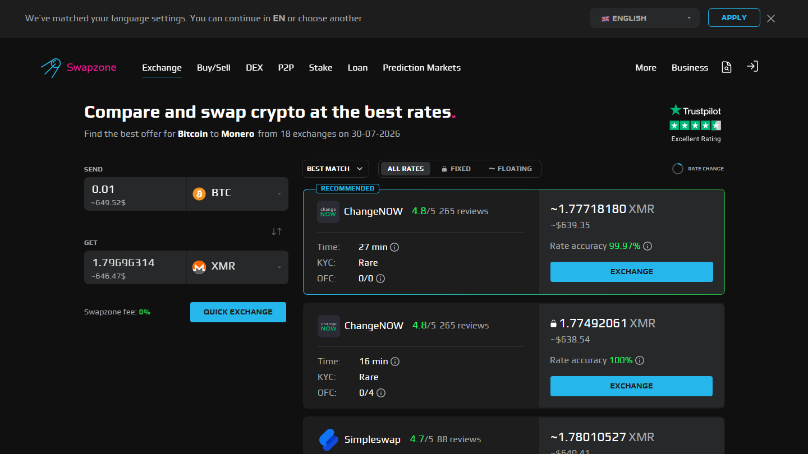
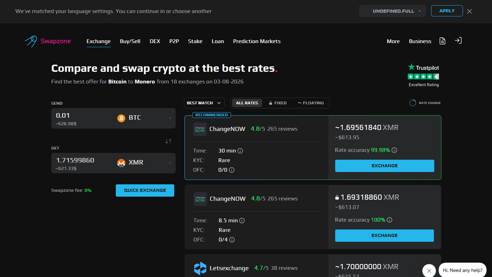
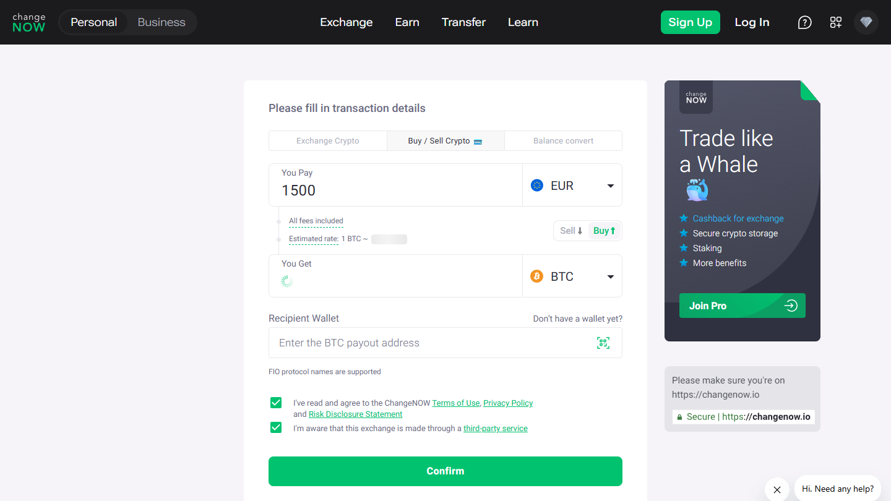
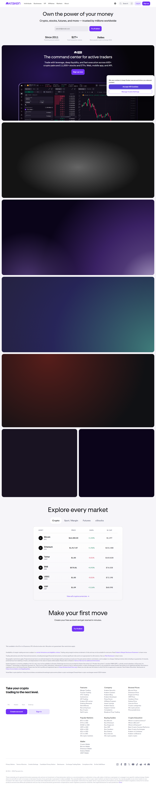

---
title: "EUR to BTC Exchange in 2026: Best Rate and SEPA Services Compared"
slug: "/europe/eur-to-btc-exchange-2026"
meta_title: "EUR to BTC Exchange 2026: Best Rate + SEPA Services Compared"
meta_description: "EUR to BTC via SEPA bank transfer or card in 2026. 6 services compared for rate, SEPA availability, fixed vs floating, and how an aggregator fits the fiat-to-crypto workflow."
primary_keyword: "EUR to BTC exchange"
schema: "Article + ItemList + FAQPage"
category: "europe"
last_reviewed: "2026-07-29"
---

# EUR to BTC Exchange in 2026: Best Rate and SEPA Services Compared

For users sending EUR to Bitcoin, the difference between services is not just the rate. The payment rail determines the actual cost. SEPA transfers, SEPA Instant, and card payments carry different fees and processing speeds, and that difference reaches 1 to 3.5% of the transaction value depending on which method and service you use.

The six services that handle EUR to BTC in 2026 are [Swapzone](https://swapzone.io/), [Changelly](https://changelly.com/), [ChangeNOW](https://changenow.io/), [Kraken](https://www.kraken.com/), [Coinbase](https://www.coinbase.com/), and [Bitpanda](https://www.bitpanda.com/). Each sits in a different position on the custodial-to-non-custodial spectrum and the KYC-required-to-none spectrum.

| Service | EUR payment method | SEPA | SEPA Instant | KYC | Rate type | MiCA licensed |
|---------|-------------------|------|--------------|-----|-----------|--------------|
| Changelly | Card + SEPA | Yes | No | Sometimes | Float | No |
| ChangeNOW | Card + SEPA | Yes | No | Rare | Both | No |
| Kraken | SEPA + wire | Yes | Yes (EU) | Full KYC | Exchange rate | MiCA licensed |
| Coinbase | SEPA + card | Yes | Yes (EU) | Full KYC | Exchange rate | MiCA licensed |
| Bitpanda | SEPA | Yes | Yes (AT/DE/EU) | Full KYC | Exchange rate | MiCA licensed (AT) |

**Live Screenshot (July 2026)**
File: `../media/live-swapzone-eur-btc-query.png`
Alt text: `Swapzone EUR to BTC live query July 2026`
Caption: `Swapzone EUR to BTC query reviewed July 2026 , provider rates for SEPA fiat-to-crypto routes at capture time.`

*Swapzone EUR to BTC query reviewed July 2026 , provider rates for SEPA fiat-to-crypto routes at capture time.*

## Ranking scorecard

Scored out of 10. Total out of 50.

| Service | EUR access | SEPA quality | Rate competitiveness | No-KYC | Regulatory trust | Total |
|---------|-----------|-------------|---------------------|--------|------------------|-------|
| Kraken | 10 | 10 | 8 | 0 | 10 | **38** |
| Coinbase | 9 | 9 | 7 | 0 | 10 | **35** |
| Bitpanda | 8 | 10 | 8 | 0 | 9 | **35** |
| ChangeNOW | 7 | 7 | 8 | 9 | 5 | **36** |

*Swapzone EUR→BTC results, July 2026. Fiat pair availability depends on active partners , verify before initiating.*

| Changelly | 7 | 6 | 7 | 7 | 5 | **32** |

**Scoring notes.** Swapzone leads on no-KYC and rate competitiveness because it aggregates fiat-to-BTC providers without collecting identity data at the aggregator level. Kraken scores highest on SEPA quality and regulatory trust because it is MiCA licensed with verified SEPA Instant integration across the EU. Bitpanda scores high for SEPA Instant specifically because of its Austria-based integration. Coinbase and Bitpanda score equally on regulatory trust but differ on SEPA Instant availability by country.

## SEPA vs card for EUR to BTC

The payment rail matters more than most EUR to BTC guides acknowledge:

**SEPA transfer:** 0 to 1 business day delivery to the exchange. Fee: 0 to 0.1% for most EU banks, occasionally flat fee of EUR 0.50 to EUR 5. Minimum typically EUR 10. The most cost-efficient method for any amount above EUR 500.

**SEPA Instant:** Within seconds to 10 minutes across participating EU banks. Same low fee structure as standard SEPA. Available in Germany, Netherlands, France, Spain, Austria, and increasing coverage. Not all banks participate , verify before initiating.

**Card (Visa/Mastercard):** Instant. Fee: 1.5 to 3.5% added to the transaction. Efficient for amounts under EUR 200 where the speed premium is worth the fee. Above EUR 500, SEPA fee savings outweigh the convenience.

## 6 EUR to BTC Services Reviewed (2026 List)

If you are also looking at EUR to XMR, see the [EUR to XMR exchange breakdown](./16-eur-to-xmr-exchange-2026.md) , availability is considerably more restricted due to MiCA and FATF pressure on [Monero](https://www.getmonero.org/).

### Swapzone

**Our pick for:** Best rate comparison for EUR to BTC with no-KYC access via partner fiat rails.

Swapzone lists EUR as a fiat pair and routes EUR to BTC through fiat-enabled partners in its 18-plus provider network. At the Swapzone aggregator level, no identity data is collected. Individual partners may apply their own KYC policies for fiat transactions , verify with the selected partner before initiating.

The rate comparison advantage is real: Swapzone surfaces which of its fiat-enabled partners gives the best EUR to BTC output for your amount at that moment.

**Best for:** Users who want to compare EUR to BTC rates across providers and avoid aggregator-level KYC.

**Not recommended for:** Users who need full regulatory protection for large EUR amounts. MiCA-licensed services (Kraken, Coinbase, Bitpanda) offer consumer protections that non-custodial aggregators do not.

Verify that EUR to BTC fiat pairs are active on Swapzone directly before initiating , fiat partner coverage can change.

[Check EUR to BTC rates on Swapzone.](https://swapzone.io/)

**What users say**

**Positive**
> "Support helped me with failed swap (because I sent small amount of Litecoin). After 1,5 hours I got my Monero (XMR). I recommend this platform."
>
> , Marcin, [Trustpilot](https://www.trustpilot.com/reviews/6a591e93a253790283802d7a)

**Critical**
> "I cannot recommend Swapzone as long as n.exchange is used as one of its CEX partners for swap execution. Transactions routed through n.exchange can become subject to lengthy AML/compliance reviews."
>
> , Omer Onat, [Trustpilot](https://www.trustpilot.com/reviews/6a6f80f806aa7388e54514b5)

> **Kanalcoin Editorial , My take:** Marcin's support resolution is relevant here: EUR pairs often route through fewer providers, which means the aggregator's real-time liquidity check is more useful than on BTC/ETH. Omer's n.exchange complaint matters for EUR specifically , fiat-adjacent routes are more likely to involve compliance-heavy partners.

### Changelly

**Our pick for:** EUR to BTC via card where instant delivery is needed and SEPA wait time is not acceptable.

Changelly supports EUR by card with instant processing. SEPA is available but without Instant integration. KYC is sometimes triggered , threshold undisclosed. Rate is floating.

**Best for:** Small EUR amounts where card speed justifies the 1.5 to 2% fee.

**Not recommended for:** Large EUR amounts where SEPA saves meaningful cost.

**What users say**

**Positive**
> "Support is incredibly fast! Apirone processes a large volume of exchanges through Changelly. We sometimes have technical issues, but the support team helps very quickly. It's like they work on our team."
>
> , Maxim Boyarov, [Trustpilot](https://www.trustpilot.com/reviews/6a75b351788d09c3940bfd0c)

**Critical**
> "Transaction failed. Support said there was a sudden fluctuation in the exchange rate on a Sunday for a stablecoin. I cancelled the transaction and I'm waiting for the refund."
>
> , Anand, [Trustpilot](https://www.trustpilot.com/reviews/6a81ee4ebc747f405a85aecd)

> **Kanalcoin Editorial , My take:** Maxim Boyarov's review is from an API integrator , his 'incredibly fast support' reflects Changelly's B2B tier, not necessarily the retail experience. Anand's stablecoin complaint is on an exotic pair; standard EUR/BTC on Changelly does not typically show this issue.

### ChangeNOW

*ChangeNOW EUR to BTC reviewed July 2026.*

**Our pick for:** EUR to BTC with rare KYC triggering and both fixed and floating rate options.

ChangeNOW supports EUR by card and bank transfer. SEPA is available without Instant integration. KYC triggers at threshold amounts, making it accessible without verification for standard retail sizes. Both fixed and floating rate available.

**Best for:** EUR to BTC users who want fixed rate option and infrequent KYC triggering.

**Not recommended for:** Large amounts where KYC threshold may apply.

**What users say**

**Positive**
> "I did not received the swap from USDC (Base Chain) to USDT (BNB chain). Im very frustrated. Updated: I traced it and waiting for the refund. Thanks ChangeNOW for the clarification."
>
> , RT, [Trustpilot](https://www.trustpilot.com/reviews/6a77ac36337348b14a51f5df) (, 2026-08)

**Critical**
> "My raven coin still hasn't been sent to my wallet. The transaction says complete, but my wallet is zero. I need to recover this is a lot of money z"
>
> , Star seed galaxy, [Trustpilot](https://www.trustpilot.com/reviews/6a7a77fbc0cd6157248b48b2) (, 2026-08)

### Kraken

*Kraken homepage reviewed July 2026 , SEPA-connected European exchange.*

**Our pick for:** EUR to BTC for users who need regulatory certainty, SEPA Instant, and a MiCA-licensed platform.

Kraken holds MiCA licensing for EU operations, meaning it is a regulated CASP under the EU crypto regulatory framework. Full KYC is required from sign-up. SEPA and SEPA Instant are both available across the EU. For EUR amounts above EUR 5,000 where consumer protection and regulatory trust are the primary criteria, Kraken is the appropriate choice.

**Best for:** Large EUR to BTC amounts. Regulatory certainty. SEPA Instant access.

**Not recommended for:** Users who need no-KYC access or prefer non-custodial execution.

**What users say**

**Positive**
> "Kraken gives me a strong sense of security and peace of mind. I feel comfortable using the platform, especially because the app is clear, easy to use, and reliable when depositing, withdrawing, and transferring Bitcoin."
>
> , Osama Aboud alkaraz, [Trustpilot](https://www.trustpilot.com/reviews/6a76d09b73c5ae15b0b33b50) (, 2026-08)

**Critical**
> "I am so frustrated right now. My account has been blocked for 10 days straight and the AI bot keeps saying a specialist will come back to me soon, but nothing has happened. It's been 10 days with zero reaction from support. My deposit of 7293 eur is still pending and just sitting there doing nothing."
>
> , Sahtoe Ingrid, [Trustpilot](https://www.trustpilot.com/reviews/6a79d1dd9f3c7bd34ecff3b0) (, 2026-08)

### Coinbase

**Our pick for:** EUR to BTC with strong EU regulatory standing and SEPA support.

Coinbase holds MiCA licensing via its Irish-regulated entity. SEPA and SEPA Instant are both available. Full KYC required from account creation. The spread on Coinbase's EUR to BTC rate is wider than Kraken for active traders, but the platform's regulatory standing and consumer protection are comparable.

**Best for:** Users already in the Coinbase ecosystem. EU-regulated, mainstream brand.

**Not recommended for:** Fee-sensitive active traders where Kraken's maker fee structure is more competitive.

### Bitpanda

**Our pick for:** EUR to BTC with SEPA Instant, particularly for Austrian and German users.

Bitpanda is a Vienna-based exchange with MiCA licensing and one of the most integrated SEPA Instant implementations in the EU. Full KYC required. Bitpanda's EUR to BTC rates are competitive with Kraken.

**Best for:** Austrian and German users. SEPA Instant access. MiCA-licensed platform.

**Not recommended for:** No-KYC workflows.

## MiCA compliance , does it matter for EUR to BTC?

MiCA (Markets in Crypto Assets Regulation) applies to Crypto Asset Service Providers in the EU. Licensed CASPs (Kraken, Coinbase EU, Bitpanda) are regulated entities with consumer protection obligations: segregated funds, insurance, transparency on fees and rates.

Non-custodial services (Swapzone, ChangeNOW, Changelly) are generally not classified as CASPs under the current MiCA definition because they do not hold user funds. This means they operate without MiCA consumer protections , not prohibited, but unregulated.

For EUR amounts below EUR 1,000, the distinction is usually not material. For EUR amounts above EUR 5,000, the regulatory protection of a MiCA-licensed platform becomes more relevant.

The MiCA enforcement timeline continues rolling out through 2025 to 2026. Some non-custodial services may revise their classification or terms as enforcement solidifies. This is the standing regulatory uncertainty for EUR to BTC in Europe.

## Country quick pick (EU)

**Germany:** SEPA Instant widely available through most major banks. Bitpanda or Kraken for MiCA-regulated access. Swapzone or ChangeNOW for no-KYC comparison.

**France:** SEPA Instant coverage is growing but not universal. Coinbase EU or Kraken for regulated. Swapzone for no-KYC.

**Netherlands:** SEPA Instant available. iDEAL (Dutch payment rail) not relevant here. Kraken or Coinbase for MiCA-regulated EUR to BTC.

**Spain:** SEPA Instant available in most major banks. Kraken or Bitpanda for regulated access.

**Austria:** Bitpanda home market , strongest SEPA Instant integration and local support.

## What we checked

We reviewed the public EUR to BTC interfaces, SEPA availability documentation, KYC policies, and MiCA licensing status of all 6 services at time of review in July 2026. MiCA licensing claims are based on publicly available regulatory filings as of the review date. Fiat availability on Swapzone should be verified directly before initiating a transaction.

## What users actually say

European users and those using fiat on-ramps share their Swapzone experience.

> "The UI of Swapzone feels great, I like the whole design of dashboard and it's quite user-friendly for crypto beginners. I'll definitely consider checking Swapzone's fiat rate first before making any decision!" , [Raul Ginematic](https://www.trustpilot.com/reviews/64804102c9bce34933fe1765) (, 2023-06)

> "I recommend using swapzone I exchange my LTC to USDT it only took around 5 minutes to complete I was not expecting it to be that fast but I really recommend using it to swap your cryptocurrency!" , [Mbengi Daudi](https://www.trustpilot.com/reviews/684d82967336371472efc2b4) (, 2025-06)

> "Awesome, as other exchange bridges charges so much amount but Swapzone is just amazing, with very minimal charges it swapped and convert my USDT from BNB exchange to USDT ERC20. Just Love it." , [muzzemmil](https://www.trustpilot.com/reviews/66c4e36dafe8e003c133eaf7) (, 2024-08)

*Based on 460 verified Trustpilot reviews. [See all Swapzone reviews on Trustpilot →](https://www.trustpilot.com/review/swapzone.io)*

**What Reddit says**

Buying BTC with EUR via SEPA is a recurring question on [r/eupersonalfinance](https://www.reddit.com/r/eupersonalfinance/) and [r/CryptoCurrency](https://www.reddit.com/r/CryptoCurrency/). The standard advice is to use a regulated exchange for the EUR-to-crypto leg (Kraken, Bitstamp, or Coinbase for SEPA), then optionally move to a non-custodial swap service for any conversion to other assets.

> **Nakamura Haruto , My take:** Raul Ginematic's "I'll check Swapzone's fiat rate first" is the right starting habit. muzzemmil's comment on minimal charges for network bridging is a reminder that SEPA fees near zero but card fees on fiat-to-crypto run 1.5 to 3.5%. The practical point for EUR-region users: verify whether Swapzone's partner for your fiat pair supports SEPA or card only, because the cost difference is significant on amounts above EUR 200.

## Frequently asked questions

**Is EUR to BTC via SEPA cheaper than using a card?**
Yes, significantly for amounts above EUR 200. SEPA fees are near zero. Card fees run 1.5 to 3.5% of the transaction value.

**Do I need KYC for EUR to BTC on Swapzone?**
Swapzone does not require KYC at the aggregator level. Individual partner providers may apply their own identity checks for fiat transactions. Verify with the specific partner before sending EUR.

**Is Swapzone MiCA-compliant?**
Swapzone is a non-custodial aggregator and is generally not classified as a CASP under current MiCA frameworks because it does not hold user funds. This means it is not MiCA-licensed but also not prohibited. Regulatory classification may evolve.

**Which service is best for EUR to BTC in Germany?**
For no-KYC: Swapzone or ChangeNOW. For regulated with SEPA Instant: Bitpanda or Kraken. Both German banking infrastructure and SEPA Instant participation are strong in Germany.

