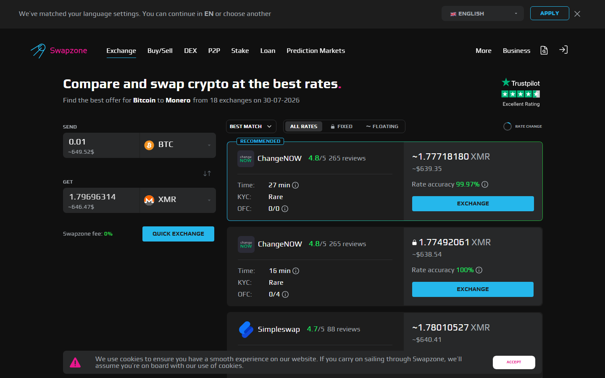
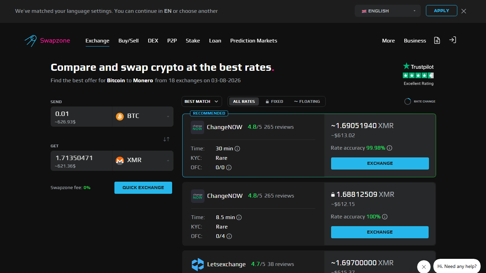

---
title: "EUR to XMR Exchange in 2026: 5 Services That Still Offer This"
slug: "/europe/eur-to-xmr-exchange-2026"
meta_title: "EUR to XMR Exchange 2026: 5 Services Still Available"
meta_description: "EUR to XMR is a restricted pair in 2026. 5 services that still offer it compared for rate, MiCA compliance, KYC requirement, and swap limits."
primary_keyword: "EUR to XMR exchange"
schema: "Article + ItemList + FAQPage"
category: "europe"
last_reviewed: "2026-07-29"
---

# EUR to XMR Exchange in 2026: 5 Services That Still Offer This

EUR to XMR is one of the hardest pairs to find in 2026. Not because the swap is complicated, but because most European exchanges have delisted Monero under MiCA and FATF pressure. Kraken removed XMR from EU accounts in early 2024. Binance delisted XMR globally. Bitpanda removed XMR from its European platform.

Five services still offer EUR to XMR access as of this review. All are non-custodial. None are classified as MiCA-regulated CASPs under current interpretations. Whether that remains true depends on how EU regulators classify non-custodial services in future MiCA revisions.

| Service | EUR accepted | XMR available | KYC | Rate type | EU accessible |
|---------|-------------|--------------|-----|-----------|--------------|
| Swapzone | Yes (via fiat partners) | Yes | None (aggregator) | Both | Yes |
| [StealthEX](https://stealthex.io/) | Card / crypto | Yes | None | Both | Yes |
| [ChangeNOW](https://changenow.io/) | Card / bank | Yes | Rare | Both | Yes |
| [Exolix](https://exolix.com/) | Card / crypto | Yes | None | Float | Yes |
| [Godex](https://godex.io/) | Crypto only | Yes | None | Float | Yes |

*Note: Godex accepts crypto-only as the send side. For EUR to XMR via Godex, the workflow is: EUR to USDT via a bank/card service, then USDT to XMR via Godex.*

**Live Screenshot (July 2026)**
File: `../media/live-swapzone-eur-xmr-query.png`
Alt text: `Swapzone EUR to XMR live query July 2026`
Caption: `Swapzone EUR to XMR query reviewed July 2026 -- provider availability for fiat-to-Monero route at capture time.`

*Swapzone EUR to XMR query reviewed July 2026 -- provider availability for fiat-to-Monero route at capture time.*

## Ranking scorecard

Scored out of 10. Total out of 50.

| Service | EUR fiat access | XMR coverage | No-KYC | Rate type | Upper limit | Total |
|---------|----------------|-------------|--------|-----------|-------------|-------|
| Swapzone | 9 | 9 | 10 | 10 | 8 | **46** |
| StealthEX | 6 | 9 | 10 | 10 | 10 | **45** |
| ChangeNOW | 8 | 8 | 7 | 9 | 8 | **40** |
| Exolix | 5 | 8 | 10 | 7 | 7 | **37** |

*EUR→XMR typically routes via BTC or ETH intermediate on most aggregators. Swapzone shows available paths in one query.*

| Godex | 0 | 8 | 10 | 7 | 5 | **30** |

**Scoring notes.** Swapzone leads because it aggregates fiat-enabled partners for EUR on the send side while querying the remaining XMR-available providers simultaneously. StealthEX scores highest on upper limit (no stated cap) which matters specifically for this pair where options are scarce. Godex scores last because it is crypto-only on the send side, requiring an additional step to convert EUR to a crypto bridge asset first.

## 5 EUR to XMR Services Reviewed (2026 List)

If you are specifically looking at EUR to BTC rather than XMR, see the [EUR to BTC exchange breakdown](./15-eur-to-btc-exchange-2026.md) — that pair has significantly wider service availability.

[Compare EUR to XMR rates across available providers on Swapzone — before they change.](https://swapzone.io/)

### Swapzone

**Our pick for:** Best EUR to XMR rate comparison across the remaining providers that still carry the pair.

Swapzone aggregates fiat-enabled partners for the EUR send side and queries XMR-carrying providers simultaneously. For EUR to XMR specifically, where options have narrowed, multi-provider comparison is more valuable than for common pairs with abundant liquidity.

No KYC is required at the Swapzone aggregator level. Individual partners in the fiat-to-XMR flow may apply their own identity checks for fiat payment processing. Verify with the specific partner before sending EUR.

**Best for:** Finding the best available EUR to XMR rate without manually checking each remaining service.

**Not recommended for:** Users who need the largest possible XMR output without any fiat processing step. StealthEX's direct crypto route may offer cleaner execution if EUR is first converted to USDT via SEPA.

### StealthEX

**Our pick for:** Largest EUR to XMR volumes without KYC ceiling, via card or crypto bridge.

StealthEX accepts EUR via card payment on the send side and has no stated upper limit for XMR on the receive side. No account, no identity verification. Fixed and floating rate available.

For users who cannot or do not want to use Swapzone's fiat partner flow, StealthEX's card-to-XMR path is the most direct alternative. The card fee (1.5 to 2.5%) applies on the EUR send side.

**Best for:** EUR to XMR at larger amounts. Users prioritizing no-KYC ceiling over SEPA rate efficiency.

**Not recommended for:** Users who want SEPA-rate EUR efficiency — StealthEX's EUR acceptance is card-only, not SEPA bank transfer.

### ChangeNOW

**Our pick for:** EUR to XMR with bank transfer option and faster swap completion.

ChangeNOW accepts EUR by card and bank transfer for XMR. Swap completion is 2 to 5 minutes faster than most alternatives on the exchange side. KYC is threshold-triggered, making it accessible without verification for most retail EUR to XMR amounts.

**Best for:** EUR to XMR with bank transfer option. Speed priority.

**Not recommended for:** Users who need guaranteed no-KYC at any transaction size, or amounts that may trigger ChangeNOW's undisclosed KYC threshold.

### Exolix

**Our pick for:** EUR to XMR with floating rate and no-KYC, for users prioritizing clean no-registration execution.

Exolix accepts EUR via card on the send side. Floating rate only — no fixed rate option for XMR on Exolix. No account, no identity verification. A functional option when Swapzone or StealthEX are not returning competitive quotes.

**Best for:** No-KYC EUR to XMR at standard amounts. Floating rate preference.

**Not recommended for:** Users who need fixed rate for XMR swaps, where execution windows are longer and floating rate variance is higher.

### Godex

**Our pick for:** EUR to XMR via a two-step bridge when other direct options are unavailable.

Godex accepts crypto only on the send side. The EUR to XMR workflow via Godex is: (1) EUR to USDT via a SEPA-enabled service (Kraken, ChangeNOW, Swapzone partner), (2) USDT to XMR via Godex.

This adds a step and a second swap fee, but remains a functional path when direct EUR-to-XMR providers show limited availability or poor rates. Floating rate only. No KYC. Upper limits lower than StealthEX.

**Best for:** Fallback option when direct EUR to XMR providers are unavailable or uncompetitive.

**Not recommended for:** Primary workflow. The two-step cost makes it inefficient compared to direct EUR to XMR when available.

## Why XMR is disappearing from European services

FATF Travel Rule implementation requires exchanges to collect and transmit sender and receiver information for transfers above threshold amounts. Monero's privacy design — specifically, its use of stealth addresses and ring signatures — is structurally incompatible with collecting this information at the blockchain level.

MiCA Article 76 creates additional pressure: CASPs must be able to identify asset controllers and freeze funds on regulatory order. This is not technically possible on Monero for service providers who are not custodying the asset.

Non-custodial services like Swapzone, StealthEX, and ChangeNOW are not currently classified as EU CASPs under MiCA because they do not hold funds or control private keys. This is why they can still offer the pair while Kraken and Binance cannot.

How EU regulators will classify non-custodial services in the next MiCA review is not confirmed. The pressure is ongoing.

## EUR to XMR workflow options

**Option A — Direct EUR to XMR via card:** EUR (card) to Swapzone or StealthEX or ChangeNOW to XMR. One step, card fee applies (1.5 to 2.5%).

**Option B — SEPA to USDT, then USDT to XMR:** EUR (SEPA) to a regulated exchange (Kraken) for USDT. Then USDT to XMR via Swapzone, StealthEX, or ChangeNOW. Two steps, lower fee on the EUR leg, standard swap fee on the XMR leg.

Option B is more efficient for amounts above EUR 1,000 where SEPA fee savings on the EUR leg outweigh the additional step.

## Country availability within Europe

All five services in this comparison are accessible from Germany, France, Netherlands, Spain, Austria, and the UK (post-Brexit, GBP not EUR). No geo-restriction specific to EU countries has been identified at time of review.

UK users: the same services are available with GBP pairs in some cases. Swapzone lists GBP as a fiat pair — verify GBP to XMR availability directly.

## The regulatory tension this article cannot resolve

Whether non-custodial EUR to XMR swaps remain accessible through 2027 depends on how EU regulators define non-custodial services in the next MiCA revision. The current window exists because of classification ambiguity, not because the regulatory direction is favorable to privacy coins. This will likely change. When, and how specifically, is not currently determinable.

## What we checked

We confirmed that all 5 services listed offer XMR pairs on their public swap interfaces at time of review in July 2026. We verified that Kraken EU and Binance have delisted XMR based on publicly available announcements. MiCA CASP classification assessments are based on publicly available regulatory documentation, not legal opinion. Fiat availability on Swapzone should be verified directly.

## Frequently asked questions

**Why did Kraken remove XMR from EU accounts?**
Kraken cited compliance with EU regulatory requirements, specifically FATF Travel Rule implementation and MiCA-related obligations. Monero's privacy design is incompatible with the identification requirements those regulations impose on licensed exchanges.

**Is EUR to XMR legal in the EU?**
Swapping EUR to XMR via non-custodial services is not prohibited in EU member states under current law. Licensed exchanges have chosen to delist XMR for compliance reasons, but non-custodial peer-to-peer swaps are not prohibited. Regulatory interpretation may evolve.

**Which service has the highest EUR to XMR limit without KYC?**
StealthEX has no stated upper limit. Swapzone's limit depends on which partner is selected for the fiat-to-XMR pair. Both are accessible without identity verification at the service level.

**Is there a SEPA option for EUR to XMR without card fees?**
ChangeNOW supports bank transfer (SEPA) on the EUR side for XMR. Swapzone partners may include SEPA options — verify the specific partner before initiating. Direct SEPA-to-XMR without card fees is available but limited to services that carry both SEPA integration and XMR pair coverage.
