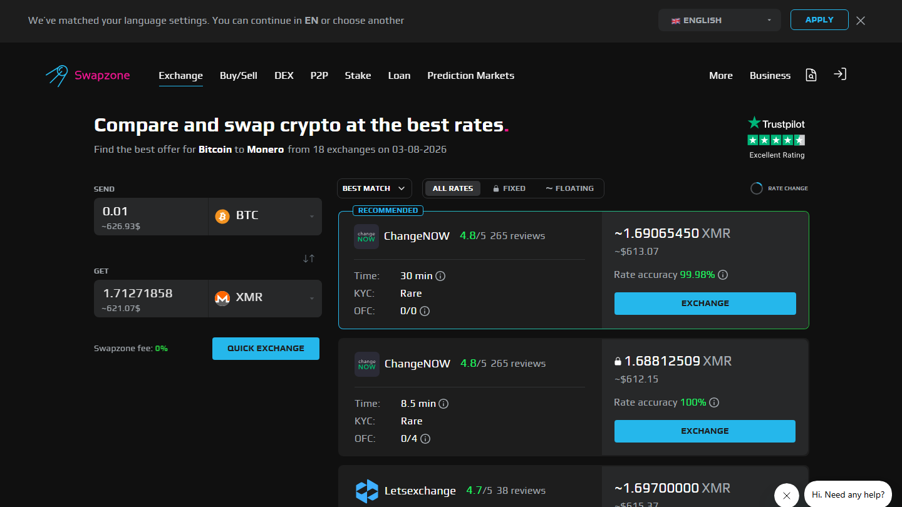

---
title: "DEX vs CEX vs Aggregator: Real Cost Comparison for Asia Users in 2026"
slug: "/asia/dex-vs-cex-vs-aggregator-cost-comparison-2026"
meta_title: "DEX vs CEX vs Aggregator 2026: Real Cost Comparison for Asia"
meta_description: "DEX, CEX, and aggregator each serve different use cases. Real cost comparison for 2026 including fees, KYC, custody model, and when each wins for SEA users."
primary_keyword: "DEX vs CEX crypto"
schema: "Article + FAQPage"
category: "asia"
last_reviewed: "2026-07-29"
---

# DEX vs CEX vs Aggregator: Real Cost Comparison for Asia Users in 2026

For users in Indonesia, Thailand, and the Philippines, the choice between a DEX, a CEX, and an aggregator starts with one question: can you get local fiat in?

If the answer is IDR, THB, or PHP, the path through a licensed local exchange (CEX) is unavoidable. No DEX accepts Indonesian rupiah directly. No aggregator currently supports IDR or THB on-ramp. The fiat entry point defines which tool is relevant for each use case.

| Dimension | DEX (e.g., Uniswap) | CEX (e.g., Binance, Bitkub) | Aggregator (Swapzone) |

*Swapzone aggregator: one query, rates from 18+ providers. Contrast with CEX (single platform rate) and DEX (on-chain liquidity pool).*

|-----------|--------------------|-----------------------------|----------------------|
| Fiat on-ramp | No | Yes — IDR/THB/PHP available on licensed SEA exchanges | EUR/GBP/AUD/CAD/USD only |
| KYC | None | Full (OJK/SEC TH/BSP required) | None |
| Swap rate | AMM price with slippage | Exchange spread | Best of 18+ providers |
| Gas fee | Yes — ETH: $5-20; BNB Chain: $0.50-2 | None | None (depends on chain) |
| Registration | None | Required | None |
| Custody | Self-custodial | Custodial | Non-custodial (routes to provider) |
| Local IDR/THB/PHP | No | Yes (via P2P or bank) | No |
| Tax record | No | Yes | No |

## DEX in Southeast Asia: where it works and where it does not

A DEX like Uniswap, PancakeSwap, or similar requires no registration and no KYC. You connect a wallet, approve the token swap, and transact on-chain. The swap rate is determined by the AMM (automated market maker) pricing formula, which includes slippage based on pool depth.

The friction for SEA users is the gas fee and the fiat gap. A $10 ETH gas fee on Uniswap is 2% overhead on a $500 swap — before factoring in the AMM spread. For users on BNB Chain (PancakeSwap), gas is $0.50 to $2, which is more manageable.

The fiat gap is fundamental: DEX does not accept IDR, THB, or PHP. To use a DEX, a user must already have crypto. That crypto typically came from a licensed CEX, which required full KYC. For first-time buyers, DEX is not the starting point.

DEX works well for SEA users who:
- Already hold crypto from a licensed exchange
- Are active DeFi users who understand liquidity pool mechanics
- Want on-chain execution without a centralized counterparty
- Are swapping within an ecosystem where DEX liquidity is deep (ETH mainnet, BNB Chain, Solana)

### A note on "AMM" for readers new to the term

AMM stands for Automated Market Maker. Instead of matching buy and sell orders between users, an AMM uses a mathematical formula (typically x multiplied by y equals k) to price swaps based on the ratio of two assets in a shared liquidity pool. The more of one asset you buy relative to pool depth, the worse your price — this is slippage.

## CEX in Southeast Asia: the necessary entry point

A licensed CEX is the only tool that directly accepts IDR, THB, and PHP. OJK-licensed exchanges in Indonesia (Indodax, Tokocrypto, Reku, Pintu) accept IDR via bank transfer. Bitkub and OKX TH accept THB. PDAX and Coins.ph accept PHP.

Full KYC is required by all licensed SEA exchanges without exception. OJK, SEC Thailand, and BSP mandate identity verification for all customer accounts. This means national ID upload, selfie verification, and in some cases address proof.

CEX is the correct tool for:
- First-time crypto buyers who need IDR/THB/PHP on-ramp
- Users who need regular fiat in/out access
- High-frequency traders who need advanced order types (limit, stop-loss)
- Users who need exchange-generated trade history for tax purposes

CEX is not optimal for:
- One-time crypto-to-crypto swaps at best rate (exchange spread applies; no multi-provider comparison)
- Users who prefer non-custodial execution (exchange holds your assets)
- Avoiding KYC (not possible on any licensed SEA exchange)

## Aggregator in Southeast Asia: the crypto-to-crypto layer

Swapzone and similar aggregators handle the crypto-to-crypto layer. Once a SEA user has acquired crypto via a licensed CEX (the fiat on-ramp), the aggregator finds the best rate for subsequent crypto-to-crypto swaps without requiring a new account.

What Swapzone does not offer for SEA users: IDR, THB, or PHP fiat pairs. The fiat currencies Swapzone supports via its partners are EUR, GBP, AUD, CAD, and USD. For SEA users who hold savings or receive payments in these currencies (remote workers, digital nomads, overseas workers in EUR/AUD countries), the fiat pairs are relevant. For users working entirely in IDR/THB/PHP, Swapzone is useful only after the local fiat-to-crypto step on a licensed exchange.

An aggregator is the right tool for:
- Crypto-to-crypto swaps after the initial fiat on-ramp
- Users who want best rate without creating another exchange account
- Non-custodial workflow (no exchange holds your funds between swaps)
- No-KYC access for subsequent swaps after the initial CEX onboarding

[Check live crypto-to-crypto rates on Swapzone — no account, no KYC.](https://swapzone.io/)

## Real cost comparison by scenario

**Scenario 1: First-time crypto buyer in Indonesia with 1,000,000 IDR**
Required tool: OJK-licensed CEX (Indodax, Tokocrypto, Reku, or Pintu). Full KYC required. IDR to BTC via bank transfer, low fee. No alternative path exists for this use case.

**Scenario 2: Indonesian user with USDT wanting to swap to ETH**
Best tool: Swapzone (no KYC, best rate from 18+ providers, no gas fee) or a DEX (no KYC, on-chain, gas fee applies). Swapzone wins on total cost for most amounts — no gas overhead.

**Scenario 3: Thai user wanting to rebalance from BTC to ETH**
Best tool: Swapzone (no KYC, rate comparison). DEX is an alternative if the user already has an Ethereum wallet and can absorb gas.

**Scenario 4: Filipino user wanting to swap BTC to XMR**
Best tool: Swapzone or StealthEX (no KYC, XMR-carrying providers). CEX cannot handle this pair in the Philippines. DEX does not list XMR.

## Country breakdown

**Indonesia:** OJK CEX (Indodax, Tokocrypto, Reku, Pintu) for IDR fiat on-ramp. Full KYC required. Then Swapzone for crypto-to-crypto at best rate. DEX for DeFi-native users comfortable with BNB Chain or Ethereum gas.

**Thailand:** Bitkub or OKX TH for THB on-ramp. Full KYC required. Then Swapzone for crypto-to-crypto. DEX accessible for users already in the DeFi ecosystem.

**Philippines:** PDAX or Coins.ph for PHP on-ramp. Full KYC required. Then Swapzone for crypto-to-crypto. DEX accessible post-onboarding.

## The fiat gap in SEA aggregators: an unresolved issue

Swapzone and most non-custodial aggregators do not support IDR, THB, or PHP. This is the practical gap for SEA retail users who work entirely in local fiat. Until aggregators integrate local payment rails for SEA currencies, the CEX-first workflow remains necessary for the on-ramp step.

Watch for: regional payment rail integrations from Swapzone or competitors in the 2026 to 2027 period. OJK, BSP, and Bank of Thailand have been expanding digital payment infrastructure — whether this connects to non-custodial aggregators is an open question.

## What we checked

We reviewed the public fee structures, KYC policies, and regional availability of the services and platforms mentioned in this comparison at time of review in July 2026. OJK, SEC Thailand, and BSP licensing information is based on publicly available regulatory data. DEX gas fee estimates reflect standard conditions on Ethereum mainnet and BNB Chain.

## Frequently asked questions

**Can I use a DEX in Indonesia without KYC?**
Yes. DEX platforms like Uniswap and PancakeSwap do not require registration or KYC. However, you must already have crypto to use a DEX — the IDR on-ramp requires a licensed OJK exchange with full KYC.

**Is Swapzone available in Thailand?**
Yes. Swapzone is accessible from Thailand without geo-restriction and without registration or KYC. It does not support THB as a fiat pair — the THB fiat on-ramp requires a Thai-licensed exchange.

**Which is cheapest for crypto-to-crypto swaps in SEA — DEX, CEX, or aggregator?**
For most crypto-to-crypto pairs, an aggregator like Swapzone is cheapest: no gas fee, best rate from 18-plus providers, no spread markup from a single exchange. DEX adds gas overhead. CEX adds exchange spread without multi-provider comparison.

**Does Swapzone have IDR or THB support?**
No. Swapzone's fiat pairs are EUR, GBP, AUD, CAD, and USD. IDR, THB, and PHP fiat pairs are not currently available.
