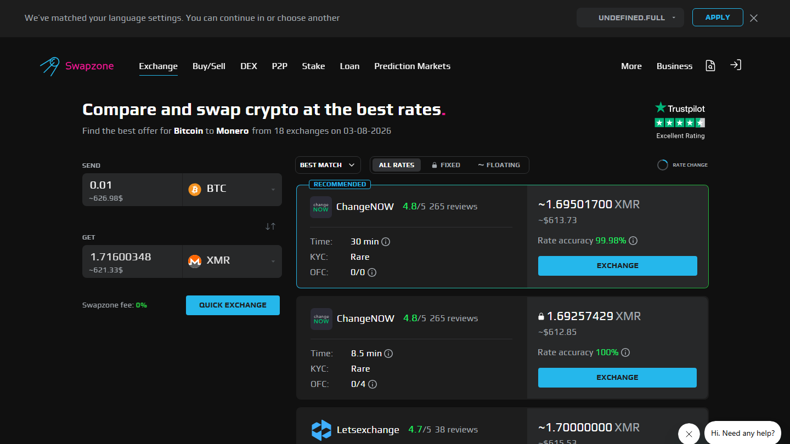
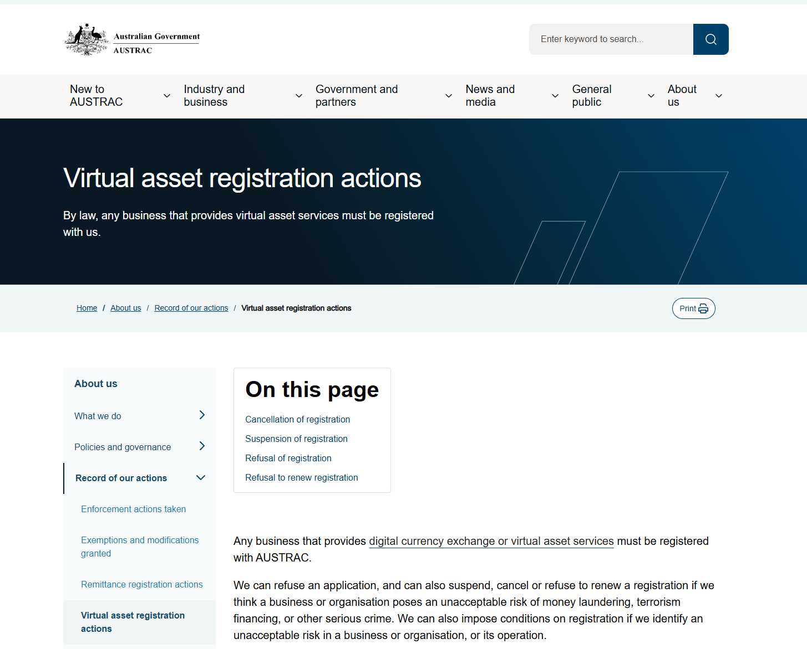

# AUD to BTC Exchange in 2026: Best Rate for Australian Users

For users in Australia, AUD to BTC has two distinct options: local exchanges with direct bank transfer in AUD, and aggregators like Swapzone that access the global best rate once you are already holding crypto.

The local AUD path — Independent Reserve, CoinSpot, Swyftx, BTC Markets — involves AUSTRAC registration, full KYC, and Australian bank transfer rails (POLi, BPAY, bank transfer). These are the only services that accept AUD directly. The aggregator path handles the crypto-to-crypto layer after the AUD on-ramp is complete.

| Service | AUD accepted | AUSTRAC registered | KYC | Rate type | Best for |
|---------|-------------|-------------------|-----|-----------|---------|
| Independent Reserve | Yes (POLi / bank) | Yes | Full | Exchange rate | Largest AUD volume, OTC |
| CoinSpot | Yes (POLi / BPAY / card) | Yes | Full | Exchange rate | Widest coin selection, simplest UX |
| Swyftx | Yes (bank / card) | Yes | Full | Exchange rate | Low maker/taker fees |
| BTC Markets | Yes (bank) | Yes | Full | Exchange rate | High-volume and OTC |
| Swapzone | AUD fiat pair (verify) | Not applicable | None | Aggregated | Crypto-to-crypto post on-ramp |

## Ranking scorecard

Scored out of 10. Total out of 50.

| Service | AUD access | AUSTRAC trust | Fee competitiveness | Coin coverage | No-KYC | Total |
|---------|-----------|--------------|---------------------|---------------|--------|-------|
| Independent Reserve | 10 | 10 | 8 | 7 | 0 | **35** |
| Swyftx | 9 | 10 | 9 | 8 | 0 | **36** |
| CoinSpot | 9 | 10 | 7 | 10 | 0 | **36** |

*Swapzone AUD?BTC, July 2026. AUD fiat support routed through select partners — verify availability at swapzone.io before initiating.*

| BTC Markets | 8 | 10 | 8 | 6 | 0 | **32** |
| Swapzone | 4 | N/A | 10 | 8 | 10 | **32** |

**Scoring notes.** Swyftx and CoinSpot tie at the top for different reasons: Swyftx wins on fee competitiveness, CoinSpot wins on coin coverage. Independent Reserve leads on institutional depth and OTC capability. Swapzone scores highest on no-KYC and rate competitiveness for the crypto-to-crypto layer but scores low on AUD access because direct AUD fiat pairs on Swapzone are limited and should be verified before use. BTC Markets is the preferred platform for high-volume and OTC transactions.

## Local AUD exchanges: the required first step

All four AUSTRAC-registered exchanges require 100-point identity verification before any AUD transaction can be processed. This is a federal requirement under Australia's Anti-Money Laundering and Counter-Terrorism Financing Act — no AUSTRAC-registered digital currency exchange can offer AUD on-ramp without full KYC.

### Independent Reserve

**Our pick for:** Largest AUD to BTC trading volume in Australia, and the preferred platform for OTC transactions above $50,000 AUD.

Independent Reserve is the most liquid AUD to BTC venue in Australia by trading volume. POLi instant bank transfer and standard bank transfer are both accepted. The platform has operated since 2013 and holds one of the longest track records of any Australian crypto exchange. OTC desk available for large transactions.

**Best for:** Large AUD to BTC transactions. OTC volume. Users who prioritize liquidity depth.

**Not recommended for:** Widest coin selection — Independent Reserve focuses on Bitcoin and major assets rather than altcoin breadth.

### CoinSpot

**Our pick for:** Widest coin selection and simplest UX for retail AUD to BTC buyers.

CoinSpot accepts POLi, BPAY, and card for AUD deposits. Coin selection is the widest of the four Australian exchanges. For retail users who want to start with BTC and later explore altcoins without switching platforms, CoinSpot's breadth keeps options open. AUSTRAC-registered and operating since 2013.

**Best for:** Retail buyers. Coin variety. Users new to Australian crypto exchanges.

**Not recommended for:** Active traders who need tight spreads — Swyftx's maker/taker fee structure is more competitive for frequent trading.

### Swyftx

**Our pick for:** Lowest fee structure for active retail AUD to BTC buyers.

Swyftx operates a maker/taker fee structure that is among the most competitive of the AUSTRAC-registered exchanges. Bank transfer and card accepted. AUSTRAC-registered. For users who will trade AUD to BTC and back regularly, Swyftx's fee structure accumulates meaningfully lower cost versus CoinSpot's spread model.

**Best for:** Fee-conscious active traders. Regular AUD to BTC buyers.

**Not recommended for:** OTC volume where Independent Reserve's depth is preferred.

### BTC Markets

**Our pick for:** High-volume AUD to BTC and institutional access.

BTC Markets is an older Australian exchange (founded 2013) with a focus on professional and institutional users. Bank transfer accepted for AUD deposits. Trading fee structure is competitive for high-volume activity. OTC capabilities for large orders. AUSTRAC-registered.

**Best for:** High-volume institutional activity. Professional trading.

**Not recommended for:** Retail users who prioritize UX or coin breadth.

## AUSTRAC registration: what it means for Australian users

All four local exchanges are registered as Digital Currency Exchanges (DCE) under AUSTRAC — Australia's financial intelligence agency and AML/CTF regulator. DCE registration requires:

- Full identity verification (100-point ID check)
- AML/CTF program implementation
- Suspicious matter reporting obligations
- Annual compliance reporting

This registration is not the same as a full financial services license (AFSL) — it is an AML registration. Users receive AML-related consumer protections but not the broader financial services protections of an AFSL-licensed entity.

The mandatory 100-point KYC check at AUSTRAC-registered exchanges means there is no AUD on-ramp for BTC in Australia without identity verification. This is not optional.

*Source: AUSTRAC.gov.au — Virtual asset registration actions. All AUD on-ramp exchanges listed in this article are registered digital currency exchanges under this framework.*

## Where Swapzone fits for Australian users

After buying BTC via a local exchange, Australian users who want to swap BTC to another crypto (ETH, XMR, USDT, etc.) can use Swapzone for the crypto-to-crypto leg without creating another account or undergoing additional KYC.

The workflow:

1. AUD to BTC via CoinSpot, Swyftx, Independent Reserve, or BTC Markets (full KYC required)
2. BTC to [any crypto] via Swapzone (no KYC, best rate from 18-plus providers, no additional registration)

This gives Australian users the AUSTRAC-compliant on-ramp for AUD and the most competitive rate for subsequent crypto-to-crypto swaps.

Swapzone's footer lists AUD as a fiat pair, which suggests some partners in the network accept AUD directly for crypto purchase. Verify this directly at swapzone.io before relying on it as an AUD on-ramp — fiat pair availability via partners can change, and card fee overhead on AUD pairs via Swapzone partners would be 1.5 to 3% versus near-zero for BPAY or bank transfer on local exchanges.

[Check Swapzone for your BTC to crypto swap after the AUD on-ramp.](https://swapzone.io/)

## The regulatory picture for Australia in 2026

ASIC (Australian Securities and Investments Commission) has been expanding its oversight of crypto assets beyond the current AUSTRAC framework. Proposed reforms to the financial services licensing regime for crypto exchanges are under consultation in 2026. How these reforms affect AUSTRAC-registered exchanges — particularly whether an AFSL becomes required for certain exchange activities — is not yet determined.

AUSTRAC-registered exchanges that operate within current requirements are not affected by uncertainty in the AFSL discussion, but Australian users should monitor whether the regulatory framework changes significantly in the 2026 to 2027 period. This is the standing regulatory open question for the Australian crypto exchange market.

## Country quick pick

**Australia (below $10,000 AUD):** CoinSpot or Swyftx for AUD to BTC. Then Swapzone for subsequent crypto-to-crypto swaps.

**Australia (above $10,000 AUD):** Independent Reserve or BTC Markets for volume and OTC. Then Swapzone for crypto-to-crypto layer.

**Australia (AUD to BTC + BTC to altcoin in one session):** AUSTRAC exchange for AUD step. Swapzone for the BTC to altcoin step.

## What we checked

We reviewed the public AUD acceptance, AUSTRAC registration status, and fee structures of Independent Reserve, CoinSpot, Swyftx, and BTC Markets at time of review in July 2026. AUSTRAC registration was confirmed via each exchange's public documentation. Swapzone's AUD fiat pair listing was observed in the site footer — direct verification is recommended before using Swapzone for AUD-to-crypto purposes.

## Frequently asked questions

**Do Australian crypto exchanges require KYC?**
Yes. All AUSTRAC-registered digital currency exchanges require 100-point identity verification under Australian AML/CTF law. There is no legal AUD to BTC on-ramp in Australia without identity verification.

**Which Australian exchange has the lowest fees for AUD to BTC?**
Swyftx's maker/taker fee structure is among the most competitive for active traders. CoinSpot uses a spread model that is simpler but typically slightly less efficient for frequent trading.

**Can I use Swapzone to buy BTC with AUD?**
Swapzone lists AUD as a fiat pair in its footer, suggesting partner coverage exists. Verify directly at swapzone.io before initiating — fiat partner availability changes, and card fees via Swapzone partners would likely be 1.5 to 3% versus bank transfer rates on local Australian exchanges.

**Is Independent Reserve the best Australian exchange?**
For large volume and OTC, yes. For retail buyers, CoinSpot and Swyftx offer better UX and coin selection. Best depends on use case.
