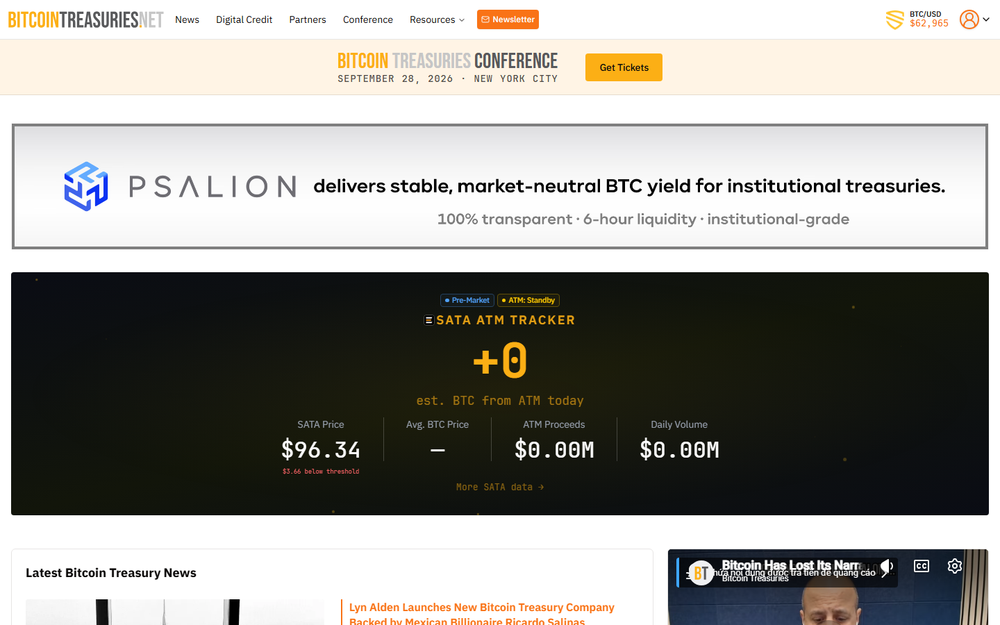

# Why Public Companies Are Expanding From Bitcoin Treasuries Into ETH, SOL and XRP

Over 80 public companies hold Bitcoin on their balance sheet as of mid-2026. A smaller but growing cohort, including SharpLink Gaming (ETH), DeFi Development Corp (SOL), and a cluster of Japan-listed firms, has begun adding non-Bitcoin assets as primary treasury positions. The pattern is not uniform in size or motivation, but it is now large enough to track as a structural market dynamic.

| Asset | Treasury adopters (public companies, mid-2026) | Dominant thesis | Volatility premium vs BTC | Key structural risk |
|---|---|---|---|---|
| Bitcoin | 80+ companies | Macro reserve, fixed supply narrative | Baseline | Governance, dilution risk |
| Ethereum | 15+ companies | Infrastructure exposure, staking yield | Higher | Regulatory classification uncertainty |
| Solana | 5+ companies | Higher-beta ecosystem bet, consumer/DeFi narrative | Highest | Ecosystem concentration, node centralization risk |
| XRP | 3-5 companies | Payments and cross-border settlement narrative | High | Ongoing legal clarity, thin institutional history |

## Why Bitcoin was the only viable starting point

Bitcoin treasury adoption had a structural logic in 2020-2023. The asset class had sufficient liquidity for meaningful buys without price impact. The narrative was compressible: scarce supply, no smart-contract risk, institutional recognition. Boards could authorise a BTC reserve without approving a whitepaper or an ecosystem thesis.

That simplicity kept alternatives out of the conversation. Most CFOs were not ready to approve an asset whose value proposition depended on staking mechanics, application layer growth, or payment network adoption. Bitcoin required the fewest explanation steps.

## Why the expansion is happening now

Three structural shifts opened the door.

**Liquidity deepened.** ETH, SOL, and XRP all have deeper spot and derivatives markets in 2026 than they did in 2021. A public company entering at a  to  scale faces less price impact and more exit optionality than it would have two years ago.

**Shareholder differentiation is harder.** Dozens of public companies now signal a Bitcoin reserve. That no longer distinguishes a firm the way it did when Strategy held a near-exclusive public claim to that narrative. A company adding ETH or SOL today can still make a first-mover claim in its specific ecosystem segment.

**The ecosystem stories matured.** Ethereum has a clear institutional track record in tokenization, settlement, and DeFi infrastructure. Solana has a high-throughput application layer with measurable daily active address growth. XRP has a decade of payment-network history and active legal resolution in the U.S. These are not 2017 whitepaper bets. They are ecosystems with operating histories.

## Ethereum: the infrastructure position

*BitcoinTreasuries.net, July 2026: corporate treasury tracking page reviewed directly to map public company BTC holdings and identify the structural baseline against which ETH and SOL treasury adoption is measured.*

SharpLink Gaming adopted an ETH treasury strategy in spring 2026, becoming one of the highest-profile non-Bitcoin treasury announcements of the year. The company framed the move as ecosystem alignment with Ethereum's application and infrastructure layers rather than a pure macro reserve bet.

The ETH treasury thesis typically includes three elements: settlement relevance (Ethereum remains the primary settlement layer for tokenised assets and DeFi), staking yield (ETH holders can earn protocol rewards through staking, adding a yield component absent in BTC), and institutional recognition (ETH is recognised alongside BTC in most institutional digital asset frameworks).

The structural tension is classification. Ethereum has not received definitive commodity classification under U.S. law in the same way that Bitcoin has. Companies taking an ETH treasury position carry regulatory classification risk that BTC holders do not face at the same level.

Mechanism: if ETH accrues institutional treasury adoption, demand concentrates above the staking lock floor, compressing available spot supply. That dynamic is already visible in on-chain data: staked ETH as a share of total supply was above 25% in mid-2026, reducing the liquid supply that spot buyers and sellers compete for.

## Solana: the high-beta ecosystem bet

DeFi Development Corp (formerly Janover) and Upexi have both structured public Solana treasury positions in 2026. Both framed the decision around conviction in Solana's consumer and DeFi application growth rather than a pure reserve posture.

Solana's treasury thesis is more ecosystem-concentrated than the Bitcoin or Ethereum versions. The argument is typically: Solana has the transaction throughput and fee economics to capture more retail and institutional application volume than competing chains, and holding SOL is a way to take a directional position on that outcome.

What makes this structurally different from an ETH position is the return profile. Solana has exhibited 2x to 3x the 30-day realised volatility of Bitcoin during periods of active market conditions. Companies entering a SOL treasury position are taking on more P&L volatility for the same dollar amount than an ETH or BTC position would generate.

Implication for market structure: SOL treasury announcements tend to generate immediate on-chain accumulation signals as other market participants front-run expected purchases. That pattern raises the effective entry cost for latecomers and reduces the return expectation from the announcement alone.

## XRP: the payments and settlement narrative

XRP treasury adoption is less common in public markets and more geographically concentrated. A cluster of Japan-listed companies has added XRP specifically for its cross-border settlement positioning, aligning with Ripple's largest regional market focus.

The XRP thesis is structurally distinct from ETH and SOL: it does not rest on application layer growth or staking mechanics. It rests on the claim that cross-border payment networks will eventually route through XRP's settlement infrastructure, and that holding XRP now is a way to take a long position on that adoption.

What to watch: XRP's liquidity profile differs from ETH and SOL in ways that matter for treasury strategy. Daily volume is more concentrated in a smaller number of exchange pairs, and the institutional futures market is less developed. A company adding XRP as a treasury asset faces a thinner exit market if the position needs to be unwound quickly.

## The structural risk map

The expansion from Bitcoin to other assets does not improve the risk profile of corporate crypto treasury strategies. It changes the character of the risk.

**Volatility risk.** Non-Bitcoin assets carry higher narrative volatility. A company that needs capital flexibility in 12 to 18 months faces more uncertainty with an ETH or SOL treasury than with BTC.

**Governance risk.** Boards approving non-Bitcoin positions face harder questions about strategic fit. "We hold ETH because we believe in staking infrastructure" is a more complex board-level claim than "we hold BTC as a reserve hedge."

**Dilution risk.** Several companies in the ETH and SOL treasury cohort have funded their positions through share issuances or at-the-market offerings. The dilution risk is not unique to non-Bitcoin positions, but it is more pronounced when the position thesis is harder to defend under board scrutiny.

**Narrative correlation.** ETH, SOL, and XRP all correlate meaningfully with BTC during risk-off periods. A multi-asset corporate treasury may look like diversification during normal conditions but behaves like a concentrated crypto position during drawdowns.

In a [r/CryptoCurrency thread tracking the largest public company crypto treasury positions](https://www.reddit.com/r/CryptoCurrency/comments/1qhl6lo/top_public_companies_countries_with_the_largest/), the top-voted comment asked whether China could hold Bitcoin while simultaneously banning it. That question is not just political: it points at the core structural issue for any sovereign or corporate holder. Announced treasury positions and actual custody control are different things. Companies with non-Bitcoin treasury positions face the same layered question: what does "holding" actually mean in terms of custody, counterparty exposure, and access under stress.

## What to watch

Three signals matter most for this market dynamic in the second half of 2026.

**Staking disclosures.** Companies holding ETH have an option to stake and earn yield. If public companies begin reporting staking income as a balance-sheet item, it changes the financial accounting model and may attract a different shareholder base. Watch Q3 2026 10-Q filings for any Ethereum staking income disclosure.

**Redemption pressure on SOL holders.** Two of the earliest SOL treasury companies entered at elevated price levels in early 2026. If SOL remains range-bound below those entry levels, redemption or liquidation announcements from smaller holders would confirm that the SOL treasury thesis is more fragile than the BTC version at lower capitalisation levels.

**XRP market structure bill.** If U.S. Congress passes a market structure bill that explicitly classifies XRP as a commodity, expect a material re-rating of XRP treasury positions. A securities classification would have the opposite effect. This is the single highest-impact binary event for the XRP treasury category in the current regulatory cycle.

---

## Why you can trust this guide

> This article is based on public corporate disclosures, regulatory filings, on-chain data, and market reporting reviewed in July 2026. The company examples cited are drawn from public announcements and press coverage. On-chain supply metrics are sourced from public blockchain data aggregators. Any claims about specific reserve sizes or staking percentages should be re-verified against the most recent disclosure at the time of reading.

## What we checked ourselves before building this analysis

For this article, we reviewed the BitcoinTreasuries.net tracking page directly to establish the baseline BTC corporate holding cohort and identify which non-Bitcoin assets appear in public company disclosures. That review covered public company entries and approximate holding sizes as of July 2026.

The screenshot above shows the live tracker page at the time of our review. What stood out immediately was not the number of Bitcoin holders. It was that the non-Bitcoin entries, while fewer, are now categorised and tracked at a level of institutional attention that did not exist two years ago. The data infrastructure for tracking ETH, SOL, and XRP corporate positions is still maturing, which is itself a signal about where institutional attention in this space is heading.

This review does not substitute for a full audit of each company's actual custody arrangements, staking configurations, or hedging positions. Those require regulatory filings and direct company disclosures.

## What this article verified and what it did not

| Claim | Status |
|---|---|
| BitcoinTreasuries.net tracking page reviewed and screenshot captured | Observed |
| Public company ETH treasury positions (SharpLink) verified via press coverage | Observed |
| Public company SOL treasury positions (DeFi Development Corp, Upexi) verified via press coverage | Observed |
| XRP treasury positions in Japan-listed companies verified via press coverage | Observed (regional sourcing) |
| On-chain staked ETH as share of total supply metric reviewed | Observed (public aggregator) |
| Specific holding sizes for all companies verified against latest disclosure | Not verified: requires live filing review |
| Staking income disclosures in SEC filings verified | Not verified: requires individual 10-Q review |
| Post-July 17, 2026 treasury announcements included | Not verified |

## FAQ

### Why are companies choosing ETH, SOL, or XRP rather than just holding more Bitcoin?

Different assets carry different narratives that appeal to different investor audiences. Ethereum signals infrastructure conviction, Solana signals high-beta ecosystem growth, and XRP signals payments positioning. Each allows a company to make a more differentiated claim than the now-crowded Bitcoin reserve narrative.

### Does holding ETH, SOL, or XRP on a balance sheet expose a company to more regulatory risk than holding Bitcoin?

Yes, in the U.S. context. Bitcoin has the clearest commodity classification signal from regulators. Ethereum, Solana, and XRP carry more regulatory classification uncertainty, which means a company holding them faces potential exposure to securities classification arguments that BTC holders do not face at the same level.

### Are non-Bitcoin corporate treasury strategies a sign the corporate crypto space is maturing?

Partially. Deeper liquidity and more developed ecosystem histories support a more diversified corporate positioning. But the risk profile does not improve with diversification during crypto-wide risk-off periods, because non-Bitcoin assets correlate strongly with Bitcoin in drawdown conditions.

## Sources

- BitcoinTreasuries.net, [Corporate Crypto Treasury Tracker](https://bitcointreasuries.net/)
- SharpLink Gaming, public announcements on ETH treasury strategy (spring 2026)
- DeFi Development Corp, public SOL treasury disclosures (2026)
- Ethereum Foundation, [Staking Statistics](https://ethereum.org/en/staking/)
