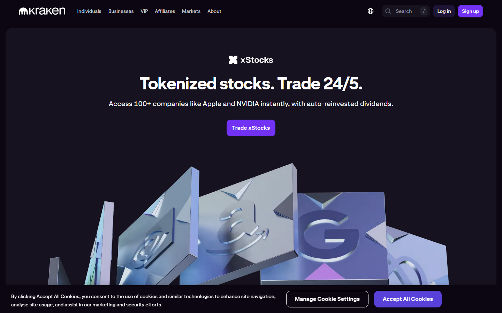
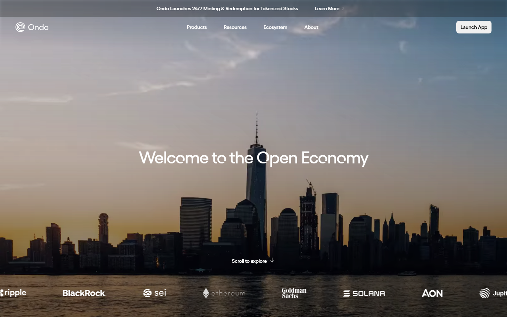

# Tokenized Stocks on Crypto Platforms: How They Work, What Traders Actually Own, and the Key Risks

Tokenized stocks are live products in 2026, not roadmap items. Kraken's [xStocks](https://www.kraken.com/pro/xstocks) covers over 50 equities and ETFs for non-U.S. clients. Ondo Finance [launched tokenized IVV and Micron securities](https://ondo.finance/) in the U.S. in July 2026. Coinbase launched [stock perpetual futures](https://www.coinbase.com/en-gb/blog/coinbase-launches-stock-perpetual-futures) for eligible international traders. What differs across all three is not the price exposure. It is what the buyer actually owns underneath the token.

| Platform | Model | What the buyer owns | Jurisdiction | 24/7 trading |
|---|---|---|---|---|
| Kraken xStocks | Custodially backed tokens | Claim on real shares via custodian | Non-U.S. (excludes UK, Canada, Australia) | 24/7 some pairs, 24/5 U.S. stocks |
| Ondo Finance | Custodially backed on-chain | 1:1 share backing, Broadridge proxy support | U.S. accredited and select international | Market hours constrained |
| Coinbase stock perps | Synthetic perpetual futures | Price exposure only, no share claim | Non-U.S. eligible traders | 24/7 |
| Generic synthetic | Synthetic or derivative | Price tracking, counterparty risk | Varies | Varies |

## What the three structural models actually are

### Model 1: custodial token (Kraken xStocks)

In this model, a custodian holds real shares. The token represents a claim tied to those holdings. The buyer has economic exposure connected to actual stock, but the legal rights differ from direct brokerage ownership.

Kraken says xStocks allow trading 24 hours a day, 7 days a week for some pairs, and 24 hours a day, 5 days a week for U.S. stocks and ETFs. The critical constraints: xStocks are available only to non-U.S. clients in select countries, with Canada, UK, and Australia explicitly excluded.

*Kraken xStocks page, July 2026: product positioning, available instruments, and jurisdiction restrictions reviewed directly as part of this analysis.*

Mechanism: the custodial model requires a regulated share custody arrangement to function. That arrangement adds a real counterparty layer that synthetic products do not have. The buyer is trusting both the token platform and the custodian. If either fails, the redemption path becomes unclear.

Implication: custodial tokenized stocks are closer to direct equity ownership in economic terms, but they are not legally equivalent to a brokerage account holding the same share. The access restrictions, trading window nuances, and custody chain distinctions all reduce the practical equivalence.

### Model 2: on-chain custodial token with shareholder rights (Ondo Finance)

Ondo's July 2026 launch of tokenized IVV (iShares S&P 500 ETF) and Micron shares is the closest current example to genuine on-chain share representation. Ondo said the underlying shares remain in the traditional U.S. custody chain, the tokens are backed 1:1, and token holders receive shareholder communications and proxy-voting support through Broadridge.

*Ondo Finance homepage, July 2026: product positioning and tokenized securities launch details reviewed directly.*

The SEC addressed this structure type in its January 28, 2026 [statement on tokenized securities](https://www.sec.gov/newsroom/speeches-statements/corp-fin-statement-tokenized-securities-012826-statement-tokenized-securities), noting that third-party tokenization models vary and that rights attached to a crypto asset "may or may not" differ materially from the underlying security. A submission to the SEC's Crypto Task Force [described both the digital receipt model and the synthetic model](https://www.sec.gov/files/ctf-written-james-overdahl-tokenized-us-equities-01-22-2026.pdf), with the explicit note that synthetic tokens do not represent actual share ownership.

Mechanism: Ondo's model puts the shares in the traditional custody chain and issues tokens as a representation of that custody claim. The token is not the share. It is a claim on the share through the custody structure.

Implication: this is structurally stronger than a synthetic product but not equivalent to holding the share directly through a broker. Redemption timelines, regulatory status of the token itself, and the role of Broadridge in mediating shareholder rights all create layers between the token holder and direct ownership.

### Model 3: synthetic perpetual future (Coinbase stock perps)

Coinbase's stock perpetual futures give eligible traders outside the U.S. continuous leveraged exposure to U.S. stock prices. No share is held. No custodian is involved. The product tracks price and settles in crypto collateral.

This is the cleanest product definition but the most important to communicate clearly: the buyer owns price exposure, not stock exposure. Corporate actions, dividends, and voting rights do not pass through.

Mechanism: the perpetual future is priced using a reference index. If the funding rate inverts, traders may pay to hold the position. The product is closer to a CFD or derivative than to equity.

Implication: synthetic products introduce counterparty risk and funding risk that direct ownership avoids. For traders who only need price exposure for hours or days, that may be acceptable. For anyone who wants to replicate equity ownership, it is not the correct tool.

## What the liquidity data shows

The liquidity gap between tokenized stocks and their underlying assets is material. In practice, a token representing Apple stock does not trade with the same depth as AAPL on Nasdaq. The spread is wider. Exit sizes are smaller. 

In an [r/DeFi thread on buying xStocks on Solana](https://www.reddit.com/r/defi/comments/1ok9226/where_can_i_buy_xstocks_tokenized_stocks_on_solana/), a user noted that "the liquidity of btc-xstock pairs is extremely [thin] and it is almost impossible to get fair prices converting directly. Best way to do it is either convert to fiat first and make the trade on a CEX." That friction is not a product flaw. It reflects the early-stage liquidity structure of tokenized equity markets: real price exposure, but thinner execution than the underlying market.

Thinner liquidity means:
- wider bid-ask spreads than the underlying equity
- larger price impact on exits above small position sizes
- potential for temporary price divergence from the underlying during low-liquidity periods

## The jurisdiction constraint is the real limiting factor

All three platform types face jurisdiction restrictions that make global rollout effectively impossible in the near term. Synthetic products face derivatives regulation in most markets. Custodial tokens require share custody relationships that depend on regulated intermediaries in each target market. On-chain tokens backed by U.S. securities face SEC perimeter questions about who qualifies as a buyer.

The result: every major tokenized stock product in 2026 is available to a subset of the global potential market. In many cases, the excluded markets are the largest ones. Kraken's xStocks exclude the U.S., UK, Canada, and Australia. Coinbase's stock perps are not available to U.S. customers. Ondo's products operate within accredited investor frameworks.

That is not a transitional limitation waiting to be resolved. It reflects the underlying regulatory architecture of global equity markets, which does not have a crypto-native bypass.

## What to watch

**SEC staff guidance on token classification.** The January 2026 SEC statement and the Crypto Task Force engagement both point toward more structured SEC commentary on tokenized securities in late 2026. If the SEC issues a no-action letter or formal exemption path for custodial tokenized shares, it would materially expand the eligible U.S. buyer base.

**Ondo's redemption mechanics in live conditions.** Ondo's model is the most structurally complete tokenized stock product currently live. The open question is how the redemption flow behaves under pressure. Watch for first live redemption cycle data, particularly whether token holders can exit to cash at net asset value without observable slippage.

**Funding rates on Coinbase stock perps.** Sustained backwardation (negative funding) on Coinbase's stock perps would indicate positioning imbalance. That is a direct signal about whether real demand exists for the product or whether it is being arb-traded for funding income rather than used as a genuine equity substitute.

---

## Why you can trust this guide

> This article is based on live public product surfaces reviewed in July 2026. We directly accessed the Kraken xStocks page and Ondo Finance homepage. SEC source documents cited are public regulatory materials. Claims about platform availability, jurisdiction restrictions, and structural mechanics are sourced from official platform communications. Specific claims about user counts, trading volume, or internal platform data are not verified: those require platform disclosures not available from public surfaces.

## What we checked ourselves before building this analysis

For this article, we reviewed the Kraken xStocks product page and Ondo Finance homepage directly in July 2026. Both screenshots above reflect what those surfaces showed at the time of review.

What stood out immediately on the Kraken xStocks page was the jurisdiction exclusion list, not the asset list. The list of countries where xStocks are unavailable is longer than most product writeups acknowledge. What stood out on the Ondo homepage was the institutional framing of the product: it is positioned at accredited and institutional buyers, not at retail crypto traders.

That contrast tells the clearest story in this space. The tokenized stock products with the strongest structural mechanics are the most restricted by access rules. The products with the broadest potential access are the most synthetic in their ownership structure.

This review covers public product surfaces only. It does not include logged-in workflow verification, live redemption testing, or custody chain inspection.

## What this article verified and what it did not

| Claim | Status |
|---|---|
| Kraken xStocks page reviewed and screenshot captured | Observed |
| Ondo Finance homepage reviewed and screenshot captured | Observed |
| SEC January 2026 tokenized securities statement reviewed | Observed |
| SEC Crypto Task Force submission on tokenized U.S. equities reviewed | Observed |
| Coinbase stock perpetual futures product page reviewed | Observed (from official blog) |
| Kraken xStocks jurisdiction restrictions verified against live page | Observed |
| Ondo 1:1 share backing and Broadridge proxy voting claim verified against official announcement | Observed |
| Live redemption mechanics tested | Not verified |
| Actual spread data on xStocks trading pairs | Not verified: requires live order book |
| Post-July 17, 2026 regulatory guidance incorporated | Not verified |

## FAQ

### Are tokenized stocks the same as real shares?

Not always. Some products are backed by real shares in a custody chain. Others only replicate price exposure through derivatives. The legal rights and redemption options differ sharply across models.

### Can tokenized stocks trade 24/7?

Some can, but it depends on the platform and model. Kraken says xStocks trade 24/7 for some pairs and 24/5 for U.S. stocks. Synthetic perpetuals can trade continuously. On-chain custodial products may be constrained by underlying market settlement windows.

### Who should use tokenized stocks?

They make most sense for traders who want stock price exposure inside a crypto-native account and who understand the specific ownership structure they are buying. They are not a substitute for direct brokerage ownership for investors who need clean shareholder rights, dividend access, or simple redemption paths.

## Sources

- SEC, [Statement on Tokenized Securities](https://www.sec.gov/newsroom/speeches-statements/corp-fin-statement-tokenized-securities-012826-statement-tokenized-securities)
- SEC, [Tokenized U.S. Equities, DeFi Trading, and the SEC's Exemptive Authority](https://www.sec.gov/files/ctf-written-james-overdahl-tokenized-us-equities-01-22-2026.pdf)
- Ondo Finance, [Ondo launches tokenized securities in the U.S.](https://ondo.finance/blog/ondo-launches-tokenized-securities-in-usa)
- Coinbase, [Coinbase Launches Stock Perpetual Futures](https://www.coinbase.com/en-gb/blog/coinbase-launches-stock-perpetual-futures)
- Kraken, [xStocks on Kraken Pro](https://www.kraken.com/pro/xstocks)
