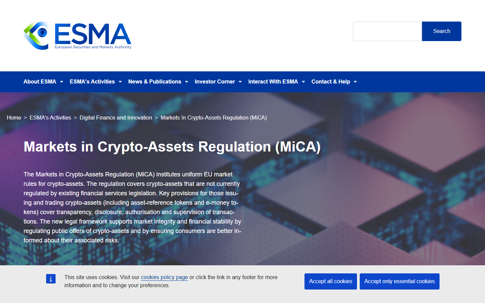
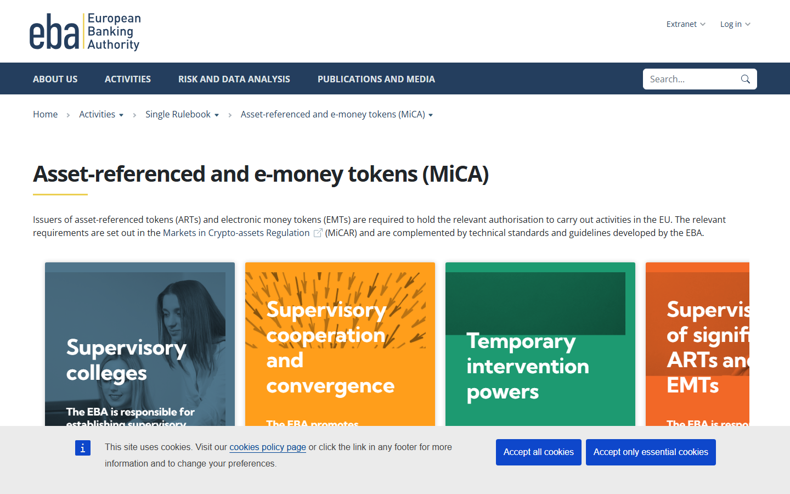

# MiCA Stablecoin Rules Explained: What the New Europe Framework Changes for Issuers and Users

MiCA created two regulatory categories for stablecoins in Europe: asset-referenced tokens (ARTs) and e-money tokens (EMTs). Stablecoins pegged to a single fiat currency, like USDC and USDT, are classified as EMTs. Multi-asset backed tokens are ARTs. The classification determines which supervisory authority handles oversight, what reserves must be held and reported, and whether the issuer can distribute freely across EU markets or must first obtain explicit authorisation.

| Category | Definition | Primary supervisor | Key requirement | Market example |
|---|---|---|---|---|
| EMT (e-money token) | Pegged to a single official currency | National competent authority (EBA for significant) | Electronic money institution authorisation or credit institution status | USDC (Circle authorised), EURC |
| ART (asset-referenced token) | References multiple currencies, commodities, or rights | EBA for significant ARTs | Whitepaper approval, reserve requirements, governance disclosures | Multi-asset backed tokens |
| Non-compliant stablecoin | Issued by non-authorised entity or non-EU structure | Not supervised | Delisting obligation for CASPs | USDT (Tether, as of EEA exchange delistings) |

## Why the classification split created immediate market consequences

The USDT delisting wave across European exchanges in 2024 and 2025 was a direct consequence of the ART/EMT authorisation requirement. ESMA stated that crypto-asset service providers should not continue listing non-compliant ARTs and EMTs, and that CASPs must move to comply: [ESMA guidance on non-MiCA compliant ARTs and EMTs](https://www.esma.europa.eu/press-news/esma-news/esma-and-european-commission-publish-guidance-non-mica-compliant-arts-and-emts).

Kraken, Coinbase, and Binance all announced European USDT delistings in the same period. Each framed it as MiCA compliance. The market-structure effect was immediate: USDC's share of European exchange volume increased as USDT was removed from pairs.

The pattern was not simply about compliance. It was about competitive positioning. Circle obtained the necessary authorisation for USDC and EURC to operate as compliant EMTs in Europe. Tether did not pursue the same authorisation path. That strategic divergence determined which stablecoin kept its European distribution access.

When Kraken delisted USDT and four other stablecoins for its European Economic Area clients, a [thread in r/CryptoCurrency](https://www.reddit.com/r/CryptoCurrency/comments/1ifalt1/kraken_will_delist_usdt_and_four_other_stablecoins/) captured the community's read precisely: "USDC is MiCA compliant. USDC is also backed  USD : 1 USDC. If Tether was willing to do the same thing it would be MiCA compliant as well." And then, separately: "Tether: no. I don't think I will." That exchange, blunt as it is, accurately maps the regulatory and strategic divergence driving European stablecoin market share shifts.

## What MiCA requires from issuers

### Authorisation path

An issuer of an EMT in the EU must be either an authorised credit institution or an authorised electronic money institution. [ESMA's Q&A 2404](https://www.esma.europa.eu/publications-data/questions-answers/2404) states that any issuer of an ART or EMT offered to the public or admitted to trading in the Union must hold this authorisation under Article 16(1) or Article 48(1).

For most stablecoin issuers, that means either obtaining an EU electronic money licence or partnering with an entity that holds one. Neither path is fast or cheap.

### Reserve requirements

MiCA sets specific reserve requirements for ARTs and EMTs. Reserves must be segregated, highly liquid, and structured to withstand redemption stress. The EBA oversees technical standards covering reserve liquidity, conflicts of interest, own funds requirements, and stress testing: [EBA MiCA token page](https://www.eba.europa.eu/regulation-and-policy/asset-referenced-and-e-money-tokens-mica).

*ESMA MiCA regulation page, July 2026: the agency's published framework for crypto-asset categories and implementation guidance reviewed directly.*

### Whitepaper obligations

Issuers must publish an approved whitepaper before any distribution to the public. The whitepaper covers token description, reserve composition, rights of holders, and risk factors. National competent authorities have approval and review powers over these documents.

### Significance thresholds

When an ART or EMT crosses thresholds on transaction volume, user numbers, or market capitalisation, it becomes "significant" and the EBA takes over direct supervision from the national competent authority. [EBA's supervisory role under MiCA](https://www.eba.europa.eu/activities/direct-supervision-and-oversight/ebas-supervisory-role-under-mica) describes this handover mechanism.

The significance threshold changes the issuer's supervisory relationship entirely. A stablecoin that was regulated nationally at launch can shift to direct EBA oversight without any product change. That creates planning complexity for issuers who expect growth.

## What changes for exchanges and wallets

### Listing decisions are now regulatory decisions

Before MiCA, an exchange could list a stablecoin based on liquidity, user demand, and platform strategy. After MiCA, listing a non-compliant stablecoin in the EEA is a regulatory violation. Exchanges had to delist or stop offering EU clients access to non-compliant tokens.

That shift from product decision to regulatory obligation changed the competitive dynamics of European exchange operations. Exchanges with strong EU user bases moved earlier and faster than global-first platforms.

### Passporting simplifies multi-market operation

The other side of the MiCA compliance burden is the passporting benefit. A CASP authorised in one EU member state can passport its services across all 27 EU markets under Article 59. [ESMA Article 59 authorisation](https://www.esma.europa.eu/publications-and-data/interactive-single-rulebook/mica/article-59-authorisation) governs that process.

For an exchange that previously needed 27 separate licensing arrangements to operate EU-wide, passporting is a structural simplification. The compliance cost to get to passporting is front-loaded. The benefit compounds across member states.

## What changes for users

### Narrower stablecoin choice in the short term

The immediate effect of MiCA compliance pressure was fewer stablecoin options on European exchanges. USDT was removed from many European trading pairs. Non-compliant ARTs were delisted. Users who preferred USDT for liquidity or familiarity faced a forced migration to USDC or EUR-denominated stablecoins.

*EBA MiCA ART/EMT regulation page, July 2026: the supervisory framework for significant stablecoins and the EBA's direct oversight role reviewed directly.*

### Regulatory clarity is not the same as user benefit

More regulated does not automatically mean better for users. Tighter reserve requirements, whitepaper obligations, and issuer authorisation all raise the cost of distributing a stablecoin in Europe. Those costs are borne partly by users through wider spreads, fewer market pairs, and reduced competitive pressure on fees.

The structural shift is real. But conflating compliance with user improvement misreads what MiCA is doing. It is building a supervisory architecture. Whether that architecture produces better stablecoin products over time is a market-structure question, not a regulatory one.

## The competitive split: Circle vs Tether in Europe

MiCA has created the sharpest competitive split in the stablecoin market since USDC launched. Circle's decision to pursue full MiCA authorisation, and Tether's decision not to, is now reflected in European market share data.

Circle's USDC and EURC are fully licensed. Tether's USDT is not distributed on EEA-compliant platforms. The  billion stablecoin market in Europe is being reorganised around that single authorisation decision.

The open question is whether European USDC adoption translates into global USDC market share growth, or whether Tether maintains dominance outside Europe while Circle wins the regulated corridor. Both outcomes can co-exist. The relevant market-structure signal is whether institutional and exchange flows in regulated markets shift the overall USDC-to-USDT ratio globally, or whether MiCA creates a regional compliance niche that does not affect the broader stablecoin market structure.

## The MiCA revision signal

The European Commission opened a targeted MiCA review consultation within six months of the regulation going live. That pace is unusual for EU legislative processes. The most likely areas of revision include the significance thresholds (considered by some market participants to be too aggressive), the treatment of non-EEA issued stablecoins used in cross-border transactions, and clarification on DeFi protocol obligations.

A revision cycle this early does not signal MiCA failure. It signals that the Commission intends to iterate the framework faster than typical EU regulatory timelines. For issuers and exchanges that built compliance stacks against the current version, revision creates partial obsolescence risk in those investments.

## What to watch

**EBA significance threshold decisions.** The first time EBA applies the significance threshold to a live issuer, it sets the precedent for how supervisory transfer works in practice. Watch for EBA announcements on significance determinations in the second half of 2026.

**Tether's European strategy, if any.** Tether has not publicly committed to a MiCA compliance path for the EEA market. If Tether begins the authorisation process, it would be one of the largest regulatory filings in the stablecoin market. If it does not, the USDT-USDC split in European markets becomes structural and permanent for this regulatory cycle.

**UK FCA stablecoin rules as a comparison point.** The UK proposed a 1% capital buffer for stablecoin issuers in June 2026, which is less stringent than MiCA's reserve requirements. If UK rules go live with lighter treatment, some stablecoin distribution may shift toward UK-domiciled structures to access a lighter regulatory regime while still reaching European audiences through other channels.

---

## Why you can trust this guide

> This article is based on live ESMA and EBA regulatory pages, ESMA Q&A documents, and official regulatory publications reviewed in July 2026. We directly accessed the ESMA MiCA regulation page and the EBA MiCA ART/EMT page. Sources cited are public regulatory materials. Stablecoin market share figures are based on published market reporting; specific percentages should be re-verified at time of reading. Post-July 17, 2026 regulatory updates are not incorporated.

## What we checked ourselves before building this analysis

For this article, we reviewed the live ESMA MiCA regulation page and the EBA ART/EMT supervision page directly in July 2026. Both screenshots above reflect those surfaces.

What stood out on the ESMA page was the volume of published Q&A and technical standards material. MiCA is not a document sitting on a shelf. It is being actively interpreted and supplemented in real time. The number of open standards processes suggests the implementation workload for issuers and CASPs is substantially larger than the top-level regulation text implies.

What stood out on the EBA page was the supervision handover structure. The language around "significant" ARTs and EMTs is carefully designed to leave flexibility in the threshold definitions. That flexibility will matter when the first major stablecoin crosses the significance boundary.

## What this article verified and what it did not

| Claim | Status |
|---|---|
| ESMA MiCA regulation page reviewed and screenshot captured | Observed |
| EBA MiCA ART/EMT page reviewed and screenshot captured | Observed |
| ESMA Q&A 2404 on ART/EMT authorisation requirement reviewed | Observed |
| ESMA guidance on non-MiCA compliant token delisting reviewed | Observed |
| EBA supervisory role under MiCA page reviewed | Observed |
| Kraken USDT EEA delisting via public press coverage confirmed | Observed |
| Circle USDC MiCA authorisation via public reporting confirmed | Observed |
| Tether non-authorisation path confirmed via public reporting | Observed |
| MiCA revision consultation via EC press release confirmed | Observed |
| Specific European stablecoin market share data verified | Not verified: requires current exchange data |
| EBA significance threshold applied to a specific live issuer | Not verified: no public determination as of July 2026 |
| Post-July 17, 2026 EBA or ESMA announcements | Not verified |

## FAQ

### What is the difference between an ART and an EMT under MiCA?

An ART seeks stable value by referencing another value, right, or combination of assets. An EMT seeks stable value by referencing a single official currency. Both require issuer authorisation, but EMTs face electronic money institution requirements specifically.

### Why was USDT delisted from European exchanges?

Tether did not obtain the electronic money institution authorisation required to distribute USDT as a compliant EMT in the European Economic Area. ESMA guidance requires CASPs to stop listing non-compliant tokens. Exchanges complying with that guidance removed USDT from their EEA product offerings.

### Does MiCA automatically make stablecoins safer?

Not by itself. MiCA creates a supervisory architecture: authorisation requirements, reserve standards, and oversight responsibilities. Whether those requirements produce better stablecoin products is a separate question. Reserve quality, issuer governance, and market liquidity all still matter independently of regulatory status.

### Could MiCA reduce the number of stablecoins available in Europe?

Yes, and this has already happened in the short term. Non-compliant tokens were delisted from European exchanges in 2024 and 2025. Whether that narrows permanently or new compliant tokens enter the market depends on the commercial attractiveness of EU market access relative to the authorisation cost.

## Sources

- ESMA, [Article 3 Definitions](https://www.esma.europa.eu/publications-and-data/interactive-single-rulebook/mica/article-3-definitions)
- ESMA, [Article 59 Authorisation](https://www.esma.europa.eu/publications-and-data/interactive-single-rulebook/mica/article-59-authorisation)
- ESMA, [Q&A 2404 on ARTs and EMTs](https://www.esma.europa.eu/publications-data/questions-answers/2404)
- ESMA, [Guidance on non-MiCA compliant ARTs and EMTs](https://www.esma.europa.eu/press-news/esma-news/esma-and-european-commission-publish-guidance-non-mica-compliant-arts-and-emts)
- EBA, [Asset-referenced and e-money tokens (MiCA)](https://www.eba.europa.eu/regulation-and-policy/asset-referenced-and-e-money-tokens-mica)
- EBA, [The EBA's supervisory role under MiCA](https://www.eba.europa.eu/activities/direct-supervision-and-oversight/ebas-supervisory-role-under-mica)
- European Commission, [Targeted Consultation on the Review of MiCA](https://finance.ec.europa.eu/regulation-and-supervision/consultations-0/targeted-consultation-review-mica-regulation_en)
