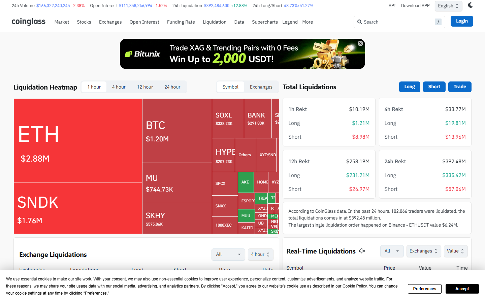
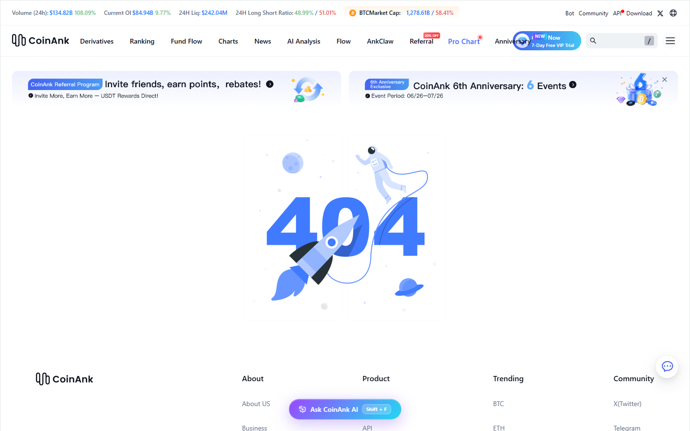

# 9 Best Crypto Liquidation Heatmaps in 2026

The best crypto liquidation heatmaps in 2026 are Coinglass, CoinAnk, Hyblock, TradingLite, Velo, DecenTrader, Kingfisher, TensorCharts, and Bookmap for crypto venues. Coinglass leads on breadth and daily usability. CoinAnk leads on derivatives-native focus. Hyblock and TradingLite serve traders who want narrower, more execution-oriented views of where leverage is crowding.

| Tool | Outstanding point | Score | Best for |
|---|---|---|---|
| Coinglass | Broadest exchange coverage and ecosystem integration | 5/5 | Daily all-around derivatives workflow |
| CoinAnk | Tightest futures-native signal hierarchy | 4.5/5 | Derivatives-first traders |
| Hyblock | Crowd positioning and cluster-level visibility | 4/5 | Identifying leverage density zones |
| TradingLite | Liquidation context near real-time chart execution | 4/5 | Chart-native traders |
| Velo | Richer pro-level derivatives context | 3.5/5 | Institutional desks with broader market needs |
| DecenTrader | Liquidation inside a broader market-structure toolkit | 3.5/5 | BTC-focused structure traders |
| Kingfisher | Visual-first liquidation zone monitoring | 3/5 | Narrative and visual flow traders |
| TensorCharts | Order book and footprint context around liquidation | 3/5 | Advanced order-flow readers |
| Bookmap | Execution-grade depth context | 3/5 | High-frequency and depth-driven traders |

## Why liquidation heatmaps matter

Crypto still trades with reflexive leverage. When price moves into a crowded leverage zone, liquidations can turn a normal move into a cascade. Heatmaps estimate where those clusters may sit before the move fully develops.

Used correctly, they help answer three things: where crowded long or short risk may be building; whether a move is likely to accelerate near a key level; and whether leverage is leading price or reacting to it.

Used incorrectly, they become a false precision trap. A heatmap is a probability model, not a live map of every position. The most common mistake is treating every bright zone as a guaranteed magnet.

Liquidation maps become reliable as analysis when paired with [open interest](/derivatives/open-interest/best-crypto-open-interest-dashboards-2026) change and [funding rate](/derivatives/funding-rate/best-crypto-funding-rate-trackers-2026) extremes. One metric alone is insufficient. When all three align, the setup has more structure.

## What we checked ourselves before ranking these tools

For this article, we reviewed the live public product pages of Coinglass, CoinAnk, Hyblock, and TradingLite directly in July 2026. We captured screenshots of each to verify what the first-screen experience actually communicates to a trader, not to depend on feature list copy from product marketing.

*Coinglass liquidation data page, July 2026: exchange-wide liquidation data, heatmap visualization, and OI context reviewed directly.*

*CoinAnk liquidation heatmap, July 2026: futures-native signal layout and leverage zone visualization reviewed directly.*

*Hyblock homepage, July 2026: crowd positioning and liquidation cluster product reviewed directly.*

*TradingLite homepage, July 2026: chart-integrated liquidation and order flow context reviewed directly.*

What stood out immediately in Coinglass was not the liquidation map itself. It was the surrounding context: the platform loaded OI, funding, and ETF flow panels alongside liquidation data without requiring a separate tab. That makes it the easiest all-around daily workflow for a trader who needs to check multiple derivatives layers quickly.

CoinAnk's first screen was more aggressive in its derivatives framing. OI change, long-vs-short ratio, and funding signals were front and center. That is a strength for a trader who already understands the relationship between these metrics. It is a steeper initial experience for anyone who wants a softer introduction.

Hyblock immediately signaled its specialization in crowd positioning. The product framing emphasized liquidation cluster density rather than broad market data. TradingLite's public page positioned itself around chart-embedded liquidity and order flow, closer to an execution workstation than a monitoring dashboard.

This review covered public product surfaces only. Logged-in features, premium tier capabilities, and live alert systems were not tested.

## The 9 best crypto liquidation heatmaps in 2026

### 1. Coinglass

Coinglass is the most complete starting point for most traders because the liquidation heatmap does not sit alone. The platform integrates OI, funding rate, long-short ratio, and ETF flow context inside the same environment. When our team reviews a liquidation zone, we check [open interest](/derivatives/open-interest/best-crypto-open-interest-dashboards-2026) and [funding rate](/derivatives/funding-rate/best-crypto-funding-rate-trackers-2026) in the same workflow without switching tools.

**Best for:** traders who open one tab and need to move across multiple derivatives signals quickly.
**Main tradeoff:** the broad layout can feel busy if the only goal is a clean, narrow liquidation screen.

### 2. CoinAnk

CoinAnk frames liquidation maps inside a tighter derivatives-native environment. OI change, long-short balance, and funding signals appear on the primary screen alongside heatmap data. For a trader who already thinks in terms of crowding, positioning pressure, and leverage zone density, CoinAnk's layout accelerates the workflow.

**Best for:** derivatives-first traders who want liquidation maps with OI and long-short context already integrated.
**Main tradeoff:** the interface is less welcoming for traders who are still learning how liquidation zones and [open interest](/derivatives/open-interest/best-crypto-open-interest-dashboards-2026) interact.

### 3. Hyblock

Hyblock specializes in crowd positioning and liquidation cluster visualization. Its heatmaps emphasize zone density rather than broad market context, which makes it useful for traders who want to see where leverage is concentrated most tightly at specific price levels.

**Best for:** traders who want a dedicated focus on leverage density and crowd positioning above general market monitoring.
**Main tradeoff:** narrower market context than Coinglass; works better as a supplement than a primary terminal.

### 4. TradingLite

TradingLite integrates liquidation data with order flow and chart-native execution context. The product positions itself closer to a trader's charting environment than a standalone data dashboard. For users who want to see liquidation zones next to volume profiles and footprint data, TradingLite provides that integration.

**Best for:** chart-native traders who want liquidation context near their execution flow rather than in a separate monitoring window.
**Main tradeoff:** more suited to technical analysis-first traders than macro derivatives watchers.

### 5. Velo

Velo provides a professional derivatives terminal that includes liquidation data within a broader market-structure and flow context. It sits in the institutional-leaning tier of the market and is best understood as a complement to, rather than a replacement for, simpler heatmap tools.

**Best for:** desks that want liquidation context embedded in a multi-asset, professional derivatives stack.
**Main tradeoff:** higher access friction than Coinglass or CoinAnk for traders who want immediate free-tier visibility.

### 6. DecenTrader

DecenTrader integrates liquidation maps with a broader Bitcoin market-structure toolkit. The platform combines on-chain and derivatives signals, which makes it useful for BTC-focused traders who want liquidation zones interpreted alongside longer-term market-structure context.

**Best for:** BTC-focused traders who want liquidation data interpreted within a wider structural view.
**Main tradeoff:** less altcoin coverage than Coinglass or CoinAnk.

### 7. Kingfisher

Kingfisher focuses on visualizing liquidity pools and liquidation zones in a way that emphasizes visual pattern recognition. It tends to attract traders who think in terms of liquidity hunts and narrative flow rather than pure quantitative overlay.

**Best for:** visual-first traders and those who use liquidity pool narratives as part of their analysis.
**Main tradeoff:** less systematic than Coinglass or CoinAnk for cross-metric derivatives work.

### 8. TensorCharts

TensorCharts centers on order book depth and footprint context, with liquidation zone data available as part of that layered view. For traders who read market microstructure, TensorCharts provides more execution-level depth than a standard heatmap.

**Best for:** advanced traders who want order book and footprint context alongside liquidation zone awareness.
**Main tradeoff:** steeper learning curve; not suited for users who want fast daily monitoring.

### 9. Bookmap for crypto venues

Bookmap is primarily known as an equities execution tool, but it supports crypto venues where connectivity is available. For traders who want depth-of-market visualization and can supplement it externally with derivatives data, Bookmap provides the most granular execution-level view on this list.

**Best for:** depth-driven and high-frequency traders who prioritize order book density over standard heatmap readability.
**Main tradeoff:** requires external sources for OI, funding, and exchange-level liquidation data.

## Best liquidation heatmap by use case

- Best for most traders: Coinglass
- Best derivatives-first alternative: CoinAnk
- Best for execution-chart integration: TradingLite
- Best for crowd positioning focus: Hyblock
- Best for depth-of-market reading: TensorCharts or Bookmap

## How our team avoids bad liquidation-map calls

One of the most common mistakes is treating every bright zone as a guaranteed magnet. Before writing any directional view based on liquidation data, the MarketBit team runs three checks:

1. [Open interest](/derivatives/open-interest/best-crypto-open-interest-dashboards-2026): is OI expanding into the move or already draining? A zone that coincides with falling OI is weaker.
2. [Funding rate](/derivatives/funding-rate/best-crypto-funding-rate-trackers-2026): is funding extreme enough to support a squeeze thesis? Neutral funding dampens the cascade probability.
3. Market structure: does the liquidation zone align with an obvious support or resistance level? Isolated heatmap clusters without structural anchors have lower follow-through.

If those three layers do not align, the signal is downgraded, not amplified.

In a [r/CryptoCurrency resource thread on DYOR tools](https://www.reddit.com/r/CryptoCurrency/comments/osmb00/several_resources_and_websites_to_help_you_dyor/), users recommended tracking "pure statistics" sources and flagging whenever a site "leans towards one side or the other." That observation maps exactly onto how liquidation heatmaps should be read: the tools that present raw leverage data without embedded directional bias are the ones worth using as primary sources. The ones that frame heatmaps as buy or sell signals are harder to use analytically.

## What liquidation maps can and cannot tell you

They can show: where crowded leverage may sit; likely volatility expansion zones; areas where reflexive cascade risk is elevated.

They cannot show: who will defend a level; whether spot demand absorbs the cascade; whether a macro catalyst overrides the mechanical setup.

## What to watch

**CME Bitcoin futures open interest relative to perps.** When CME OI diverges meaningfully from offshore perpetual OI, the liquidation map changes character. CME expiries create mechanical cascades at specific dates that perpetual-only heatmaps cannot capture.

**Altcoin liquidation concentration.** When BTC liquidation zones are thin but altcoin liquidation zones are crowded, cascades tend to originate in smaller caps and spread to BTC rather than the reverse. Watch for cross-market concentration shifts in [OI by asset](/derivatives/open-interest/best-crypto-open-interest-dashboards-2026).

**Negative [funding rate](/derivatives/funding-rate/best-crypto-funding-rate-trackers-2026) plus dense long liquidation cluster.** This is the highest-risk combination: market has already moved against longs to the point where funding inverted, but the liquidation cluster still has not cleared. Unresolved clusters below current price with inverted funding indicate mechanical downside pressure that has not fully expressed.

---

## Why you can trust this guide

> This guide is based on live public product pages for Coinglass, CoinAnk, Hyblock, and TradingLite reviewed directly in July 2026. Screenshots above were captured from live product surfaces. Claims about Velo, DecenTrader, Kingfisher, TensorCharts, and Bookmap are based on publicly available product descriptions and known market positioning; full logged-in workflow tests for those tools were not completed. Any claims about exchange coverage counts or premium tier features should be verified against current platform documentation before publication.

## What this review verified and what it did not

| Claim | Status |
|---|---|
| Coinglass liquidation page reviewed and screenshot captured | Observed |
| CoinAnk liquidation heatmap reviewed and screenshot captured | Observed |
| Hyblock homepage reviewed and screenshot captured | Observed |
| TradingLite homepage reviewed and screenshot captured | Observed |
| Coinglass OI and funding integration reviewed on live page | Observed |
| Velo, DecenTrader, Kingfisher logged-in workflow tested | Not verified |
| TensorCharts and Bookmap full feature comparison | Not verified |
| Exchange coverage counts for all tools verified against current docs | Not verified |
| Premium tier features and alert systems tested | Not verified |
| Post-July 17, 2026 product updates included | Not verified |

## FAQ

### Are liquidation heatmaps accurate?

They are directional probability tools, not exact maps of every forced close. They are built from estimated leverage positions at price levels, not confirmed live order data.

### What is the best free crypto liquidation heatmap?

Coinglass provides the most complete free-tier access for most users. CoinAnk is the best free alternative for a more derivatives-focused layout.

### Should liquidation maps be used alone?

No. They become more reliable when paired with [open interest](/derivatives/open-interest/best-crypto-open-interest-dashboards-2026) change, [funding rate](/derivatives/funding-rate/best-crypto-funding-rate-trackers-2026) extremes, and nearby market structure context.

## Sources

- Coinglass, [Liquidation Data](https://www.coinglass.com/LiquidationData)
- CoinAnk, [Liquidation Heatmap](https://coinank.com/liqheatmap)
- Hyblock Capital, [Homepage](https://hyblockcapital.com/)
- TradingLite, [Homepage](https://tradinglite.com/)
- Velo, [Homepage](https://velo.xyz/)
- DecenTrader, [Homepage](https://decentrader.com/)
- Kingfisher, [Homepage](https://kingfisher.team/)
- TensorCharts, [Homepage](https://tensorcharts.com/)
- Bookmap, [Homepage](https://bookmap.com/)
