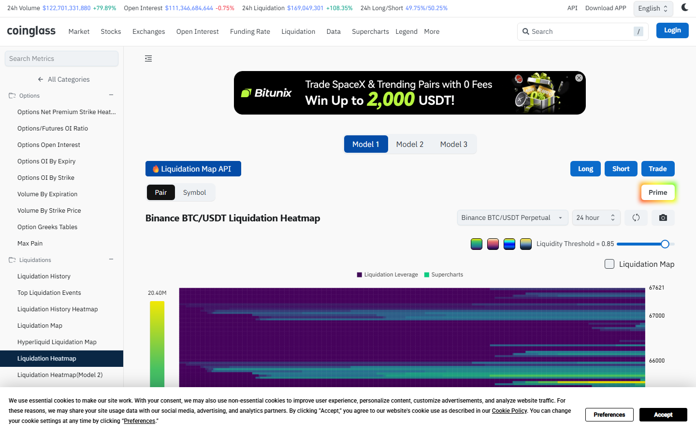
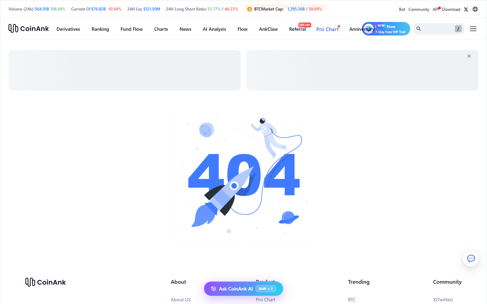
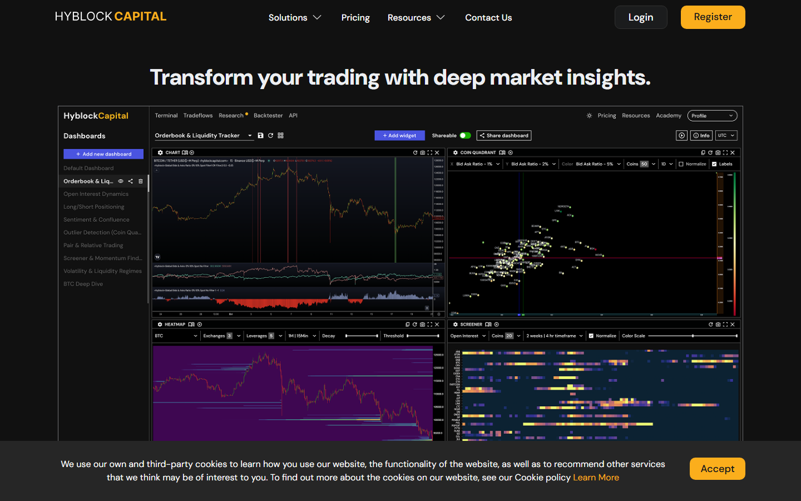
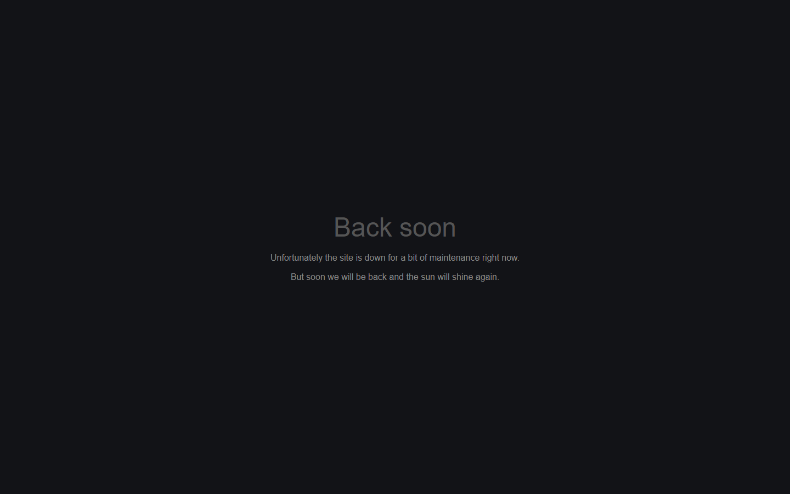
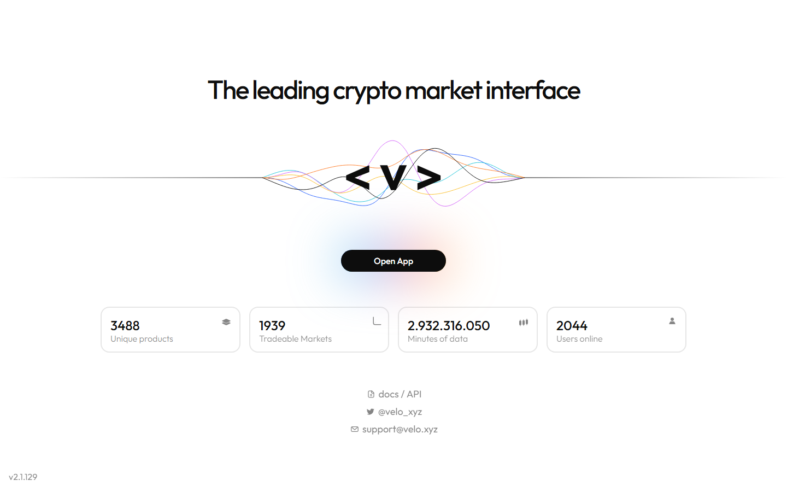
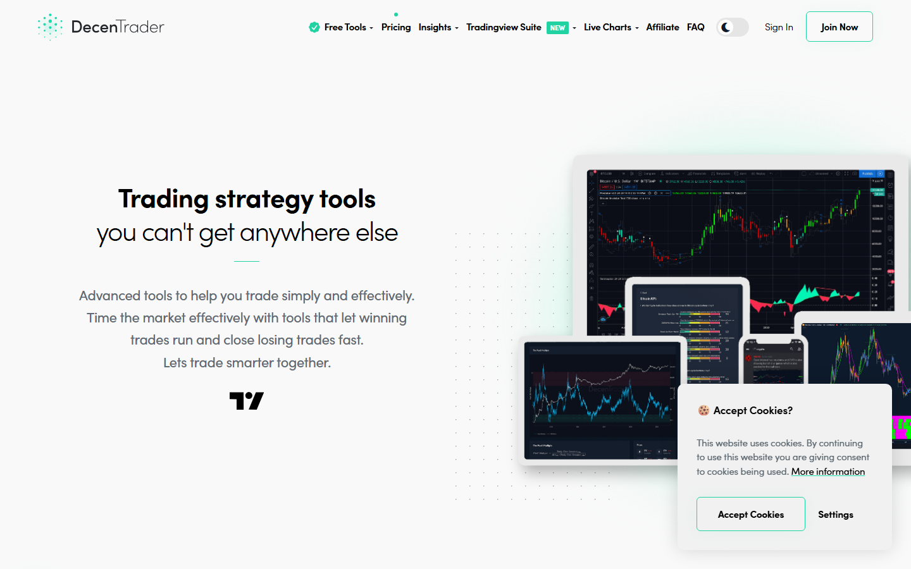
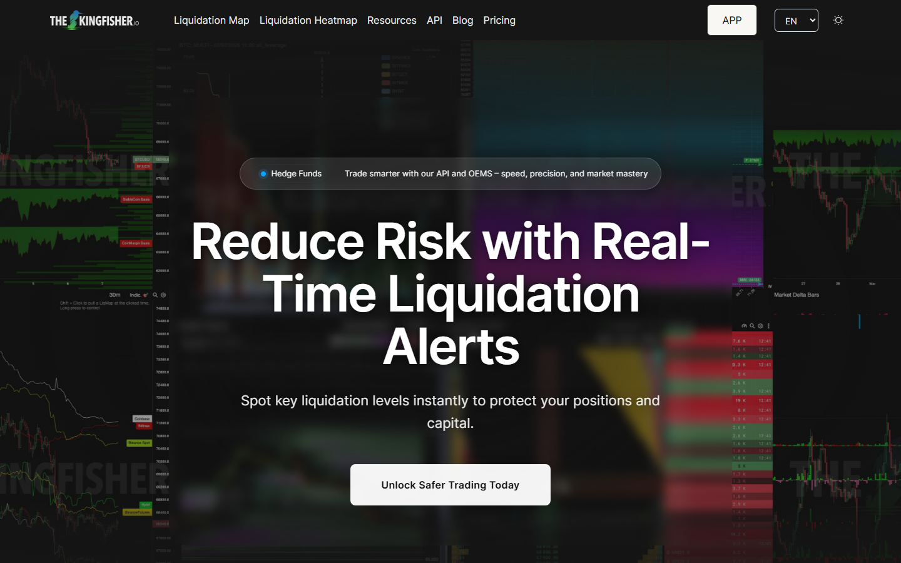
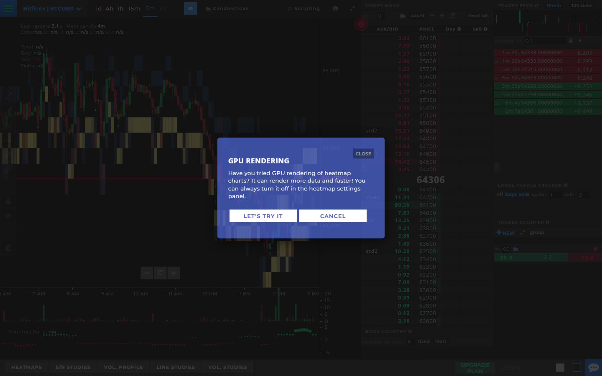
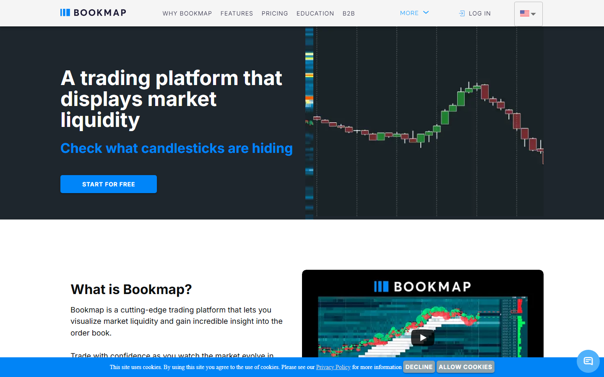

# 9 Best Crypto Liquidation Heatmaps in 2026

The best crypto liquidation heatmaps in 2026 are Coinglass, CoinAnk, Hyblock Capital, TradingLite, Velo Data, DecenTrader, The Kingfisher, TensorCharts, and Bookmap for crypto venues. Coinglass leads on exchange breadth and daily usability. CoinAnk leads on futures-native signal density. Hyblock and TradingLite serve traders who need narrower, execution-oriented views of where leverage crowds.

| Tool | Outstanding point | Score | Best for |
|---|---|---|---|
| Coinglass | Broadest exchange coverage (30+), three heatmap models | 5/5 | Daily all-around derivatives workflow |
| CoinAnk | Tightest futures-native signal hierarchy | 4.5/5 | Derivatives-first traders who think in OI and funding |
| Hyblock Capital | Leverage isolation filters and institutional-grade cluster depth | 4/5 | Prop desks and size-traders optimizing entry timing |
| TradingLite | Liquidation context inside a chart-native execution view | 4/5 | Chart-first traders who act on zones, not monitor them |
| Velo Data | 3,400+ products across derivatives, options, and liquidation context | 3.5/5 | Institutional desks needing multi-asset terminal coverage |
| DecenTrader | Liquidation maps for ~100 coins inside a BTC structure toolkit | 3.5/5 | BTC-focused structure traders using TradingView |
| The Kingfisher | Z-Score cluster filtering, free heatmap without sign-up | 3/5 | Visual-flow traders focused on cluster significance |
| TensorCharts | Order book depth, footprint charts, and GPU-rendered heatmaps | 3/5 | Advanced order-flow readers in microstructure |
| Bookmap | Execution-grade depth-of-market visualization | 3/5 | High-frequency and depth-driven traders from equities |

## Ranking scorecard

Scored out of 10 per category. Total out of 60.

| Tool | Exchange coverage | Model depth | Signal context | Free access | Workflow fit | Execution integration | **Total** |
|---|---|---|---|---|---|---|---|
| Coinglass | 10 | 8 | 9 | 9 | 9 | 5 | **50** |
| CoinAnk | 7 | 7 | 9 | 8 | 8 | 5 | **44** |
| Hyblock Capital | 6 | 10 | 8 | 4 | 7 | 6 | **41** |
| TradingLite | 5 | 6 | 5 | 5 | 7 | 9 | **37** |
| Velo Data | 7 | 6 | 8 | 3 | 6 | 6 | **36** |
| DecenTrader | 4 | 7 | 7 | 5 | 7 | 6 | **36** |
| The Kingfisher | 4 | 7 | 4 | 8 | 5 | 5 | **33** |
| TensorCharts | 3 | 5 | 4 | 4 | 5 | 8 | **29** |
| Bookmap | 3 | 4 | 3 | 3 | 4 | 9 | **26** |

**Scoring notes.** Exchange coverage measures how many venues feed into the heatmap. Model depth scores the granularity and configurability of the liquidation model (leverage band isolation, threshold sliders, multi-model options). Signal context measures how much OI, funding, and positioning data sits alongside the heatmap in the same view. Free access reflects how much is usable without a subscription. Workflow fit scores how naturally the tool integrates into a daily derivatives check. Execution integration measures how well the liquidation data connects to chart-native trade entry. Coinglass leads on total score because it covers the most ground across all six criteria. Hyblock scores highest on model depth because its leverage-band isolation is unmatched, but its lower free access and narrower exchange coverage pull its total below Coinglass.

## Why liquidation heatmaps matter

Crypto still trades with reflexive leverage. When price moves into a crowded leverage zone, liquidations can turn a normal move into a cascade. Heatmaps estimate where those clusters sit before the move fully develops.

A concrete reference point: on August 5, 2024, the Bank of Japan's surprise rate hike unwound the yen carry trade and spilled into crypto. Bitcoin dropped from roughly $65,000 to $50,000 in a day. Per Coinglass data, around 300,000 traders were liquidated and over $1B in positions were wiped out, with longs accounting for nearly $930M versus about $163M in shorts. That one-sided positioning fueled the cascade: forced selling pushed price lower, and the chain kept going.

The most common mistake is treating every bright zone as a guaranteed magnet. A heatmap is a probability model, not a live map of every position. Public exchanges do not publish entry price or leverage per position. Heatmap providers reconstruct the picture from open interest, funding flows, recent trade volume, and a leverage-usage model. Different providers reach slightly different numbers, which is why Coinglass and Hyblock screenshots of the same hour rarely look identical.

Liquidation maps become reliable analysis when paired with [open interest](/derivatives/open-interest/best-crypto-open-interest-dashboards-2026) change and [funding rate](/derivatives/funding-rate/best-crypto-funding-rate-trackers-2026) extremes. One metric alone is insufficient. When all three align, the setup carries structural weight.

## The 9 best crypto liquidation heatmaps in 2026

### 1. Coinglass

**Featured Image**
File: `../media/coinglass-heatmap-2026-07-20.png`
Alt text: `Coinglass liquidation heatmap page showing Model 1/2/3 tabs, Binance BTC/USDT Perpetual selector, Liquidity Threshold slider, and 24h market summary bar, July 2026.`
Caption: `Coinglass liquidation heatmap, July 2026: Model 1 view of Binance BTC/USDT Perpetual with adjustable Liquidity Threshold (set at 0.85), Liquidation Leverage and Supercharts overlay, and 24h market metrics visible in header bar. Captured during our direct review.`

*Coinglass liquidation heatmap, July 2026: Model 1 view of Binance BTC/USDT Perpetual with adjustable Liquidity Threshold (set at 0.85), Liquidation Leverage and Supercharts overlay, and 24h market metrics visible in header bar. Captured during our direct review.*

Coinglass aggregates derivatives data from more than 30 exchanges, including Binance, OKX, Bybit, Deribit, BitMEX, Bitget, and Kraken Futures. The platform launched in 2019 under the name Bybt and rebranded as its scope expanded beyond exchange-specific metrics.

The liquidation heatmap offers three distinct models (Model 1, Model 2, Model 3), each weighting leverage distribution differently. Timeframe options range from 12 hours to one year. When we opened the heatmap page in July 2026, the header bar displayed live market context: 24h Volume at $122.7B, Open Interest at $111.3B, 24h Liquidations at $169M, and Long/Short ratio at 49.75%/50.25%.

That surrounding context is what separates Coinglass from narrower tools: OI, funding rate, long-short ratio, and ETF flow panels sit alongside liquidation data without requiring a separate tab.

The Liquidity Threshold slider (visible at 0.85 in our capture) lets traders filter out low-confidence zones. A separate Liquidation Map tab provides a horizontal bar chart of estimated dollar volume per price bucket, a different product from the heatmap gradient.

When our team reviews a liquidation zone, we check [open interest](/derivatives/open-interest/best-crypto-open-interest-dashboards-2026) and [funding rate](/derivatives/funding-rate/best-crypto-funding-rate-trackers-2026) in the same workflow without switching tools. That workflow efficiency is the primary reason Coinglass ranks first. Every time crypto prices swing sharply, the screenshots that spread across social media almost always come from this platform.

When traders on [Reddit's ethtrader forum](https://www.reddit.com/r/ethtrader/comments/1gpwdjw/is_liquidation_heatmap_reliable/) ask whether liquidation heatmaps actually work, Coinglass is the name that comes up first. One [Bitcoin community thread](https://www.reddit.com/r/Bitcoin/comments/1qc3a5h/there_are_no_crystal_balls_but_heatmaps_can_show/) walked through a live example: a $74M liquidation wall at $94.5K on Coinglass correctly identified the intraday rejection.

Not everyone agrees. In a [CryptoCurrency Reddit thread on heatmap modes](https://www.reddit.com/r/CryptoCurrency/comments/1ogixrv/dont_understand_different_modes_of_heat_maps/), one commenter called Coinglass heatmaps "horrible" and pointed to Velo and Fire Charts instead. Model choice matters more than the platform name.

**Best for:** traders who open one tab and move across multiple derivatives layers in a single session.

**Main tradeoff:** the broad layout runs dense, and isolating a single signal takes more effort than it should. Whether that density helps or hurts depends on how many metrics the trader actually checks daily.

### 2. CoinAnk

**Screenshot 1**
File: `../media/coinank-heatmap-2026-07-20.png`
Alt text: `CoinAnk liquidation heatmap showing futures-native signal layout with OI change, long-short ratio, and leverage zone visualization, July 2026.`
Caption: `CoinAnk liquidation heatmap, July 2026: futures-native signal hierarchy with OI change, long-short balance, and funding signals visible alongside heatmap data. Captured during our direct review.`

*CoinAnk liquidation heatmap, July 2026: futures-native signal hierarchy with OI change, long-short balance, and funding signals visible alongside heatmap data. Captured during our direct review.*

CoinAnk presents OI change, long-short ratio, and funding signals on the primary screen alongside the liquidation heatmap. The signal hierarchy is tighter than Coinglass, less cluttered, more opinionated about what matters first. Where Coinglass shows everything, CoinAnk curates.

For a trader who already thinks in terms of positioning pressure and leverage-zone density, CoinAnk's layout accelerates the daily check. The interface assumes that relationship between OI, funding, and liquidation clustering is already understood.

CoinAnk screenshots show up regularly in [Bitcoin](https://www.reddit.com/r/Bitcoin/comments/1kuso27/ive_not_seen_this_before/) and [CryptoCurrency Reddit threads](https://www.reddit.com/r/CryptoCurrency/comments/1b9wg4h/bch_liquidation_heatmap_shows_3x_as_many_shorters/) when traders post short-vs-long liquidation imbalances. Often the tool is not even named because the interface is recognizable enough on its own.

**Best for:** derivatives-first traders who want the liquidation map, OI, and long-short context already ranked by priority, not displayed as equal panels.

**Main tradeoff:** a trader who still needs [open interest](/derivatives/open-interest/best-crypto-open-interest-dashboards-2026) explained before it becomes useful will find CoinAnk's assumptions steep. Whether the tighter hierarchy saves time or creates blind spots for anyone outside its target user remains the open question.

### 3. Hyblock Capital

**Screenshot 2**
File: `../media/hyblock-dashboard-2026-07-20.png`
Alt text: `Hyblock Capital dashboard showing Orderbook & Liquidity Tracker, Chart, Coin Quadrant, Heatmap, and Screener panels with leverage filter controls, July 2026.`
Caption: `Hyblock Capital dashboard, July 2026: four-panel view with Orderbook & Liquidity Tracker, Coin Quadrant (Bid Ask Ratio filters at 1% and 2%), Heatmap (Exchanges: 3, Leverages: 5), and Open Interest Screener (20 coins, 4hr timeframe). Nine pre-built dashboards visible in sidebar. Captured during our direct review.`

*Hyblock Capital dashboard, July 2026: four-panel view with Orderbook & Liquidity Tracker, Coin Quadrant (Bid Ask Ratio filters at 1% and 2%), Heatmap (Exchanges: 3, Leverages: 5), and Open Interest Screener (20 coins, 4hr timeframe). Nine pre-built dashboards visible in sidebar. Captured during our direct review.*

Hyblock is subscription-based and targets serious users with higher-resolution heatmaps. The dashboard we reviewed showed nine pre-built layouts: Orderbook & Liquidity Tracker, Open Interest Dynamics, Long/Short Positioning, Sentiment & Confluence, Outlier Detection, Pair & Relative Trading, Screener & Momentum, Volatility & Liquidity Regimes, and BTC Deep Dive.

The key differentiator is leverage isolation. Hyblock lets traders filter by specific leverage bands (25x, 50x, 100x) to see where a particular type of position clusters, not just the blended picture. Additional tools include Combined Order Book, Bid/Ask Imbalance, Anchored Liquidation Levels, and a True Retail Long/Short Ratio that some traders use as a contrarian indicator.

Many prop desks and established derivatives accounts have publicly shifted to Hyblock since 2023 because the model resolution is tighter and the latency is lower.

For most retail traders, free Coinglass plus a disciplined workflow is sufficient. Hyblock makes sense once the trader is size-trading and the edge case is the marginal 50 basis points of timing improvement that leverage-band isolation provides.

**Best for:** prop desks and size-traders who need leverage-density reads at specific bands, not just the blended cluster view.

A [vetted trading tools list on Reddit](https://www.reddit.com/r/CryptoTradersHotline/comments/1futraj/tools_for_use_in_trading_vetted_recommendations/) categorizes Hyblock as a "specialized crypto mapping and inside edge data provider" for intermediate to advanced traders. In an [ethtrader discussion on liquidity as a price magnet](https://www.reddit.com/r/ethtrader/comments/17b7vvi/liquidity_acting_as_magnets_for_price/), traders reference Hyblock and TradingLite as the paid tools they eventually graduated toward.

**Main tradeoff:** the subscription cost and learning curve only justify themselves at a certain trading scale. Whether that scale threshold matches the trader's actual volume is the decision point.

### 4. TradingLite

**Screenshot 3**
File: `../media/tradinglite-home-2026-07-17.png`
Alt text: `TradingLite homepage showing chart-integrated liquidation and order flow execution context, July 2026.`
Caption: `TradingLite homepage, July 2026: chart-native execution environment integrating liquidation context with order flow and volume profiles. Captured during our direct review.`

*TradingLite homepage, July 2026: chart-native execution environment integrating liquidation context with order flow and volume profiles. Captured during our direct review.*

TradingLite integrates liquidation data with order flow and volume profiles inside a chart-native environment. The product sits closer to an execution workstation than a monitoring dashboard. Liquidation zones appear next to footprint data, not in a separate window.

For technical-analysis-first traders, that integration removes friction between seeing a zone and acting on it. The workflow difference is structural: Coinglass shows where leverage is, TradingLite shows where leverage is relative to the execution the trader is about to make. Macro derivatives context is thinner here.

**Best for:** chart-native traders who want liquidation zones embedded in their execution flow, not in a separate monitoring tab.

TradingLite comes up in [day trading](https://www.reddit.com/r/Daytrading/comments/16xwj1q/is_there_any_other_good_alternative_for/) and [order flow communities on Reddit](https://www.reddit.com/r/OrderFlow_Trading/comments/1kk1ovk/what_order_flow_platforms_do_you_use_for_crypto/) when traders look for crypto-native tools, typically mentioned alongside Bookmap as one of the few not adapted from equities infrastructure.

**Main tradeoff:** more suited to execution-level decisions than macro derivatives monitoring. Whether TradingLite's chart integration or Coinglass's broader dashboard matters more depends on where in the workflow the trader makes sizing and entry decisions.

### 5. Velo Data

**Screenshot 4**
File: `../media/velo-home-2026-07-20.png`
Alt text: `Velo Data homepage showing 3,488 unique products, 1,939 tradeable markets, and 2,044 users online, July 2026.`
Caption: `Velo Data terminal, July 2026: 3,488 unique products, 1,939 tradeable markets, 2,044 concurrent users. Docs/API and support links visible. Captured during our direct review.`

*Velo Data terminal, July 2026: 3,488 unique products, 1,939 tradeable markets, 2,044 concurrent users. Docs/API and support links visible. Captured during our direct review.*

Velo Data (velo.xyz) provides a professional derivatives terminal where liquidation data sits inside a broader market-structure, options, and flow context. The homepage when we captured it showed 3,488 unique products across 1,939 tradeable markets with 2,044 concurrent users online.

The platform aggregates data from Binance, Bybit, OKX and other venues. Coverage extends into options flows, gamma exposure, volatility surfaces, and term structure analysis, which no other tool on this list offers at the same depth. Liquidation context is one layer within that broader stack.

**Best for:** institutional desks and professional traders who want liquidation context embedded in a multi-asset, options-inclusive derivatives terminal.

In a [Reddit thread on crypto tools that actually improved workflow](https://www.reddit.com/r/CryptoCurrency/comments/1okwvxu/crypto_tools_that_actually_improved_my_workflow/), users flagged Velo as a step above dashboard-style aggregators. A commenter in a [separate discussion](https://www.reddit.com/r/CryptoCurrency/comments/1ogixrv/dont_understand_different_modes_of_heat_maps/) recommended it directly as an alternative for traders confused by Coinglass model differences.

**Main tradeoff:** the broader terminal scope means the liquidation layer alone is not as focused as Coinglass or Hyblock. Whether the options and volatility surface context adds enough signal to justify a more complex interface depends on the trader's strategy profile.

### 6. DecenTrader

**Screenshot 5**
File: `../media/decentrader-home-2026-07-20.png`
Alt text: `DecenTrader homepage showing Trading strategy tools, TradingView Suite integration, and multi-device charting interface, July 2026.`
Caption: `DecenTrader homepage, July 2026: TradingView Suite integration visible in nav, multi-device charting layouts, Free Tools and Pricing sections accessible. Captured during our direct review.`

*DecenTrader homepage, July 2026: TradingView Suite integration visible in nav, multi-device charting layouts, Free Tools and Pricing sections accessible. Captured during our direct review.*

DecenTrader, founded by the well-known crypto analyst filbfilb, integrates liquidation maps with on-chain and derivatives signals inside a BTC-focused market-structure toolkit. The platform offers liquidation maps for nearly 100 coins with x3, x5, and x10 leverage level overlays, plus a TradingView Suite integration that was recently launched.

Additional tools include the Ironman strategy creator with backtesting, and weekly livestreams from the Alpha Max analysis desk. Free tools are available with a 7-day trial for premium features. The product reads more like a Bitcoin structural analyst's workbench than a general heatmap tool.

**Best for:** BTC-focused traders who interpret liquidation data within a wider structural view and use TradingView as their primary charting environment.

DecenTrader's BTC cycle reports have circulated in [Bitcoin forums on Reddit since at least 2021](https://www.reddit.com/r/Bitcoin/comments/qj7qmi/an_extensive_report_by_decentrader_predicts_that/), drawing engagement from traders who treat it as a structural reference rather than a signal service.

**Main tradeoff:** less altcoin coverage than Coinglass or CoinAnk. For traders who rotate between BTC and alts, DecenTrader only covers part of the workflow. Whether the BTC depth compensates for that narrowness depends on how much of the trader's book is BTC-denominated.

### 7. The Kingfisher

**Screenshot 6**
File: `../media/kingfisher-home-2026-07-20.png`
Alt text: `The Kingfisher homepage showing Liquidation Map and Heatmap navigation, Hedge Funds API banner, and real-time liquidation alert positioning, July 2026.`
Caption: `The Kingfisher homepage, July 2026: Liquidation Map and Liquidation Heatmap navigation tabs, Hedge Funds API/OEMS banner visible, "Reduce Risk with Real-Time Liquidation Alerts" as primary positioning. Captured during our direct review.`

*The Kingfisher homepage, July 2026: Liquidation Map and Liquidation Heatmap navigation tabs, Hedge Funds API/OEMS banner visible, "Reduce Risk with Real-Time Liquidation Alerts" as primary positioning. Captured during our direct review.*

The Kingfisher has operated since 2015 and focuses exclusively on liquidation cluster analysis. The heatmap is free to access without sign-up, which makes it the lowest-friction starting point on this list for a trader who wants to check liquidation zones quickly.

The distinguishing feature is Z-Score analysis applied to cluster significance. Rather than displaying raw estimated liquidation volume, The Kingfisher uses a standardized measure to surface only statistically significant clusters, filtering out noise. Multi-leverage filtering and an API (KF-API) are available for deeper integration. A newer product, KF-OEMS (Order Execution Management System), targets assisted scalping workflows with rule-based execution. The platform also offers GEX+ (Gamma/Vanna Exposure), Toxic Order Flow detection, and an Aggregated Orderbook.

The community is primarily Telegram-based with over 4,000 active traders, reflecting the tool's niche positioning in the liquidation-specific segment.

**Best for:** visual-flow traders who want statistically filtered liquidation zones rather than raw heatmap data, and traders who want a quick free check without creating an account.

The Kingfisher shows up in [crypto tools threads on Reddit](https://www.reddit.com/r/CryptoCurrency/comments/18huo4f/what_tools_do_you_use/) alongside TradingView and CoinGecko as a niche but recognized name. When someone in a [Bitcoin Cash community thread](https://www.reddit.com/r/btc/comments/1c3ze3b/is_anyone_knows_which_platform_is_this_analyzing/) posted an unidentified liquidation screenshot, The Kingfisher was called out immediately.

**Main tradeoff:** less systematic for cross-metric derivatives work than Coinglass or CoinAnk. Whether the Z-Score filtering adds analytical rigor or just a different flavor of visualization is something the trader needs to evaluate against their own signal chain.

### 8. TensorCharts

**Screenshot 7**
File: `../media/tensorcharts-home-2026-07-20.png`
Alt text: `TensorCharts showing Bitfinex BTC/USD order book depth, footprint chart, heatmap layers, Large Trades Tracker, and GPU rendering prompt, July 2026.`
Caption: `TensorCharts live view, July 2026: Bitfinex BTC/USD 5-minute chart with order book depth (Ask/Bid columns), heatmap layer visible behind candlesticks, GPU Rendering prompt for performance, and Large Trades Tracker plus Trades Counter panels on right sidebar. Captured during our direct review.`

*TensorCharts live view, July 2026: Bitfinex BTC/USD 5-minute chart with order book depth (Ask/Bid columns), heatmap layer visible behind candlesticks, GPU Rendering prompt for performance, and Large Trades Tracker plus Trades Counter panels on right sidebar. Captured during our direct review.*

TensorCharts centers on order book depth and footprint context. When we loaded the platform, it opened directly into a live Bitfinex BTC/USD chart with the order book (Ask/Bid at 100-tick intervals), heatmap layers behind the candles, and a GPU Rendering prompt offering faster data visualization. The right sidebar showed a Large Trades Tracker (filtering trades >100K) and a Trades Counter with buy/sell/scene/VWAP breakdowns.

Bottom tabs revealed the layered analysis approach: Heatmaps, S/R Studies, Vol. Profile, Line Studies, and Vol. Studies. Liquidation zone data appears as one layer inside that microstructure view, not as a standalone product. For advanced order-flow readers, TensorCharts provides more execution-level depth than a standard heatmap.

TensorCharts has a dedicated subreddit (r/tensorcharts, ~233 members) where users discuss chart features, order book interpretation, and platform status. The community is small but technically focused.

**Best for:** advanced traders who want order book depth, footprint charts, and heatmap context unified in a single microstructure view.

TensorCharts has been mentioned in [Bitcoin Reddit communities](https://www.reddit.com/r/Bitcoin/comments/80p8kv/secret_weapon_of_daytraders_tensorchartscom/) since 2018 as a "secret weapon" for order-flow day traders. It still comes up in [charting tool discussions](https://www.reddit.com/r/Bitcoin/comments/kq21al/best_crypto_charts/) as a specialized alternative to TradingView for volume-first traders.

**Main tradeoff:** steeper learning curve than any other tool on this list, and the microstructure focus means broader derivatives context (OI, funding) must come from elsewhere. Whether the depth granularity adds enough alpha to justify the setup cost depends on the trader's timeframe and style.

### 9. Bookmap for crypto venues

**Screenshot 8**
File: `../media/bookmap-home-2026-07-20.png`
Alt text: `Bookmap homepage showing depth-of-market visualization and execution platform interface, July 2026.`
Caption: `Bookmap homepage, July 2026: depth-of-market visualization with candlestick overlay and liquidity density bars. Platform geo-detected to Vietnamese locale during our capture from Vietnam. Captured during our direct review.`

*Bookmap homepage, July 2026: depth-of-market visualization with candlestick overlay and liquidity density bars. Platform geo-detected to Vietnamese locale during our capture from Vietnam. Captured during our direct review.*

Bookmap is primarily an equities and futures execution tool that supports crypto venues where connectivity allows. The depth-of-market visualization is the core product. The platform is desktop-application-first and B2B-capable, with Binance, Bybit, and other crypto exchange integrations available.

When we loaded bookmap.com from Vietnam, the platform geo-detected to Vietnamese locale, which confirms multi-language localization but also means the initial experience varies by region. OI, funding, and exchange-level liquidation data require external sources. For depth-driven traders who already supplement with derivatives data elsewhere, Bookmap provides the most granular execution-level view on this list.

**Best for:** depth-driven and high-frequency traders who prioritize order book density visualization over standard heatmap readability, especially those crossing over from equities.

Bookmap generates strong but polarized sentiment. A 10-year trader in a [day trading forum on Reddit](https://www.reddit.com/r/Daytrading/comments/utlwak/how_many_of_yall_are_using_bookmap/) said it "changed literally everything" about how they read market structure.

The other side is just as clear. In a [futures trading community thread](https://www.reddit.com/r/FuturesTrading/comments/1l0foox/anybody_use_bookmap_i_feel_like_i_cant_trade_with/), multiple users said Bookmap did not measurably improve executions. One [order flow trader](https://www.reddit.com/r/OrderFlow_Trading/comments/1lrxnh1/anyone_here_successfully_use_bookmap_for_trading/) stopped using it because "there are simpler and faster ways to trade." That split is Bookmap in a sentence: transformative for some, marginal for others.

**Main tradeoff:** requires external sources for OI, funding, and exchange-level liquidation data. Whether Bookmap's depth granularity justifies maintaining separate tools for the rest of the derivatives stack is the real cost question for crypto-native traders.

## Best liquidation heatmap by use case

- Best for most traders: Coinglass
- Best derivatives-first alternative: CoinAnk
- Best for leverage-band isolation: Hyblock Capital
- Best for execution-chart integration: TradingLite
- Best for options-inclusive terminal: Velo Data
- Best for BTC structural analysis: DecenTrader
- Best free heatmap without sign-up: The Kingfisher
- Best for depth-of-market reading: TensorCharts or Bookmap

## How our team avoids bad liquidation-map calls

Treating every bright zone as a guaranteed magnet is the most common error. Before writing any directional view from liquidation data, the MarketBit team runs three checks:

1. [Open interest](/derivatives/open-interest/best-crypto-open-interest-dashboards-2026): is OI expanding into the move or already draining? A zone that coincides with falling OI carries less mechanical weight.
2. [Funding rate](/derivatives/funding-rate/best-crypto-funding-rate-trackers-2026): is funding extreme enough to support a squeeze thesis? Neutral funding dampens cascade probability.
3. Market structure: does the liquidation zone align with an obvious support or resistance level? Isolated heatmap clusters without structural anchors have lower follow-through.

If those three layers do not align, the signal gets downgraded, not amplified.

In a [widely-shared DYOR resource thread on Reddit](https://www.reddit.com/r/CryptoCurrency/comments/osmb00/several_resources_and_websites_to_help_you_dyor/), users recommended tracking "pure statistics" sources and flagging whenever a tool leans toward one side. That maps directly onto how liquidation heatmaps should be read: the tools that present raw leverage data without embedded directional bias are the ones worth using as primary sources.

## What liquidation maps can and cannot tell you

They can show: where crowded leverage may sit, likely volatility expansion zones, areas where reflexive cascade risk is elevated.

They cannot show: who defends a level, whether spot demand absorbs the cascade, whether a macro catalyst overrides the mechanical setup. The August 5, 2024 event demonstrated both sides: the heatmap correctly identified where leverage was stacked, but it could not predict that a Bank of Japan rate decision would be the trigger. That gap between what heatmaps model and what markets do is where most misreads originate.

## What to watch

**CME Bitcoin futures open interest relative to perps.** When CME OI diverges meaningfully from offshore perpetual OI, the liquidation map changes character. CME expiries create mechanical cascades at specific dates that perpetual-only heatmaps cannot capture.

**Venue weighting matters.** As of 2026, Binance still dominates BTC and ETH perp open interest, often accounting for 30% to 45% of total OI on a given day. Bybit is a strong second. OKX and Hyperliquid trade off third depending on the asset and the week.

A heatmap weighted heavily by Binance flow looks different from one weighted by Hyperliquid flow because the user profiles differ. Binance skews toward a wider retail base using 20x to 50x leverage, while Hyperliquid skews toward larger-size traders using lower leverage but higher notional.

**Altcoin liquidation concentration.** When BTC liquidation zones are thin but altcoin zones are crowded, cascades tend to originate in smaller caps and spread to BTC rather than the reverse. Watch for cross-market concentration shifts in [OI by asset](/derivatives/open-interest/best-crypto-open-interest-dashboards-2026).

**Negative [funding rate](/derivatives/funding-rate/best-crypto-funding-rate-trackers-2026) plus dense long liquidation cluster.** This is the highest-risk combination: market has already moved against longs to the point where funding inverted, but the liquidation cluster has not cleared. Unresolved clusters below current price with inverted funding indicate mechanical downside pressure that has not fully expressed.

---

## What we checked ourselves before ranking these tools

For this article, we reviewed the live public product pages of all nine tools directly in July 2026. Screenshots were captured from live product surfaces to verify what each first-screen experience actually communicates to a trader, not to depend on feature list copy from product marketing.

**Coinglass:** Opened the Liquidation Heatmap page. Verified Model 1/2/3 selector, exchange and pair picker (Binance BTC/USDT Perpetual), Liquidity Threshold slider, and 24h market metrics in the header bar. Separate tabs for Liquidation Map (bar chart), Liquidation History, and Hyperliquid Liquidation Map were confirmed.

**CoinAnk:** Opened the liquidation heatmap. Verified OI change, long-short ratio, and funding signals on the primary screen alongside heatmap data.

**Hyblock Capital:** Opened the public dashboard demo. Verified nine pre-built dashboard layouts, leverage filter controls (Exchanges: 3, Leverages: 5), Coin Quadrant with Bid Ask Ratio filtering, and Open Interest Screener with 20-coin coverage at 4hr timeframe.

**Velo Data:** Loaded velo.xyz. Confirmed platform statistics: 3,488 unique products, 1,939 tradeable markets, 2,044 concurrent users. Docs/API link visible.

**DecenTrader:** Loaded decentrader.com. Confirmed TradingView Suite integration in nav, Free Tools section, Pricing, multi-device charting layouts.

**The Kingfisher:** Loaded thekingfisher.io. Confirmed Liquidation Map and Liquidation Heatmap as separate nav items, Hedge Funds API/OEMS banner, free heatmap access positioning.

**TensorCharts:** Platform opened directly into a live Bitfinex BTC/USD chart with order book depth, heatmap layers, GPU Rendering prompt, and Large Trades Tracker/Trades Counter panels.

**Bookmap:** Loaded bookmap.com. Platform geo-detected to Vietnamese locale from our Vietnam IP. Depth-of-market visualization and candlestick overlay confirmed. English-language content accessible via language selector.

This review covered public product surfaces. Logged-in features, premium tier capabilities, and live alert systems were not tested for tools requiring paid access.

## Why you can trust this guide

This guide is based on live public product pages for all nine tools reviewed directly in July 2026. Nine screenshots were captured from live product surfaces.

Specific claims about Coinglass exchange coverage (30+ exchanges), Hyblock leverage isolation filters, Velo Data product count (3,488), The Kingfisher Z-Score analysis, and TensorCharts GPU rendering are based on what was directly visible on the public product surface at the time of capture. Any claims about premium tier features, exchange coverage counts, or alert capabilities that were behind a paywall should be verified against current platform documentation before publication.

## What this review verified and what it did not

| Claim | Status |
|---|---|
| Coinglass heatmap page with Model 1/2/3 and Liquidity Threshold reviewed | Observed |
| Coinglass 24h metrics (Volume, OI, Liquidation, Long/Short) visible in header | Observed |
| CoinAnk liquidation heatmap with OI and funding context reviewed | Observed |
| Hyblock dashboard with 9 pre-built layouts and leverage filters reviewed | Observed |
| TradingLite homepage and chart-native positioning reviewed | Observed |
| Velo Data product stats (3,488 products, 1,939 markets) verified on live page | Observed |
| DecenTrader homepage with TradingView Suite integration reviewed | Observed |
| The Kingfisher homepage with Liquidation Map/Heatmap nav and API banner reviewed | Observed |
| TensorCharts live chart with order book, heatmap layer, and GPU prompt reviewed | Observed |
| Bookmap homepage with depth visualization reviewed (Vietnamese locale) | Observed |
| Coinglass aggregates from 30+ exchanges (per CryptoRank, platform docs) | Cross-referenced |
| Hyblock leverage isolation (25x, 50x band filtering) from published guides | Cross-referenced |
| The Kingfisher Z-Score analysis from official product page description | Cross-referenced |
| Premium tier features and alert systems tested across all tools | Not verified |
| Full logged-in workflow comparison across all nine tools | Not verified |
| Exchange coverage counts independently verified against current docs | Not verified |
| Post-July 20, 2026 product updates included | Not verified |

## FAQ

### Are liquidation heatmaps accurate?

They are directional probability tools, not exact maps of every forced close. Public exchanges do not publish entry price or leverage per position. Providers reconstruct the picture from open interest, funding flows, recent trade volume, and a leverage-usage model. Different providers reach slightly different numbers from the same raw data.

### What is the best free crypto liquidation heatmap?

Coinglass provides the most complete free-tier access for most users. The Kingfisher offers a free heatmap without requiring sign-up or account creation. CoinAnk is the best free alternative for a more derivatives-focused layout.

### Should liquidation maps be used alone?

No. They become more reliable when paired with [open interest](/derivatives/open-interest/best-crypto-open-interest-dashboards-2026) change, [funding rate](/derivatives/funding-rate/best-crypto-funding-rate-trackers-2026) extremes, and nearby market structure context. A single metric in isolation is insufficient for directional conviction.

### What is the difference between a liquidation map and a liquidation heatmap?

The Liquidation Map (available on Coinglass) displays a horizontal bar chart of estimated dollar volume at each price level. The Liquidation Heatmap shows the same clustering data as a color-intensity gradient over time. The map shows current state; the heatmap shows how that state evolved.

### Why do Coinglass and Hyblock show different liquidation data for the same hour?

Both platforms reconstruct liquidation estimates from open interest, funding flows, and leverage-usage models. Their models weight these inputs differently, so the output diverges. Neither is "wrong." The divergence itself can be informative about model sensitivity.

## Sources

- Coinglass, [Liquidation Heatmap](https://www.coinglass.com/pro/futures/LiquidationHeatMap)
- Coinglass, [Liquidation Data](https://www.coinglass.com/LiquidationData)
- CoinAnk, [Liquidation Heatmap](https://coinank.com/liqheatmap)
- Hyblock Capital, [Dashboard](https://hyblockcapital.com/)
- TradingLite, [Homepage](https://tradinglite.com/)
- Velo Data, [Terminal](https://velo.xyz/)
- DecenTrader, [Homepage](https://decentrader.com/)
- The Kingfisher, [Liquidation Heatmap](https://thekingfisher.io/bitcoin-liquidations-heatmap)
- TensorCharts, [Homepage](https://tensorcharts.com/)
- Bookmap, [Homepage](https://bookmap.com/)
- CryptoRank, [What Is Coinglass](https://cryptorank.io/news/feed/bf393-what-is-coinglass-crypto-liquidation-data-explained)
- DEXTools, [How to Read Liquidation Maps in Crypto: 2026 Guide](https://www.dextools.io/tutorials/how-to-read-liquidation-maps-in-crypto-guide-2026)
