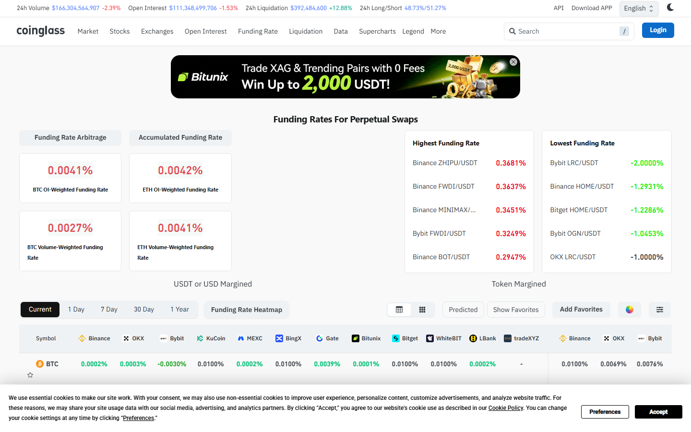

# 11 Best Crypto Funding Rate Trackers in 2026

The best crypto funding rate trackers in 2026 are Coinglass, CoinAnk, CryptoQuant, Laevitas, Velo, Hyblock, Binance Futures data, Bybit derivatives pages, CME crypto markets, TradingView custom scripts, and Glassnode. Coinglass leads on breadth and ease of cross-exchange comparison. CoinAnk is the sharpest derivatives-native alternative. CryptoQuant adds narrative framing. Laevitas stands out when options volatility surfaces matter alongside funding.

| Tool | Outstanding point | Score | Best for |
|---|---|---|---|
| Coinglass | Broadest cross-exchange funding comparison in one screen | 5/5 | Daily monitoring, fast cross-exchange reads |
| CoinAnk | Tightest futures-native layout with OI and long-short context | 4.5/5 | Derivatives-first traders |
| CryptoQuant | Funding embedded in broader market interpretation | 4/5 | Narrative analysts and macro context readers |
| Laevitas | Funding alongside options vol surfaces | 4/5 | Multi-product derivatives desks |
| Velo | Professional derivatives terminal depth | 3.5/5 | Institutional desks |
| Hyblock | Funding as part of crowd positioning workflow | 3.5/5 | Leveraged position flow analysts |
| Binance Futures | Venue-level first-party data confirmation | 3/5 | BTC and ETH venue-specific checks |
| Bybit Derivatives | Altcoin-rich exchange-native funding data | 3/5 | Altcoin and perpetual traders |
| CME crypto markets | Regulated futures context vs offshore perp sentiment | 3/5 | Institutional cross-market comparison |
| TradingView scripts | Funding overlaid directly on price chart | 3/5 | Chart-native traders |
| Glassnode | On-chain and derivatives signals combined | 3/5 | Macro-level derivatives and on-chain researchers |

## Why funding rates matter

Funding rates show how perpetual futures markets are balancing long and short demand at any given moment. When funding is heavily positive, longs are paying to stay long. When it turns deeply negative, shorts are paying to stay short. Neither sign is a trade signal by itself. The useful question is whether the extreme is broad across exchanges or isolated on one venue, and whether [open interest](/derivatives/open-interest/best-crypto-open-interest-dashboards-2026) is rising with it or already rolling over.

A funding spike on one exchange with neutral funding everywhere else is noise. A synchronized extreme across Binance, Bybit, and OKX with rising OI and a crowded [liquidation zone](/derivatives/liquidations/best-crypto-liquidation-heatmaps-2026) is a setup worth analyzing.

## What we checked ourselves before ranking these tools

For this article, we reviewed the live public product pages of Coinglass, CoinAnk, CryptoQuant, and Laevitas directly in July 2026. Screenshots were captured from each to verify what information the product surfaces on first load and how that information is framed for a derivatives trader.

*Coinglass funding rate page, July 2026: cross-exchange funding rate comparison and live data layout reviewed directly.*

*CoinAnk homepage, July 2026: derivatives-native layout with OI, long-short, and funding signals reviewed directly.*

*CryptoQuant homepage, July 2026: on-chain and derivatives data with market interpretation framing reviewed directly.*

*Laevitas homepage, July 2026: derivatives analytics including options vol and funding context reviewed directly.*

What stood out immediately in Coinglass was the density of the cross-exchange comparison. The funding rate page aggregated data across a broad exchange set, with color coding that made it fast to spot which venues were running hot or cold relative to one another. That is the most critical feature for a funding tracker: not just showing one number, but letting a trader instantly see whether an extreme is isolated or synchronized.

CoinAnk's layout was more aggressive in how it brought OI change and long-short data into the same view as funding. The effect is a tighter signal cluster that suits a trader who already knows what they are looking for. CryptoQuant added interpretive framing around its data, which makes it more useful for analysts who want to connect a funding extreme to a broader market narrative. Laevitas immediately signaled its options market orientation, making it the right choice for desks that trade derivatives across both perpetuals and structured products.

## The 11 best crypto funding rate trackers in 2026

### 1. Coinglass

Coinglass is the easiest and most complete starting point for funding rate monitoring. The cross-exchange comparison screen aggregates live funding from Binance, Bybit, OKX, Deribit, and other major venues into one view, with color coding that makes rate dispersion immediately visible. For most MarketBit readers, this is the first screen to open when checking whether a funding extreme is meaningful.

**Best for:** daily funding monitoring and fast cross-exchange comparison.
**Main tradeoff:** the broad layout includes more market context than a trader who only wants funding data needs to parse.

### 2. CoinAnk

CoinAnk presents funding rate data inside a derivatives-native layout that integrates OI change and long-short context on the same screen. The product feels built for traders who think about funding as part of a positioning picture, not as an isolated number.

**Best for:** traders who want funding as one layer inside a derivatives-first workflow.
**Main tradeoff:** less intuitive for users who are new to reading multiple derivatives signals simultaneously.

### 3. CryptoQuant

CryptoQuant provides funding rate data embedded within a broader on-chain and market interpretation layer. The platform adds narrative framing around its metrics, which makes it more useful for analysts who want to understand why funding is moving, not just that it moved.

**Best for:** market analysts and narrative-driven traders who pair funding with on-chain macro signals.
**Main tradeoff:** less visual speed on pure funding monitoring than Coinglass or CoinAnk; more suited to research than fast tactical checks.

### 4. Laevitas

Laevitas is the strongest choice when funding rate tracking needs to sit alongside options implied volatility, term structure, and structured product analytics. The platform serves multi-product derivatives desks that monitor perpetuals and options in the same workflow.

**Best for:** desks trading both perpetuals and options who want funding rate context alongside vol surface data.
**Main tradeoff:** higher complexity and access friction than pure funding dashboards; not the right starting point for simple perpetual monitoring.

### 5. Velo

Velo provides a professional-tier derivatives terminal that includes funding rate data within a richer market context. It serves institutional desks that need funding embedded in a broader order flow and cross-market analytics environment.

**Best for:** institutional desks with professional derivatives workflow needs.
**Main tradeoff:** higher access requirements; not the free-tier starting point most retail traders need.

### 6. Hyblock

Hyblock integrates funding rate context alongside its crowd positioning and liquidation cluster tools. For traders using Hyblock primarily for [liquidation zone analysis](/derivatives/liquidations/best-crypto-liquidation-heatmaps-2026), checking funding on the same platform maintains workflow consistency.

**Best for:** traders who are already using Hyblock for liquidation monitoring and want funding in the same environment.
**Main tradeoff:** narrower than Coinglass for pure cross-exchange funding comparison breadth.

### 7. Binance Futures data

Binance publishes its own funding rate data directly on its futures product pages. For trades that are executed on Binance, the venue-level funding data is the most accurate first-party source. It is a confirmation check, not a primary monitoring tool.

**Best for:** confirming Binance-specific funding readings alongside aggregated tracker data.
**Main tradeoff:** single-venue only; does not provide cross-exchange comparison.

*Binance Futures, July 2026: venue-level funding rate data reviewed as a first-party confirmation source.*

### 8. Bybit Derivatives

Bybit's derivatives product pages publish funding rates for its perpetual and inverse contract markets. Bybit's altcoin coverage is broader than Binance's for some trading pairs, which makes it useful for traders monitoring alt-market funding.

**Best for:** altcoin-focused traders who want venue-level funding confirmation on Bybit-listed pairs.
**Main tradeoff:** single-venue only; requires cross-referencing with aggregators for the full picture.

### 9. CME crypto markets

CME publishes settlement data and open interest for its Bitcoin and Ethereum futures contracts. For traders who want to understand how regulated futures sentiment compares to offshore perpetual funding, CME's data adds an institutional calibration point.

**Best for:** understanding the gap between institutional regulated futures positioning and retail-heavy perpetual funding.
**Main tradeoff:** CME futures are not perpetuals; the funding rate concept does not translate directly, requiring careful interpretation.

### 10. TradingView custom funding scripts

TradingView's community library includes scripts that overlay funding rate data onto price charts. For chart-native traders who want to see funding extremes in the same view as price action without switching windows, TradingView offers the most flexible integration.

*TradingView, July 2026: chart-native environment for custom funding rate overlay scripts reviewed directly.*

**Best for:** technical analysts who want funding overlaid on price rather than in a separate data terminal.
**Main tradeoff:** quality depends on the specific script; requires finding and validating a reliable community script rather than using a maintained first-party feed.

### 11. Glassnode

Glassnode includes perpetual funding rate data within its derivatives analytics module, alongside on-chain metrics. For researchers who want to connect funding extremes to longer-term market cycles, Glassnode provides the deepest historical context on this list.

*Glassnode homepage, July 2026: on-chain and derivatives analytics platform reviewed directly.*

**Best for:** on-chain researchers and macro analysts who want funding data in a long-cycle context.
**Main tradeoff:** more suited to research and longer-term analysis than tactical daily monitoring.

## Best funding tracker by use case

- Best for most traders: Coinglass
- Best derivatives-native alternative: CoinAnk
- Best for narrative and on-chain pairing: CryptoQuant
- Best for multi-product desks: Laevitas
- Best for institutional calibration: CME crypto data
- Best for chart-native workflow: TradingView scripts
- Best for deep historical research: Glassnode

## How to read positive, negative, and extreme funding

Positive funding means long demand is outpacing short demand. Negative funding means short demand is outpacing long demand. The sign alone does not determine the trade. The actionable read comes from three observations:

Is funding rising with [open interest](/derivatives/open-interest/best-crypto-open-interest-dashboards-2026)? Rising OI confirms participation is growing, which makes the extreme more credible.

Is funding extreme while price stalls? Funding that stays elevated without price follow-through is a crowding signal that has stopped expressing itself in price, which often precedes mean reversion.

Is funding diverging across exchanges? Isolated extremes on one venue are noise. Synchronized extremes across multiple venues are structural.

When our team reviews a funding extreme, we check [liquidation zone density](/derivatives/liquidations/best-crypto-liquidation-heatmaps-2026) immediately after. A crowded funding environment with a dense liquidation cluster below the current price is the highest-risk combination for a squeeze setup.

In a widely referenced [r/CryptoCurrency resource thread listing crypto analysis tools](https://www.reddit.com/r/CryptoCurrency/comments/n8ersp/list_of_general_crypto_resources_and_tools/), one commenter noted Bankless as a site that "changed drastically the way I look at crypto" and another specifically called for "pure statistics" sources over narrative-heavy tools. That preference maps directly onto how a good funding tracker should be evaluated: the tools that provide raw, cross-exchange data with clear sourcing are the ones worth trusting for real decision-making. Tools that layer directional narratives on top of funding data without making the data itself transparent are harder to use analytically.

## What to watch

**Funding rate divergence between BTC perps and BTC CME.** When offshore perpetual funding runs heavily positive while CME open interest is flat or declining, institutional participation is not matching the retail leverage narrative. That divergence is one of the clearest signals that a crowded perpetual position has no institutional support underneath it.

**Negative funding plus rising OI.** This combination means new short positions are being added at the same time as funding has turned negative, which is a signal that the short trade is becoming crowded rather than protective. Watch for this when [liquidation maps](/derivatives/liquidations/best-crypto-liquidation-heatmaps-2026) show dense short liquidation clusters above current price.

**Funding dispersion across altcoins.** When altcoin funding rates run substantially hotter than BTC funding, altcoin leverage is outpacing the index. That historically precedes sharper altcoin corrections when the leverage unwinds.

---

## Why you can trust this guide

> This guide is based on live public product pages for Coinglass, CoinAnk, CryptoQuant, Laevitas, TradingView, and Glassnode reviewed directly in July 2026. Screenshots above were captured from live product surfaces. Claims about Velo, Hyblock, Binance, Bybit, and CME are based on publicly available product descriptions and known market positioning; full logged-in workflow tests for those tools were not completed as part of this review. Exchange coverage counts and premium tier features should be verified against current platform documentation.

## What this review verified and what it did not

| Claim | Status |
|---|---|
| Coinglass funding rate page reviewed and screenshot captured | Observed |
| CoinAnk homepage reviewed and screenshot captured | Observed |
| CryptoQuant homepage reviewed and screenshot captured | Observed |
| Laevitas homepage reviewed and screenshot captured | Observed |
| Binance Futures platform reviewed and screenshot captured | Observed |
| TradingView crypto page reviewed and screenshot captured | Observed |
| Glassnode homepage reviewed and screenshot captured | Observed |
| Velo, Hyblock logged-in workflow tested | Not verified |
| Bybit and CME live funding data compared | Not verified |
| Exchange coverage counts verified against current docs | Not verified |
| Historical funding depth on all tools verified | Not verified |
| Post-July 17, 2026 product updates included | Not verified |

## FAQ

### What is the best crypto funding rate tracker for free use?

Coinglass offers the broadest free-tier cross-exchange funding comparison for most users. CoinAnk is the best free alternative for a more derivatives-native layout.

### Does high positive funding mean price must fall?

No. High positive funding means the long side is crowded or expensive, not that reversal is guaranteed. It becomes more significant when combined with elevated [OI](/derivatives/open-interest/best-crypto-open-interest-dashboards-2026) and a dense [liquidation cluster](/derivatives/liquidations/best-crypto-liquidation-heatmaps-2026) below current price.

### What should funding rates be paired with?

[Open interest](/derivatives/open-interest/best-crypto-open-interest-dashboards-2026), [liquidation zone density](/derivatives/liquidations/best-crypto-liquidation-heatmaps-2026), and nearby market structure are the most important complements.

## Sources

- Coinglass, [Funding Rate](https://www.coinglass.com/FundingRate)
- CoinAnk, [Homepage](https://coinank.com/)
- CryptoQuant, [Homepage](https://cryptoquant.com/)
- Laevitas, [Homepage](https://laevitas.ch/)
- Binance, [Futures](https://www.binance.com/en/futures)
- TradingView, [Crypto Markets](https://www.tradingview.com/markets/cryptocurrencies/)
- Glassnode, [Homepage](https://glassnode.com/)
- CME Group, [Cryptocurrency Markets](https://www.cmegroup.com/markets/cryptocurrencies.html)
