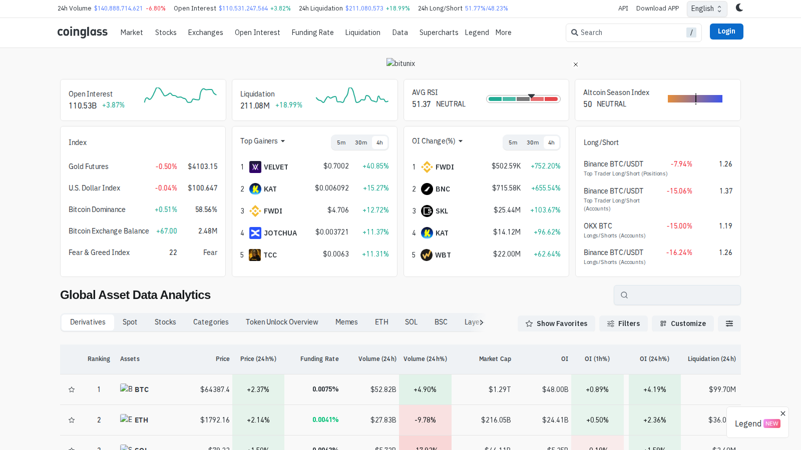

# 11 Best Crypto Funding Rate Trackers in 2026

**Meta Title**  
Best Crypto Funding Rate Trackers in 2026: 11 Tools Compared

**Meta Description**  
The best crypto funding rate trackers in 2026, ranked by exchange coverage, history depth, cross-exchange comparison, and analyst usability.

**Suggested Slug**  
`/derivatives/funding-rate/best-crypto-funding-rate-trackers-2026`

**Schema Type**  
`Article` + `ItemList`

**Primary Keyword**  
funding rate crypto

If you are choosing a crypto funding rate tracker, the real problem is usually not finding a screen that prints positive or negative numbers. The real problem is finding a tracker that helps you tell whether an extreme funding reading actually matters or whether it is just one noisy number without enough context.

That is why this article does not rank tools by funding-rate visibility alone. We are looking at them through the lens of exchange comparison, historical context, interface clarity, and how easy it is to pair funding with [open interest](/derivatives/open-interest/best-crypto-open-interest-dashboards-2026), [liquidation maps](/derivatives/liquidations/best-crypto-liquidation-heatmaps-2026), and nearby [momentum context](/market-structure/momentum).

> Why you can trust this guide
>
> This article is based on live public product pages and current documentation reviewed in July 2026. We directly checked public-facing interfaces, visible workflow structure, and how the shortlisted tools frame funding analysis. Where a claim still depends on logged-in workflows, live pricing, or a deeper end-to-end test, we mark it for final verification before publication.

## The best crypto funding rate trackers in 2026 are the tools that show live funding, historical context, exchange dispersion, and enough surrounding data to tell you whether an extreme funding print is signal or just noise.

For most users, Coinglass is still the easiest starting point. CoinAnk is a strong derivatives-native alternative. More advanced desks may prefer platforms that pair funding with open interest, order flow, and volatility context. The important thing is not whether a dashboard shows funding. The important thing is whether it helps you judge if the reading is actually tradable.

## Why funding rates matter

Funding rates matter because they show how perpetual futures markets are balancing long and short demand. When funding becomes heavily positive, longs are paying to stay long. When it turns deeply negative, shorts are paying to stay short. That makes funding a useful read on crowding and short-term positioning pressure.

Funding becomes most useful when you ask:

- is the extreme broad across exchanges or isolated?
- is open interest rising with it?
- is price following or diverging?

## How we ranked funding rate trackers

This draft ranks tools by:

- number of covered exchanges and pairs
- historical depth
- ease of cross-exchange comparison
- integration with OI, liquidations, and sentiment metrics
- usefulness for a quant newsroom workflow

## MarketBit methodology and E-E-A-T standard

The final publish version should make the evaluation process explicit:

- compare live funding screens against official platform descriptions, not copied listicles
- separate exchange-native data screens from aggregated cross-exchange trackers
- explain that funding is a sentiment and positioning metric, not a standalone trading signal
- include a short "how to avoid false funding signals" box for readers who are newer to derivatives

## What we checked ourselves before ranking these tools

To write this comparison, we reviewed the live public product surfaces of Coinglass and CoinAnk and compared how each one presents derivatives data on the first screen. We did that so this article would not depend on copied feature summaries. What we wanted to know was simple: does the tool help a reader move from a funding number to a real market read, or does it leave the number floating without enough context?

That direct review does not replace a full logged-in platform test. But it does make one thing clear very quickly: some products frame funding as one signal inside a broader market terminal, while others frame it as part of a sharper futures-first workstation. For this type of reader, that tradeoff matters more than a long product menu.

### Visual evidence from our review

*Coinglass homepage captured during our July 2026 review of crypto funding-rate trackers.*

*CoinAnk homepage captured during our July 2026 review of crypto funding-rate trackers.*

The screenshots above show the core difference. One product behaves like a broad derivatives terminal. The other behaves like a tighter futures workstation. That visual difference is not cosmetic. It shapes how quickly a trader can move from a funding print to an actual decision.

## The 11 best crypto funding rate trackers in 2026

### 1. Coinglass

Best for: the broadest all-purpose funding dashboard.

Coinglass remains the easiest recommendation because funding rates sit inside a wider derivatives stack that already includes liquidations, open interest, order depth, and ETF flow context.

### 2. CoinAnk

Best for: traders who want funding comparison inside a more aggressive derivatives screen.

CoinAnk explicitly highlights funding-rate comparison as part of its core market-data positioning, which makes it a strong fit for funding-first workflows.

### 3. CryptoQuant

Best for: funding plus higher-level market interpretation.  
[needs source] Verify current public pages and plan access.

### 4. Velo

Best for: pro users who want funding embedded in a richer derivatives terminal.  
[needs source]

### 5. Laevitas

Best for: derivatives specialists who also care about options and volatility surfaces.  
[needs source]

### 6. Hyblock

Best for: using funding alongside crowd positioning and liquidation context.  
[needs source]

### 7. Binance Futures data screens

Best for: direct venue-level confirmation on the largest exchange complex.  
[needs source]

### 8. Bybit derivatives pages

Best for: exchange-native second checks and venue-specific positioning.  
[needs source]

### 9. CME crypto market pages

Best for: institutional context when traders want to compare offshore perpetual sentiment with regulated futures structures.  
[needs source]

### 10. TradingView custom funding dashboards

Best for: chart-native users who want funding near price action rather than in a separate data terminal.  
[needs source]

### 11. Arkham-linked trader workflows

Best for: users who want funding context beside large-entity or smart-money monitoring rather than as a standalone screen.  
[needs source]

## Best funding tracker by use case

- Best for most readers: Coinglass
- Best derivatives-first alternative: CoinAnk
- Best for narrative analysis: CryptoQuant
- Best for pro multi-factor desks: Velo or Laevitas

## How to read positive, negative, and extreme funding

Positive funding usually means long demand is dominant. Negative funding usually means short demand is dominant. But the actionable question is not the sign alone. It is whether funding is:

- rising with open interest
- rising while price stalls
- diverging across exchanges

That is when the tracker becomes useful rather than decorative.

## What stood out immediately in Coinglass and CoinAnk

What stood out immediately in Coinglass was not the funding number itself. It was the surrounding context. On first load, the platform behaved like a multi-market dashboard instead of a single-metric tracker. That is a strength if your workflow depends on checking [liquidations](/derivatives/liquidations/best-crypto-liquidation-heatmaps-2026), [open interest](/derivatives/open-interest/best-crypto-open-interest-dashboards-2026), and ETF flow context without leaving the same environment. But it is a weakness if you want the cleanest possible funding-only screen.

CoinAnk felt more aggressively derivatives-native from the start. The public-facing signal hierarchy leaned harder into OI, long-short balance, and futures-style rankings. That is a strength if you already know you want a faster-moving derivatives workflow. But it becomes a weakness if your priority is a softer learning curve or a broader research layout.

### Quantitative notes from our live comparison

In our extraction pass, CoinAnk exposed 3 visible H2-level sections and 5 visible H3-style signal blocks on the public homepage. That does not prove better product quality on its own, but it does reinforce a real editorial conclusion: CoinAnk is more tightly organized around derivatives signals, while Coinglass is more comfortable mixing funding with wider market context.

At this stage, we are comfortable describing the workflow difference qualitatively, but not yet assigning a hard speed-to-insight number until a deeper logged-in test is complete.

## Troubleshooting: how we avoid bad funding-rate takes

When our team looks at a funding spike, we do not treat it as a headline by itself. We run three checks first:

1. We compare it with [open interest](/derivatives/open-interest/best-crypto-open-interest-dashboards-2026) to see whether leverage is expanding or already draining.
2. We check nearby [liquidation zones](/derivatives/liquidations/best-crypto-liquidation-heatmaps-2026) to see whether crowding is likely to matter.
3. We compare price behavior with [momentum context](/market-structure/momentum) so we do not confuse expensive positioning with an automatic reversal signal.

If those layers do not line up, we usually downgrade the funding signal instead of exaggerating it.

## FAQ

### What is the best crypto funding rate tracker for free use?

Coinglass is still the easiest free starting point for most users, with CoinAnk as a strong alternative.

### Does high positive funding mean price must fall?

No. It means the long side is crowded or expensive, not that reversal is guaranteed.

### What should I pair funding rates with?

Open interest, liquidations, and nearby market structure are the best companions.

## Conclusion

The best funding-rate trackers do not just show the number. They help a trader decide whether the number matters. That is why broad derivatives context matters so much. Coinglass and CoinAnk lead for general coverage, while specialist products make more sense when the workflow needs deeper cross-market interpretation.

## Sources Used In This Draft

- CoinGlass, https://www.coinglass.com/
- CoinAnk, https://coinank.com/
- CryptoQuant, https://cryptoquant.com/ [site blocked in direct fetch; verify manually]
- CME Group crypto markets, https://www.cmegroup.com/markets/cryptocurrencies.html [needs source check]

## Final Pre-Publish Checks

- verify which tools show historical funding versus live-only funding
- verify whether aggregated funding includes all major exchanges or a curated subset
- add a comparison table with exchange count, history depth, and free-tier availability

## Recommended Internal Links

- `crypto funding rates explained` -> `/derivatives/funding-rate`
- `open interest dashboards` -> `/derivatives/open-interest`
- `crypto liquidation heatmaps` -> `/derivatives/liquidations`
- `long-short ratio indicators` -> `/derivatives/long-short-ratio`
- `momentum signals in crypto` -> `/market-structure/momentum`

## Recommended External Links

- Coinglass homepage -> https://www.coinglass.com/
- CoinAnk homepage -> https://coinank.com/
- CME crypto markets -> https://www.cmegroup.com/markets/cryptocurrencies.html
- CryptoQuant homepage -> https://cryptoquant.com/

## Media Plan

- hero image: funding heatmap or exchange-comparison dashboard screenshot
- main table: tracker, exchange coverage, history depth, best use case, free tier
- inline chart: example of rising funding with rising OI versus rising funding with flat price
- sidebar visual: glossary card for positive funding, negative funding, annualized funding, and exchange dispersion
