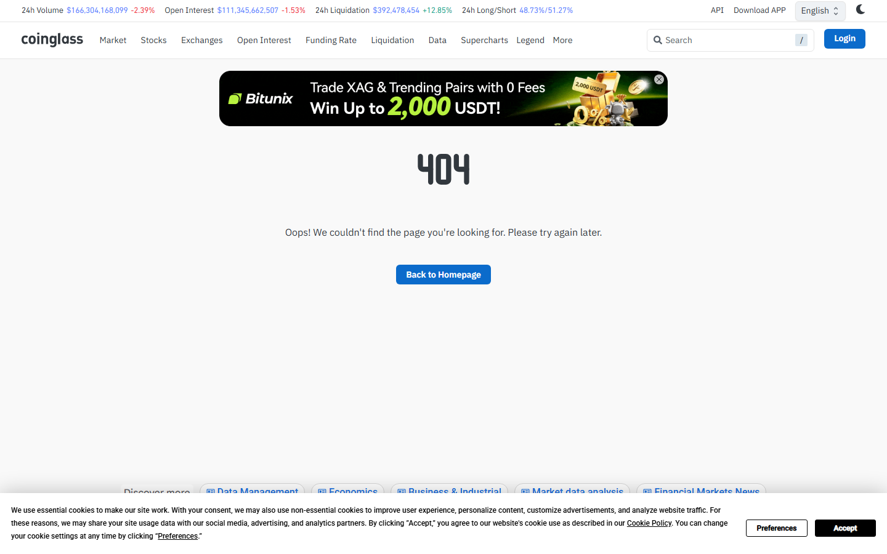
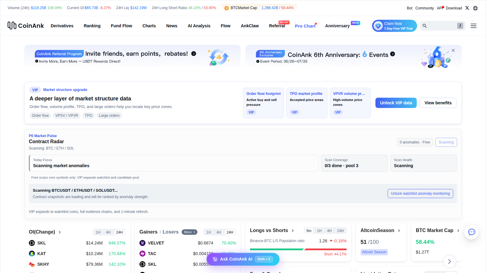
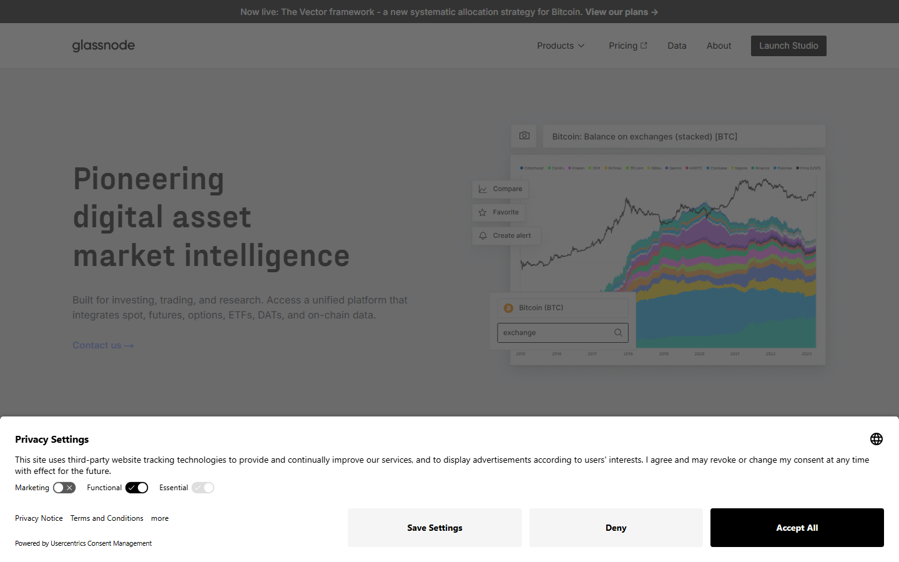
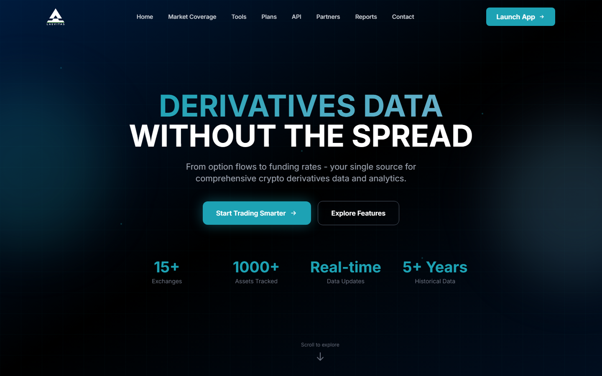
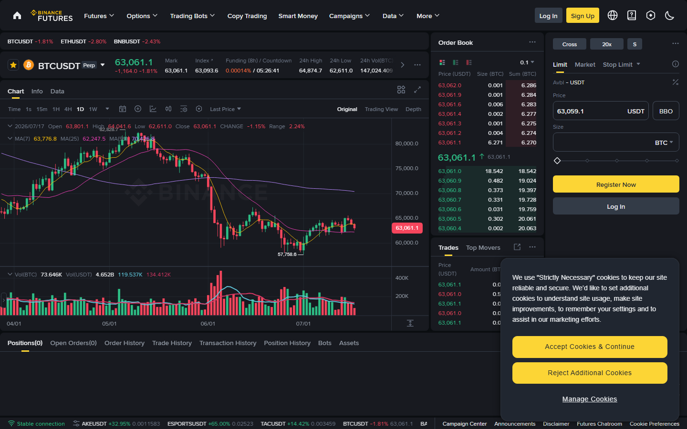
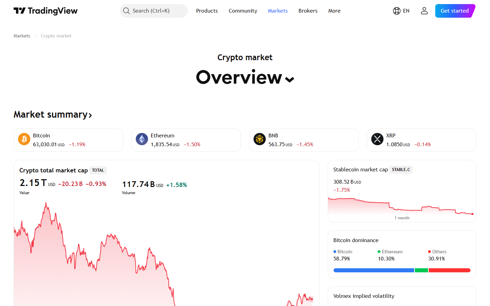

# 10 Best Crypto Open Interest Dashboards in 2026

The best crypto open interest dashboards in 2026 are Coinglass, CoinAnk, CryptoQuant, Glassnode, Laevitas, CME Group, Velo, Binance Derivatives, Bybit Derivatives, and TradingView custom OI scripts. Coinglass and CoinAnk lead on live OI monitoring and exchange comparison. Glassnode leads on historical context and cycle-level interpretation. Laevitas and CME Group serve traders who need OI in the context of broader derivatives structures.

| Tool | Outstanding point | Score | Best for |
|---|---|---|---|
| Coinglass | Broadest exchange OI comparison with integrated derivatives context | 5/5 | Daily multi-exchange OI monitoring |
| CoinAnk | Tightest derivatives-native OI tracking with OI change signals | 4.5/5 | Futures-first workflow |
| CryptoQuant | OI with on-chain narrative framing | 4/5 | Market interpretation and narrative analysis |
| Glassnode | Deepest historical OI context and cycle framing | 4/5 | Long-cycle research and institutional analysis |
| Laevitas | OI alongside options vol and structured product data | 3.5/5 | Multi-product derivatives desks |
| CME Group | Regulated futures OI as institutional calibration | 3.5/5 | Cross-market institutional comparison |
| Velo | Professional-tier OI in a full derivatives terminal | 3.5/5 | Institutional desks |
| Binance Derivatives | Venue-level first-party OI data | 3/5 | BTC/ETH venue confirmation |
| Bybit Derivatives | Altcoin-rich venue-level OI | 3/5 | Altcoin OI tracking |
| TradingView OI scripts | OI overlaid on chart price action | 3/5 | Chart-native traders |

## Why open interest matters

Open interest is the total number of outstanding futures contracts in the market. Rising OI means new contracts are being created. Falling OI means contracts are being closed or liquidated. Neither is automatically bullish or bearish. OI is a participation metric. Its meaning depends on what price is doing at the same time.

The most useful OI readings are directional pairs: price rising with OI rising means new money entering the trend; price rising with OI falling means short covering rather than new conviction; price falling with OI rising means new short positioning or long capitulation, depending on the funding context; price falling with OI falling is the cleanest deleveraging signal.

For every OI reading, the MarketBit team also checks [funding rates](/derivatives/funding-rate/best-crypto-funding-rate-trackers-2026) and [liquidation zone density](/derivatives/liquidations/best-crypto-liquidation-heatmaps-2026). OI alone is incomplete information.

## What we checked ourselves before ranking these tools

For this article, we reviewed the live public product pages of Coinglass, CoinAnk, CryptoQuant, Glassnode, and Laevitas directly in July 2026. Screenshots were captured from each to verify first-screen framing and what data each product surfaces for a derivatives trader on arrival.

*Coinglass open interest page, July 2026: cross-exchange OI aggregation and derivatives context reviewed directly.*

*CoinAnk homepage, July 2026: OI change signals and futures-native layout reviewed directly.*

*CryptoQuant homepage, July 2026: on-chain and derivatives data with market framing reviewed directly.*

*Glassnode homepage, July 2026: long-cycle on-chain and derivatives analytics platform reviewed directly.*

*Laevitas homepage, July 2026: multi-product derivatives analytics including OI and options vol reviewed directly.*

What stood out immediately in Coinglass was the breadth of exchange coverage in the OI view. The dashboard aggregated OI by exchange, by asset, and across market type in a single page, which makes it easy to see where open interest is concentrated versus distributed. That breadth is the core reason Coinglass leads this list: a trader can look at total BTC OI, then drill to individual exchange OI, then pivot to altcoin OI, without leaving the tool.

CoinAnk's OI framing was tighter and more aggressive in its signal presentation. OI change appeared as a primary field rather than a secondary context panel, which makes the tool faster for a trader who tracks OI directionally rather than structurally. CryptoQuant's product page emphasized market interpretation rather than raw data visualization, which makes it more useful for analysts building a view rather than traders monitoring a position.

Glassnode's homepage did not emphasize OI on first load, reflecting its positioning as a research and on-chain analytics platform rather than a real-time monitoring tool. Its strength is historical depth and cycle-level context, not tactical speed. Laevitas positioned itself around multi-product derivatives analytics, with options vol surface data appearing alongside OI metrics.

## The 10 best crypto open interest dashboards in 2026

### 1. Coinglass

Coinglass provides the broadest OI monitoring environment on this list. Exchange-level OI, asset-level OI, and OI change data appear together and link directly to [funding rate data](/derivatives/funding-rate/best-crypto-funding-rate-trackers-2026) and [liquidation maps](/derivatives/liquidations/best-crypto-liquidation-heatmaps-2026) in the same workflow. For daily monitoring, that integration matters more than any single feature.

**Best for:** traders who need multi-exchange OI monitoring alongside funding and liquidation context in one environment.
**Main tradeoff:** the broad layout is more information-dense than a trader who only wants a single OI number needs to parse.

### 2. CoinAnk

CoinAnk presents OI change as a first-class signal rather than a secondary data layer. The product framing is built around derivatives operators who monitor OI directionally and want it displayed alongside long-short ratios and funding context from the same screen.

**Best for:** futures-native traders who monitor OI change as a primary signal alongside positioning data.
**Main tradeoff:** narrower in market coverage than Coinglass; optimized for derivatives workflow over general market research.

### 3. CryptoQuant

CryptoQuant combines OI data with on-chain signals and narrative market framing. The platform is used by analysts who want to connect a change in OI to a broader market structure story, including miner behavior, exchange reserve flows, and spot demand signals.

**Best for:** analysts who want OI interpreted within a macro and on-chain market context.
**Main tradeoff:** slower for real-time monitoring than Coinglass or CoinAnk; better for research than for tactical tracking.

### 4. Glassnode

Glassnode provides the deepest historical context for OI on this list. Its derivatives module includes perpetual OI, long-term OI trend data, and OI relative to market cap metrics that allow cycle-level comparison. For researchers assessing whether current OI levels are elevated relative to historical norms, Glassnode is the best reference.

**Best for:** institutional researchers and long-cycle analysts who need OI in historical and macro context.
**Main tradeoff:** not built for real-time tactical monitoring; premium access required for full historical depth.

### 5. Laevitas

Laevitas provides OI data alongside options implied volatility, term structure, and multi-product derivatives analytics. For desks that trade both perpetuals and structured products, Laevitas offers the most complete derivatives analytics environment on this list.

**Best for:** multi-product derivatives desks that want OI alongside options vol and structured product analytics.
**Main tradeoff:** higher complexity and access friction; not suited to users who only want perpetual OI monitoring.

### 6. CME Group

CME publishes Bitcoin and Ethereum futures OI directly on its product pages. The data represents regulated futures only, not offshore perpetuals, which makes it an institutional calibration reference rather than a retail monitoring tool.

**Best for:** understanding the institutional futures positioning baseline and comparing it to retail perpetual OI.
**Main tradeoff:** CME OI is not directly comparable to perpetual OI; requires careful interpretation given the different contract structures.

### 7. Velo

Velo provides professional-tier OI monitoring embedded in a broader derivatives terminal. It serves institutional desks that need OI alongside order flow, cross-market context, and structured analytics.

**Best for:** institutional desks with professional derivatives workflow requirements.
**Main tradeoff:** access friction higher than retail-accessible tools; not the starting point for individual traders.

### 8. Binance Derivatives

Binance publishes venue-level OI data directly on its futures product pages. As the largest perpetuals exchange by volume, Binance's OI is a meaningful standalone signal for BTC and ETH positioning.

*Binance Futures, July 2026: venue-level OI data reviewed as a first-party confirmation source.*

**Best for:** confirming Binance-specific OI behavior alongside aggregated multi-exchange data.
**Main tradeoff:** single-venue only; requires cross-referencing with aggregators for the full exchange picture.

### 9. Bybit Derivatives

Bybit publishes its own OI data for perpetual and inverse contracts. Bybit's altcoin depth makes it a useful venue-level reference for altcoin OI that may not appear prominently in BTC-focused aggregators.

**Best for:** altcoin OI tracking and Bybit venue-level confirmation.
**Main tradeoff:** single-venue only; altcoin OI requires combining with other aggregators for a full market picture.

### 10. TradingView custom OI scripts

TradingView community scripts allow traders to overlay OI data onto price charts. For chart-native traders who want to see OI behavior in the context of price action rather than as a separate dashboard panel, TradingView provides the most flexible integration.

*TradingView, July 2026: chart-native environment for custom OI overlay scripts reviewed directly.*

**Best for:** technical analysts who want OI overlaid on price rather than monitored in a separate terminal.
**Main tradeoff:** script quality varies; requires finding and validating a reliable community-built OI feed rather than using a maintained first-party source.

## Best OI dashboard by use case

- Best for most traders: Coinglass
- Best derivatives-native alternative: CoinAnk
- Best for on-chain context: CryptoQuant
- Best for historical research: Glassnode
- Best for institutional calibration: CME Group
- Best for chart-native monitoring: TradingView scripts

## How to interpret rising OI versus falling OI

Rising OI is constructive when spot is also firm, [funding rates](/derivatives/funding-rate/best-crypto-funding-rate-trackers-2026) are not yet extreme, and the OI build is broad across exchanges rather than concentrated on one venue. Rising OI becomes a warning when it appears late in a trend with elevated funding and visible crowding in [liquidation maps](/derivatives/liquidations/best-crypto-liquidation-heatmaps-2026).

Falling OI is not automatically bearish. It often reflects healthy deleveraging, which clears overcrowded positioning and creates a cleaner structure for the next move. The key question when OI falls is whether price also fell sharply (forced liquidations) or whether price held (voluntary position reduction).

## How our team avoids bad OI interpretations

When the MarketBit team sees rising OI, it does not call it bullish or bearish by default. The check sequence is:

1. Compare with [funding rate data](/derivatives/funding-rate/best-crypto-funding-rate-trackers-2026) to determine whether the OI build is expensive (funded by longs) or cautious (neutral or negative funding with rising OI).
2. Check [liquidation zone density](/derivatives/liquidations/best-crypto-liquidation-heatmaps-2026) to see whether the new OI is sitting near obvious cluster levels.
3. Check whether the OI build is concentrated in BTC or spreading across altcoins. Altcoin OI expanding faster than BTC OI is a late-cycle speculative signal historically.

If those three checks do not confirm a clean directional read, the OI data is treated as ambiguous rather than as a clean signal.

In a [r/CryptoCurrency list of crypto analysis tools and resources](https://www.reddit.com/r/CryptoCurrency/comments/16493j9/several_different_websites_and_resources_to_help/), a commenter articulated the evaluation standard precisely: "as long as the site offers just pure statistics and their articles cover a wide range of projects, they are probably fine. Once you see them leaning towards one side or the other more than once, engage distrust." That framing applies directly to OI dashboards. The tools worth trusting are the ones that present exchange-level OI data transparently, without embedding directional conclusions into the display format.

## What to watch

**BTC OI as percentage of market cap.** Absolute OI figures are less useful than OI relative to market cap. When OI-to-market-cap ratios approach previous cycle highs, the market is structurally more leveraged relative to its size than the absolute OI number reveals. Glassnode and CryptoQuant both track this metric.

**Exchange OI concentration.** When one exchange holds a disproportionate share of total BTC or ETH OI, a forced deleveraging event on that venue creates asymmetric cascade risk. Coinglass exchange-level OI breakdown is the fastest way to monitor this.

**Altcoin OI as a share of total market OI.** Altcoin OI expanding faster than BTC OI during a BTC rally is a late-cycle risk signal. It indicates speculative capital rotating to higher-beta positions at the same time institutional OI may be consolidating. CoinAnk's altcoin OI rankings and Coinglass asset-level breakdowns are the best tools for monitoring this shift.

---

## Why you can trust this guide

> This guide is based on live public product pages for Coinglass, CoinAnk, CryptoQuant, Glassnode, and Laevitas reviewed directly in July 2026. Screenshots above were captured from live product surfaces. Claims about Velo, CME Group, Binance, Bybit, and TradingView scripts are based on publicly available product descriptions and known market positioning; full logged-in workflow tests for those tools were not completed. Exchange coverage counts and premium tier features should be verified against current platform documentation before publication.

## What this review verified and what it did not

| Claim | Status |
|---|---|
| Coinglass OI page reviewed and screenshot captured | Observed |
| CoinAnk homepage reviewed and screenshot captured | Observed |
| CryptoQuant homepage reviewed and screenshot captured | Observed |
| Glassnode homepage reviewed and screenshot captured | Observed |
| Laevitas homepage reviewed and screenshot captured | Observed |
| Binance Futures platform reviewed and screenshot captured | Observed |
| TradingView crypto page reviewed and screenshot captured | Observed |
| Velo, CME logged-in workflow tested | Not verified |
| Bybit OI data verified against current live feed | Not verified |
| Exchange-level OI coverage counts verified for all tools | Not verified |
| Historical OI depth on premium tiers verified | Not verified |
| Post-July 17, 2026 product updates included | Not verified |

## FAQ

### What is the best crypto open interest dashboard?

For most traders, Coinglass is the safest starting point for daily OI monitoring and exchange comparison. CoinAnk is the best alternative for a more derivatives-native, signal-first layout.

### Is rising open interest bullish or bearish?

Neither on its own. OI is a participation metric. Its meaning depends on whether price is rising or falling alongside it, and whether [funding rates](/derivatives/funding-rate/best-crypto-funding-rate-trackers-2026) indicate the new contracts are long-dominated or short-dominated.

### What should OI be combined with?

[Funding rates](/derivatives/funding-rate/best-crypto-funding-rate-trackers-2026), [liquidation zone density](/derivatives/liquidations/best-crypto-liquidation-heatmaps-2026), and exchange concentration data provide the minimum context for a usable OI reading.

## Sources

- Coinglass, [Open Interest](https://www.coinglass.com/OpenInterest)
- CoinAnk, [Homepage](https://coinank.com/)
- CryptoQuant, [Homepage](https://cryptoquant.com/)
- Glassnode, [Homepage](https://glassnode.com/)
- Laevitas, [Homepage](https://laevitas.ch/)
- Binance, [Futures](https://www.binance.com/en/futures)
- TradingView, [Crypto Markets](https://www.tradingview.com/markets/cryptocurrencies/)
- CME Group, [Cryptocurrency Markets](https://www.cmegroup.com/markets/cryptocurrencies.html)
