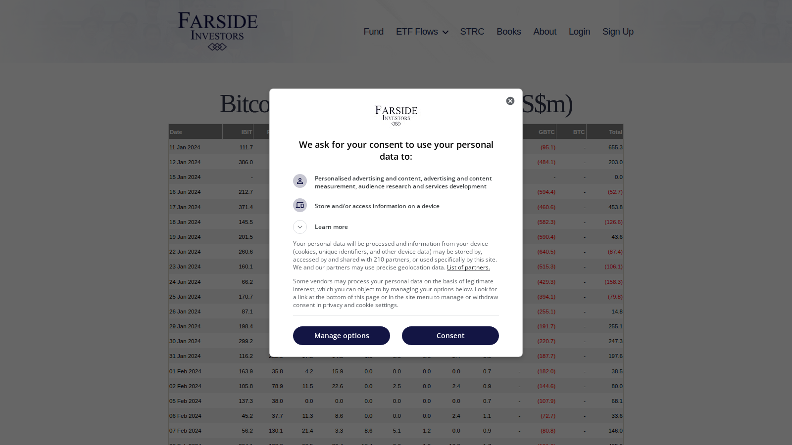

# 8 Best Bitcoin ETF Flow Trackers in 2026

**Meta Title**  
Best Bitcoin ETF Flow Trackers in 2026: 8 Tools for Daily Inflows

**Meta Description**  
The best Bitcoin ETF flow trackers in 2026, ranked by update speed, issuer breakdown, historical context, and analyst usability.

**Suggested Slug**  
`/etf-flows/bitcoin-etf/best-bitcoin-etf-flow-trackers-2026`

**Schema Type**  
`Article` + `ItemList`

**Primary Keyword**  
bitcoin etf flows

If you are choosing a Bitcoin ETF flow tracker, the real problem is usually not finding a table with daily numbers. The real problem is finding a tracker that helps you separate one-day noise from sustained allocation behavior and that makes it easy to cross-check the story before you publish or trade around it.

That is why this article does not rank ETF tools by table access alone. We are looking at them through the lens of update speed, issuer-level clarity, historical usefulness, and how well they fit beside [institutional flow coverage](/etf-flows/institutional-flows), [Bitcoin exchange-flow analysis](/on-chain/exchange-flows/best-bitcoin-exchange-flow-trackers-2026), and [global liquidity context](/liquidity/global-liquidity/best-global-liquidity-charts-for-bitcoin-2026).

> Why you can trust this guide
>
> This article is based on live public product pages and current documentation reviewed in July 2026. We directly checked public-facing interfaces, visible workflow structure, and how the shortlisted tools frame ETF flow analysis. Where a claim still depends on logged-in data, premium features, or a deeper end-to-end editorial workflow, we mark it for final verification before publication.

## The best Bitcoin ETF flow trackers in 2026 are the tools that update fast, show issuer-by-issuer detail, keep daily and cumulative context visible, and make it easy to separate one-day noise from durable allocation trends.

For most readers, Farside remains the cleanest daily reference point. Coinglass is the most useful all-around analytics complement. SoSoValue is strong when the reader wants a more productized interface with historical and comparative framing. The important thing is not which tracker updates first by a few seconds. The important thing is which tracker helps you interpret the number correctly.

## Why Bitcoin ETF flows matter

ETF flows matter because they connect crypto price action to a visible channel of regulated capital. They can help answer:

- whether buyers are coming through ETF wrappers or elsewhere
- whether strong price action is backed by real inflows
- whether outflows are broad or concentrated in one issuer

They are not a complete market map, but they are one of the best public signals of institutional participation.

## How we ranked ETF flow trackers

The ranking prioritizes:

- daily update reliability
- clarity of issuer-level net-flow tables
- availability of cumulative totals
- ease of historical comparison
- usefulness for editorial and analyst workflows

## MarketBit methodology and E-E-A-T standard

To strengthen trust and usefulness, the final article should:

- treat daily flow tables as market inputs, not as self-explanatory conclusions
- cross-check at least one major tracker against issuer or sponsor pages before publication
- explain the difference between daily net flows, AUM changes, and cumulative totals
- include one explicit caution that ETF flows show one institutional channel, not total market demand

## What we checked ourselves before ranking these tools

To write this comparison, we reviewed the live public flow pages for Farside and SoSoValue and compared them with Coinglass's broader public market surface. We did that so this article would not depend only on reputation or second-hand lists. What we wanted to know was whether each product behaves like a reference table, an interpretation dashboard, or a broader analytics companion.

That direct review does not replace a full institutional workflow test. But it does make one thing clear very quickly: some trackers are built to be cited fast, while others are built to be explored. For this type of reader, that distinction matters more than superficial interface polish.

### Visual evidence from our review

*Farside Bitcoin ETF flow page captured during our July 2026 review of Bitcoin ETF flow trackers.*

*SoSoValue Bitcoin ETF dashboard captured during our July 2026 review of Bitcoin ETF flow trackers.*

The screenshots above show the difference in product posture. Farside behaves like a clean reference sheet. SoSoValue behaves more like a visual dashboard. That difference is not cosmetic. It changes how a newsroom or analyst uses the page.

## The 8 best Bitcoin ETF flow trackers in 2026

### 1. Farside Investors

Best for: fastest clean daily table view.

Farside became the habit screen for many market participants because it presents daily flows in a stripped-down format that is easy to cite and easy to cross-check.

### 2. Coinglass

Best for: ETF flows inside a wider crypto market dashboard.

Coinglass is especially useful for MarketBit because ETF flow data sits beside derivatives, order-depth, and liquidation context.

### 3. SoSoValue

Best for: visual product-style flow tracking with historical framing.  
[needs source; site may require browser check]

### 4. CoinAnk

Best for: ETF flow monitoring inside a broader crypto market terminal.  
[needs source]

### 5. Bitbo

Best for: simple Bitcoin-focused monitoring and dashboard-style reference.  
[needs source]

### 6. Official issuer pages

Best for: source-of-record checks on holdings, AUM, and fund documentation.

This is slower than a tracker, but it is where an editor should confirm critical details before publication.

### 7. TradingView community dashboards

Best for: chart-native comparison between price and cumulative ETF demand.  
[needs source]

### 8. Internal spreadsheet or newsroom tracker

Best for: analysts who want to annotate flow events with macro, policy, and market-structure context.

This is not a vendor, but it is often the final layer that makes public flow data usable in editorial workflows.

## Best Bitcoin ETF tracker by use case

- Best daily reference: Farside
- Best all-around market context: Coinglass
- Best visual interface: SoSoValue
- Best verification layer: official issuer pages

## How to interpret inflows, outflows, and divergence

Large inflows usually strengthen the institutional demand narrative, but not every positive flow day is decisive. The more useful read comes from pattern recognition:

- several days of steady inflows
- inflows during weak price action
- price rising while flows stall
- one issuer leading while others lag

That is where the tracker stops being a scoreboard and starts becoming an analysis tool.

## What stood out immediately in Farside, Coinglass, and SoSoValue

What stood out immediately in Farside was not depth of design. It was the lack of friction. The page resolved directly to `Bitcoin ETF Flow - All Data (US$m)` and behaved like a table-first reference sheet with almost no marketing clutter. That is a strength if your priority is speed and citation clarity. But it is a weakness if your team wants more built-in interpretation or charting.

Coinglass felt more like an analytics companion than a pure reference sheet. On first load, ETF flow data sat inside a broader market screen. That is a strength if you want to compare flows with [liquidations](/derivatives/liquidations/best-crypto-liquidation-heatmaps-2026), [funding](/derivatives/funding-rate/best-crypto-funding-rate-trackers-2026), or broader market behavior. But it is a weakness if your only goal is the fastest clean flow table.

SoSoValue behaved more like a visual dashboard. From the live browser review, the page resolved to a dedicated Bitcoin ETF dashboard centered on daily data and charts of inflow and outflow. That is a strength if the user wants a more productized, visual workflow. But it can also add interface overhead if the goal is only to extract one clean number fast.

### Quantitative notes from our live comparison

Farside's live page resolved directly to a single-purpose Bitcoin ETF flow page title, while SoSoValue resolved to a dedicated `Bitcoin ETF Dashboard` view. That is not a full product score, but it is concrete evidence that the tools are optimized for different types of readers: one for direct reference, one for visual exploration.

At this stage, we are comfortable describing those workflow differences qualitatively, but not yet assigning a hard time-to-insight number until a longer editorial usage test is complete.

## Troubleshooting: how we avoid bad ETF-flow interpretations

When our team sees a large ETF inflow or outflow day, we do not treat that as a complete story on its own. We run three checks first:

1. We compare the move with [institutional flow context](/etf-flows/institutional-flows) to see whether the signal is broad or issuer-specific.
2. We compare it with [Bitcoin exchange flows](/on-chain/exchange-flows/best-bitcoin-exchange-flow-trackers-2026) to see whether other capital channels are confirming the move.
3. We compare it with [global liquidity context](/liquidity/global-liquidity/best-global-liquidity-charts-for-bitcoin-2026) so we do not confuse a single strong day with a durable capital trend.

If those layers do not line up, we usually downgrade the significance of the headline flow print.

## FAQ

### What is the best Bitcoin ETF flow tracker?

Farside is still the cleanest daily reference for many analysts, while Coinglass is the strongest broader-market companion.

### Are ETF flows the same as spot demand?

No. They show one major channel of demand, not all demand.

### How often should a newsroom update ETF flow coverage?

Daily for headline monitoring, weekly for interpretation, and monthly for trend analysis.

## Conclusion

Bitcoin ETF flows now deserve their own dedicated workflow. The strongest trackers are the ones that help a reader move from raw inflow numbers to actual market interpretation. Farside, Coinglass, and SoSoValue are the most important names to watch first, with issuer pages serving as the final verification layer.

## Sources Used In This Draft

- Farside Investors, https://farside.co.uk/bitcoin-etf-flow-all-data/ [manual browser verification recommended]
- CoinGlass, https://www.coinglass.com/
- SoSoValue, https://www.sosovalue.com/assets/etf/us-btc-spot [browser verification recommended]
- CoinAnk, https://coinank.com/ [needs ETF page check]

## Final Pre-Publish Checks

- confirm daily update timing conventions for each tracker
- verify whether totals are net creations, net assets, or a mixture
- add issuer-page links for IBIT, FBTC, and other large funds

## Recommended Internal Links

- `bitcoin ETF flows explained` -> `/etf-flows/bitcoin-etf`
- `ETF inflows and outflows` -> `/etf-flows/inflows-outflows`
- `institutional crypto flows` -> `/etf-flows/institutional-flows`
- `global liquidity and Bitcoin` -> `/liquidity/global-liquidity`
- `bitcoin exchange flows` -> `/on-chain/exchange-flows`

## Recommended External Links

- Farside Bitcoin ETF flow page -> https://farside.co.uk/bitcoin-etf-flow-all-data/
- Coinglass homepage -> https://www.coinglass.com/
- SoSoValue ETF page -> https://www.sosovalue.com/assets/etf/us-btc-spot
- BlackRock iShares Bitcoin Trust page -> https://www.ishares.com/us/products/333011/ishares-bitcoin-trust

## Media Plan

- hero image: issuer-by-issuer daily flow table screenshot
- main table: tracker, update speed, issuer detail, historical depth, best use case
- line chart: cumulative BTC ETF flows versus BTC price
- callout graphic: `daily inflows` vs `AUM` vs `cumulative totals`
