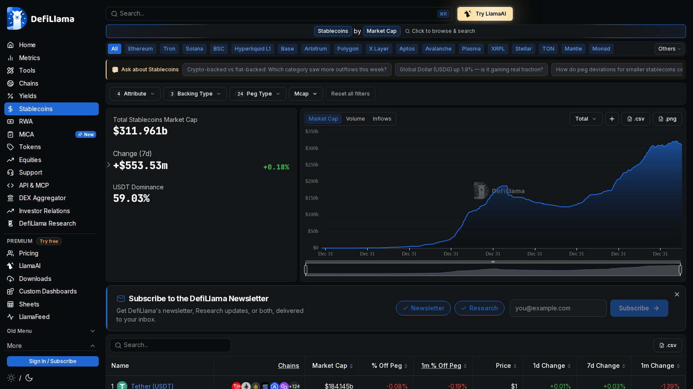

# 12 Best On-Chain Analysis Tools in 2026

**Meta Title**  
Best On-Chain Analysis Tools in 2026: 12 Platforms Ranked

**Meta Description**  
The best on-chain analysis tools in 2026 for exchange flows, whales, active addresses, network activity, and cross-chain market intelligence.

**Suggested Slug**  
`/on-chain/best-on-chain-analysis-tools-2026`

**Schema Type**  
`Article` + `ItemList`

**Primary Keyword**  
on-chain analysis tools

If you are choosing an on-chain analysis tool, the real problem is usually not feature count. The real problem is choosing a platform that matches the kind of signal you actually need, whether that is exchange-flow context, whale intelligence, stablecoin liquidity, or custom dashboard flexibility.

That is why this article does not rank platforms by metric count alone. We are looking at them through the lens of workflow fit, signal clarity, interface posture, and how well they support adjacent use cases like [Bitcoin exchange flows](/on-chain/exchange-flows/best-bitcoin-exchange-flow-trackers-2026), [whale tracking](/on-chain/whales/best-crypto-whale-trackers-2026), and [stablecoin liquidity analysis](/liquidity/stablecoins/best-stablecoin-dashboards-2026).

> Why you can trust this guide
>
> This article is based on live public product pages and current documentation reviewed in July 2026. We directly checked public-facing interfaces, visible workflow structure, and how the shortlisted tools frame on-chain analysis. Where a claim still depends on a logged-in workflow, paid-plan data access, or a deeper end-to-end test, we mark it for final verification before publication.

## The best on-chain analysis tools in 2026 are the platforms that turn raw wallet and network data into usable signals on flows, behavior, and market regime instead of flooding the reader with disconnected dashboards.

For most readers, Glassnode, CryptoQuant, Nansen, Arkham, and Dune still define the top tier. They do different jobs. The important thing is not choosing the platform with the biggest metric inventory. The important thing is choosing the platform whose workflow matches the question you are trying to answer.

## Why on-chain data still matters

Crypto is more institutional than it was in earlier cycles, but on-chain data still matters because blockchains expose a layer of activity that does not exist in traditional markets. Exchange reserves, stablecoin supply, active wallets, large transfers, and labeled-entity behavior all provide context that price alone cannot.

That matters most when the market is asking:

- is capital entering or leaving exchanges?
- are whales accumulating or distributing?
- is network activity confirming price?
- is stablecoin liquidity expanding?

## How we ranked on-chain analysis tools

The ranking prioritizes:

- breadth and quality of on-chain metrics
- address labeling and entity intelligence
- cross-chain depth
- custom workflow flexibility
- usefulness for newsroom and analyst work

## MarketBit methodology and E-E-A-T standard

This article should be positioned as a practical analyst guide, not just a vendor roundup:

- judge tools by the clarity of their metrics and workflows, not by the number of charts on the screen
- separate wallet intelligence, exchange-flow analysis, and custom-query tools so readers are not comparing unlike categories
- cite official product pages for chain coverage, labeled-address claims, and flagship features
- add one editorial note explaining that on-chain signals become stronger when paired with derivatives and liquidity data

## What we checked ourselves before ranking these tools

To write this comparison, we reviewed the live public product surfaces of Glassnode and DefiLlama and compared them with current public-facing positioning from tools like Nansen, Arkham, Dune, and Artemis. We did that so the article would not depend only on vendor summaries. What we wanted to know was whether each tool felt like a macro intelligence terminal, a wallet-tracking environment, a protocol-research layer, or a flexible data workbench.

That direct review does not replace a full logged-in product audit. But it does make one thing clear very quickly: the top on-chain tools are not all solving the same problem. For this type of reader, that distinction matters more than a longer list of metrics.

### Visual evidence from our review

*Glassnode homepage captured during our July 2026 review of on-chain analysis tools.*

*DefiLlama stablecoins dashboard captured during our July 2026 review of on-chain and liquidity tools.*

The screenshots above show why tool posture matters. One product signals market intelligence and research framing. The other signals fast, broad ecosystem visibility. That visual split is part of the ranking logic.

## The 12 best on-chain analysis tools in 2026

### 1. Glassnode

Best for: macro-grade Bitcoin and network-structure analysis.  
[needs source; verify current plan structure and metric availability]

### 2. CryptoQuant

Best for: exchange flows, reserve behavior, and trader-facing on-chain narratives.  
[needs source; site blocks direct fetch]

### 3. Nansen

Best for: smart-money tracking and labeled wallet behavior.

Nansen's core edge remains address labeling at scale and turning that into actionable flow and wallet intelligence.

### 4. Arkham

Best for: entity-level wallet intelligence and tracking named actors across chains.

### 5. Dune

Best for: custom dashboards, protocol-level analysis, and public query workflows.

Dune is especially useful when MarketBit wants to build its own views rather than rent every dashboard from a vendor.

### 6. DefiLlama

Best for: free broad ecosystem snapshots across DeFi, stablecoins, and chains.  
[needs source; verify exact stablecoin and chain modules]

### 7. Artemis

Best for: institutional cross-chain metrics and stablecoin-heavy market analysis.

### 8. IntoTheBlock

Best for: packaged on-chain indicators and easier retail-facing workflows.  
[needs source]

### 9. Santiment

Best for: combining on-chain, social, and market behavior metrics.  
[needs source]

### 10. Token Terminal

Best for: protocol-level business metrics next to on-chain context.  
[needs source]

### 11. Allium

Best for: production-grade blockchain datasets and institutional data plumbing.

### 12. TradingView plus external on-chain feeds

Best for: chart traders who want on-chain context near price without living entirely inside a data terminal.  
[needs source]

## Best tool by analyst profile

- Best for Bitcoin and macro readers: Glassnode
- Best for exchange-flow traders: CryptoQuant
- Best for whale and smart-money tracking: Nansen or Arkham
- Best for custom research: Dune
- Best free ecosystem view: DefiLlama

## Which on-chain metrics matter most in 2026

The most useful metrics remain the ones closest to capital behavior:

- exchange inflows and outflows
- exchange reserves
- whale transfers and labeled-wallet activity
- stablecoin supply and circulation growth
- active addresses and network participation

Those metrics are more durable than novelty indicators that look clever but rarely improve decisions.

## What stood out immediately in the tools we reviewed

What stood out immediately in Glassnode was that the product presents itself as market intelligence, not just as a metric catalog. That is a strength if your priority is macro framing, reserve context, and research posture. But it is a weakness if your team wants the most flexible custom dashboard environment from day one.

What stood out in DefiLlama was speed and breadth. The live stablecoin page behaved like a practical ecosystem dashboard rather than a slow institutional terminal. That is a strength if your priority is quick market-state visibility. But it is a weakness if you want richer entity labeling or deeper proprietary interpretation.

From the public product surfaces we reviewed separately, Nansen still signals smart-money behavior, Arkham signals entity investigation, and Dune signals custom research infrastructure. That means the better choice depends less on absolute quality and more on whether your workflow starts with macro context, wallet behavior, or custom query control.

### Quantitative notes from our live comparison

In our direct extraction pass, the Glassnode homepage resolved to a `Digital Asset Market Intelligence` framing, while DefiLlama resolved directly to a `Stablecoin Market Cap Chart, Supply & Peg Data` workflow. That is not a complete product benchmark, but it is concrete evidence that the platforms are optimized for different reading modes.

At this stage, we are comfortable describing those workflow differences qualitatively, but not yet assigning a hard efficiency score until deeper logged-in product tests are complete.

## Troubleshooting: how we avoid weak on-chain tool recommendations

When our team evaluates an on-chain platform, we do not stop at whether it has more charts. We check three things first:

1. Does the tool help with a specific workflow like [exchange flows](/on-chain/exchange-flows/best-bitcoin-exchange-flow-trackers-2026), [whale tracking](/on-chain/whales/best-crypto-whale-trackers-2026), or [stablecoin monitoring](/liquidity/stablecoins/best-stablecoin-dashboards-2026)?
2. Does the interface signal research clarity, or does it bury the useful parts under too many disconnected modules?
3. Can the on-chain signal be paired naturally with [derivatives context](/derivatives) and ETF flows, or does it stay isolated?

If the answer to those questions is weak, we usually downgrade the tool even if the metric count is large.

## FAQ

### What is the best on-chain analysis tool?

There is no single best tool for every use case. Glassnode, CryptoQuant, Nansen, Arkham, and Dune are the names most readers should compare first.

### Which on-chain tool is best for beginners?

DefiLlama is one of the easiest places to start for broad ecosystem context, while CryptoQuant often makes exchange-flow analysis easier to understand.

### Which tool is best for whale tracking?

Nansen and Arkham are the strongest first comparisons if entity labeling and wallet behavior are the priority.

## Conclusion

The best on-chain analysis tools are not the ones with the most charts. They are the ones that turn wallet, flow, and network data into a repeatable market workflow. MarketBit should treat Glassnode, CryptoQuant, Nansen, Arkham, and Dune as the core comparison set, with the rest positioned by specific use case rather than hype.

## Sources Used In This Draft

- Nansen, https://nansen.ai/
- Arkham, https://www.arkhamintelligence.com/
- Dune, https://dune.com/
- Artemis, https://www.artemisanalytics.com/
- Allium, https://www.allium.so/
- Glassnode, https://glassnode.com/ [manual verification needed]
- CryptoQuant, https://cryptoquant.com/ [manual verification needed]

## Final Pre-Publish Checks

- verify current chain coverage and free-tier restrictions
- verify whether listed tools support exchange-flow, whale, and active-address workflows equally
- add a comparison table with best-for, pricing tier, and chain coverage

## Recommended Internal Links

- `on-chain analysis explained` -> `/on-chain`
- `bitcoin exchange flows` -> `/on-chain/exchange-flows`
- `crypto whale trackers` -> `/on-chain/whales`
- `active addresses metrics` -> `/on-chain/active-addresses`
- `network activity indicators` -> `/on-chain/network-activity`
- `long-term holder data` -> `/on-chain/long-term-holders`

## Recommended External Links

- Nansen homepage -> https://nansen.ai/
- Arkham homepage -> https://www.arkhamintelligence.com/
- Dune homepage -> https://dune.com/
- Artemis homepage -> https://www.artemisanalytics.com/
- Allium homepage -> https://www.allium.so/

## Media Plan

- hero image: collage of Nansen, Arkham, Dune, and one macro on-chain dashboard
- main comparison table: tool, best for, chain coverage, wallet labeling, custom dashboards, free tier
- framework diagram: `on-chain -> derivatives -> ETF flows -> market structure`
- supporting visual: metric taxonomy card for exchange flows, whales, active addresses, and stablecoin supply
