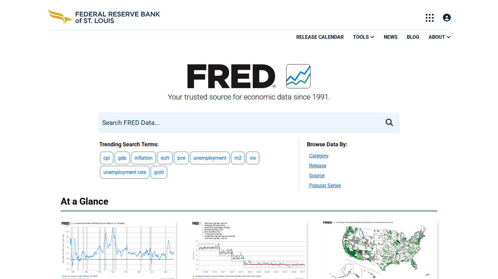

# 7 Best Global Liquidity Charts for Bitcoin in 2026

**Meta Title**  
Best Global Liquidity Charts for Bitcoin in 2026: 7 Macro Tools Ranked

**Meta Description**  
Compare the best global liquidity charts for Bitcoin in 2026, including M2, macro-liquidity proxies, and BTC correlation views for serious analysts.

**Suggested Slug**  
`/liquidity/global-liquidity/best-global-liquidity-charts-for-bitcoin-2026`

**Schema Type**  
`Article` + `ItemList`

**Primary Keyword**  
global liquidity bitcoin

If you are choosing a global liquidity chart for Bitcoin, the real problem is usually not finding a chart that overlays two lines. The real problem is deciding whether the chart uses a clear liquidity proxy, whether the method is transparent enough to trust, and whether the comparison helps you think better instead of just confirming a macro meme.

That is why this article does not rank charts by visual appeal alone. We are looking at them through the lens of data transparency, macro usefulness, repeatability, and how well they fit beside [Bitcoin ETF flows](/etf-flows/bitcoin-etf/best-bitcoin-etf-flow-trackers-2026), [stablecoin liquidity](/liquidity/stablecoins/best-stablecoin-dashboards-2026), and broader [market-cycle analysis](/market-structure/cycles).

> Why you can trust this guide
>
> This article is based on live public product pages and current documentation reviewed in July 2026. We directly checked public-facing interfaces, visible workflow structure, and how the shortlisted platforms frame macro-liquidity analysis. Where a claim still depends on custom chart-building, proprietary composites, or a deeper model review, we mark it for final verification before publication.

## The best global liquidity charts for Bitcoin in 2026 are the ones that show liquidity proxies clearly, update consistently, and make it easy to compare macro liquidity conditions with BTC price without pretending the relationship is mechanical.

For most readers, TradingView-based workflows remain the most flexible. Macro data sources like FRED and MacroMicro are crucial for building cleaner inputs. The important thing is not whether the chart says `liquidity`. The important thing is whether the methodology is clear enough that the reader knows what the chart is actually measuring.

## Why global liquidity matters for Bitcoin

Global liquidity matters because Bitcoin often responds to changes in the availability of capital, risk appetite, and balance-sheet expansion. That does not mean Bitcoin is a pure M2 chart. It means liquidity conditions can shape the background environment in which BTC trades.

The useful question is not "does BTC always follow liquidity?" It is:

- when does the relationship tighten?
- when does it break?
- what explains the gap?

## How we ranked global liquidity charts

This draft ranks charts by:

- transparency of underlying data
- update consistency
- ease of comparing liquidity with BTC price
- ability to support serious macro interpretation rather than social-media chartposting
- usefulness for MarketBit editorial workflows

## MarketBit methodology and E-E-A-T standard

This article needs stronger macro discipline than a normal crypto listicle:

- define exactly which liquidity proxies are being used in the final version
- distinguish global M2-style charts from broader dollar-liquidity or balance-sheet composites
- explain where correlation is loose, delayed, or broken rather than overstating the relationship
- include one methodology box that tells readers why the chosen charts were selected

## What we checked ourselves before ranking these charts

To write this comparison, we reviewed the live public product surfaces of FRED and MacroMicro and compared them against the role that more flexible charting environments like TradingView play in a Bitcoin liquidity workflow. We did that so the article would not flatten every liquidity chart into the same category. What we wanted to know was whether the source helps a reader understand the underlying data or only consume a finished narrative.

That direct review does not replace a full custom-chart build for every listed source. But it does make one thing clear very quickly: some platforms are strongest as transparent data foundations, while others are strongest as flexible charting overlays. For this type of reader, that tradeoff matters more than visual polish.

### Visual evidence from our review

*FRED homepage captured during our July 2026 review of Bitcoin global-liquidity chart sources.*

*MacroMicro homepage captured during our July 2026 review of Bitcoin global-liquidity chart sources.*

The screenshots above show why the distinction matters. One environment signals transparent data access. The other signals a more packaged macro-dashboard workflow. That visual difference shapes how much interpretation the reader must do for themselves.

## The 7 best global liquidity charts for Bitcoin in 2026

### 1. TradingView custom global liquidity overlays

Best for: flexible chart workflows and BTC overlay analysis.

TradingView wins because analysts can combine price with macro proxies, custom scripts, and additional context like yields or DXY on one screen.

### 2. FRED-based liquidity builds

Best for: transparent U.S.-centric macro inputs and reproducible chart setups.  
[needs source] The final piece should link exact series used.

### 3. MacroMicro global liquidity views

Best for: readers who want a cleaner packaged macro dashboard without building every chart from scratch.  
[needs source]

### 4. BGeometrics-style liquidity dashboards

Best for: readers who want purpose-built Bitcoin-versus-liquidity visualizations.  
[needs source]

### 5. CrossBorder Capital liquidity frameworks

Best for: macro readers who want a more formal liquidity lens rather than social chart overlays.  
[needs source]

### 6. Artemis stablecoin-supply dashboards

Best for: adding a crypto-native liquidity proxy beside traditional macro liquidity.

Stablecoin growth is not the same as global liquidity, but it is a valuable parallel signal inside crypto market structure.

### 7. Dune stablecoin and flow dashboards

Best for: custom crypto-liquidity overlays that complement, rather than replace, global macro charts.

## Best liquidity chart by use case

- Best flexible workflow: TradingView
- Best transparent macro build: FRED-based charts
- Best reader-friendly packaged dashboard: MacroMicro
- Best crypto-native companion signal: Artemis

## Where the liquidity framework breaks down

The biggest mistake in this niche is forcing every BTC move into a liquidity narrative. The relationship weakens when:

- idiosyncratic crypto catalysts dominate
- ETF flows overwhelm macro noise
- positioning squeezes drive price faster than macro data can explain

That is why MarketBit should always present liquidity as a framework, not a law.

## What stood out immediately in FRED and MacroMicro

What stood out immediately in FRED was transparency. The product posture signals data access first, not narrative packaging. That is a strength if your team wants to build or verify the underlying liquidity view itself. But it is a weakness if your priority is the shortest path to a polished Bitcoin-versus-liquidity chart.

MacroMicro felt more packaged from the start. That is a strength if your workflow benefits from a faster macro-dashboard environment. But it is a weakness if your team wants the cleanest possible line of sight from raw source series to final chart logic.

From the public workflows we reviewed separately, TradingView still looks like the strongest flexible overlay environment for this category because it favors chart construction and indicator logic rather than prewritten macro narratives.

### Quantitative notes from our live comparison

In our direct browser review, both FRED and MacroMicro resolved cleanly to public-facing macro data environments, but they clearly signaled different reader expectations: source transparency versus packaged macro workflow. That is not a complete model benchmark, but it is concrete evidence for the editorial ranking logic in this article.

At this stage, we are comfortable describing those chart-workflow differences qualitatively, but not yet assigning a hard score for predictive usefulness until a deeper chart-build pass is complete.

## Troubleshooting: how we avoid bad liquidity-chart claims

When our team uses a liquidity chart in a Bitcoin article, we do not let the chart speak alone. We run three checks first:

1. We define whether the chart is using global M2, broader dollar liquidity, or another composite.
2. We compare the macro view with [Bitcoin ETF flows](/etf-flows/bitcoin-etf/best-bitcoin-etf-flow-trackers-2026) and [stablecoin liquidity](/liquidity/stablecoins/best-stablecoin-dashboards-2026).
3. We ask whether the chart explains the current move better than a [market-cycle](/market-structure/cycles) or positioning framework would.

If those checks do not line up, we avoid overstating the chart's importance.

## FAQ

### Does Bitcoin always follow global liquidity?

No. It often responds to liquidity conditions, but the relationship is not constant and not perfectly timed.

### What is the best liquidity proxy for Bitcoin?

There is no single perfect proxy. Analysts usually combine M2-style measures, central-bank balance-sheet views, dollar conditions, and crypto-native liquidity signals like stablecoin growth.

### What should I pair liquidity charts with?

ETF flows, stablecoin supply growth, and derivatives positioning are the best companions.

## Conclusion

The best global liquidity charts for Bitcoin are the ones that help a reader think clearly about regime, not just repeat a narrative. TradingView, FRED-style builds, MacroMicro, and crypto-native companions like Artemis create the strongest starting stack. The editorial goal should be disciplined interpretation, not visual determinism.

## Sources Used In This Draft

- TradingView, https://www.tradingview.com/
- Artemis, https://www.artemisanalytics.com/
- Dune, https://dune.com/
- FRED, https://fred.stlouisfed.org/ [needs source check]
- MacroMicro, https://en.macromicro.me/ [needs source check]

## Final Pre-Publish Checks

- name the exact liquidity series used in the final publish version
- confirm whether the article uses global M2, dollar liquidity, or a broader composite
- add one chart-methodology box to avoid overclaiming

## Recommended Internal Links

- `global liquidity and Bitcoin` -> `/liquidity/global-liquidity`
- `stablecoin liquidity dashboards` -> `/liquidity/stablecoins`
- `capital-flow indicators` -> `/liquidity/capital-flows`
- `bitcoin ETF flows` -> `/etf-flows/bitcoin-etf`
- `crypto market cycles` -> `/market-structure/cycles`

## Recommended External Links

- TradingView homepage -> https://www.tradingview.com/
- FRED homepage -> https://fred.stlouisfed.org/
- MacroMicro homepage -> https://en.macromicro.me/
- Artemis homepage -> https://www.artemisanalytics.com/

## Media Plan

- hero image: BTC price versus liquidity overlay chart
- main table: chart source, proxy used, update frequency, best use case, limitations
- methodology graphic: `global liquidity proxy -> transmission to risk assets -> BTC response`
- supporting visual: divergence example where BTC moved ahead of or behind liquidity
