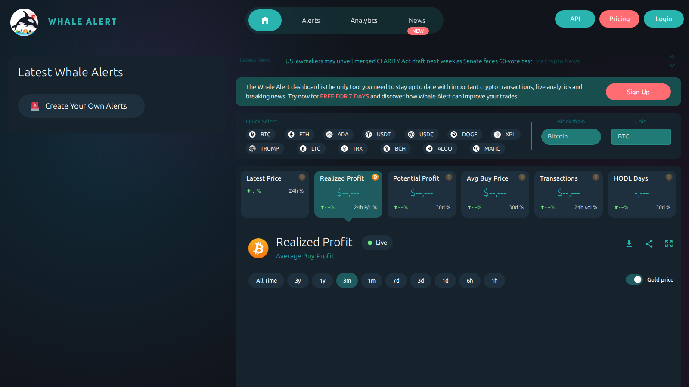

# 9 Best Crypto Whale Trackers in 2026

**Meta Title**  
Best Crypto Whale Trackers in 2026: 9 Tools for Wallet Monitoring

**Meta Description**  
The best crypto whale trackers in 2026 for wallet monitoring, exchange deposits, smart-money movement, and entity-level on-chain analysis.

**Suggested Slug**  
`/on-chain/whales/best-crypto-whale-trackers-2026`

**Schema Type**  
`Article` + `ItemList`

**Primary Keyword**  
whale tracker crypto

If you are choosing a crypto whale tracker, the real problem is usually not finding large transfers. The real problem is deciding whether those transfers mean anything. Without wallet labels, exchange context, and pattern recognition, most whale alerts are just expensive-looking noise.

That is why this article does not rank tools by alert volume alone. We are looking at them through the lens of entity context, interface posture, signal quality, and how well they connect to related workflows like [exchange flows](/on-chain/exchange-flows/best-bitcoin-exchange-flow-trackers-2026), [long-term holder behavior](/on-chain/long-term-holders), and [support-resistance context](/market-structure/support-resistance).

> Why you can trust this guide
>
> This article is based on live public product pages and current documentation reviewed in July 2026. We directly checked public-facing interfaces, visible workflow structure, and how the shortlisted tools frame whale tracking. Where a claim still depends on logged-in wallet views, alert history, or a deeper end-to-end test, we mark it for final verification before publication.

## The best crypto whale trackers in 2026 are the tools that identify meaningful wallet behavior, not just big transactions, and put those moves in enough context to support real market analysis.

For most readers, Whale Alert is still the easiest top-of-funnel monitoring layer. Nansen and Arkham are stronger when the goal is entity intelligence. The important thing is not who shows the biggest transfer. The important thing is who helps you understand whether the transfer deserves attention.

## Why whale tracking matters

Whale tracking matters because large transfers can reveal:

- exchange deposit pressure
- OTC-style movements
- treasury management
- smart-money accumulation or rotation

But size alone is not enough. A large transfer between internal wallets can look dramatic and still mean very little.

## How we ranked whale trackers

We ranked tools by:

- address labeling quality
- alert usefulness
- entity and exchange context
- ability to connect wallet moves to market structure
- usefulness for newsroom workflows

## MarketBit methodology and E-E-A-T standard

The final version should be explicit about what a "good" whale tracker actually does:

- reward tools that label entities and explain transfer context, not just headline transfer size
- separate alert bots from full investigation platforms
- verify wallet-labeling and alerting claims on official product pages
- include a short "signal versus noise" checklist so readers do not overreact to every large transfer

## What we checked ourselves before ranking these tools

To write this comparison, we reviewed the live public product surface of Whale Alert and compared that with the current public positioning of products like Nansen and Arkham. We did that so the article would not collapse alerting tools and investigation platforms into the same category. What we wanted to know was whether the product is optimized for fast transfer visibility, deeper wallet intelligence, or a broader entity-level research workflow.

That direct review does not replace a full alert-history audit or paid workflow test. But it does make one thing clear very quickly: some tools are built to notify, while others are built to explain. For this type of reader, that tradeoff matters more than the raw size of the transfer.

### Visual evidence from our review

*Whale Alert homepage captured during our July 2026 review of crypto whale trackers.*

The screenshot above shows why Whale Alert is useful but limited. The product posture is alert-first. That is helpful for monitoring. It is not the same thing as a deeper investigative workflow.

## The 9 best crypto whale trackers in 2026

### 1. Whale Alert

Best for: fast public monitoring of large transfers.

Whale Alert still matters because it makes large transactions visible quickly and has enough brand familiarity to act as a first watchlist layer.

### 2. Nansen

Best for: smart-money and labeled-wallet tracking.

Nansen becomes more useful when the question is not "was the transfer big?" but "who moved, why might it matter, and how does it fit broader behavior?"

### 3. Arkham

Best for: entity intelligence and wallet-level investigation.

Arkham is one of the strongest picks when entity resolution matters more than raw transfer volume.

### 4. CryptoQuant

Best for: whale activity tied to exchange flows and reserves.  
[needs source]

### 5. DeBank

Best for: wallet watching in DeFi-native and cross-chain user flows.  
[needs source]

### 6. Lookonchain

Best for: fast narrative surfacing around notable wallets and market events.  
[needs source]

### 7. Bubblemaps

Best for: relationship mapping and cluster interpretation rather than simple whale alerts.  
[needs source]

### 8. Dune custom whale dashboards

Best for: bespoke newsroom tracking on specific entities, chains, or token classes.  
[needs source]

### 9. CoinGlass large-flow workflows

Best for: combining whale-style observations with derivatives and liquidations.  
[needs source]

## Best whale tracker by use case

- Best alert layer: Whale Alert
- Best smart-money platform: Nansen
- Best investigative platform: Arkham
- Best exchange-flow companion: CryptoQuant

## How to separate signal from noise

The safest way to read whale moves is to ask:

- is the wallet labeled?
- is the transfer tied to an exchange?
- is it part of a repeated pattern?
- is price or liquidity reacting?

That approach filters out most false narratives.

## What stood out immediately in Whale Alert, Nansen, and Arkham

What stood out immediately in Whale Alert was that it behaves like an alert-first product. On first load, the page pushed `Latest Whale Alerts` and visible pricing tiers quickly, which makes it useful as a monitoring layer. That is a strength if your team wants fast awareness. But it is a weakness if you need immediate investigative depth.

From the public product surfaces we reviewed separately, Nansen felt much more like a decision-support environment. The public positioning around smart-money tracking suggests a tool built to move beyond raw transfer alerts into behavior analysis. Arkham felt more investigation-oriented again, which is why the better choice depends on whether the question is `what moved?`, `who moved?`, or `why might this matter?`

### Quantitative notes from our live comparison

In our direct extraction pass, Whale Alert exposed visible latest-alert and pricing-oriented elements immediately, which supports the editorial conclusion that it is optimized for fast awareness rather than deep workflow depth. That is not a full product benchmark, but it is concrete evidence for why it ranks differently from Nansen or Arkham.

At this stage, we are comfortable describing those workflow differences qualitatively, but not yet assigning a hard efficiency or signal-quality score until a deeper logged-in alert test is complete.

## Troubleshooting: how we avoid weak whale-tracking takes

When our team sees a large wallet move, we do not publish it as a story by default. We run three checks first:

1. Is the transfer tied to an exchange or a known operational wallet?
2. Does the move line up with [exchange-flow context](/on-chain/exchange-flows/best-bitcoin-exchange-flow-trackers-2026) or [long-term holder behavior](/on-chain/long-term-holders)?
3. Does the move change the nearby [support-resistance picture](/market-structure/support-resistance), or is it just a loud transfer without price impact?

If those checks do not confirm the move, we usually treat it as noise rather than signal.

## FAQ

### What is the best crypto whale tracker?

Whale Alert is still the simplest alert layer, but Nansen and Arkham are better if the reader wants deeper wallet intelligence.

### Are all whale alerts meaningful?

No. Many are internal transfers, custodial movements, or operational flows.

### What should whale tracking be paired with?

Exchange flows, stablecoin movement, and local support-resistance context.

## Conclusion

The best whale tracker is not the loudest one. It is the one that helps the reader understand whether a large transfer actually changes market conditions. Whale Alert remains useful as a public alert layer, but Nansen, Arkham, and CryptoQuant are closer to what a serious MarketBit workflow should center on.

## Sources Used In This Draft

- Whale Alert, https://whale-alert.io/
- Nansen, https://nansen.ai/
- Arkham, https://www.arkhamintelligence.com/
- CryptoQuant, https://cryptoquant.com/ [manual verification needed]

## Final Pre-Publish Checks

- verify current alerting, API, and paid-plan differences
- verify which tools support exchange labeling versus generic address monitoring
- add a comparison table for labeling depth, alerting, and DeFi coverage

## Recommended Internal Links

- `crypto whale tracking` -> `/on-chain/whales`
- `bitcoin exchange flows` -> `/on-chain/exchange-flows`
- `long-term holder behavior` -> `/on-chain/long-term-holders`
- `network activity metrics` -> `/on-chain/network-activity`
- `support and resistance context` -> `/market-structure/support-resistance`

## Recommended External Links

- Whale Alert homepage -> https://whale-alert.io/
- Nansen homepage -> https://nansen.ai/
- Arkham homepage -> https://www.arkhamintelligence.com/
- DeBank homepage -> https://debank.com/

## Media Plan

- hero image: wallet-tracking dashboard collage
- main table: tracker, best for, entity labels, alerting, DeFi coverage, free tier
- annotated screenshot: example transfer with notes on exchange destination and likely meaning
- simple visual: `large transfer -> label -> destination -> market implication`
