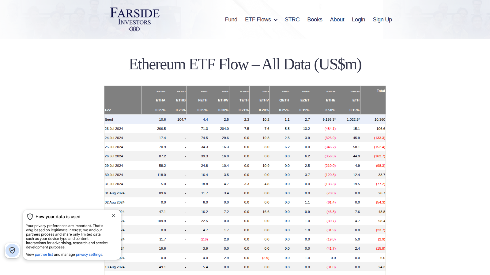

# 6 Best Ethereum ETF Flow Trackers in 2026

**Meta Title**  
Best Ethereum ETF Flow Trackers in 2026: 6 Tools Compared

**Meta Description**  
The best Ethereum ETF flow trackers in 2026 for daily net flows, issuer comparisons, historical context, and institutional ETH demand analysis.

**Suggested Slug**  
`/etf-flows/ethereum-etf/best-ethereum-etf-flow-trackers-2026`

**Schema Type**  
`Article` + `ItemList`

**Primary Keyword**  
ethereum etf flows

If you are choosing an Ethereum ETF flow tracker, the real problem is usually not finding a table with ETH numbers. The real problem is finding a workflow that helps you compare ETH demand with Bitcoin demand and decide whether a move reflects real rotation or just a single noisy day.

That is why this article does not rank ETH ETF trackers by table access alone. We are looking at them through the lens of update clarity, BTC-versus-ETH comparison, historical usability, and how well they connect to related workflows like [institutional flow analysis](/etf-flows/institutional-flows), [open interest](/derivatives/open-interest/best-crypto-open-interest-dashboards-2026), and [network activity context](/on-chain/network-activity).

> Why you can trust this guide
>
> This article is based on live public product pages and current documentation reviewed in July 2026. We directly checked public-facing interfaces, visible workflow structure, and how the shortlisted tools frame Ethereum ETF flow analysis. Where a claim still depends on premium dashboards, issuer-side validation, or a deeper end-to-end workflow test, we mark it for final verification before publication.

## The best Ethereum ETF flow trackers in 2026 are the tools that show daily net flows, issuer-level detail, and enough context to compare ETH demand with Bitcoin, alt rotation, and broader institutional positioning.

For most readers, Farside remains the fastest daily reference, while Coinglass and SoSoValue are the strongest analytics companions. The important thing is not whether an ETH tracker exists. The important thing is whether it helps you read ETH demand in relation to Bitcoin and the rest of the market.

## Why Ethereum ETF flows matter

ETH ETF flows matter because they help analysts see whether Ethereum is gaining institutional traction as:

- a relative-value trade against Bitcoin
- an infrastructure allocation
- a thematic bet on tokenization, staking, or smart-contract finance

That makes ETH flow tracking less about raw size and more about comparative signal.

## How we ranked Ethereum ETF flow trackers

The ranking prioritizes:

- reliability of daily updates
- issuer-level clarity
- ease of BTC-versus-ETH comparison
- historical visibility
- usefulness for editorial workflows

## MarketBit methodology and E-E-A-T standard

This article should publish with an explicit analyst note:

- compare ETH tracker quality by daily reliability and BTC-versus-ETH context, not just by interface
- cross-check one or more public tracker pages against fund issuer pages before publication
- explain that ETH flows are often more useful in relative terms than in absolute-size terms
- include one editorial caution against reading a single day of ETH flows as a regime shift

## What we checked ourselves before ranking these tools

To write this comparison, we reviewed the live public ETF flow pages for Farside and SoSoValue and compared them with Coinglass's broader public market interface. We did that so the article would not treat every ETH tracker as interchangeable. What we wanted to know was whether each page behaved like a quick reference sheet, a visual dashboard, or a broader analytics companion.

That direct review does not replace a full institutional workflow test. But it does make one thing clear very quickly: some tools are better for immediate citation, while others are better for relative interpretation. For this type of reader, that difference matters more than marginal design polish.

### Visual evidence from our review

*Farside Ethereum ETF flow page captured during our July 2026 review of Ethereum ETF flow trackers.*

*SoSoValue Ethereum ETF dashboard captured during our July 2026 review of Ethereum ETF flow trackers.*

The screenshots above show the same structural split we saw in the Bitcoin ETF category: one product behaves like a direct table reference, while the other behaves more like a visual dashboard.

## The 6 best Ethereum ETF flow trackers in 2026

### 1. Farside Investors

Best for: fast daily reference tables.

Farside is still the easiest place to get a clean daily read without excess UI friction.

### 2. Coinglass

Best for: ETF flows inside a wider crypto market framework.

Coinglass is valuable because ETH ETF demand often needs to be interpreted beside futures positioning, ETF flow divergence, and broader liquidity conditions.

### 3. SoSoValue

Best for: visual ETH-versus-BTC comparison and cleaner interface views.  
[needs source]

### 4. CoinAnk

Best for: flow watching inside a broader terminal-style market dashboard.  
[needs source]

### 5. Official issuer pages

Best for: source-of-record checks on holdings, AUM, and fund-level details.

### 6. Internal spreadsheet or newsroom comparison model

Best for: comparing ETH flows to BTC flows, staking narratives, and broader market-structure changes.

## Best ETH ETF tracker by use case

- Best daily read: Farside
- Best wider market context: Coinglass
- Best visual product interface: SoSoValue
- Best final verification layer: issuer pages

## How to interpret ETH flows during rotation phases

The most useful questions are:

- is ETH attracting inflows while BTC stalls?
- are both assets seeing demand, but at different intensity?
- are ETH inflows rising alongside open interest and network activity?

Those questions turn ETF flow data into relative-market analysis instead of isolated reporting.

## What stood out immediately in Farside, Coinglass, and SoSoValue

What stood out immediately in Farside was speed and simplicity. The direct page structure works especially well for ETH flow monitoring because the reader can move from raw table data to comparison work without much interface friction. That is a strength if your priority is clean daily reference. But it is a weakness if you want more built-in interpretation.

Coinglass felt more useful once the question moved beyond `what were flows today?` and into `what does that mean beside positioning and broader market conditions?` That is a strength if your workflow connects ETF flows to [open interest](/derivatives/open-interest/best-crypto-open-interest-dashboards-2026) or [network activity](/on-chain/network-activity). But it is a weakness if the only goal is the fastest single-number lookup.

Using browser-level access, we also confirmed that SoSoValue presents a dedicated ETH ETF dashboard workflow rather than only generic market pages. That is a strength for more visual comparison work, but it can create more interface overhead than a bare-bones table for readers who only want the data fast.

### Quantitative notes from our live comparison

Both Farside and SoSoValue resolved to ETH-specific ETF flow pages in our live browser review. That is not a full product score, but it is concrete evidence that both tools support dedicated Ethereum ETF monitoring rather than only generic ETF navigation.

At this stage, we are comfortable describing those workflow differences qualitatively, but not yet assigning a hard speed-to-insight score until a longer editorial usage test is complete.

## Troubleshooting: how we avoid weak ETH-flow interpretations

When our team sees a strong ETH ETF flow day, we do not call it a regime shift by default. We run three checks first:

1. We compare the move directly with [Bitcoin ETF flows](/etf-flows/bitcoin-etf/best-bitcoin-etf-flow-trackers-2026) to see whether the change is relative or broad.
2. We compare it with [open interest](/derivatives/open-interest/best-crypto-open-interest-dashboards-2026) to see whether positioning is confirming the move.
3. We compare it with [network activity](/on-chain/network-activity) so we do not confuse a one-day capital move with deeper ecosystem demand.

If those layers do not line up, we usually downgrade the claim.

## FAQ

### What is the best Ethereum ETF flow tracker?

Farside is still the cleanest daily reference for many analysts, while Coinglass is the best broader-market companion.

### Should ETH ETF flows be analyzed alone?

No. They are more useful when compared directly with Bitcoin ETF flows and derivatives positioning.

### Why do ETH ETF flows matter if they are smaller than BTC flows?

Because relative changes in ETH demand can still reveal important shifts in institutional appetite and market narrative.

## Conclusion

Ethereum ETF flow tracking is a smaller niche than Bitcoin ETF tracking, but it can be more revealing during rotation phases. Farside, Coinglass, and SoSoValue form the key comparison set. The strongest final article should emphasize relative interpretation rather than raw-flow hype.

## Sources Used In This Draft

- Farside Investors, https://farside.co.uk/ethereum-etf-flow-all-data/ [needs manual verification]
- CoinGlass, https://www.coinglass.com/
- SoSoValue, https://www.sosovalue.com/ [browser verification recommended]
- CoinAnk, https://coinank.com/ [needs ETF page check]

## Final Pre-Publish Checks

- confirm exact ETH ETF flow page URLs and update timing
- add issuer-specific links for the main ETH funds covered
- add one ETH-versus-BTC comparison table

## Recommended Internal Links

- `ethereum ETF flows explained` -> `/etf-flows/ethereum-etf`
- `ETF inflows and outflows` -> `/etf-flows/inflows-outflows`
- `institutional crypto flows` -> `/etf-flows/institutional-flows`
- `open interest dashboards` -> `/derivatives/open-interest`
- `network activity metrics` -> `/on-chain/network-activity`

## Recommended External Links

- Farside Ethereum ETF flow page -> https://farside.co.uk/ethereum-etf-flow-all-data/
- Coinglass homepage -> https://www.coinglass.com/
- SoSoValue homepage -> https://www.sosovalue.com/
- Grayscale Ethereum ETF page -> https://www.grayscale.com/crypto-products/grayscale-ethereum-trust

## Media Plan

- hero image: ETH issuer flow table screenshot
- main table: tracker, update speed, issuer detail, BTC comparison, best use case
- dual-line chart: ETH ETF flows versus BTC ETF flows over the same period
- supporting visual: `ETH inflows + OI + network activity` confluence card
