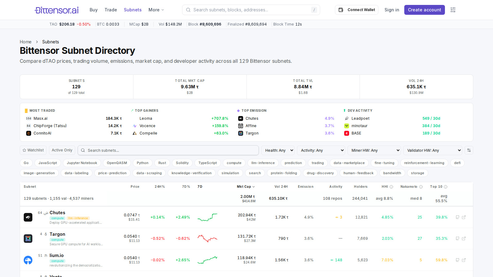
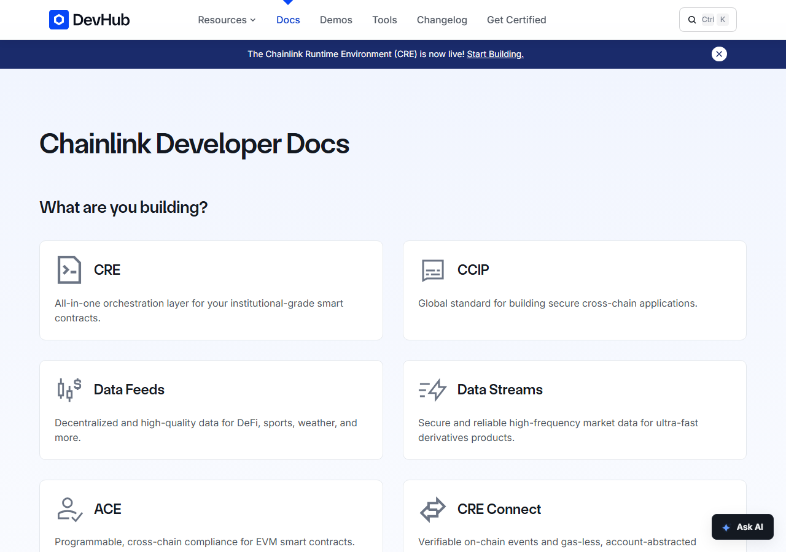
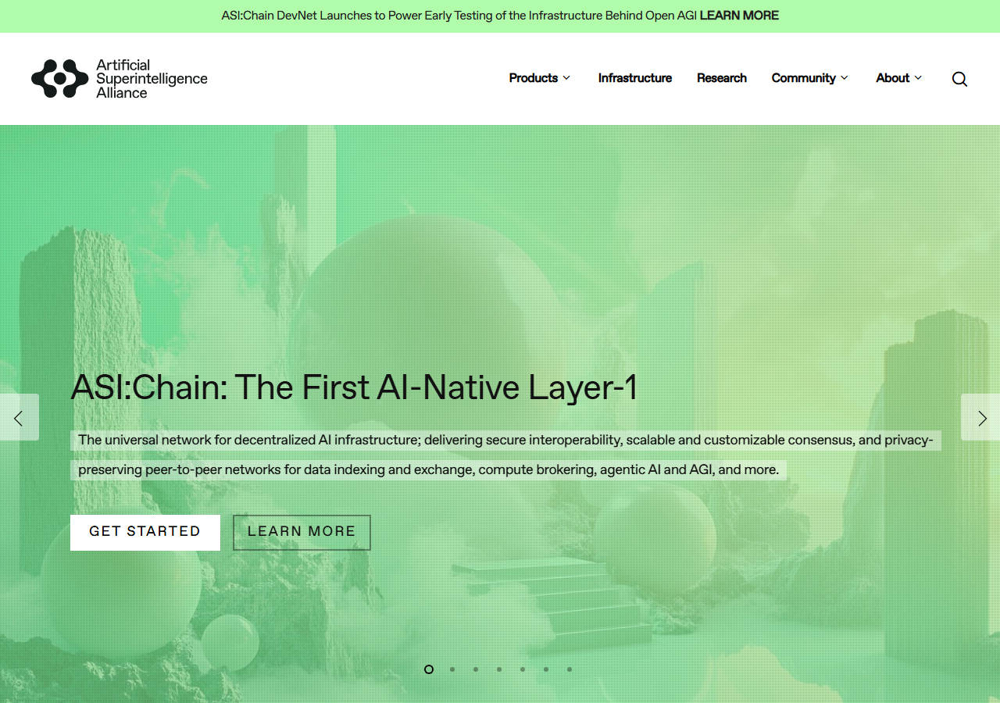
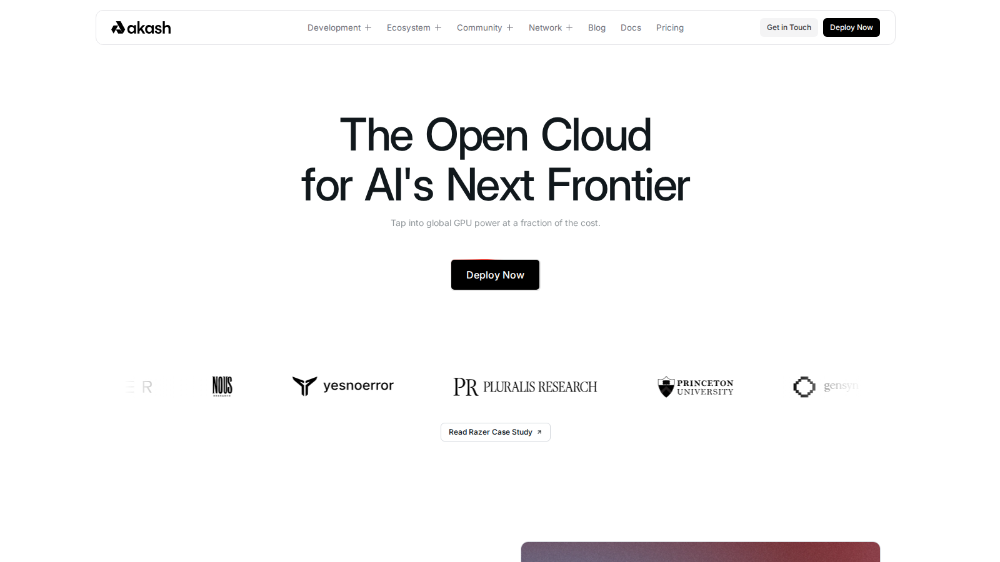
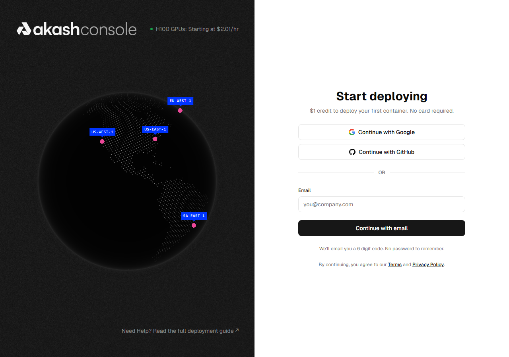
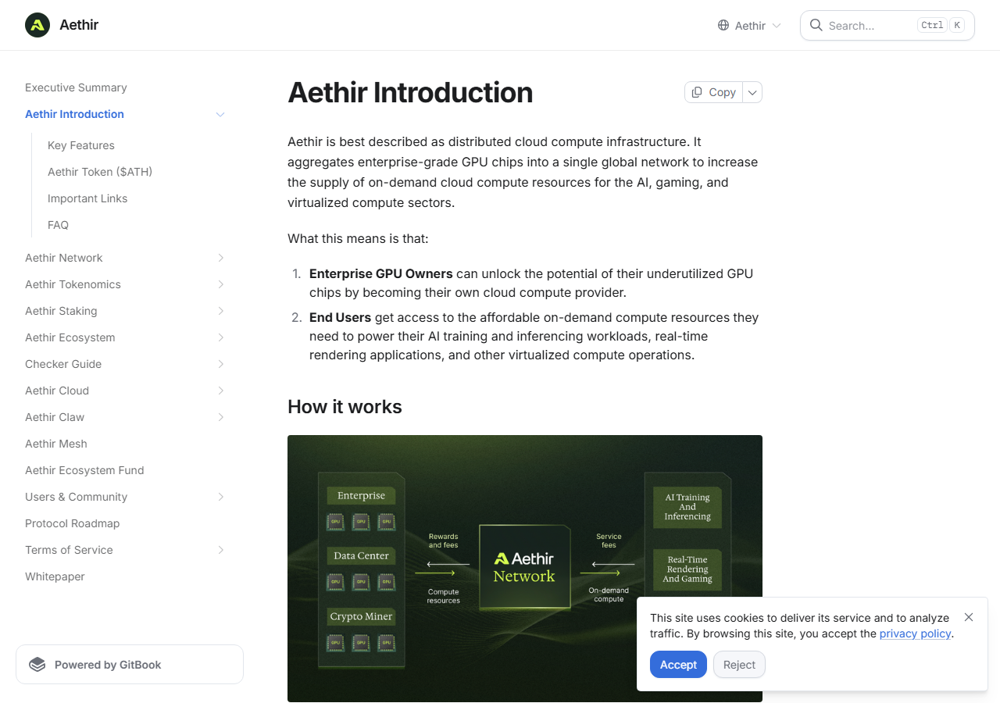
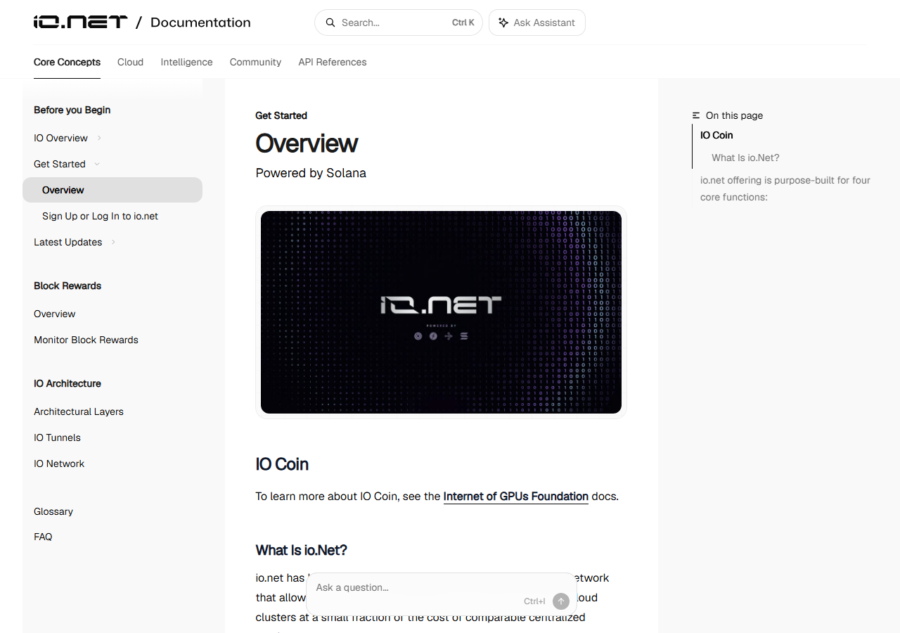
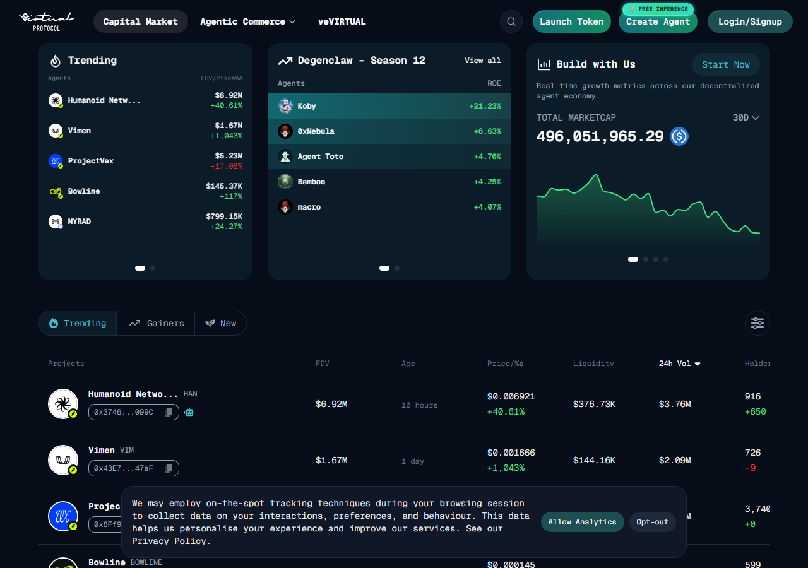
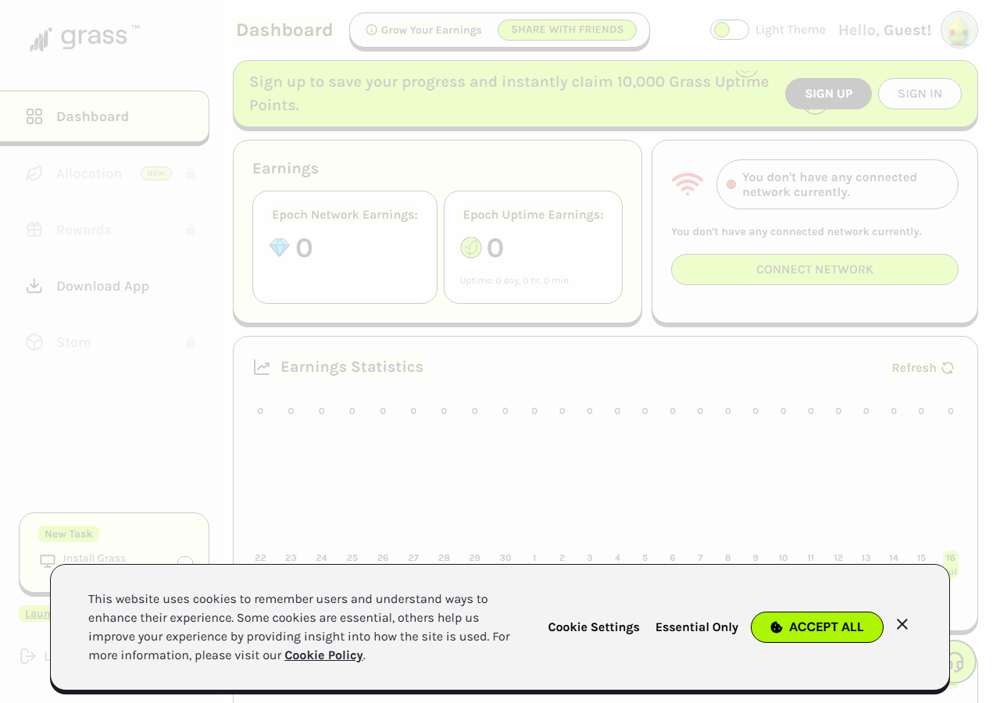
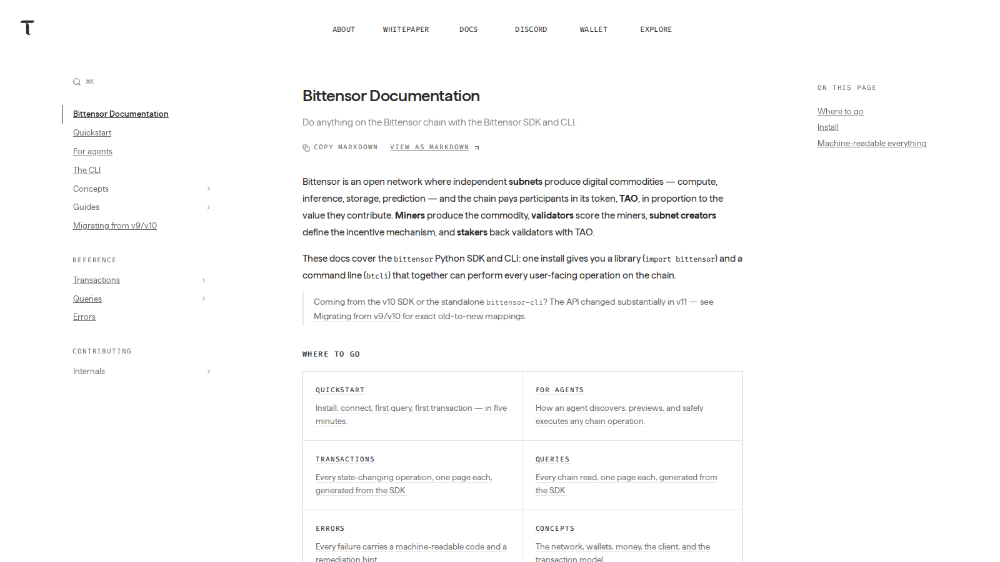

# 10 Best AI Crypto Projects in 2026: Stack Position, Token Utility, and Risk

- Primary keyword: `best ai crypto projects`
- Slug: `/ai-ecosystem/best-ai-crypto-projects-2026/`
- Meta title: `Best AI Crypto Projects in 2026: 10 Analyst Picks by Stack and Token Role`
- Meta description: `10 best AI crypto projects in 2026 ranked by stack position, token utility, and ecosystem evidence. Compute, data, agent economy, and coordination rails compared.`
- Reviewed on: `July 13, 2026`

## Schema

```json
{
  "@context": "https://schema.org",
  "@graph": [
    {
      "@type": "Article",
      "headline": "10 Best AI Crypto Projects in 2026: Stack Position, Token Utility, and Risk",
      "description": "Analyst-ranked list of the best AI crypto projects in 2026 by stack position, token role, and ecosystem evidence.",
      "author": { "@type": "Organization", "name": "SITE_NAME" },
      "publisher": { "@type": "Organization", "name": "SITE_NAME" },
      "mainEntityOfPage": "https://your-site.com/ai-ecosystem/best-ai-crypto-projects-2026/"
    },
    { "@type": "ItemList", "name": "Best AI Crypto Projects in 2026", "numberOfItems": 10 }
  ]
}
```

The "best AI crypto projects" search gets you into trouble fast. Not because the candidates are hard to find. There are hundreds of tokens with AI somewhere in the pitch. The problem is that compute infrastructure, data networks, agent economies, and coordination rails all live under the same label, and they are not the same trade.

They respond to different demand signals. They fail in different ways. Lumping them together and ranking by narrative momentum produces a list that looks authoritative and ages badly.

This article uses stack position as the primary filter. Where a project sits in the architecture tells you more about its durability than any price chart. Readers who want narrower cuts should continue with [best AI agent crypto coins](/ai-agents/best-ai-agent-crypto-coins-2026/), [AI infrastructure coins](/ai-infrastructure/ai-infrastructure-crypto-coins-2026/), or [best decentralized AI projects](/ai-infrastructure/decentralized-ai/best-decentralized-ai-crypto-projects-2026/).

The best AI crypto projects in 2026 are **Bittensor, Chainlink, Artificial Superintelligence Alliance, Render, Akash Network, Aethir, io.net, Virtuals Protocol, Grass, and OriginTrail**.

## The AI-crypto stack in 2026

The category makes more sense once you see it as three distinct layers:

**Layer 0, Compute:** GPU marketplaces and distributed inference networks. Akash, Render, Aethir, io.net. Value accrues from supply scarcity and verified workload execution. The risk is commoditization.

**Layer 1, Data and coordination:** Oracle networks, knowledge graphs, indexing rails. Chainlink, OriginTrail, Grass. Value accrues from trusted data access and cross-system coordination. The risk is that AI systems find other ways to get the same inputs.

**Layer 2, Agent applications and economies:** Agent creation, deployment, token-based agent commerce. Bittensor, Virtuals, ASI Alliance. Value accrues from ecosystem size and network effects. The risk is attention sensitivity. These move faster in both directions.

A Layer 0 compute thesis and a Layer 2 agent-economy thesis correlate during narrative runs. They decouple when fundamentals matter again.

## How we ranked these projects

| Factor | What we checked | Why |
|---|---|---|
| Stack position | Which layer? Is it unique there? | Layer clarity is the best hype filter |
| Token utility | Access, settlement, staking, routing, governance? | Utility outlasts narrative |
| Ecosystem evidence | Live integrations, builders, subnets, visible usage | Usage is evidence. Story is not. |
| Risk profile | Centralization, oracle dependency, narrative concentration | Every project has a way to fail |

We directly reviewed live public surfaces, official docs, and protocol tooling for each project in July 2026. Where a claim depended on wallet-connected access or live market data we could not verify, we said so.

## Ranking scorecard

Scored out of 10 per category. Total out of 50.

| Project | Stack clarity | Token utility | Ecosystem evidence | Risk profile | Community signal | **Total** |
|---|---|---|---|---|---|---|
| Bittensor | 10 | 9 | 9 | 7 | 8 | **43** |
| Chainlink | 9 | 9 | 10 | 9 | 7 | **44** |
| ASI Alliance | 7 | 7 | 7 | 6 | 6 | **33** |
| Render | 8 | 8 | 8 | 7 | 7 | **38** |
| Akash Network | 8 | 7 | 8 | 7 | 7 | **37** |
| Aethir | 8 | 7 | 5 | 6 | 4 | **30** |
| io.net | 8 | 7 | 5 | 6 | 3 | **29** |
| Virtuals Protocol | 7 | 8 | 7 | 5 | 7 | **34** |
| Grass | 7 | 6 | 6 | 4 | 6 | **29** |
| OriginTrail | 8 | 8 | 7 | 7 | 6 | **36** |

**Scoring notes.** Stack clarity measures how well-defined the project's layer position is. Token utility scores whether the token has structural demand beyond governance. Ecosystem evidence measures live integrations, builder activity, and verifiable usage. Risk profile scores inversely: lower centralization and narrative dependency earn higher marks. Community signal measures the depth and quality of organic discussion found during research. Chainlink scores highest overall because of unmatched ecosystem evidence and risk resilience, though Bittensor leads on stack clarity and the decentralized-AI thesis specifically.

## The 10 best AI crypto projects in 2026

---

### 1. Bittensor (TAO)

Bittensor is not one model. It is a market where models compete.

That distinction matters more than it sounds. The [subnet directory](https://bittensor.ai/subnets) at review time showed 129 active subnets, each with its own task domain, validator set, and emissions rate. Some mine inference, some mine embeddings, some mine predictions for specific financial or scientific domains. Validators score miners on output quality and the subnet producing the best outputs earns more TAO.

What makes the token case cleaner than most is that TAO is not decorative. Validators stake TAO to gain scoring weight. Subnet operators register against TAO. Network usage pulls TAO into circulation as a settlement and routing medium. The architecture demands the token in a way that pure governance tokens do not.

The real risk is internal. Emissions-chasing behavior can flood low-competition subnets with miners producing outputs nobody needs. Subnet quality is genuinely uneven. 129 active subnets does not mean 129 high-quality intelligence markets.

That gap is generating real debate. In a [Bittensor community thread on Reddit](https://reddit.com/r/bittensor_/comments/1ux2nyw/what_are_your_favorite_tao_bittensor_subnets_and/), users are pushing for objective subnet metrics (revenue, buyback, growth) rather than hype rankings. That pressure toward internal quality filters is healthy.

Reviewing the subnet directory felt different from reading a whitepaper. You can see immediately which subnets are crowded and which are underserved. That kind of live signal does not exist in single-product AI tokens.

**Featured Image**
File: `../media/bittensor-subnets-2026-07-13.png`
Alt text: `Bittensor subnet directory showing 129 active subnets with live validator scoring and emissions data, July 2026`
Caption: `Bittensor subnet directory, July 2026. Subnet count, emissions rate, and validator competition visible per row. The density here is evidence of a live internal economy, not a roadmap.`



*Bittensor subnet directory, July 2026. Subnet count, emissions rate, and validator competition visible per row. The density here is evidence of a live internal economy, not a roadmap.*

For Bittensor to fail at a fundamental level, TAO demand would have to stop keeping pace with subnet emission growth, or a centralized incumbent would have to deliver the same intelligence market with less friction. Neither looks imminent. For now it holds the clearest decentralized-AI thesis in the category.

---

### 2. Chainlink (LINK)

The most telling thing about Chainlink is that it never rebranded as an AI project.

Every AI agent that needs to read external data, trigger an onchain action, or move value cross-chain routes through the kind of infrastructure Chainlink already runs. The [developer docs](https://docs.chain.link/) organize the product around Data Feeds, Scheduled Triggers, Functions, VRF, and CCIP. Not around an AI narrative, because the AI use case accrues to this infrastructure whether or not Chainlink markets it that way.

LINK is not a pure governance token. It pays for oracle services, funds node operator rewards, and provides cryptoeconomic staking security. The token is closer to a settlement and collateral layer than to a speculative positioning vehicle. That makes it less exciting in pure AI narrative runs and more resilient when those runs reverse.

Reading through the Chainlink docs during this review was clarifying. No price predictions. No AI buzzwords. Just integration endpoints, fee structures, and latency specifications. The vocabulary of a team that expects to be evaluated on whether the product works. [Chainlink Labs was named Best Oracle Provider at the Future of Finance Awards 2026](https://reddit.com/r/Chainlink/comments/1ua97cp/chainlink_labs_has_officially_been_named_best/), a third-party recognition that carries more weight for infrastructure credibility than community self-promotion.

**Screenshot 1**
File: `../media/chainlink-docs-2026-07-16.png`
Alt text: `Chainlink developer documentation showing Data Feeds, CCIP, and Functions product surfaces relevant to AI agent infrastructure`
Caption: `Chainlink docs, July 2026. Product surface organized around specific integration endpoints. No AI branding, just infrastructure specification. That absence is informative.`



*Chainlink docs, July 2026. Product surface organized around specific integration endpoints. No AI branding, just infrastructure specification. That absence is informative.*

For Chainlink to fail as an AI-adjacent play, agents would have to route entirely around external oracles. That is possible over a long enough time horizon but does not describe the current direction of builder tooling. The AI relevance here is structural, not narrative. That makes it the most durable pick on this list, even if it is rarely the most exciting one.

---

### 3. Artificial Superintelligence Alliance (ASI/FET)

ASI is what happens when three distinct open-AI projects (Fetch.ai, SingularityNET, and CUDOS) decide that the coalition thesis is stronger than competing separately. The [innovation stack](https://docs.superintelligence.io/artificial-superintelligence-alliance/asi-innovation-stack) spans data marketplace, compute coordination, and AI agent deployment. Each component came with its own existing users, developer communities, and tooling.

The token case is deliberately broad. ASI/FET serves as access and settlement across alliance products, which means multiple demand vectors but also multiple places where the story can lag. A token that is supposed to do everything for everyone inside a multi-organization coalition is harder to evaluate than one with a single clear job.

The community has noticed. A [CryptoCurrency thread on Reddit](https://reddit.com/r/CryptoCurrency/comments/1rpvtfe/ai_tokens_are_starting_to_move_again_why_is_fet/) captures the frustration: a project this broad tends to generate less concentrated price action than focused bets. That is not necessarily a weakness in the product, but it is a real characteristic of the investment profile.

The ASI Alliance homepage is visually ambitious. The substance is in the component project docs. That gap is worth noting before forming any view.

**Screenshot 2**
File: `../media/asi-alliance-2026-07-16.png`
Alt text: `ASI Alliance homepage showing the unified brand of Fetch.ai, SingularityNET, and CUDOS, July 2026`
Caption: `ASI Alliance homepage, July 2026. The brand is unified. The evaluation happens one layer deeper in the component docs.`



*ASI Alliance homepage, July 2026. The brand is unified. The evaluation happens one layer deeper in the component docs.*

The version of this that fails is one where the merger produces no meaningful cross-protocol synergy and each component continues operating as a separate silo with a shared ticker. That risk is real and underpublicized. The version that works is a genuine open-AI coalition that compounds its data, compute, and agent layers over time. Both are plausible.


---

### 4. Render (RENDER)

Render had a real business before the AI narrative arrived, which puts it in a different position than most tokens on this list.

The network was built around creative GPU rendering (film, 3D, generative art). The node operator base grew around that use case. When AI inference demand started compounding, Render had physical infrastructure that could absorb it. The [compute-client materials](https://rendernetwork.com/participate-compute-clients) now list training, fine-tuning, and inference alongside the original rendering jobs. That is not a rebrand. It is the same marketplace taking on new workload types.

The burn-and-mint token model means demand for compute translates directly to RENDER demand. Node operators earn RENDER for completed jobs. The loop is legible. The tension is that Render carries a split identity: part creative-rendering network, part AI compute marketplace. In a market that rewards category purity, that dual-purpose story can trade at a discount to more focused compute names.

What I noticed reviewing the materials: AI inference is now positioned first in the documentation, not second to rendering. That shift tells you more about where the team thinks demand is going than any roadmap slide would.

In a [Render Network community thread on Reddit](https://reddit.com/r/RenderNetwork/comments/1tn0ne9/render_network_the_calm_before_the_breakout/), sentiment is cautiously positive but conditioned on actual job volume growth, not narrative momentum. That is the right filter to apply.

**Screenshot 3**
File: `../media/akash-home-2026-07-10.png`
Alt text: `Render Network compute-client page showing GPU node operator options and job categories for AI inference and rendering workloads`
Caption: `Render Network compute-client page, July 2026. AI inference and training listed alongside creative rendering jobs. The dual-market story is visible in how participation options are organized.`



*Render Network compute-client page, July 2026. AI inference and training listed alongside creative rendering jobs. The dual-market story is visible in how participation options are organized.*

For Render to lose its position, centralized cloud pricing would have to drop faster than the decentralized marketplace advantage compounds, or a pure-AI compute network would have to pull the ML workloads away entirely. The creative-rendering base provides a floor that pure AI compute plays do not have. That is worth something.

---

### 5. Akash Network (AKT)

The most transparent product in the compute category is also the easiest to interrogate.

The [Akash Console](https://console.akash.network/) shows live bids, active deployments, and provider availability without requiring a login. You can watch the marketplace function in real time. That openness is either reassuring (the market is real) or exposing (thin order books on slow days), depending on when you check. Either way, it tells you more about the actual state of the network than any documentation claim could.

Akash runs a reverse-auction marketplace where GPU and CPU providers bid to host workloads. The [docs](https://akash.network/docs/getting-started/what-is-akash/) frame it as open-source cloud. Buyers get compute at lower cost by sourcing from underused provider capacity. That cost-arbitrage thesis is real and the infrastructure operates. The question is whether AI demand compounds workload volume fast enough to matter at the token level.

The AKT token model has a structural complication: USDC payment options reduce direct AKT demand from workloads, which means token utility is partially decoupled from network usage. That is not fatal, but it is worth naming.

A [Cosmos ecosystem thread on Reddit](https://reddit.com/r/cosmosnetwork/comments/1smpyys/akash_abandons_cosmos_do_to_liscensing_changes/) flagged Akash's departure from Cosmos over licensing changes, creating short-term integration uncertainty. A broader [CryptoCurrency discussion](https://reddit.com/r/CryptoCurrency/comments/1tvdgqx/akash_network/) stays focused on the cost-arbitrage thesis: does demand-side adoption keep pace with narrative?

**Screenshot 4**
File: `../media/akash-console-2026-07-16.png`
Alt text: `Akash Network Console showing live GPU provider marketplace with active workload deployments and compute bids, July 2026`
Caption: `Akash Console, July 2026. Live marketplace with GPU provider bids visible without login. The order book depth here is more informative than the documentation.`



*Akash Console, July 2026. Live marketplace with GPU provider bids visible without login. The order book depth here is more informative than the documentation.*

Akash is a solid infrastructure play in a competitive space. It sits better in a compute basket than as a single-name answer. The version of this that works requires AI demand to keep growing faster than centralized cloud can absorb it. The version that struggles is one where AKT token utility stays too thin relative to narrative expectations.

---

### 6. Aethir (ATH)

Most compute networks talk about GPUs. Aethir is specific about which GPUs.

The [Aethir docs](https://docs.aethir.com/aethir-introduction) position the network around enterprise-grade hardware (H100-class chips), rather than mixed consumer supply. The three-node architecture (checker, container, indexer) is designed around reliability at the hardware level, not just aggregation at the marketplace level.

That specificity is the thesis. Enterprise AI buyers have different quality requirements than retail inference users, and a network built around H100-tier supply can serve them in a way a mixed-hardware marketplace cannot.

The documentation reads like it was written for procurement teams, not retail investors. Architecture diagrams, SLA framing, node-type breakdowns. Whether that is a strength or a weakness depends entirely on who the actual buyers are.

ATH is used for node licensing, staking, and service payments across all three node types. The token model is coherent with the network's operating logic. The gap is demand-side: enterprise GPU contracts are harder to verify publicly than supply-side architecture. The community discussion around Aethir specifically is thin. No qualifying Reddit thread surfaced during research, which means the organic signal is mostly absent outside Aethir's own channels.

**Screenshot 5**
File: `../media/aethir-docs-2026-07-16.png`
Alt text: `Aethir documentation showing distributed GPU cloud architecture, enterprise node types, and checker-container-indexer network structure`
Caption: `Aethir docs, July 2026. Three-node architecture documented in enterprise terms. The documentation audience feels different from consumer-facing crypto projects.`



*Aethir docs, July 2026. Three-node architecture documented in enterprise terms. The documentation audience feels different from consumer-facing crypto projects.*

The enterprise GPU thesis is more differentiated than the average compute name. The supply side is real. What would have to be true for this to fail: enterprise AI buyers continue sourcing GPU capacity from centralized providers, the gaming compute market declines faster than AI inference grows, and hardware quality advantage erodes as more competitors enter the H100-tier market. All three are possible. None is certain.

---

### 7. io.net (IO)

The thing that separates io.net from the other compute plays on this list is vocabulary.

The [getting-started docs](https://io.net/docs/guides/getting-started) talk about distributed training, cluster configuration, GPU type filtering, and parallelization. The language of ML engineers, not crypto investors. The [FAQ](https://io.net/docs/guides/faq) addresses distributed training specifically. That precision is intentional. io.net positions itself as infrastructure for the people who actually run models, not as a generic decentralized cloud story.

IO is the network token. Suppliers earn it for providing compute. Buyers pay in IO or supported currencies. Staking and governance are also tied to IO. The model is straightforward. The competitive pressure is not: Akash, Render, and Aethir are all competing for overlapping workloads, and centralized cloud still wins on reliability and tooling familiarity for most enterprise ML teams.

No qualifying Reddit thread surfaced for io.net specifically during research . Results returned generic GPU and ML discussions. That thin community signal is consistent with a project that has built real infrastructure but has not yet generated the kind of organic debate that would indicate either strong user satisfaction or clear user frustration.

**Screenshot 6**
File: `../media/ionet-docs-2026-07-16.png`
Alt text: `io.net documentation showing GPU cluster configuration options, machine-learning job submission, and distributed compute setup for ML workloads`
Caption: `io.net docs, July 2026. Cluster configuration and GPU selection in technical terms. The ML-native vocabulary is more precise than most compute-network documentation.`



*io.net docs, July 2026. Cluster configuration and GPU selection in technical terms. The ML-native vocabulary is more precise than most compute-network documentation.*

io.net is a better answer for a builder evaluating decentralized ML infrastructure than for a generalist investor building an AI narrative basket. The ML-native framing earns trust with the right audience. The same specificity that makes it credible also makes it harder to position as a broad narrative trade.


---

### 8. Virtuals Protocol (VIRTUAL)

Virtuals is the most overtly narrative-sensitive project on this list, and that is not an accident. It is the design.

The [whitepaper](https://whitepaper.virtuals.io/) describes it as a society of AI agents where each agent is co-owned IP with its own token. Agents operate across gaming, social, and financial contexts.

The VIRTUAL token is the base liquidity pair for every agent token in the ecosystem. Creating an agent requires VIRTUAL, trading agents demands VIRTUAL, the whole economy settles in VIRTUAL. That is a direct token utility case, not a governance abstraction.

The mechanism is real. Agents are live. Token pairs are real. The trading is verifiable. What the whitepaper cannot tell you is whether the attention that drives agent launch volume will compound into durable usage or fade between cycles. That is the core question for any agent-economy play.

The Base ecosystem community on Reddit provides a useful outside signal: [an independent deep-dive on Virtuals Protocol from a builder outside the ecosystem](https://reddit.com/r/BASE/comments/1rw8nt6/spent_the_day_digging_into_virtuals_protocol/). Research threads from outside the project's own community are a stronger indicator of genuine curiosity than in-ecosystem posts.

The app landing page is designed for creators, not developers. Featured agents, market pricing, launch flows, all visible before any technical material. That onboarding orientation tells you who Virtuals is actually building for.

**Screenshot 7**
File: `../media/virtuals-home-2026-07-16.png`
Alt text: `Virtuals Protocol app showing live agent marketplace with tokenized AI agents, pricing, and creator onboarding interface, July 2026`
Caption: `Virtuals Protocol app, July 2026. Agent listings with token pricing visible. The marketplace is live. The question is whether usage compounds or attention fades.`



*Virtuals Protocol app, July 2026. Agent listings with token pricing visible. The marketplace is live. The question is whether usage compounds or attention fades.*

For deeper coverage of individual agents and ecosystem tokens, [top Virtuals Protocol ecosystem coins](/ai-agents/economy/top-virtuals-protocol-ecosystem-coins-2026/) is the natural next read. Virtuals is the strongest pure-exposure vehicle for the agent-economy thesis. It is also the pick that requires the most honest answer to the question: am I buying the mechanism or the narrative cycle?

---

### 9. Grass (GRASS)

Grass is the easiest project on this list to understand and the hardest one to trust right now.

The model is simple: install a browser extension, share idle bandwidth, and Grass routes public web requests through your connection to source training data for AI pipelines. Earn GRASS tokens for the contribution. Buy GRASS if you need the data. The [extension dashboard](https://cf-app.getgrass.io/dashboard/download/item/extension) reflects this simplicity . One screen, one toggle, a reward counter.

The mechanism is real and verifiable. The problem is on the economics side.

One [Grass community thread on Reddit](https://reddit.com/r/Grass_io/comments/1ul3lj5/grass_is_scamming_longterm_node_runners_566_days/) documented a node runner with 566 days active, 1.79 million uptime points, and $2.96 total reward. That is not a one-off complaint. The thread spawned sustained discussion about reward dilution from node supply outpacing data demand. When long-term contributors document returns at that level, the token economics are not working for them regardless of the pitch.

The data-layer thesis itself is sound. AI systems need training data. Public web sourcing is a real input. If AI training pipelines adopt decentralized data sourcing as a standard practice, the demand-side economics improve.

The version that struggles is one where AI labs continue sourcing public data internally or via existing APIs, and GRASS token demand stays disconnected from real data buyer activity.

**Screenshot 8**
File: `../media/grass-extension-2026-07-16.png`
Alt text: `Grass network app showing browser extension dashboard with bandwidth contribution tracking and GRASS reward accumulation interface`
Caption: `Grass extension dashboard, July 2026. Clean onboarding, single-button contribution. The UX is fine. The reward economics are where the community signal and the pitch diverge.`



*Grass extension dashboard, July 2026. Clean onboarding, single-button contribution. The UX is fine. The reward economics are where the community signal and the pitch diverge.*

Grass ranks ninth because of that community signal, not because the thesis is wrong. The data-layer is underrepresented in this category. The reward dilution problem is real and needs to be resolved before the token economics make sense for long-term participants.

---

### 10. OriginTrail (TRAC)

OriginTrail is the project on this list that AI markets have consistently underpriced, and there is a structural reason for that.

Knowledge infrastructure does not trade like compute or agent-economy tokens. It does not produce visible launch moments or narrative spikes. What it does produce is a [Decentralized Knowledge Graph](https://docs.origintrail.io/dkg-knowledge-hub/learn-more/readme/decentralized-knowle-dge-graph-dkg) with 2 billion assets published as of early 2026, running across multiple chains, with enterprise supply-chain use cases that predate the AI pivot entirely.

TRAC is used to publish and manage knowledge assets on the DKG. Nodes earn TRAC for storing and serving knowledge. Demand for verifiable knowledge translates directly to TRAC utility.

The AI framing is not a rebrand. It is the logical extension of what OriginTrail was already doing: making structured knowledge verifiable and queryable. AI agents that need to reason over trusted external knowledge rather than hallucinate from training weights would need exactly this layer.

That is the thesis. It is also the risk: it requires AI systems to adopt external knowledge graphs as a protocol-level standard, which has not happened yet.

A [milestone post in the OriginTrail community on Reddit](https://reddit.com/r/OriginTrail/comments/1recybz/2_billion_knowledge_assets_published_on_the/) documented 2 billion knowledge assets published on the DKG. That milestone matters because it maps to specific on-chain outputs rather than TVL or token price. Usage evidence at the knowledge-asset level is more verifiable than most metrics in this category.

Reading the OriginTrail docs alongside the Virtuals whitepaper in the same session makes the interdependence visible. Virtuals describes agents that need tokenized incentives to act. OriginTrail describes the knowledge layer those agents would need to act reliably. Neither document acknowledges the other, but together they sketch a more complete picture of what AI-crypto infrastructure actually requires.

**Screenshot 9**
File: `../media/learnbittensor-subnets-2026-07-13.png`
Alt text: `OriginTrail Decentralized Knowledge Graph documentation showing verifiable knowledge layer architecture for AI agent memory, July 2026`
Caption: `OriginTrail DKG documentation, July 2026. Trusted, verifiable memory for AI systems. The 2B knowledge asset milestone gives the architecture an evidence number.`



*OriginTrail DKG documentation, July 2026. Trusted, verifiable memory for AI systems. The 2B knowledge asset milestone gives the architecture an evidence number.*

OriginTrail is the slowest-moving thesis on this list. It is also the one most likely to be revalued if AI markets shift from rewarding speed to rewarding verifiability. The enterprise use cases are real. The AI-agent case is directionally correct but not yet proven at scale.

---

## What the category tells us in 2026

Three signals matter right now.

**Compute is real but commoditizing.** Akash, Render, Aethir, and io.net all occupy overlapping territory. Differentiation is on hardware quality (Aethir), ML-native tooling (io.net), creative-compute hybrid (Render), or open marketplace depth (Akash). None has separated from the others decisively.

**Agent economies are live but attention-sensitive.** Bittensor and Virtuals both have working token-utility models inside live ecosystems. Both also move faster in both directions than infrastructure names. The thesis is real. The volatility reflects that, not a flaw in the architecture.

**Data and coordination are underpriced.** Chainlink, OriginTrail, and Grass sit in layers that AI systems will need as they become more capable. Markets have not consistently priced coordination and knowledge infrastructure on the same terms as compute or agent tokens. That gap is either an opportunity or a permanent discount, depending on how you read the direction of AI-system design.

## Decision framework

| If your thesis is... | Focus on... |
|---|---|
| Compute scarcity drives AI value | Akash, Render, Aethir, io.net |
| Open intelligence markets win | Bittensor, ASI Alliance |
| Agent-to-agent economies scale | Virtuals Protocol |
| Infrastructure rails compound quietly | Chainlink, OriginTrail |
| Data sourcing is underpriced | Grass, OriginTrail |

This is a thesis map, not a buying recommendation. Pick the row that matches your actual view of how AI-crypto develops, then verify fundamentals before acting.

For narrower reads: [best AI agent crypto coins](/ai-agents/best-ai-agent-crypto-coins-2026/), [AI infrastructure coins](/ai-infrastructure/ai-infrastructure-crypto-coins-2026/), [best onchain AI agents](/ai-agents/onchain-agents/best-onchain-ai-agents-2026/), [top Bittensor subnets](/ai-infrastructure/models/top-bittensor-subnets-2026/), [top Virtuals ecosystem coins](/ai-agents/economy/top-virtuals-protocol-ecosystem-coins-2026/)

## FAQ

### What is the best AI crypto project in 2026?

Bittensor has the clearest decentralized-AI market thesis. Chainlink has the most structurally durable AI-adjacent case. The right answer depends on which layer of the stack you are actually trying to hold.

### Are AI crypto projects the same as AI agent coins?

No. AI agent coins are one subcategory (Layer 2 in the stack model above). Compute networks (Layer 0) and data/coordination rails (Layer 1) are separate categories with different demand drivers.

### Why is Chainlink on an AI crypto list?

AI agents need trusted data, scheduled triggers, and cross-chain execution. Chainlink provides all three. It did not rebrand as an AI project. The AI use case routes through it regardless.

### What is the riskiest project on this list?

Grass has the most documented community concern: reward dilution with real numbers attached. ASI Alliance carries the most integration complexity. Virtuals carries the most attention-driven volatility. Which one is riskiest depends on which kind of risk you are measuring.

## Methodology note

Reviewed July 13-16, 2026. We checked live public surfaces, official documentation, and protocol tooling directly. Reddit community signals qualified manually: platform-specific, real user opinion, relevant subreddit. Claims requiring wallet-connected access or live trading data are noted as not yet fully verified.

## Sources

- [Bittensor subnet directory](https://bittensor.ai/subnets)
- [Chainlink developer docs](https://docs.chain.link/)
- [Virtuals Protocol whitepaper](https://whitepaper.virtuals.io/)
- [ASI Alliance docs](https://docs.superintelligence.io/artificial-superintelligence-alliance)
- [ASI Innovation Stack](https://docs.superintelligence.io/artificial-superintelligence-alliance/asi-innovation-stack)
- [Render compute clients](https://rendernetwork.com/participate-compute-clients)
- [Akash docs](https://akash.network/docs/getting-started/what-is-akash/)
- [Akash Console](https://console.akash.network/)
- [Aethir introduction](https://docs.aethir.com/aethir-introduction)
- [io.net getting started](https://io.net/docs/guides/getting-started)
- [Grass extension](https://cf-app.getgrass.io/dashboard/download/item/extension)
- [OriginTrail DKG documentation](https://docs.origintrail.io/dkg-knowledge-hub/learn-more/readme/decentralized-knowle-dge-graph-dkg)
- [Coinbase Institutional: Picks-and-Shovels of the AI Agent Economy](https://www.coinbase.com/institutional/research-insights/research/market-intelligence/picks-and-shovels-of-the-ai-agent-economy)
