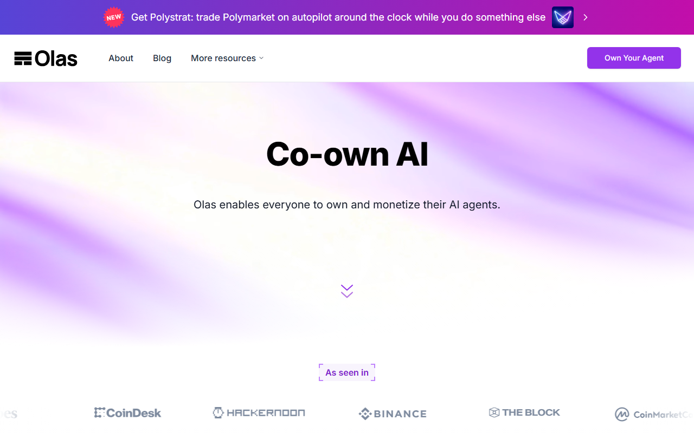
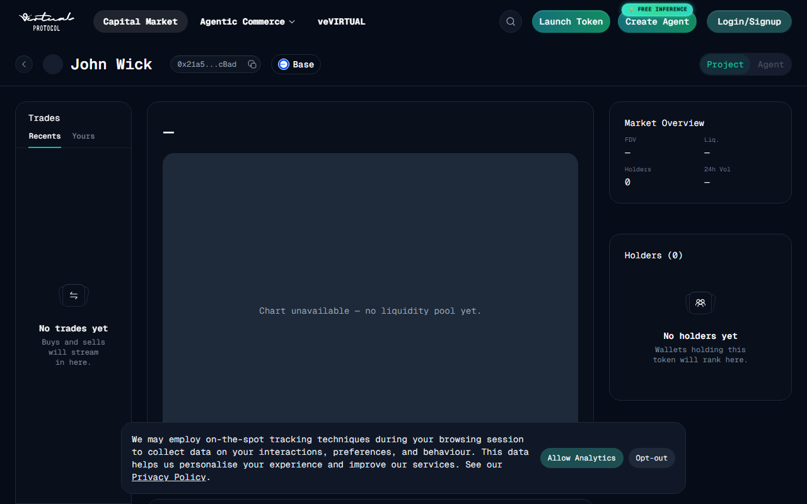
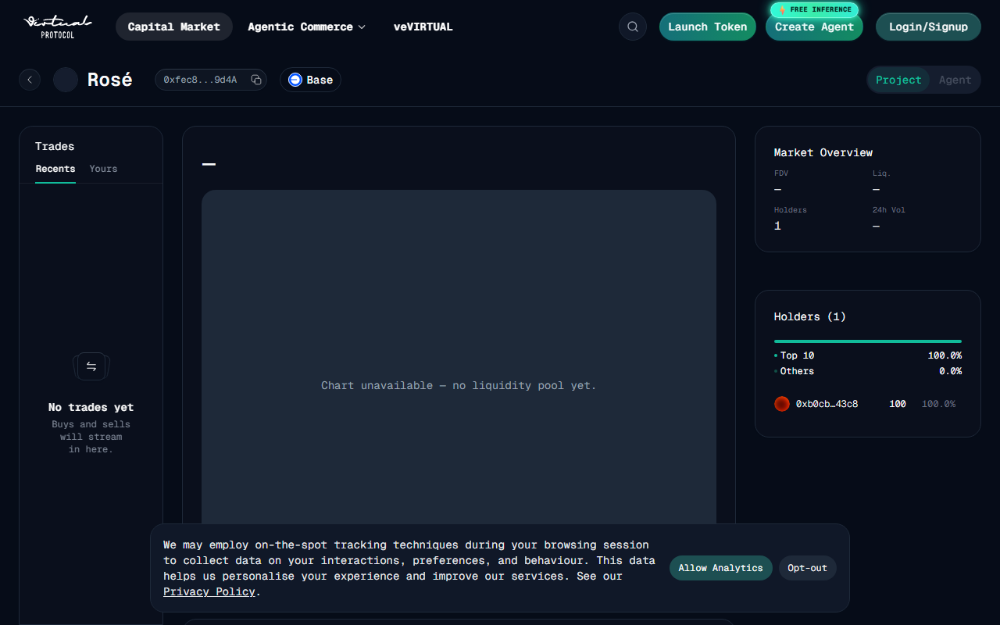
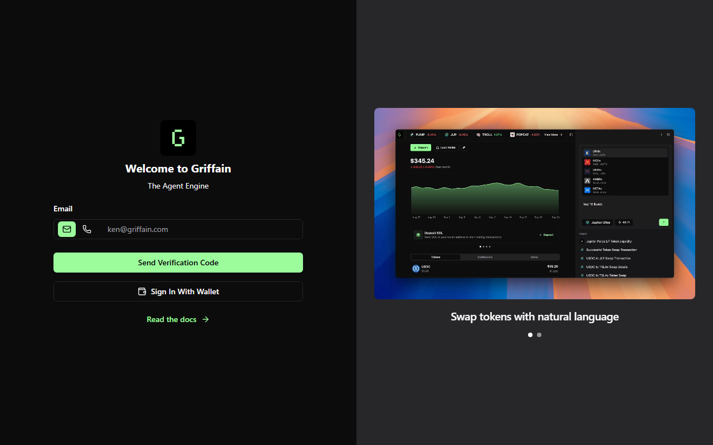
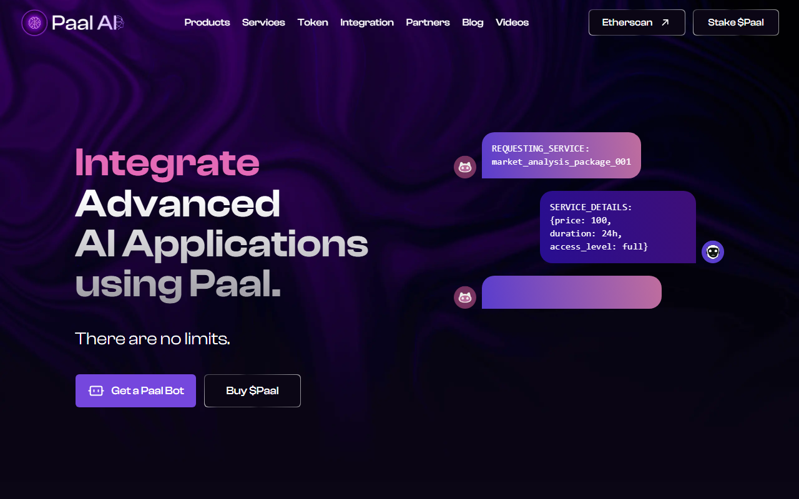
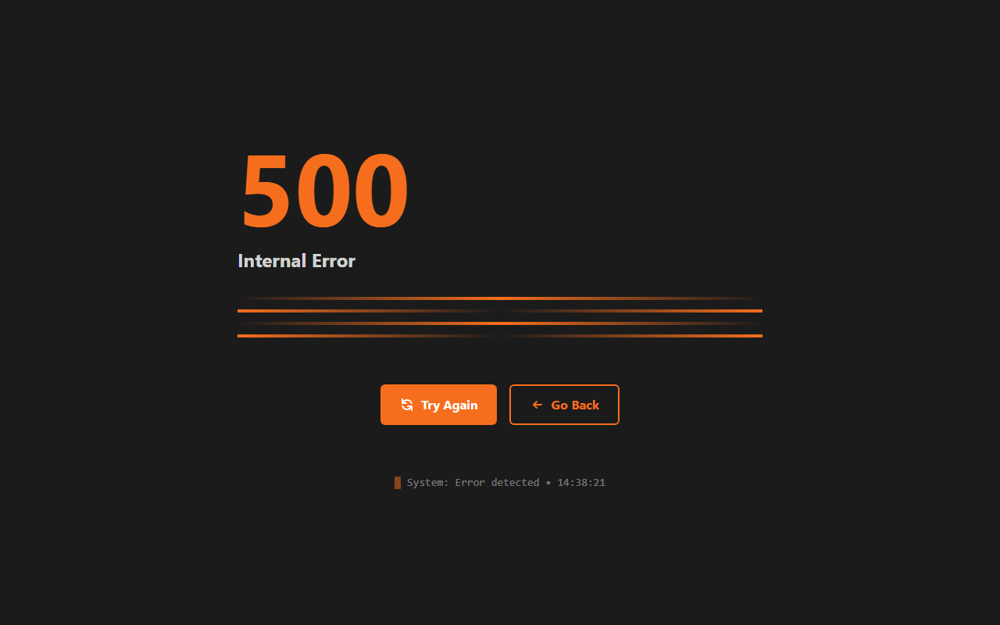

# 10 Best AI Agent Crypto Coins in 2026: Which Agent Tokens Actually Have a Real Role?

- Primary keyword: `best ai agent crypto coins`
- Slug: `/ai-agents/best-ai-agent-crypto-coins-2026/`
- Meta title: `Best AI Agent Crypto Coins in 2026: 10 Ranked by Agent Function and Token Role`
- Meta description: `10 best AI agent crypto coins in 2026 ranked by agent function, token utility, ecosystem depth, and onchain relevance -- with community signals and risk context.`
- Reviewed on: `July 16, 2026`

## Schema

```json
{
  "@context": "https://schema.org",
  "@graph": [
    {
      "@type": "Article",
      "headline": "10 Best AI Agent Crypto Coins in 2026: Which Agent Tokens Actually Have a Real Role?",
      "description": "10 best AI agent crypto coins in 2026 ranked by agent function, token utility, ecosystem depth, and onchain relevance.",
      "mainEntityOfPage": "https://your-site.com/ai-agents/best-ai-agent-crypto-coins-2026/"
    },
    { "@type": "ItemList", "name": "Best AI Agent Crypto Coins in 2026", "numberOfItems": 10 }
  ]
}
```

The fastest way to build a bad AI agent coin list is to grab every token with "AI" in its marketing and sort by market cap.

Agent tokens split into two camps that behave very differently. The first camp ties the token to a real economic function inside agent creation, coordination, or onchain execution. The second camp rides the narrative while the market is paying attention to the category. Both camps can produce price movement, but only the first one gives you a thesis that holds up when the social layer goes quiet.

This article ranks ten coins against that filter: what does the agent actually do, what role does the token play inside the mechanism, and what breaks if the broader narrative cools? Readers who want the wider infrastructure picture first should go to [best AI crypto projects](/ai-ecosystem/best-ai-crypto-projects-2026/) before this list. Readers interested in the infrastructure layer underneath agents should continue to [AI infrastructure crypto coins](/ai-infrastructure/ai-infrastructure-crypto-coins-2026/).

## What makes something a real AI agent coin

The AI-agent token market has at least four distinct categories inside it, each with a different logic:

**Agent economies:** Platforms that let anyone create, deploy, and trade tokenized agents. The base token functions as agent liquidity and creation collateral. (Virtuals Protocol)

**Autonomous services:** Networks that run multi-agent services as persistent onchain processes, not one-off chatbot requests. (Autonolas)

**Agent-native applications:** Products where the AI capability is the product, not a wrapper. Token grants usage access and governance over the model stack. (Venice)

**Ecosystem agents:** Named agent personas that exist inside a broader agent economy -- tradable identities with their own tokens. (aixbt, GAME, Luna, VaderAI)

**Onchain action agents:** Agents that execute wallet actions, trades, or cross-protocol operations -- the most crypto-native use case. (Griffain)

**Retail AI tooling:** Consumer-facing AI assistants with token utility bolted onto a subscription or usage model. (PAAL AI, Alchemist AI)

## How we ranked these coins

| Factor | What we checked | Why |
|---|---|---|
| Agent function | Does the project create, coordinate, or operate agents? | "Agent" is used loosely |
| Token role | Does the token power access, routing, payments, or staking? | Narrative-only tokens are weaker |
| Ecosystem depth | Is there a live marketplace or operating product? | Distribution matters |
| Onchain relevance | Does it touch wallets, execution, or agent commerce? | This is where crypto adds real value |
| Survivability | Would it still matter if social hype cooled? | Many agent coins cannot answer yes |

We reviewed live public surfaces and official documentation for all ten projects in July 2026.

## The 10 best AI agent crypto coins in 2026

### 1. Virtuals Protocol (VIRTUAL)

Virtuals is not a single agent. It is trying to be the economy that other agents are built inside.

The platform at [app.virtuals.io](https://app.virtuals.io/) lets anyone launch a tokenized AI agent with its own token, liquidity pool, and persona. VIRTUAL is the base currency for agent creation and the liquidity pair for agent tokens minted on the platform. When a new agent launches, VIRTUAL is spent and locked -- token demand is structurally tied to agent creation volume, not just to trading activity.

The moat is the creation-and-liquidity flywheel. More agents launched means more VIRTUAL locked, more agent tokens circulating, and more surface area for ecosystem assets like aixbt, GAME, and Luna to compound on top. The ecosystem concentration is also the risk: Virtuals-linked names trade on whether the Base-native agent economy keeps compounding, not on separate product fundamentals.

No qualifying community thread surfaced specifically for VIRTUAL in July 2026 research -- the token's Reddit presence is fragmented across many agent subthreads. The strongest signal is the volume of agents created and the market cap of ecosystem tokens: those are the real adoption metrics.


*Virtuals Protocol app, July 2026 -- the marketplace lists hundreds of agent tokens with live liquidity. The creation volume is the metric that tells you whether the economy is actually growing.*

For Virtuals to fail as a category leader, agent creation would have to decouple from VIRTUAL demand -- either through a competing base layer that pulls creators, or through agent market saturation that reduces new launches. Neither is the near-term direction of the ecosystem.

---

### 2. Autonolas (OLAS)

Autonolas is the most structurally serious agent project on this list, and also the least narratively convenient one.

Most AI agent projects describe one-off interactions -- a chatbot that executes a trade, an agent that responds to a prompt. Autonolas builds something different: persistent autonomous services that run as multi-agent processes across Ethereum, Solana, and other chains. The [Olas documentation](https://olas.network/) is dense with concepts like agent services, multi-sig-secured execution, and contributor bonding -- vocabulary that signals a team building infrastructure, not a social product.

OLAS governs the protocol, bonds node operators into service commitments, and rewards contributors who build and run agent services. The token is load-bearing in a way that most governance tokens are not: removing OLAS from the system does not leave you with the same product.

**Community signal:** [r/CryptoCurrency discussion on how agentic AI, liquidity markets, and crypto infrastructure are converging toward autonomous machine economics](https://www.reddit.com/r/CryptoCurrency/comments/1tnx12u/how_agentic_ai_deep_liquidity_markets_and_crypto/) -- the thread takes seriously the idea that Autonolas-style persistent agent services are the real crypto-AI overlap, not conversational wrappers.



*Olas Network site, July 2026 -- the product vocabulary (agent services, bonding, multi-agent coordination) is structurally different from consumer AI agent projects. That difference is the investment thesis.*

The trade-off is attention. Autonolas earns less social narrative than persona-driven agent tokens during momentum runs, because the product does not have a face. The infrastructure position is more defensible for that exact reason.

---

### 3. Venice (VVV)

Venice made a structural choice that most AI application projects avoid: no data is stored on the platform's servers, and no training runs on user inputs.

The [venice.ai](https://venice.ai/) product runs inference locally or through privacy-preserving infrastructure -- the pitch is a private-by-design AI platform where the provider cannot read your prompts. VVV grants token holders priority access, reduced fees, and governance over model selection and tokenomics. The burn mechanism is real: discretionary burns of platform revenue are executed onchain and announced publicly.

That privacy architecture creates a defensible product position that is distinct from every centralized AI company. The question is whether enough users care enough about privacy to pay a premium for it over free-tier alternatives.

**Community signal:** [r/VeniceAI -- largest discretionary VVV burn to date executed at $267k, with emissions also reduced from 5M to 4M tokens per year](https://www.reddit.com/r/VeniceAI/comments/1usuf6l/the_latest_discretionary_vvv_burn_has_been/) -- the community treats burn events as product health signals, and the emission reduction signals the team is managing supply pressure, not just issuing tokens.


*Venice AI platform, July 2026 -- the privacy-by-design framing is visible in the product surface. Whether that positioning holds up as centralized AI platforms improve privacy tooling is the long-term risk to watch.*

Venice sits at an unusual product-crypto intersection. The token does real work. The moat depends on users who have a genuine privacy preference -- a real segment, but smaller than the total AI user market.

---

### 4. aixbt by Virtuals (AIXBT)

aixbt is the clearest proof that a persona can become an economic object on its own.

The agent runs as an onchain AI system that generates market commentary, tracks crypto trends, and has its own X/Twitter presence with verified onchain attribution. When aixbt says something, the output is traceable back to the agent's onchain identity -- that traceability is what separates it from a social media account with a chatbot. AIXBT is the tradeable token for the agent persona, operating inside the Virtuals ecosystem.

What made aixbt category-defining was not the quality of any single call. It was the demonstration that an AI persona with an economic stake and onchain presence could develop genuine market influence. That pattern has been replicated dozens of times since -- but aigbt was early enough in that cycle to have the distribution advantage.

No qualifying community thread surfaced specifically for AIXBT in July 2026 research. Community discussion is active on X and within the Virtuals ecosystem but thin on independent Reddit forums, which is typical for ecosystem agent tokens at this stage.



*aixbt profile on Virtuals Protocol, July 2026 -- the agent's token, liquidity data, and onchain identity are all visible in one surface. The economic layer is the part that separates this from a standard social account.*

AIXBT holds its position through first-mover distribution inside the AI market commentary category. The risk is that the category commoditizes -- dozens of agent personas with market commentary are now in operation.

---

### 5. GAME by Virtuals (GAME)

GAME is the infrastructure layer inside Virtuals that agent builders use to configure and deploy their agents.

Where VIRTUAL is the economy token and individual agents have their own tokens, GAME is the SDK and framework token -- it provides the tooling that agents run on top of. Coinbase Institutional highlighted GAME specifically in their [picks-and-shovels AI agent economy analysis](https://www.coinbase.com/institutional/research-insights/research/market-intelligence/picks-and-shovels-of-the-ai-agent-economy) as the infrastructure layer within the Virtuals stack, which is a meaningful third-party signal for a token that otherwise operates without significant external coverage.

The investment thesis for GAME is different from VIRTUAL: it is a bet on the tooling layer compounding as more agents are built, rather than a bet on the economy token appreciating with creation volume.

No qualifying community thread surfaced independently for GAME in July 2026 research. The third-party institutional recognition is more informative than community forum activity at this stage.


*GAME framework on Virtuals Protocol, July 2026 -- the tooling layer for agent deployment. The infrastructure position here is narrower than VIRTUAL but more specific in its function.*

GAME holds a picks-and-shovels position relative to the Virtuals ecosystem. The risk is concentration: if Virtuals loses developer mindshare to a competing agent economy, GAME loses its deployment volume directly.

---

### 6. Luna by Virtuals (LUNA)

Luna is the most recognized conversational agent persona inside the Virtuals ecosystem, and her position is entirely about reach and distribution.

The agent has a large following across platforms, an established identity, and high recognition within the crypto-native AI agent community. As a Virtuals ecosystem asset, LUNA trades on whether the persona maintains engagement and whether the Virtuals economy keeps generating surface area for ecosystem tokens to appreciate. The token does not coordinate infrastructure or govern a protocol -- it is a stake in an agent identity that has real audience.

No qualifying community thread surfaced independently for LUNA. Community activity is concentrated on X and within Virtuals platform discussions rather than independent forums.


*Luna agent profile on Virtuals Protocol, July 2026 -- the persona is visible as an economic object with its own token and liquidity. Whether the engagement floor holds as the ecosystem matures is the key question.*

Luna is cleaner to evaluate than most narrative tokens because the metric is simple: does the persona maintain audience and does the Virtuals ecosystem keep growing. Both have been true for longer than expected.

---

### 7. VaderAI by Virtuals (VADER)

VaderAI occupies the same structural position as Luna -- a named agent persona inside the Virtuals ecosystem with its own token, identity, and community following.

The differentiation between Virtuals ecosystem agents is mostly about persona strength and community timing. VADER has maintained presence inside the ecosystem through market cycles that eliminated thinner agent tokens. That persistence is a weak but real signal: tokens that survive multiple narrative rotation events inside a competitive ecosystem have demonstrated some floor of community demand.

No qualifying community thread surfaced independently for VADER. The token's community life happens primarily within Virtuals platform activity and X.



*VaderAI profile on Virtuals Protocol, July 2026 -- one of the older named agent personas in the ecosystem. Persistence through multiple narrative cycles is the strongest independent signal available for this asset.*

VADER is a reasonable ecosystem diversification inside Virtuals if the thesis is that multiple agent personas will hold value simultaneously. It is a weaker standalone bet than VIRTUAL or GAME.

---

### 8. Griffain (GRIFFAIN)

Griffain is the most crypto-native agent thesis on the list: an AI that acts on your wallet, not just your chat window.

The [griffain.com](https://griffain.com/) product positions the agent as a natural-language interface for onchain execution -- describe what you want to do, and the agent interprets and executes the transaction. That use case is narrower than a general AI assistant, but it is exactly where the crypto layer adds genuine value. Agents that can sign and execute are qualitatively different from agents that recommend and stop.

The risk is also specific to that thesis: every major wallet provider and DeFi interface is building natural-language execution layers. Griffain has early-mover positioning in the standalone agent category, but the competitive surface is wide.

No qualifying community thread surfaced for Griffain on Reddit -- the token was flagged in a BitMart delisting announcement alongside many other small-cap tokens, which is not a community signal but is worth noting as a liquidity-risk data point.



*Griffain interface, July 2026 -- the product is oriented around execution, not just conversation. Whether the natural-language-to-transaction use case compounds to a durable position before major wallet providers absorb the same UX is the core question.*

Griffain holds the strongest product thesis among the non-Virtuals names on this list. The onchain execution layer is where crypto agents have unique value. The window for a standalone agent to hold that position is the open question.

---

### 9. PAAL AI (PAAL)

PAAL AI is a consumer AI assistant with crypto token integration -- which is a product category, not an agent economy.

The [paal.ai](https://www.paal.ai/) platform provides an AI chatbot accessible across Telegram, Discord, and web, with PAAL token used for premium features and staking rewards. The product is aimed at retail crypto users who want AI tooling inside the environments they already use. Token utility is cleaner than many speculative AI tokens -- staking and premium access do real things -- but the infrastructure moat is thin.

The risk is the same one facing every AI assistant product: the product category is being commoditized by every major AI lab simultaneously. PAAL's defensive position is crypto-native distribution (Telegram, Discord) and retail community depth rather than technical differentiation.

No qualifying community thread surfaced for PAAL AI in July 2026 research. The subreddit was banned, which is a notable community health signal.



*PAAL AI platform, July 2026 -- the product is a crypto-native AI assistant with token utility for access and staking. The distribution moat (Telegram, Discord) is more defensible than the AI capability moat in this market.*

PAAL is the most application-oriented pick on the list. It holds a position as long as retail crypto communities want AI tooling inside their existing communication tools and the token utility stays live.

---

### 10. Alchemist AI (ALCH)

Alchemist AI rounds out the list at the most experimental edge: AI-assisted app and agent creation, with ALCH as the token for platform access and creation fees.

The [alchemistai.app](https://www.alchemistai.app/) product lets users describe what they want to build -- a tool, a bot, an agent -- and the platform generates a functional prototype. ALCH is spent on creation credits. The thesis is that non-technical users will pay for AI-generated tools and agents if the creation process is accessible enough. That is a real use case in an early market.

The risk is that this is the most crowded application layer: every major AI platform is building no-code creation tools. The ALCH token's defensibility depends on whether the crypto-specific creation market (building onchain agents, DeFi tools, web3 apps) is different enough from the general no-code AI market to sustain a standalone product.

No qualifying community thread surfaced for Alchemist AI in July 2026 research. The subreddit exists but has no posts yet, which is the clearest community-signal data point available: the project has product but limited independent community depth.



*Alchemist AI platform, July 2026 -- the creation interface is oriented toward non-technical users who want to build tools and agents without writing code. The community depth is the weakest variable in the thesis right now.*

Alchemist AI is an early-market bet on no-code agent creation with a crypto token layer. The product direction is right for where the market is heading. The community and traction are earlier-stage than every other name on this list.

---

## What separates real agent projects from narrative tokens

The fastest test: does the token still have a job when price stops moving?

For Virtuals Protocol, OLAS, and VVV -- yes. Creation demand, service bonding, and fee burns all require the token regardless of market sentiment. For the Virtuals ecosystem agents -- conditionally. The token has a job if the persona holds audience; it disappears if attention moves. For PAAL and Alchemist, the token survives as long as the product retains users -- a product-market-fit question, not a crypto question.

That ordering is not a ranking of investment quality. It is a ranking of how much of the thesis depends on something the market controls versus something the product controls.

## Decision framework

| If you want... | Start with |
|---|---|
| The base economy for the whole agent layer | Virtuals Protocol (VIRTUAL) |
| Structurally serious autonomous agent infrastructure | Autonolas (OLAS) |
| Privacy-first AI product with real token mechanics | Venice (VVV) |
| AI market commentary agent with distribution | aixbt (AIXBT) |
| Tooling layer inside the Virtuals ecosystem | GAME by Virtuals |
| Established persona inside the Virtuals economy | Luna (LUNA) or VaderAI (VADER) |
| Onchain execution / wallet-action agent thesis | Griffain (GRIFFAIN) |
| Crypto-native retail AI assistant | PAAL AI |
| No-code agent creation market | Alchemist AI (ALCH) |

No single name covers all four agent categories. A basket that holds one economy token (VIRTUAL), one infrastructure token (OLAS), and one application token (VVV or Griffain) is more defensible than concentration in ecosystem agent personas alone.

## Risk map

**Category churn:** Agent narratives rotate faster than infrastructure narratives. Tokens can lose two-thirds of attention in a single news cycle when a new agent meta emerges.

**Ecosystem concentration:** Six of the ten names here depend on the Virtuals Protocol ecosystem. A single platform failure, security incident, or regulatory event would hit multiple positions simultaneously.

**Commoditization:** The onchain execution and retail AI assistant categories are being entered by well-funded competitors. Early-mover positioning has months, not years, before it must convert to retention.

**Community depth:** Several names on this list have active X communities but thin independent forum presence. Tokens with only one community surface are more vulnerable to coordinated narrative collapses.

## Frequently asked questions

**What is the best AI agent coin in 2026?**
Virtuals Protocol (VIRTUAL) is the clearest answer for broad agent-economy exposure. Autonolas (OLAS) is the better answer if the thesis is infrastructure rather than ecosystem speculation.

**Are AI agent coins different from AI infrastructure coins?**
Yes. Agent coins sit closer to product behavior, agent creation, or agent commerce. Infrastructure coins sit closer to compute, data, oracle rails, or storage. The [AI infrastructure crypto coins guide](/ai-infrastructure/ai-infrastructure-crypto-coins-2026/) covers that layer separately.

**Why are so many top agent coins inside one ecosystem?**
Because ecosystems with creation tools, liquidity, and distribution pull attention toward their own internal assets. Virtuals Protocol built that flywheel earlier than competitors. Concentration risk is the direct cost of that structural advantage.

**What is the biggest risk in AI agent tokens?**
Category churn and ecosystem concentration together. Many agent tokens have no product floor -- when the narrative rotates, there is no usage base to support token demand. Check whether the token does a real job before the narrative.

**How is Venice different from other AI tokens?**
Venice runs a privacy-by-design inference product where VVV governs model access and the team executes discretionary token burns from platform revenue. The combination of real product, privacy differentiation, and transparent tokenomics is uncommon in the AI agent token market.

---

## Sources

- [Virtuals Protocol app](https://app.virtuals.io/)
- [Olas Network](https://olas.network/)
- [Venice AI platform](https://venice.ai/)
- [Griffain](https://griffain.com/)
- [PAAL AI](https://www.paal.ai/)
- [Alchemist AI](https://www.alchemistai.app/)
- [Coinbase Institutional: Picks-and-Shovels of the AI Agent Economy](https://www.coinbase.com/institutional/research-insights/research/market-intelligence/picks-and-shovels-of-the-ai-agent-economy)
- [Ethereum.org AI agents explainer](https://ethereum.org/ai-agents/)
- [Virtuals Protocol whitepaper](https://whitepaper.virtuals.io/)
- [r/VeniceAI -- VVV discretionary burn announcement](https://www.reddit.com/r/VeniceAI/comments/1usuf6l/the_latest_discretionary_vvv_burn_has_been/)
- [r/CryptoCurrency -- agentic AI and crypto infrastructure thread](https://www.reddit.com/r/CryptoCurrency/comments/1tnx12u/how_agentic_ai_deep_liquidity_markets_and_crypto/)
