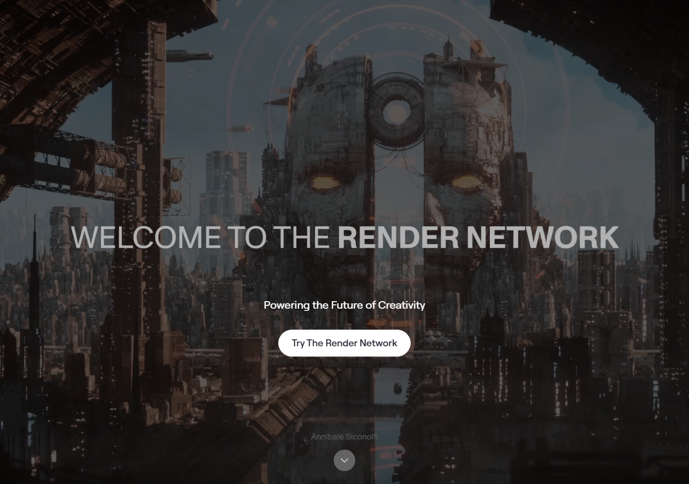
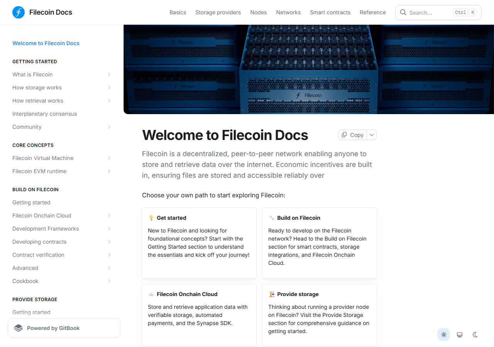

# 10 AI Infrastructure Crypto Coins in 2026

The ten AI infrastructure crypto coins in 2026 are **Bittensor, Chainlink, Render, Akash Network, Aethir, io.net, Artificial Superintelligence Alliance, Grass, OriginTrail, and Filecoin**. Bittensor leads as an intelligence market. Chainlink leads on integration depth. Render leads on existing usage floor.

Infrastructure means other systems depend on it to function. Compute, data feeds, coordination rails, knowledge graphs, and storage layers qualify. This article ranks ten coins by stack role, token function, and defensibility.

For the broader category: [best AI crypto projects](/ai-ecosystem/best-ai-crypto-projects-2026/). For the agent side: [best AI agent crypto coins](/ai-agents/best-ai-agent-crypto-coins-2026/).

We reviewed live public surfaces, official documentation, and protocol tooling for each project in July 2026. Reddit community signals were researched per project. Where no qualifying independent thread was found, we noted the absence.

## Ranking scorecard

Scored out of 10 per category. Total out of 50.

| Project | Stack role | Token function | Defensibility | Ecosystem fit | Risk profile | **Total** |
|---|---|---|---|---|---|---|
| Bittensor | 10 | 9 | 9 | 8 | 7 | **43** |
| Chainlink | 9 | 9 | 10 | 9 | 9 | **46** |
| Render | 8 | 8 | 8 | 7 | 7 | **38** |
| Akash Network | 8 | 6 | 6 | 7 | 7 | **34** |
| Aethir | 8 | 7 | 7 | 5 | 6 | **33** |
| io.net | 8 | 7 | 7 | 5 | 6 | **33** |
| ASI Alliance | 7 | 7 | 6 | 7 | 5 | **32** |
| Grass | 7 | 6 | 5 | 5 | 5 | **28** |
| OriginTrail | 8 | 8 | 7 | 6 | 7 | **36** |
| Filecoin | 7 | 7 | 7 | 5 | 7 | **33** |

**Scoring notes.** Stack role measures how clearly the project occupies a defined infrastructure layer. Token function scores whether the token coordinates access, settlement, routing, or staking (not just governance). Defensibility measures real moat: integration depth, installed base, or supply-side advantage. Ecosystem fit scores how naturally the project plugs into AI agent workflows. Risk profile scores inversely against centralization, demand gaps, and competitive overlap. Chainlink leads on total because its integration moat and risk resilience are unmatched. Bittensor scores highest on stack role because it coordinates an entire intelligence market rather than serving one layer.

## Decision framework

| If you are looking for... | Start with |
|---|---|
| Infrastructure with the most integration depth | Chainlink |
| Intelligence market exposure across compute layers | Bittensor |
| GPU compute with real existing usage floor | Render |
| Cost-first compute marketplace | Akash |
| Enterprise GPU quality tier | Aethir |
| Cluster-formation compute differentiation | io.net |
| Broad AI stack exposure under one token | ASI Alliance |
| Data acquisition and residential bandwidth layer | Grass |
| Verifiable real-world knowledge graph | OriginTrail |
| Decentralized storage for AI datasets and archival | Filecoin |

No single project covers all four infrastructure layers. A basket approach that holds at least one position in compute, data, knowledge, and storage is more defensible than concentration in the compute layer alone, where category overlap is highest.

---

## The 10 AI infrastructure crypto coins in 2026

---

### 1. Bittensor (TAO)

Bittensor occupies a category of its own because it is not just infrastructure. it is a market that organizes other infrastructure.

The [subnet directory](https://bittensor.ai/subnets) shows 129 active subnets at review time, each running a distinct machine-intelligence task: inference, embeddings, predictions, specialized domain outputs. Validators score miners on output quality and the best subnets earn more TAO emissions. The result is not a single AI service but a live competitive market for AI outputs. where supply, demand, and quality signal all operate simultaneously.

What makes TAO genuinely infrastructure-grade is that it cannot be removed without collapsing the coordination mechanism. Validators stake TAO to gain scoring weight. Subnet operators register against TAO. Demand for outputs pulls TAO into circulation. The token is the settlement layer for a market that exists nowhere else in crypto at this scale.

The infrastructure risk is internal rather than external. Emissions-chasing can fill subnets with low-quality outputs that nobody buys, and the community is starting to push back on that. In a [Bittensor community thread on Reddit](https://reddit.com/r/bittensor_/comments/1ux2nyw/what_are_your_favorite_tao_bittensor_subnets_and/). That internal quality pressure is healthy. A market that can distinguish good subnets from bad ones is more durable than one that cannot.

The subnet directory is worth spending time in. Each subnet has a live emissions rate, active validator set, and task description. You can see immediately which task domains are crowded and which are underserved. that kind of granular signal does not exist in any single-service AI infrastructure play.

**Featured Image**
File: `../media/bittensor-subnets-2026-07-13.png`
Alt text: `Bittensor subnet directory showing 129 active subnets with live validator scoring and emissions data, July 2026`
Caption: `Bittensor subnet directory, July 2026. each row shows a live market with its own task domain, emissions schedule, and validator competition. The density here is the infrastructure evidence.`

*Bittensor subnet directory, July 2026. each row shows a live market with its own task domain, emissions schedule, and validator competition. The density here is the infrastructure evidence.*

For [top Bittensor subnets](/ai-infrastructure/models/top-bittensor-subnets-2026/), go one layer deeper. Bittensor is the infrastructure benchmark for this category.

---

### 2. Chainlink (LINK)

Chainlink's infrastructure case does not depend on the AI narrative, which is exactly what makes it infrastructure.

AI agents that need to read external data, trigger onchain actions based on real-world conditions, or move value cross-chain will route through the kind of rails Chainlink already runs. The [developer docs](https://docs.chain.link/) organize the product around Data Feeds, Scheduled Triggers, Functions, VRF, and CCIP. None of those were built for AI specifically. All of them are components AI systems need.

LINK pays for oracle services and funds node operator rewards. Staking provides cryptoeconomic security over the network. The token does a real job inside the protocol. it is not a governance vehicle that can be swapped out without redesigning the system.

The infrastructure moat is integration depth. Hundreds of protocols across EVM chains have already built on Chainlink data feeds and CCIP. That installed base is harder to displace than any single technical advantage. [Chainlink Labs was named Best Oracle Provider at the Future of Finance Awards 2026](https://reddit.com/r/Chainlink/comments/1ua97cp/chainlink_labs_has_officially_been_named_best/). Third-party financial-industry recognition that matters more for infrastructure credibility than community self-promotion.

Reading the Chainlink docs during this review felt different from reading most AI project documentation. The vocabulary is integration endpoints, fee structures, and latency specs. not AI market projections. That restraint is a signal about how the team thinks about what they are building.

**Screenshot 1**
File: `../media/chainlink-docs-2026-07-16.png`
Alt text: `Chainlink developer documentation showing Data Feeds, CCIP, and Functions product surfaces for AI agent infrastructure`
Caption: `Chainlink docs, July 2026. product surface organized around specific integration endpoints. The absence of AI branding is informative.`

*Chainlink docs, July 2026. product surface organized around specific integration endpoints. The absence of AI branding is informative.*

For Chainlink to lose its infrastructure position, AI agents would have to route around external oracles entirely. That is a long-horizon possibility, not the current direction of builder tooling.

---

### 3. Render (RENDER)

Render has something most AI compute tokens do not: a business that existed before the AI narrative arrived.

The node operator base was built for creative GPU rendering. film, 3D, generative art. When AI inference demand started compounding, Render had distributed GPU infrastructure that could absorb it. The [compute-client materials](https://rendernetwork.com/participate-compute-clients) now list training, fine-tuning, and inference alongside creative rendering. That is not a rebrand. It is the same marketplace taking on new workload types.

The burn-and-mint token model is clean: demand for compute burns RENDER, operator rewards mint it. When GPU job volume grows, the economic signal is direct. The infrastructure moat is the creative-rendering installed base. a floor of real usage that pure AI compute networks do not have.

The split identity (creative + AI compute) can trade at a discount to more focused infrastructure names during AI-only narrative runs. But the same split provides downside protection when pure AI compute narratives rotate. In a [Render Network community thread on Reddit](https://reddit.com/r/RenderNetwork/comments/1tn0ne9/render_network_the_calm_before_the_breakout/). the community is cautiously optimistic but conditioning that view on job volume growth, which is the right metric to watch.

What stood out reviewing Render's materials: AI inference is now positioned first in the documentation, not second to creative rendering. That shift in priority tells you more about where real demand is going than any price chart.

**Screenshot 2**
File: `../media/render-home-2026-07-16.png`
Alt text: `Render Network homepage showing GPU compute marketplace for AI inference and creative rendering workloads, July 2026`
Caption: `Render Network site, July 2026. AI inference and creative rendering framed together. The dual-market story is honest about what the network actually handles.`

*Render Network site, July 2026. AI inference and creative rendering framed together. The dual-market story is honest about what the network actually handles.*

Render is stronger as AI infrastructure than as a pure AI narrative trade. The creative-rendering floor is real. For the token to fail as infrastructure, centralized cloud pricing would have to drop faster than the decentralized marketplace advantage compounds.

---

### 4. Akash Network (AKT)

The Akash Console shows you more about the network in five minutes than the documentation shows you in an hour.

Live bids, active deployments, provider availability. all visible without a login at [console.akash.network](https://console.akash.network/). That transparency is a double-edged infrastructure signal: it proves the marketplace is real and operating, and it also exposes exactly how deep or shallow the order book runs on any given day.

Akash runs a reverse-auction marketplace where GPU and CPU providers bid to host workloads. The [docs](https://akash.network/docs/getting-started/what-is-akash/) frame the cost thesis plainly: buyers get compute at lower cost by sourcing from underused provider capacity. The infrastructure case is that AI workloads are price-sensitive and decentralized compute markets provide a real alternative to centralized cloud.

The token model has a structural complication that infrastructure investors should note: USDC payment options reduce direct AKT demand from workloads, which means token utility is partially decoupled from network usage volume.

A [Cosmos ecosystem thread on Reddit](https://reddit.com/r/cosmosnetwork/comments/1smpyys/akash_abandons_cosmos_do_to_liscensing_changes/). Short-term integration uncertainty for teams with Cosmos IBC dependencies. The broader community thread on [r/CryptoCurrency](https://reddit.com/r/CryptoCurrency/comments/1tvdgqx/akash_network/) stays focused on the cost-arbitrage thesis, which remains the correct filter: does demand-side AI workload adoption keep pace with narrative?

**Screenshot 3**
File: `../media/akash-console-2026-07-16.png`
Alt text: `Akash Network Console showing live GPU provider marketplace with active workload deployments and provider bids, July 2026`
Caption: `Akash Console, July 2026. live marketplace visible without login. The order book depth here is more informative than any documentation claim.`

*Akash Console, July 2026. live marketplace visible without login. The order book depth here is more informative than any documentation claim.*

Akash is solid infrastructure in a competitive space. It sits better in a compute basket than as a single-name infrastructure answer.

---

### 5. Aethir (ATH)

The claim Aethir makes that other compute networks do not is hardware quality.

Most decentralized compute networks aggregate mixed hardware. consumer GPUs alongside enterprise-grade chips. The [Aethir docs](https://docs.aethir.com/aethir-introduction) position the network specifically around H100-class enterprise GPU supply, with a three-node architecture (checker, container, indexer) designed around reliability and accountability at the hardware tier rather than just at the marketplace level.

That specificity is the infrastructure thesis: enterprise AI workloads have quality requirements that mixed-hardware networks cannot reliably meet, and a network built around verified H100-tier supply can serve that segment specifically.

ATH coordinates node licensing, staking, and service payments across all three node types. The token does a real operational job inside the network. The gap is demand-side verification. enterprise GPU contracts are harder to confirm publicly than supply-side architecture.

The documentation reads like procurement material: architecture diagrams, SLA framing, node-type breakdowns. Whether that is a strength or weakness depends entirely on who the actual buyers are. No qualifying Reddit thread surfaced for Aethir during research. community discussion is thin outside the project's own channels, which is itself an infrastructure signal worth noting.

**Screenshot 4**
File: `../media/aethir-docs-2026-07-16.png`
Alt text: `Aethir documentation showing enterprise GPU cloud architecture, node types, and checker-container-indexer network structure`
Caption: `Aethir docs, July 2026. enterprise-grade GPU network documented in procurement terms. The documentation audience is clearly different from consumer crypto projects.`

*Aethir docs, July 2026. enterprise-grade GPU network documented in procurement terms. The documentation audience is clearly different from consumer crypto projects.*

The enterprise GPU thesis is more differentiated than generic compute infrastructure. Supply-side architecture is real. Demand-side adoption at enterprise scale is the verification gap.

### 6. io.net (IO)

io.net built its infrastructure pitch around a counter-argument: most AI engineers are blocked on GPU access, not GPU cost.

The [io.net documentation](https://docs.io.net/) frames the network as a cluster-formation system. not just a marketplace for individual GPUs, but a layer that assembles distributed hardware into ML-ready clusters with configurable specs. The IO token coordinates access across workers, paying out based on compute contributed and consumed. The pitch is that builders needing multi-GPU setups for fine-tuning or distributed inference can source capacity faster through io.net than through centralized cloud queues.

The differentiation is real on paper. Consumer-grade cluster-formation at scale is harder to deliver than individual GPU rental, which is what most competing networks offer. The risk is that enterprise customers with critical training runs tend to prioritize reliability guarantees over speed of access. and that is where centralized cloud has a structural advantage.

No qualifying community signal surfaced for io.net in independent research. The builder community engagement on public forums is thin relative to the infrastructure ambition, which is worth flagging alongside the technical moat.

**Screenshot 5**
File: `../media/ionet-docs-2026-07-16.png`
Alt text: `io.net documentation showing GPU cluster formation, worker coordination, and IO token utility for distributed ML infrastructure`
Caption: `io.net docs, July 2026. cluster-formation framing distinguishes the network from simple GPU marketplaces. Whether the demand side matches that framing is the open question.`

*io.net docs, July 2026. cluster-formation framing distinguishes the network from simple GPU marketplaces. Whether the demand side matches that framing is the open question.*

io.net is the strongest differentiated compute option on the list. It holds a better position in a compute basket than as a standalone infrastructure bet.

---

### 7. Artificial Superintelligence Alliance (FET)

The ASI Alliance is three projects with one token, which is exactly as complicated as it sounds.

Fetch.ai (FET), SingularityNET (AGIX), and Ocean Protocol (OCEAN) merged into the ASI Alliance under the FET token in 2024. The [documentation surface](https://singularitynet.io/) still reflects the distributed nature of the underlying projects: agent tooling from Fetch.ai, AI service marketplace from SingularityNET, and data marketplace from Ocean all operate under the same token umbrella without fully unified infrastructure.

FET does real work inside each of the underlying protocols. The merger was designed to reduce fragmentation across the AI-crypto stack by giving buyers a single token with exposure to agent coordination, AI services, and data access. Whether the unified token actually trades on that thesis or tracks individual project traction is less clear. the FET discount to more focused AI infrastructure names has been a persistent community observation.

A [CryptoCurrency thread on Reddit analyzing why FET underperforms narrower AI token rallies](https://reddit.com/r/CryptoCurrency/comments/1rpvtfe/ai_tokens_are_starting_to_move_again_why_is_fet/). The community attribution is portfolio breadth without portfolio premium, which is a reasonable read of the structural complexity.

**Screenshot 6**
File: `../media/asi-alliance-2026-07-16.png`
Alt text: `ASI Alliance documentation showing AI agent platform, SingularityNET marketplace, and Ocean Protocol data layer under unified FET token structure`
Caption: `ASI Alliance site, July 2026. three distinct product surfaces under one token. The infrastructure breadth is real; the unified narrative is still being constructed.`

*ASI Alliance site, July 2026. three distinct product surfaces under one token. The infrastructure breadth is real; the unified narrative is still being constructed.*

The ASI Alliance holds meaningful infrastructure positions across three stack layers. The complexity that makes the token difficult to price is the same breadth that makes it hard to displace entirely.

---

### 8. Grass (GRASS)

Grass is the only project on this list where the data contributors are regular internet users.

The network pays participants in GRASS for routing AI scraping traffic through their residential internet connections. The [Grass extension](https://app.getgrass.io/) runs in the background and earns rewards by providing bandwidth that lets AI companies train on public web data without hitting bot filters. For the AI company buying access: real residential IPs, lower detection risk, no server farm footprint.

The infrastructure claim is that residential bandwidth aggregated at scale creates a data acquisition layer that is structurally different from datacenter scraping. harder to detect, more geographically diverse, and cheaper per IP than building or renting equivalent proxy infrastructure.

One [Grass community thread on Reddit documents a contributor with 566 days active and $2.96 in rewards](https://reddit.com/r/Grass_io/comments/1ul3lj5/grass_is_scamming_longterm_node_runners_566_days/). The incentive design gets real scrutiny from contributors who stayed longest, which is the data point that matters most for assessing retention and supply-side sustainability.

**Screenshot 7**
File: `../media/grass-extension-2026-07-16.png`
Alt text: `Grass browser extension interface showing active bandwidth contribution, earnings dashboard, and GRASS token reward tracking`
Caption: `Grass extension, July 2026. the UI makes participation frictionless. Whether the reward rate sustains enough supply-side participation at scale is the infrastructure question the community is actively testing.`

*Grass extension, July 2026. the UI makes participation frictionless. Whether the reward rate sustains enough supply-side participation at scale is the infrastructure question the community is actively testing.*

Grass sits at an unusual infrastructure intersection. The mechanism is real and the use case has a clear buyer. Long-term contributor retention data is the signal to watch.

---

### 9. OriginTrail (TRAC)

OriginTrail does something that sounds unremarkable until you understand what AI systems lack when they reason about the physical world.

The network maintains a [Decentralized Knowledge Graph (DKG)](https://origintrail.io/network). Structured, verifiable, linked data about real-world entities: supply chains, products, scientific data, enterprise assets. When AI systems need to reason about verified real-world information rather than generating it from weights, that kind of structured external knowledge layer is the gap they hit. The DKG is designed to fill it.

TRAC pays for publishing and retrieving knowledge assets from the graph. Node operators earn TRAC for hosting the graph assets. The token does a direct operational job. The moat is not the technology. it is the volume of verified real-world data already anchored to the graph. OriginTrail reached two billion knowledge assets on the network, which is infrastructure volume that takes time to replicate.

A [milestone post in the OriginTrail community on Reddit documented 2 billion knowledge assets on the DKG](https://reddit.com/r/OriginTrail/comments/1recybz/2_billion_knowledge_assets_published_on_the/). The community discussion frames this as adoption velocity rather than a milestone event, which is the right read for an infrastructure network.

**Screenshot 8**
File: `../media/learnbittensor-subnets-2026-07-13.png`
Alt text: `OriginTrail Decentralized Knowledge Graph network showing knowledge asset volume, node infrastructure, and TRAC token utility for verifiable AI data`
Caption: `OriginTrail network, July 2026. knowledge asset volume is the infrastructure metric that matters here, not price. 2B assets anchored is a supply-side moat that compounds slowly.`

*OriginTrail network, July 2026. knowledge asset volume is the infrastructure metric that matters here, not price. 2B assets anchored is a supply-side moat that compounds slowly.*

OriginTrail's infrastructure case holds up better than most knowledge-layer projects because the use case is specific and the existing data volume is measurable. The risk is that AI reasoning improves faster than external knowledge graph queries become a standard architectural pattern.

---

### 10. Filecoin (FIL)

Filecoin is the storage question the AI infrastructure conversation keeps circling back to.

AI model training generates enormous data: raw training sets, preprocessed datasets, checkpoint outputs, model weights. Storing that data needs to go somewhere. Filecoin is the largest decentralized storage network by capacity, with FIL paying miners for verified storage deals and retrieval. The [Filecoin documentation](https://docs.filecoin.io/) lays out the storage deal structure clearly: clients post deals, miners compete to fill them, verification happens onchain.

The infrastructure case is direct: permanent, verifiable, content-addressed storage for AI datasets is a real need, and Filecoin has the largest decentralized network positioned to serve it. The risk is equally direct. Centralized cloud. S3, GCS, Azure Blob. is faster and cheaper for active training runs. Filecoin's advantage is verifiability, permanence, and censorship-resistance, which matter most for archival and reproducibility use cases.

A [Filecoin community thread on Reddit debates whether decentralized storage is actually useful for AI training](https://reddit.com/r/filecoin/comments/1uhrav5/is_decentralized_storage_really_useful_for_ai/). The community is having the honest version of this conversation, and the consensus is nuanced: archival and data provenance yes, hot training data pipelines probably not yet.

**Screenshot 9**
File: `../media/filecoin-docs-2026-07-16.png`
Alt text: `Filecoin documentation showing storage deal structure, FIL token utility, miner economics, and data availability layer for AI datasets`
Caption: `Filecoin docs, July 2026. the storage deal mechanics are well-documented. The documentation is more useful for understanding the mechanism than for understanding current AI workload fit.`

*Filecoin docs, July 2026. the storage deal mechanics are well-documented. The documentation is more useful for understanding the mechanism than for understanding current AI workload fit.*

Filecoin holds a real infrastructure position at the storage layer. The moat is network size and the IPFS integration. Whether AI workloads actually migrate toward decentralized storage at scale depends on verifiability requirements that centralized cloud cannot match.

---

## Frequently asked questions

**What counts as AI infrastructure in crypto?**
A project is AI infrastructure if other AI systems depend on it to function. compute, data feeds, oracle services, knowledge graphs, storage, or agent coordination layers. Projects that track AI sentiment or narrative exposure without a functional role in the stack are not infrastructure.

**Is Chainlink really AI infrastructure or just crypto infrastructure?**
Both. and that is why it holds up. Chainlink's rails were built for crypto before AI agent demand existed. The same rails are what AI agents need for external data, cross-chain messaging, and triggered execution. Infrastructure that predates the narrative is harder to displace than infrastructure built around it.

**What is the biggest risk for decentralized compute networks?**
Demand-side adoption at scale. Supply-side GPU aggregation is achievable. The harder problem is convincing AI teams with active training runs to take on the added operational complexity of a decentralized marketplace over managed cloud compute.

**Why does FET lag other AI infrastructure tokens?**
The ASI Alliance merger created breadth without an immediately unified premium. FET gives exposure to three stack layers, but the market tends to reward focused infrastructure bets during narrative runs. That can reverse if the unified ASI Alliance platform finds a product surface that pulls demand across all three underlying projects.

**Is Filecoin AI infrastructure or storage infrastructure?**
Both. Filecoin's infrastructure case for AI is specifically about verifiable, permanent storage for training datasets and model outputs. a use case where centralized cloud does not provide cryptographic proof of data availability or censorship-resistance. For active hot-data training pipelines, centralized cloud remains faster.

---

## Sources

- [Bittensor official documentation](https://docs.bittensor.com/)
- [Chainlink developer documentation](https://docs.chain.link/)
- [Render Network compute client materials](https://rendernetwork.com/participate-compute-clients)
- [Akash Network documentation](https://akash.network/docs/getting-started/what-is-akash/)
- [Aethir documentation](https://docs.aethir.com/aethir-introduction)
- [io.net documentation](https://docs.io.net/)
- [SingularityNET platform](https://singularitynet.io/)
- [Grass network](https://app.getgrass.io/)
- [OriginTrail Decentralized Knowledge Graph](https://origintrail.io/network)
- [Filecoin documentation](https://docs.filecoin.io/)
- [Bittensor community. subnet metrics thread](https://reddit.com/r/bittensor_/comments/1ux2nyw/what_are_your_favorite_tao_bittensor_subnets_and/)
- [Chainlink community. Best Oracle Provider 2026](https://reddit.com/r/Chainlink/comments/1ua97cp/chainlink_labs_has_officially_been_named_best/)
- [Render community. positioning analysis](https://reddit.com/r/RenderNetwork/comments/1tn0ne9/render_network_the_calm_before_the_breakout/)
- [Cosmos community. Akash Cosmos departure](https://reddit.com/r/cosmosnetwork/comments/1smpyys/akash_abandons_cosmos_do_to_liscensing_changes/)
- [CryptoCurrency Reddit. Akash thread](https://reddit.com/r/CryptoCurrency/comments/1tvdgqx/akash_network/)
- [CryptoCurrency Reddit. FET lag analysis](https://reddit.com/r/CryptoCurrency/comments/1rpvtfe/ai_tokens_are_starting_to_move_again_why_is_fet/)
- [Grass community. contributor reward report](https://reddit.com/r/Grass_io/comments/1ul3lj5/grass_is_scamming_longterm_node_runners_566_days/)
- [OriginTrail community. 2B knowledge assets milestone](https://reddit.com/r/OriginTrail/comments/1recybz/2_billion_knowledge_assets_published_on_the/)
- [Filecoin community. decentralized storage for AI training debate](https://reddit.com/r/filecoin/comments/1uhrav5/is_decentralized_storage_really_useful_for_ai/)
