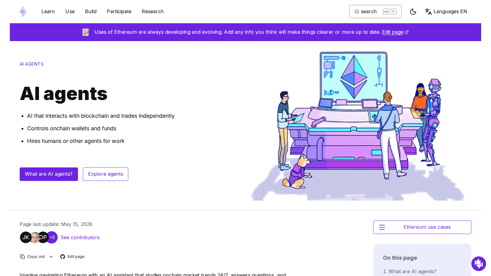

# 10 Best Onchain AI Agents in 2026: Which Autonomous Crypto Agents Matter Most?

- Primary keyword: `best onchain ai agents`
- Slug: `/ai-agents/onchain-agents/best-onchain-ai-agents-2026/`
- Meta title: `Best Onchain AI Agents in 2026: Top 10 Ranked`
- Meta description: `See the best onchain AI agents in 2026, ranked by autonomy, wallet behavior, execution ability, and ecosystem traction.`

## Schema

```json
{
  "@context": "https://schema.org",
  "@graph": [
    {
      "@type": "Article",
      "headline": "10 Best Onchain AI Agents in 2026: Which Autonomous Crypto Agents Matter Most?",
      "description": "Ranked overview of onchain AI agents in 2026.",
      "mainEntityOfPage": "https://your-site.com/ai-agents/onchain-agents/best-onchain-ai-agents-2026/"
    },
    {
      "@type": "ItemList",
      "name": "Best Onchain AI Agents in 2026",
      "numberOfItems": 10
    }
  ]
}
```

If you are trying to choose the best onchain AI agents in 2026, the real problem is usually not finding projects that talk about autonomy. The real problem is deciding whether the system actually does something onchain or only wraps a social or dashboard narrative in agent language. Readers who need the broader token map should start with our guide to the [best AI agent crypto coins](/ai-agents/best-ai-agent-crypto-coins-2026/).

That is why this article does not rank onchain agents by personality or token buzz alone. We are looking at them through the lens of execution relevance, wallet logic, ecosystem support, and whether the product still looks like an agent once the branding is stripped away.

> The best onchain AI agents in 2026 are the projects that combine AI behavior with actual onchain execution, coordination, or economic activity rather than only social branding.

> Why you can trust this guide
>
> This article is based on live category pages, public docs, and ecosystem materials reviewed in July 2026. Where a claim still depends on deeper wallet testing, live execution, or a full end-to-end usage run, we treat that as a final verification item before publication.

## What are the best onchain AI agents in 2026?

The best onchain AI agents in 2026 are Virtuals Protocol, Autonolas, Griffain, Wayfinder, Venice, GAME by Virtuals, Luna by Virtuals, aixbt by Virtuals, Vader, and PAAL AI.

Some of these names are better understood as agent ecosystems or agent-launch economies rather than single autonomous systems. That still matters, because the best onchain agents usually need distribution, liquidity, and wallet-native infrastructure around them. Readers who want the ecosystem-cluster angle after this should continue into [top Virtuals Protocol ecosystem coins](/ai-agents/economy/top-virtuals-protocol-ecosystem-coins-2026/).

## Who this guide is for and how to use it

This guide is for readers who want to understand whether an AI agent is actually doing something onchain or simply borrowing the language of autonomy.

Before publication, keep the definition of `onchain agent` explicit. Readers should know whether each listed name is a direct agent product, an agent economy asset, or a supporting protocol. Readers who want the DeFi-specific branch after this should move into [best DeFAI projects](/ai-agents/defi-agents/best-defai-projects-2026/).

## What we checked ourselves before ranking these agents

To write this guide, we reviewed the live public category surfaces, public ecosystem positioning, and official docs for the shortlisted names. We did that so the article would not depend only on token lists or social descriptions of `autonomy`.

That direct review does not replace a full wallet-connected execution test of every agent in the list. But it does make one thing clear quickly: some projects are trying to create agent economies, while others are trying to create agent behavior. Those are related ideas, but they are not the same.

What stood out immediately was not the ambition of the category. It was how often the strongest names still depend on surrounding rails like wallets, liquidity, and ecosystem tooling to make the agent story believable.



*Ethereum AI agents explainer page captured during our July 2026 review of onchain-agent workflows.*


*Virtuals Protocol whitepaper page captured during our July 2026 review of onchain AI agent infrastructure and economy design.*

## How we ranked onchain AI agents

| Factor | What we looked for | Why it matters |
|---|---|---|
| Onchain action | Can the agent trigger or help coordinate real blockchain actions? | The category should do more than talk |
| Wallet relevance | Does the product meaningfully relate to wallets, routing, or settlement? | This is where crypto becomes useful |
| Agent autonomy | Is there actual delegated behavior or only a dashboard assistant? | Many projects exaggerate autonomy |
| Ecosystem support | Is there infrastructure, liquidity, or app distribution around the agent? | Agents need rails |
| Risk | How dependent is the project on hype and narrative velocity? | Agent categories can reverse fast |

Bottom line: we favored systems that move closer to software actors than to AI-themed mascots.

## The 10 best onchain AI agents in 2026

### 1. Virtuals Protocol

Virtuals ranks first because it is one of the clearest attempts to build a full onchain agent economy. It does not depend on one personality or one use case. It is trying to make agent creation and monetization native to crypto. This is a strength if your thesis is that onchain agents need an economic base layer. But it is a weakness if your priority is a simpler single-product agent exposure.

### 2. Autonolas

Autonolas remains one of the stronger "serious agent infrastructure" picks because the project has been focused on autonomous services for longer than many newer entrants. That is a strength if you care more about structural seriousness than social velocity. It is a weaker fit if you want the loudest liquid narrative.

### 3. Griffain

Griffain belongs high on the list because it is closer to the practical end of the category: agents helping users navigate and execute onchain tasks. That is exactly why readers interested in actual task completion rather than ecosystem identity may find it more useful than some bigger names.

### 4. Wayfinder

Wayfinder makes sense as a top-tier pick because onchain agents are only as useful as their ability to help users find paths through fragmented crypto systems.

### 5. Venice

Venice is relevant here because the product case is easier to understand than many agent tokens. It sits closer to usable AI plus crypto rails than to pure category theater.

### 6. GAME by Virtuals

GAME matters because it has repeatedly been cited as part of the emerging Virtuals-centered agent stack. It is a good way to track how agent economies may turn into financial primitives.

### 7. Luna by Virtuals

Luna stays on the list because it remains a visible agent-economy asset inside the Virtuals ecosystem. It is more ecosystem-sensitive than infrastructure-sensitive, but still worth tracking.

### 8. aixbt by Virtuals

aixbt is one of the clearest examples of an AI-native market persona becoming an economic object onchain. That makes it important even for readers who remain skeptical of its long-term durability.

### 9. Vader

Vader belongs because onchain agent markets increasingly reward projects that combine AI identity, tokenization, and action.

### 10. PAAL AI

PAAL AI rounds out the list as a more assistant-style project that still matters because crypto users keep demanding simpler interfaces for complex systems.

## What an onchain AI agent actually is

The easiest definition is this: an onchain AI agent is a software actor that can observe information, make bounded decisions, and help initiate or coordinate blockchain actions.

That does not mean full autonomy with no human control. In practice, many agents still live in a supervised setup where the user approves actions, sets limits, or defines strategy boundaries.

That is still enough to make the category real. The point is not science fiction. The point is reducing the friction between AI interpretation and crypto execution. The important thing is not whether a project sounds autonomous. The important thing is whether it changes what a user can do onchain.

## Why onchain agents are different from bot narratives

Trading bots have existed for years. Onchain agents are different because the ambition is broader.

Instead of simply placing orders under preset rules, onchain agents aim to interpret instructions, route across systems, evaluate opportunities, manage identities, or coordinate multi-step actions. The closer a product gets to that behavior, the more believable its agent label becomes.

## What risks come with autonomous onchain systems

The biggest risk is execution error. A system can misunderstand context, use the wrong tool, or route through weak liquidity.

The second risk is permission design. If users give an agent too much wallet or contract authority, mistakes become more expensive.

The third risk is category inflation. Some projects market themselves as autonomous agents when they are really chat wrappers or social content engines.

## Final verdict: which onchain AI agents look strongest now

If you want the strongest ecosystem-level exposure, start with Virtuals Protocol. If you want a more infrastructure-heavy thesis, Autonolas is easier to defend. If you want user-facing onchain execution themes, Griffain and Wayfinder are better watchlist names. If you want the broader category context before picking, return to [best AI agent crypto coins](/ai-agents/best-ai-agent-crypto-coins-2026/). If you want the trading-tool branch after this, move into [best AI crypto trading bots](/ai-trading/bots/best-ai-crypto-trading-bots-2026/).

## FAQ

### What is an onchain AI agent?

An onchain AI agent is an AI-driven software system that can help observe blockchain conditions, interpret instructions, and trigger or coordinate blockchain actions under defined rules.

### Are onchain AI agents the same as AI trading bots?

No. Trading bots are usually narrower and rule-based. Onchain AI agents aim to handle broader workflows and more flexible decision logic.

### Why does crypto help AI agents?

Crypto gives agents open wallets, programmable payments, composable apps, and machine-readable settlement rails.

## Internal link map used in this article

- Agent category hub: [best AI agent crypto coins](/ai-agents/best-ai-agent-crypto-coins-2026/)
- Virtuals cluster support: [top Virtuals Protocol ecosystem coins](/ai-agents/economy/top-virtuals-protocol-ecosystem-coins-2026/)
- DeFi workflow branch: [best DeFAI projects](/ai-agents/defi-agents/best-defai-projects-2026/)
- Trading tooling branch: [best AI crypto trading bots](/ai-trading/bots/best-ai-crypto-trading-bots-2026/)
- Infrastructure comparison: [best decentralized AI crypto projects](/ai-infrastructure/decentralized-ai/best-decentralized-ai-crypto-projects-2026/)

## External links to cite in the body

- [Ethereum.org AI agents explainer](https://ethereum.org/ai-agents/)
- [Coinbase Institutional: Picks-and-Shovels of the AI Agent Economy](https://www.coinbase.com/institutional/research-insights/research/market-intelligence/picks-and-shovels-of-the-ai-agent-economy)
- [CoinGecko AI Agents category](https://www.coingecko.com/en/categories/ai-agents)
- [Virtuals Protocol whitepaper](https://whitepaper.virtuals.io/)

## First-hand experience package to add before publish

Do not fake first-hand experience on an onchain-agent ranking page. Use first-hand evidence only where the editorial team actually reviewed public product surfaces, docs, dashboards, or wallet-connected flows directly.

### 1. Visual evidence to collect

- Original screenshots from the CoinGecko AI Agents category
- Original screenshots from relevant public agent dashboards or ecosystem pages
- One annotated flow diagram showing `instruction -> agent -> wallet -> onchain action`

### 2. First-person perspective to add only after real review

- Use wording such as `From the public product surfaces we reviewed...`
- Add context such as `After comparing the visible workflows and docs in July 2026...`
- Describe real editorial judgments, especially where a name felt more like an ecosystem asset than a direct agent
- Only use `we tested` if the team completed a wallet or execution flow

### 3. Balanced evaluation to strengthen trust

- Add one short `Best fit for` line for each project
- Add one short `What still needs real execution proof` line for the top five names
- Add one short `Who should avoid this` line where useful

### 4. Quantitative data to add where available

- Number of shortlisted agent names reviewed before cutting to 10
- Number of top-10 names tied to one ecosystem versus standalone projects
- Any public category snapshot used in the final methodology

## EEAT upgrades to add before publish

- Add a note separating fully autonomous behavior from supervised agent workflows
- Add direct citations whenever a project is described as executing real onchain actions
- Add a review date because this category changes fast
- Add a short methodology disclosure explaining which judgments came from manual editorial review versus external sources

## Source notes

- Ethereum AI agents page
- Coinbase Institutional AI agent economy report
- CoinGecko AI Agents category
- Virtuals Protocol whitepaper

## Verification notes before publish

- Verify whether any listed name should be reframed as an ecosystem asset rather than an agent itself.
- Add direct examples of wallet, routing, or execution behavior if publishing as a flagship explainer.
